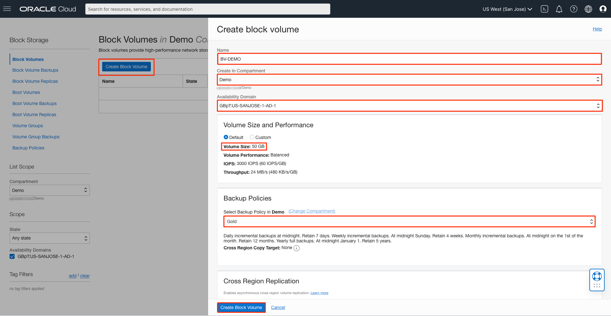
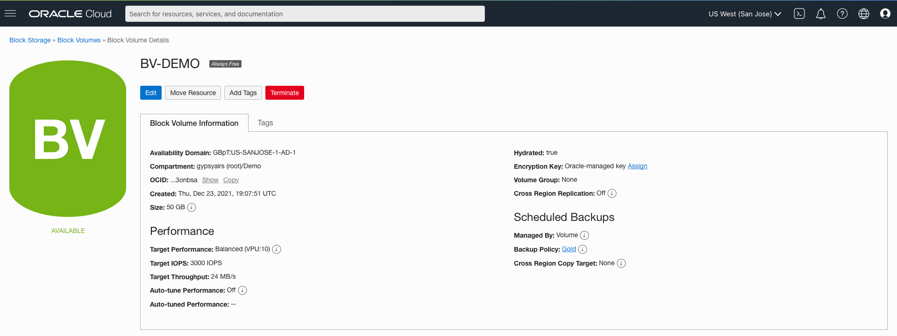
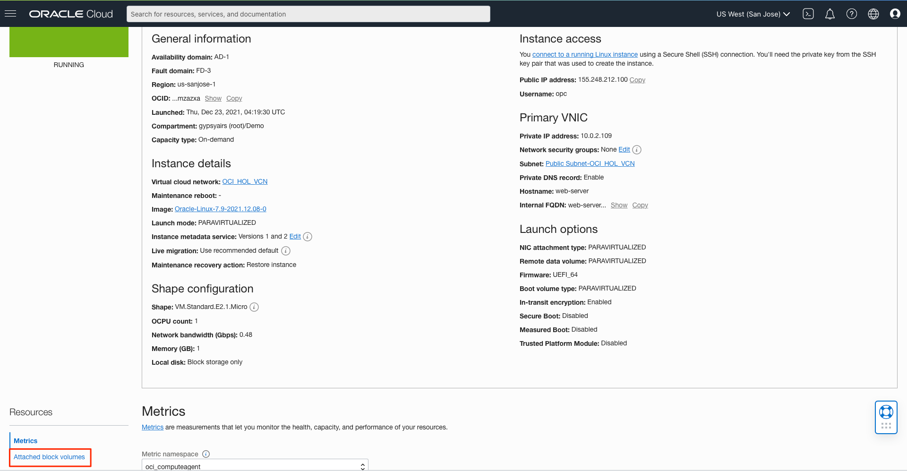
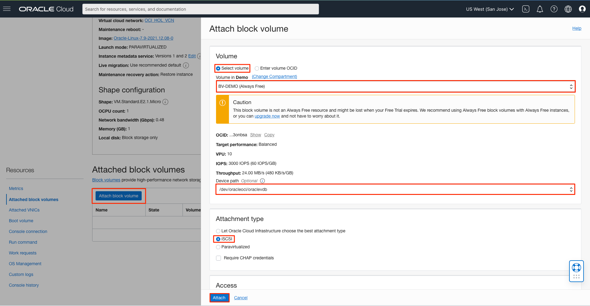
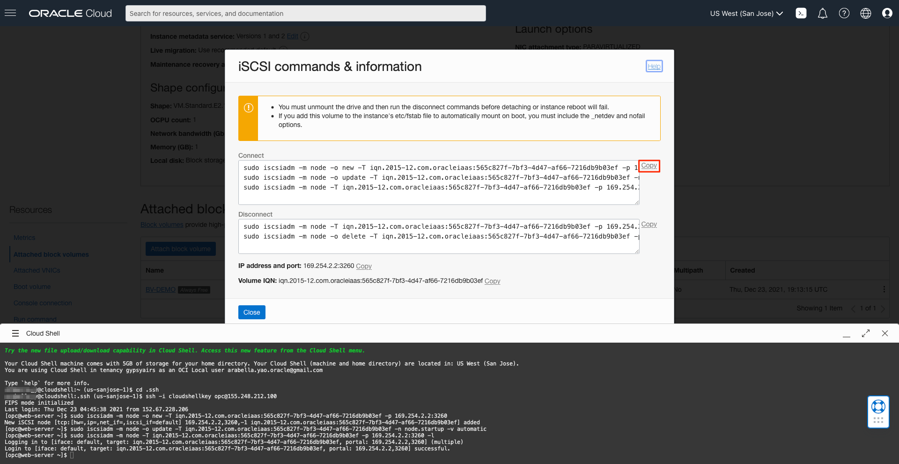

<!-- Not tested -->
# Create and Attach a Block Volume Service

## Introduction

The Oracle Cloud Infrastructure Block Volume service lets you dynamically provision and manage block storage volumes. You can create, attach, connect and move volumes as needed to meet your storage and application requirements. Once attached and connected to an instance, you can use a volume like a regular hard drive. Volumes can also be disconnected and attached to another instance without the loss of data.

Estimated Time: 40 minutes
 
This video provides an overview of creating and attaching Oracle Cloud Infrastructure Block Volumes:

[](youtube:jxzw8NZGUJw)

### Objectives
In this lab, you will:
- Create a Block Volume
- Attach the Block Volume to your instance
- Mount the Block Volume

### Prerequisites

* An Oracle Cloud Account - please view this workshop's LiveLabs landing page to see which environments are supported.

>**Note:** If you have a **Free Trial** account, when your Free Trial expires, your account will be converted to an **Always Free** account. You will not be able to conduct Free Tier workshops unless the Always Free environment is available. 

**[Click here for the Free Tier FAQ page.](https://www.oracle.com/cloud/free/faq.html)**
 
## Task 1: Create a Block Volume

A common usage of Block Volume is adding storage capacity to an Oracle Cloud Infrastructure instance. Once you have launched an instance and set up your cloud network, you can create a block storage volume through the Console or API. Once created, the volume can be attached to an instance using a volume attachment. Once the volume is attached, you connect to the volume from your instance's guest OS using iSCSI or paravirtualized mode. The volume can then be mounted and used by your instance.

1. Click the **Navigation Menu** in the upper left. Navigate to **Storage**, and click **Block Storage**.

    

2. In Block Volume service, click **Create Block Volume** and provide the following details:

    <if type="freetier">
     - **Name:** BV-DEMO
     - **Compartment:** Demo</if>
     <if type="livelabs">
     - **Name:** username-BV
     - **Compartment:** username-compartment</if>
     - **Availability Domain:** It must be the same as the AD you chose for your instance
     - **Size**: Please choose **50 GB**
     - **Backup Policy**: **Gold**

    >**Note**: Size must be between **50 GB** and **32 TB**. You can choose in 1 GB increments within this range. The default is 1024 GB

     Quick recap on the block volume backup policies: There are three predefined backup policies: Bronze, Silver, and Gold. Each backup policy has a set backup frequency and retention period.

    - **Bronze Policy:** The bronze policy includes monthly incremental backups, run on the first day of the month. These backups are retained for twelve months. This policy also includes a full backup, run yearly on January 1st. Full backups are retained for five years.

    - **Silver Policy:** The silver policy includes weekly incremental backups that run on Sunday. These backups are retained for four weeks. This policy also includes monthly incremental backups, run on the first day of the month and are retained for twelve months. Also includes a full backup, run yearly on January 1st. Full backups are retained for five years.

    - **Gold Policy**: The gold policy includes daily incremental backups. These backups are retained for seven days. This policy also includes weekly incremental backups that run on Sunday and are retained for four weeks. Also includes monthly incremental backups, run on the first day of the month, retained for twelve months, and a full backup, run yearly on January 1st. Full backups are retained for five years.

3. Leave the encryption and tags options as their default values and click **Create Block Volume**. The volume will be ready to attach once its icon no longer lists it as **PROVISIONING** in the volume list.

   <if type="freetier">
   
   
   </if>
   <if type="livelabs">
   
   
   
   </if>

## Task 2: Attach a Block Volume to an Instance

1. Once the Block Volume is created, you can attach it to the VM instance you just launched on Compute Practice. When you attach a block volume to a VM instance, you have two options for attachment type, iSCSI or paravirtualized.

    - **iSCSI:** iSCSI attachments are the only option when connecting block volumes to bare metal instances. Once the volume is attached, you need to log in to the instance and use the iscsiadm command-line tool to configure the iSCSI connection

     - **Paravirtualized:** Paravirtualized attachments are now an option when attaching volumes to VM instances. For VM instances launched from Oracle-Provided Images, you can select this option for Linux-based images published. Once you attach a volume using the paravirtualized attachment type, it is ready to use. You do not need to run any additional commands. However, due to the overhead of virtualization, this reduces the maximum IOPS performance for larger block volumes. See [Paravirtualized Attachment Performance](https://docs.cloud.oracle.com/iaas/Content/Block/Concepts/blockvolumeperformance.htm#paraPerf) for more information.

2. Go to the Compute Instances Menu, and navigate to the VM instance you created before. Click **Attached block volumes**.

    <if type="freetier">
    </if>
    <if type="livelabs">
    </if>

3. Click **Attach block volume**.

4. Click **Select volume** and choose the following options:

     - **Volume:** Select the volume created
     - **Device Path:** Select `/dev/oracleoci/oraclevdb`
     - **Attachment mode:** iSCSI
     - Click **Attach**

   <if type="freetier">
   </if>
   <if type="livelabs">
   </if>

5. Once the volume is attached, you can click on the ellipsis and then click **iSCSI commands and information**.

    <if type="freetier">
    </if>
    <if type="livelabs">
    </if>

6. Connect to the instance through SSH and **run the iSCSI Connect Commands**. 
    Click **Copy** to copy all connect commands. Run all these commands by pasting them in the cloud shell:

    

7. Once the disk is attached, you can run the following commands to format the disk and mount it.
     ```
     # <copy>ls -l /dev/oracleoci/oraclevd*</copy>
     ```
     ```
     # <copy>sudo mkfs -t ext4 /dev/oracleoci/oraclevdb</copy>
     Press y when prompted
     ```
     ```
     # <copy>sudo mkdir /mnt/disk1</copy>
     ```
     ```
     # <copy>sudo mount /dev/oracleoci/oraclevdb /mnt/disk1</copy>
     ```
     ```
     # <copy>df -h</copy>
     ```

    

    >**Note:** When mounting a storage volume for the first time, you can format the storage volume and create a single, primary partition that occupies the entire volume by using fdisk command (Caution: Using fdisk to format the disk deletes any data on the disk).

## Acknowledgements

- **Author** - Rajeshwari Rai, Prasenjit Sarkar 
- **Contributors** - Oracle LiveLabs QA Team (Kamryn Vinson, QA Intern, Arabella Yao, Product Manager, DB Product Management)
- **Last Updated By/Date** - Arabella Yao, December 2021

