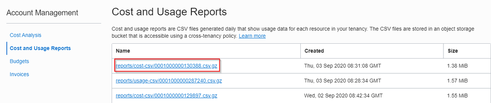
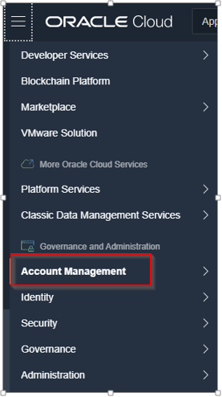
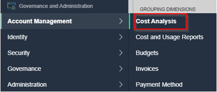
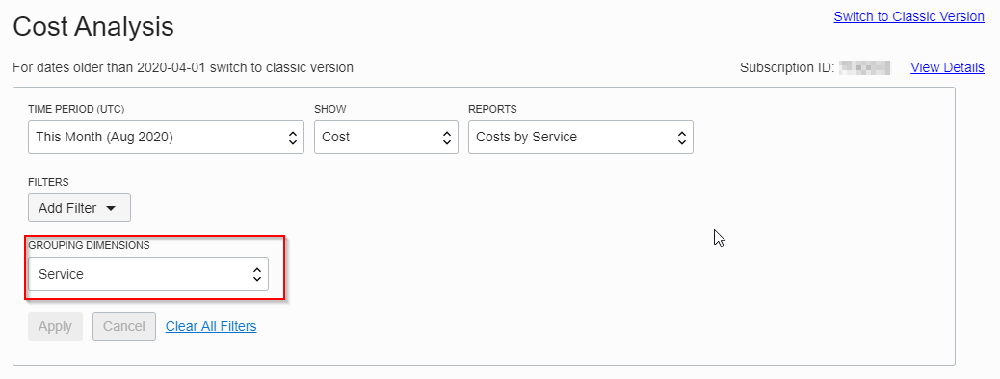
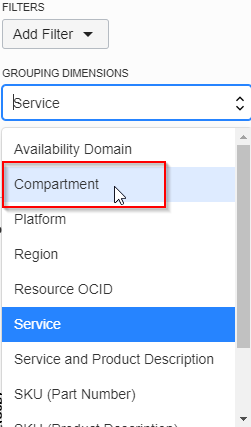
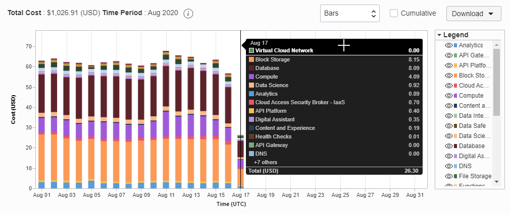

# Cost Analysis

## Introduction
Cost Analysis tools are visualization options which can be accessed by the Oracle Cloud Infrastructure Console, they provide useful trend lines which help detect patterns in usage right away, patterns which can be looked at over various services in OCI. It gives functionality in terms of filtering, so you can access data in which you are most interested in. To be able to use the Cost Analysis you must be a member of the Administrator group.

A cost report is a comma-separated value (CSV) file that is similar to a usage report, but also includes cost columns. The report can be used to obtain a breakdown of your invoice line items at resource-level granularity. As a result, you can optimize your Oracle Cloud Infrastructure spending, and make more informed cloud spending decisions.
A usage report is a comma-separated value (CSV) file that can be used to get a detailed breakdown of resources in Oracle Cloud Infrastructure for audit or invoice reconciliation.

  

Estimated Lab Time: 30 minutes

### Prerequisites

* An Oracle Free Tier, Always Free, Paid or LiveLabs Cloud Account

## Task 1: Select Cost Analysis

1. Click the **Hamburger Menu** on the top left
2. Select from the Governance and Administration Tab.  The Account Management Tab which opens up the Cost Analysis Options

  

  

## Task 2: Cost Analysis Options

1. Under this view, there is the possibility to create specific filters from different time periods, reports
2. Explore grouping dimensions, with different values, for example Availability Domain, Compartment, Service, etc

  
  

## Task 3: Overview of the Cost Analysis Diagram

1. Below we would be able to see a detailed overview of the Cost Analysis Diagram, and in detail which service generated which costs:
  

This concludes this lab.

## Learn More
* [Cost Analysis](https://docs.cloud.oracle.com/en-us/iaas/Content/Billing/Concepts/costanalysisoverview.htm)

## Acknowledgements
* **Authors/Contributors** - Harshit Kumar, Constantin Sebe, EMEA Hub Sales
* **Last Updated By/Date** - Harshit Kumar, August 2020

