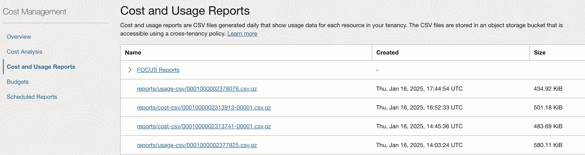
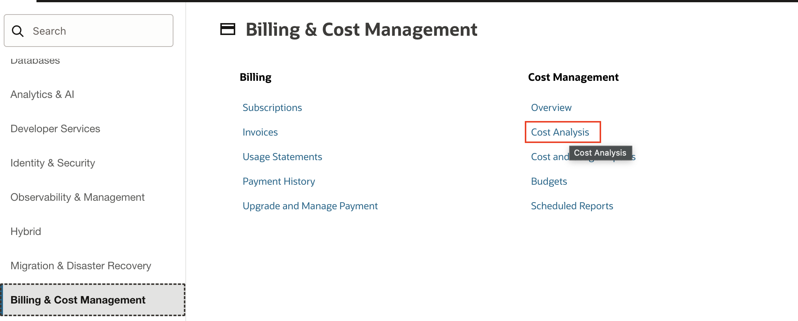
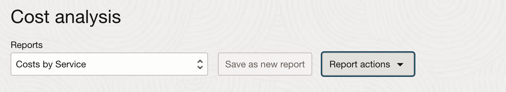
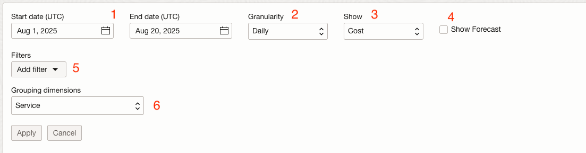
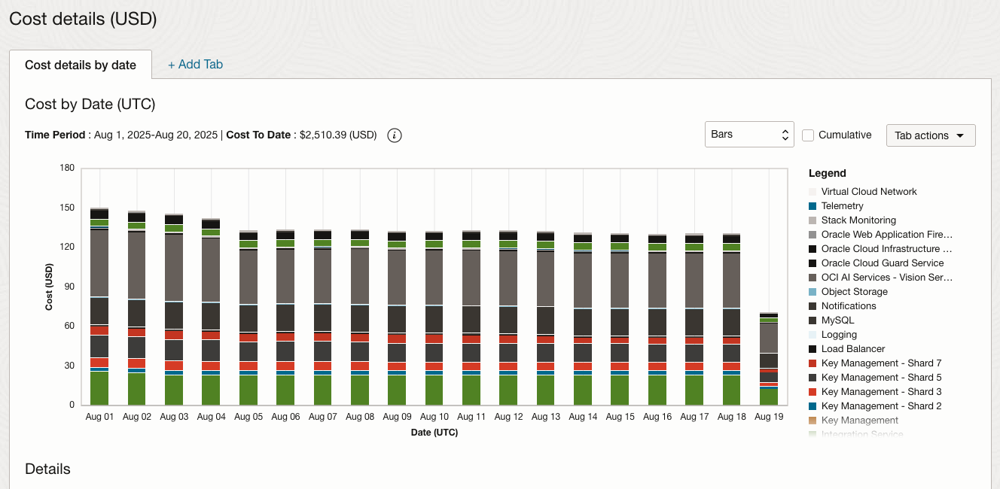

# Cost Analysis

## Introduction
Cost Analysis tools are visualization options which can be accessed by the Oracle Cloud Infrastructure Console, they provide useful trend lines which help detect patterns in usage right away, patterns which can be looked at over various services in OCI. It gives functionality in terms of filtering, so you can access data in which you are most interested in. To be able to use the Cost Analysis you must be a member of the Administrator group.

A cost report is a comma-separated value (CSV) file that is similar to a usage report, but also includes cost columns. The report can be used to obtain a breakdown of your invoice line items at resource-level granularity. As a result, you can optimize your Oracle Cloud Infrastructure spending, and make more informed cloud spending decisions.
A usage report is a comma-separated value (CSV) file that can be used to get a detailed breakdown of resources in Oracle Cloud Infrastructure for audit or invoice reconciliation.

  

Estimated Lab Time: 30 minutes

### Prerequisites

* An Oracle Free Tier, Always Free, Paid or LiveLabs Cloud Account

## Task 1: Select Cost Analysis

1. Click the **Hamburger Menu** on the top left
2. Select from the **Billing and Cost Management** Tab. In the Cost Management Section opens up the Cost Analysis Page

  

  ## Task 2: Cost Analysis Reports

1. Here you can choose from one of the default reports to view cost and usage information. You can also see the different report actions and this is where you will save a report if you make any adjustments.
2. You can keep the report on the default **Costs by Service** option

  

## Task 3: Cost Analysis Options

1. Under this view, there is the possibility to create specific filters from different time periods. You can choose a particular start date and end date that you would want to view the consumption from. By default it will show the first day of the month and current date
2. Granularity allows you to choose between showing the cost on a daily or monthly view
3. In the **Show** view you can toggle between showing cost, usage, and attributed cost or attributed usage.
4. **Show Forecast** allows estimating future usage and consumption information, based on past usage data
5. You can also add filters on several options to display cost or usage data based on the options that you have specified. 
6. Explore grouping dimensions, with different values, for example Availability Domain, Compartment, Service, etc

  

## Task 3: Overview of the Cost Analysis Diagram

1. Below we would be able to see a detailed overview of the Cost Analysis Diagram, and in detail which service generated which costs:
  

This concludes this lab.

## Learn More
* [Cost Analysis](https://docs.cloud.oracle.com/en-us/iaas/Content/Billing/Concepts/costanalysisoverview.htm)

## Acknowledgements
* **Authors/Contributors** - Harshit Kumar, Constantin Sebe, EMEA Hub Sales
* **Last Updated By/Date** - Uma Kumar, August 2025

