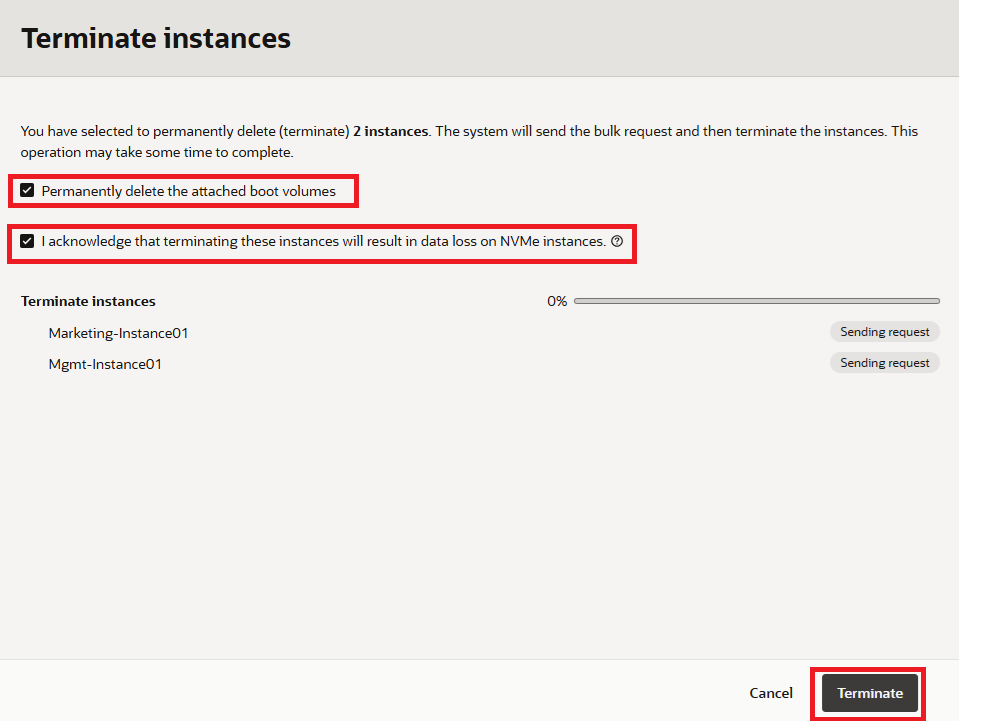
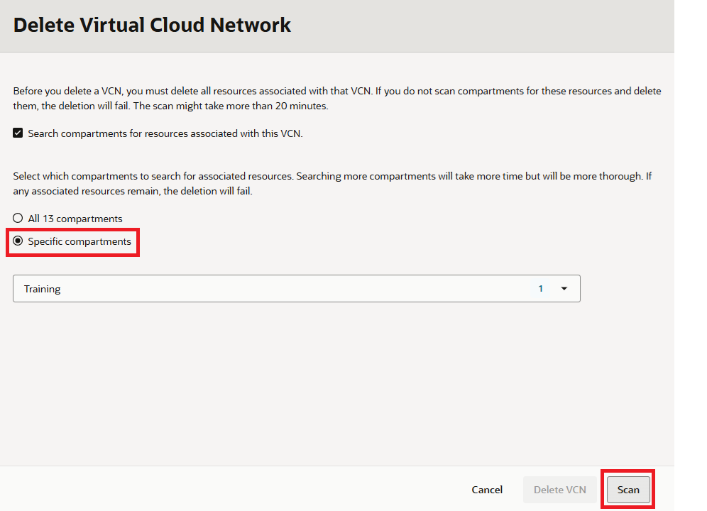

# Clean up the resources

## Introduction

This is an optional lab. If you'd like guidance for deleting all resources created as part of this workshop, you can proceed with the following tasks.

Estimated Time: 10 minutes

### Objectives
- Delete all resources created during the workshop

### Prerequisites
* Successful completion of the previous lab tasks

## Task 1: Delete the resources

1. Switch to  OCI console window.

2. If your compute instances are not displayed, from OCI services menu, click **Instances** under **Compute**.

    

3. Locate your compute instances. Click the check boxes to the left of both instances. Click the Actions menu, then click **Terminate**.

    

4. Make sure **Permanently delete the attached boot volume** and Acknowledgement boxes are both checked. Click **Terminate**. Wait for the instance to be fully terminated.

    

6. From OCI services menu, click **Virtual Cloud Networks** under **Networking**. A list of all VCNs will appear.

    

7. Locate your VCN. Click the **...** (ellipses) icon on the far right and then **Delete**.

    

8. Select **Specific Compartments** then click **Scan** in the dialog window. 

    
    
9. When the scan completes, click **[Delete All]** to remove all VCN resources.

    >NOTE: If you encounter any errors during the delete process, the message should indicate which resource is preventing the VCN deletion from being completed. You may need to locate those resources (route rules, gateways, etc) and delete them first. Then return to delete the VCN once more.

10. Close the dialog when complete. You can now repeat Steps 7 to 9 to delete the second VCN.

*Congratulations! You have successfully completed the lab.*

## Acknowledgements

- **Author** - Umair Siddiqui, Larry Beausoleil
- **Adapted by** -  Yaisah Granillo, Cloud Solution Engineer
- **Last Updated By/Date** - Eli Schilling, Cloud Archtiect, Lab Experience Team, February 2026