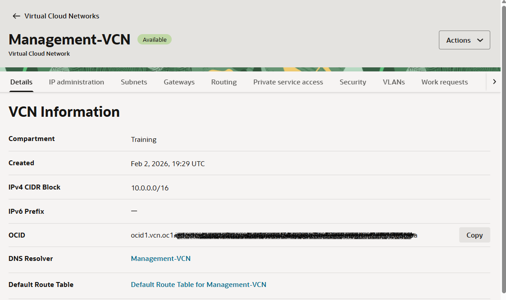
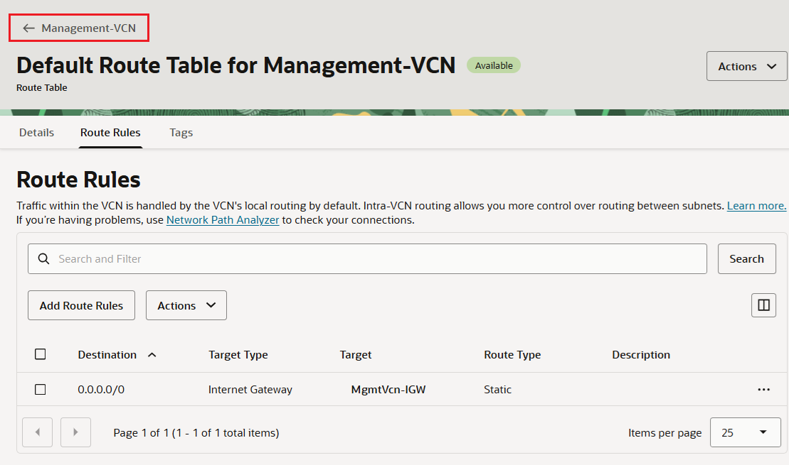
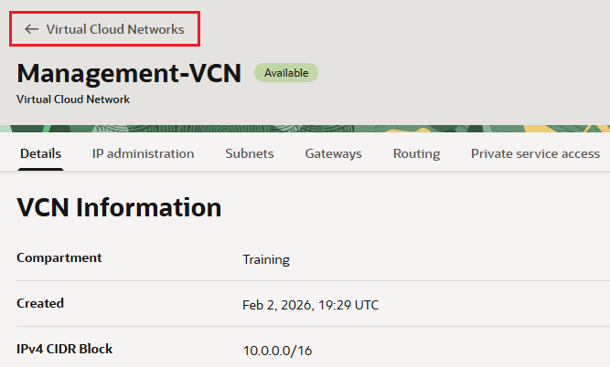
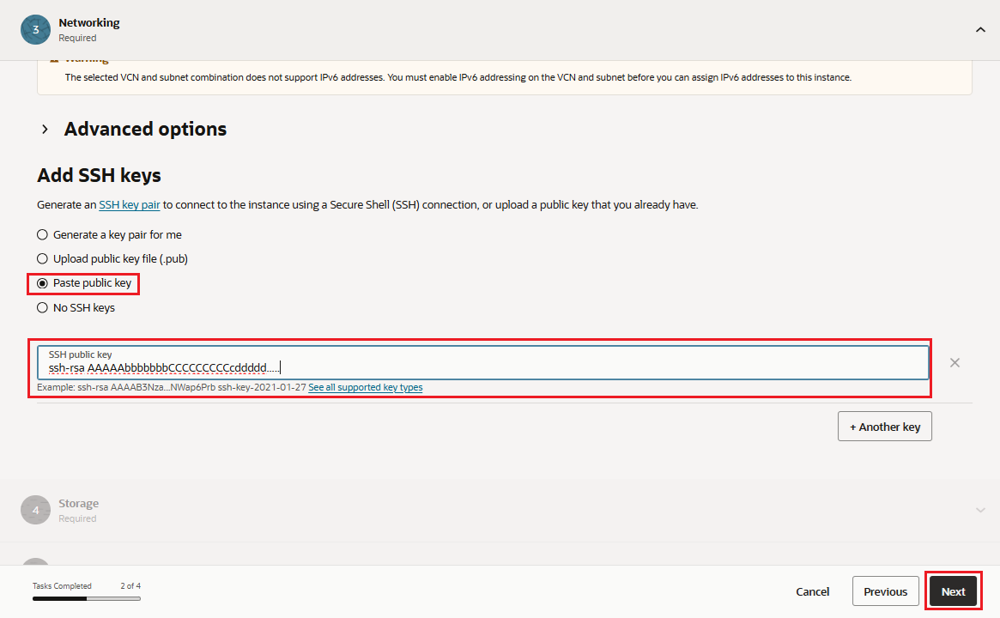
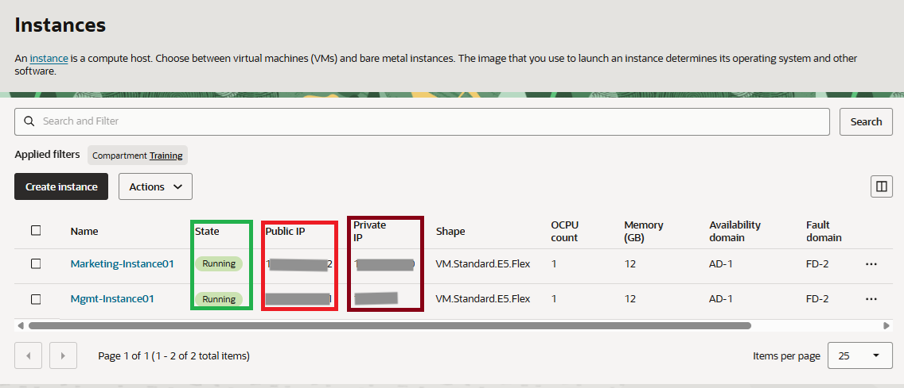

# Create Network and Compute resources

## Introduction

Local VCN peering is the process of connecting two VCNs in the same region and tenancy, so that their resources can communicate using private IP addresses without routing the traffic over the Internet or through your on-premises network. Without peering, a given VCN would need an Internet gateway and public IP addresses for instances that need to communicate with another VCN.

Estimated Time: 25 minutes

### Objectives
- Create two virtual cloud networks
- Create two compute instances, one in each VCN

### Prerequisites
* An Oracle Cloud Account - please view this workshop's LiveLabs landing page to see which environments are supported
* SSH keys created in Oracle Cloud Shell

## Task 1: Sign in to Oracle Cloud Infrastructure Console

>**Note:** Oracle Cloud Infrastructure (OCI) UI is being updated, thus some screenshots in the instructions may be different from the actual UI.

1. Sign in using your tenancy, user name, and password. Use the login option under **Oracle Cloud Infrastructure Direct Sign-In**.

    

## Task 2: Create the Virtual Cloud Network (VCN)

1. From the OCI Services menu, click **Networking** -> **Virtual Cloud Networks**. 

    

    Select the compartment assigned to you from drop down menu on left side of the screen, and click **Create VCN**.

    

    >**Note:** Ensure the correct Compartment is selected under Compartment list.

2. Fill out the dialog box:

      - **Name**: Provide a VCN name
      - **Create in compartment**: Ensure your compartment is selected
      - **IPv4 CIDR Block**: **10.0.0.0/16**

    

    >NOTE: After typing the IPv4 CIDR block in the field, press **[Enter]** to lock in the value.

3. Click **Create VCN**.

4. The Virtual Cloud Network will automatically be redirected to the **Details** page for your new VCN.

    

5. In VCN Details page, click the **Gateways** tab, scroll down to the **Internet Gateways** section, then click **Create Internet Gateway**. Fill out the dialog box. Click **Create Internet Gateway** (ensure correct compartment is selected).

    

6. Click **Routing**, and click **Default Route Table for `<VCN_NAME>`**.

    

7. Click **Route Rules**, then **Add Route Rules**. Fill out the dialog box:

      - **Target Type**: **Internet Gateway**
      - **Destination CIDR Block**: **0.0.0.0/0**
      - **Target Internet Gateway**: Select the Internet Gateway created in Step 5

    

8. Click **Add Route Rules**.

9. On the **Default Route Table for...** page, click the VCN Name with back arrow to return to the VCN Details Page.

    

10. Click on the **Subnets** tab, and then **Create Subnet**. Fill out the dialog box:

    - **Name**: Enter a name (for example Mgmt-Subnet01)
    - **Subnet Type**: **Regional**
    - **CIDR Block**: **10.0.0.0/24**
    - **Route Table**: Select Default Route Table
    - **Subnet Access**: **Public Subnet**
    - **Dhcp Options**: Select Default DHCP Options
    - **Security Lists**: Select Default Security List

    

    

11. Leave all other options as default. Click **Create Subnet**.

12. Click **<-- Virtual Cloud Networks** to navigate back to the VCN main dashboard.

    

13. Repeat steps 2 through 11 to create a second VCN, make sure to use the following resource values:

    * **VCN Name: Marketing-VCN**
    * **VCN IPv4 CIDR Block: 172.16.0.0/16**
    * **Subnet Name: Marketing-Subnet01**
    * **Subnet IPv4 CIDR Block: 172.16.0.0/24**
    * **Internet Gateway Name: MarketingVcn-IGW**

    >NOTE: You have created two VCNs with Internet gateway for Internet traffic, added default rules in the route tables, and created subnets. Proceed to the next task to create compute instances.

## Task 3: Create Compute Instances

1. From OCI services menu, click **Compute** -> **Instances**.

    

2. Click **Create Instance**. Fill out the dialog Basic information page:

    **This is the first compute instance, and ensure to create in the first VCN**.

    - **Name**: Enter a name like Mgmt-instance01

    - **Placement**:
        - **Availability Domain**: Select an availability domain

    - **Image and shape**:
        - **Image**: We recommend using the Latest **Oracle Linux** available
        - **Shape**: Use the default shape selected

    
    

3. Click **[Next]** to proceed to the Security page. Leave all settings as is and click **[Next]** to access the Networking page.

    - Fill in details on the **Networking** page:

        - Radio button: **Select existing virtual cloud network**: Select  Management-VCN
        - Radio button: **Select existing subnet**: Select Mgmt-Subnet01
        
            

    

    - **Add SSH keys:** Choose **Paste public keys** and paste the public key created under Cloud Shell in Lab 1

    

    - Click **[Next]** to proceed to the storage page. Leave all settings as is and click **[Next]** to navigate to the Review page.

3. Click **Create**.

    >**Note:** If *Service limit* error is displayed, choose a different shape from VM.Standard.E4.Flex or VM.Standard.E3.Flex, or choose a different availability domain.

4. The work request for **Create Instance** will appear. Click **<--Instances** at the top of the creen to return to the Instances dashboard.

5. Repeat the steps above to create a second compute instance in the **second VCN**.

    - **Name**: Enter a name like Marketing-Instance01

    - **Placement**:
        - **Availability Domain**: Select an availability domain

    - **Image and shape**:
        - **Image**: We recommend using the Latest **Oracle Linux** available
        - **Shape**: Use the default shape selected

    - **Networking**: click **Edit**

        - Radio button: **Select existing virtual cloud network**: Select  Marketing-VCN
        - Radio button: **Select existing subnet**: Select Marketing-Subnet01

    - **Add SSH keys:** Choose **Paste public keys** and paste the public key created under Cloud Shell in Lab 1
    - **Boot volume:** Leave the default

    - Click **Create**.

6. Once the instances are in running state, note down the *public IP* and *private IP* addresses of the two compute instances.

    

*You may now proceed to the next lab*

## Acknowledgements

- **Author** - Umair Siddiqui, Larry Beausoleil
- **Adapted by** -  Yaisah Granillo, Cloud Solution Engineer
- **Last Updated By/Date** - Eli Schilling, Cloud Archtiect, Lab Experience Team, February 2026