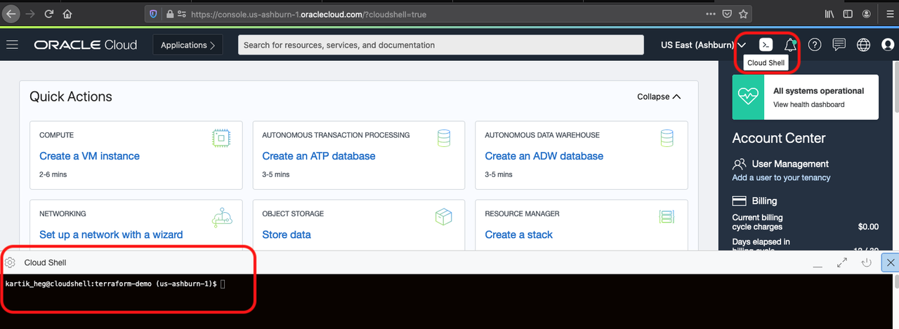
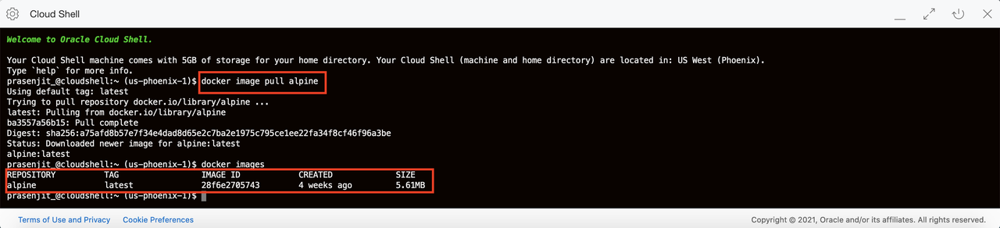
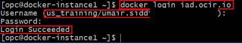
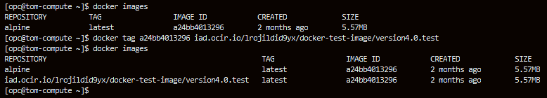
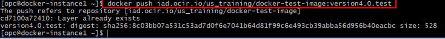
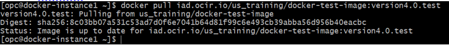

# Create Docker registry in OCI

## Introduction

Oracle Cloud Infrastructure Registry is an Oracle-managed registry that enables you to simplify your development to production workflow. Oracle Cloud Infrastructure Registry makes it easy for you as a developer to store, share, and manage development artifacts like Docker images. And the highly available and scalable architecture of Oracle Cloud Infrastructure ensures you can reliably deploy your applications.

## Task 1: Sign in to OCI Console and create VCN, Auth token and Docker Registry

1. Sign in using your tenant name, user name and password. Use the login option under **Oracle Cloud Infrastructure**.
       


2. From the OCI Services menu, click **Virtual Cloud Networks** under Networking. Select the compartment assigned to you from the drop down menu on the left part of the screen under Networking and Click **Start VCN Wizard**.

    **NOTE:** Ensure the correct Compartment is selected under COMPARTMENT list

3. Click **VCN with Internet Connectivity** and click **Start VCN Wizard**

4. Fill out the dialog box:

    - **VCN NAME**: Provide a name
    - **COMPARTMENT**: Ensure your compartment is selected
    - **VCN CIDR BLOCK**: Provide a CIDR block (10.0.0.0/16)
    - **PUBLIC SUBNET CIDR BLOCK**: Provide a CIDR block (10.0.1.0/24)
    - **PRIVATE SUBNET CIDR BLOCK**: Provide a CIDR block (10.0.2.0/24)
    - Click **Next**

5. Verify all the information and  Click **Create**

6. This will create a VCN with following components.

    *VCN, Public subnet, Private subnet, Internet gateway (IG), NAT gateway (NAT), Service gateway (SG)*

7. Click **View Virtual Cloud Network** to display your VCN details.

    *We will now create an Auth Token. This token will be used to login to connect to OCI Docker registry from the Docker compute instance that will be created later on*

8. In OCI console Click the user icon (top right)  then **User settings**. Under Resources Click **Auth Token**, then **Generate Token**. In pop up window provide a description then Click **Generate Token**

     

     

9.  Click **Copy** and save the token in Notepad. **Do not close the window without saving the token as it can not be retrieved later**

     

10. Click the **Navigation Menu** in the upper left, navigate to **Developer Services**, and select **Container Registry**.

	

11. Click **Create Repository**. Provide Repository name (all Lowercase), Check **Public** for **Access**, Click **Create Repository**

12.  Once created, verify there are no existing images in the repository


*We now have a Docker registry and Auth token (to validate login to the registry). Next we will use Cloud Shell to test pushing and pulling images from the registry.*

## Task 2: Create compute instance install Docker and push images to registry

1. From the OCI Console, click on the **cloud shell** icon as shown below. This should launch a cloud shell session for the user.

    

    *NOTE: Ensure the correct Compartment is selected under COMPARTMENT list*

2. We will now pull a example image from Docker registry  to the compute instance. Enter Command:

    ```
    <copy>
    docker image pull alpine
    </copy>
    ```
    Verify image pull was successful, Enter Command
    ```
    <copy>
    docker images
    </copy>
    ```
    and verify alpine is present

     

3. Now we will push this image to Docker registry created in OCI. First login to Registry in OCI. Enter command:

    ```
    <copy>
    bash
    docker login <Region_Name_Code>.ocir.io
    </copy>
    ```

    **NOTE:** Region name code are, fra for Frankfurt, iad for Ashburn, lhr for London, phx for Phoenix.

    **HINT:** Your region is shown on top right corner of OCI console window

4. Provide the information:

    - Username:  Enter it in format Tenancy Name/User name (for example: TS-SPL-55/john_doe)
    - Password: Paste the Auth key saved earlier (Characters wont be visible)

     

5. Verify Login Succeeded message is displayed.

6. Next we will tag the image that we pulled from the web. Enter command:

    ```
    <copy>
    docker images
    </copy>
    ```
    and note down the image id of alpine. Enter command: (No Spaces)

    ```
    <copy>
    bash
    docker tag <image_id>  <Region_Name_Code>.ocir.io/<TenancyName>/<docker_registry_name>:<image_name>
    </copy>
    ```

7. Verify the tag was created, Enter command:

    ```
    <copy>
    docker images
    </copy>
    ```
    and verify version<x.y>.test is present.

    **NOTE:** In below example (version4.0.test) x is 4 and y is 0

      - Image\_Id is **3fd9065eaf02**
      - Region\_Name\_Code is **iad**
      - Tenancy\_Name is **us\_training**
      - docker\_registry\_name is **docker-test-image**
      - Image\_name is **version4.0.test**  

     

8. We will now push the image to docker registry in OCI. Enter command:

    ```
    <copy>
    docker push <Region_Name_Code>.ocir.io/<Tenancy_Name>/<docker_registry_name>:<image_name>* (No Spaces)
    </copy>
    ```
    **NOTE:** In below example:

     - Region\_Name\_Code is **iad**
     - Tenancy\_Name is **us\_training**
     - docker\_registry\_name is **docker-test-image**
     - Image\_name is **version4.0.test**  

     

9. Switch to OCI window and navigate to your registry. Newly pushed image should be visible.

    **HINT:** Refresh the browser window if image is not displayed

10. Switch to compute instance ssh window. Enter command:

    ```
    <copy>
    docker pull <Region_Name_Code>.ocir.io/<Tenancy_Name>/<docker_registry_name>:<image_name>*  (No Spaces)  
    </copy>  
    ```

11. Verify the pull command was successful

     

    **HINT:** We are pulling the same image that we just pushed.

*We now have a working Docker registry and can successfully push and pull images to/from it.*

## Task 3: Delete the resources

1. Switch to  OCI console window

2. From OCI services menu Click **Virtual Cloud Networks** under Networking, list of all VCNs will
appear.

3. Locate your VCN , Click Action icon and then **Terminate**. Click **Terminate All** in the Confirmation window. Click **Close** once VCN is deleted

     

4. Navigate to your registry (**Container Registry** under **Developer Services**), Click Registry Name, Under **Actions** Click **Delete Repository**, Click **Delete** in confirmation window.

     


## Acknowledgements
*Congratulations! You have successfully completed the lab.*

- **Author** - Flavio Pereira, Larry Beausoleil
- **Adapted by** -  Yaisah Granillo, Cloud Solution Engineer
- **Contributors** - Prasenjit Sarkar
- **Last Updated By/Date** - Prasenjit Sarkar, March 2021

