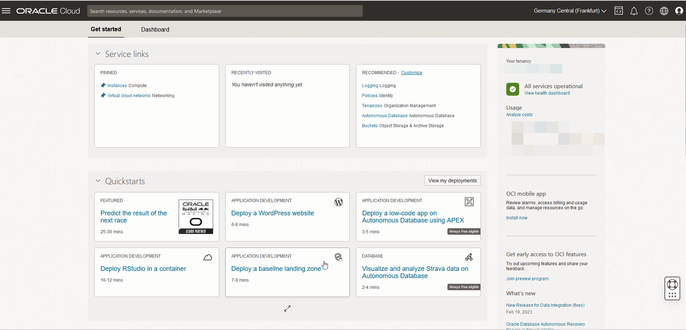
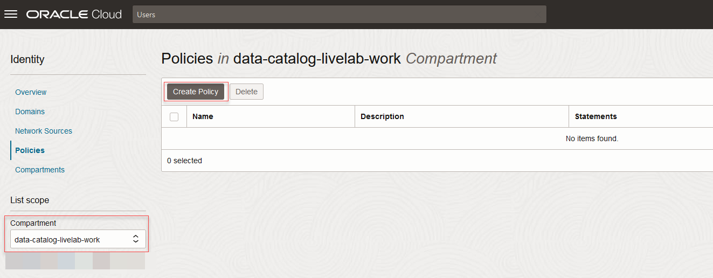
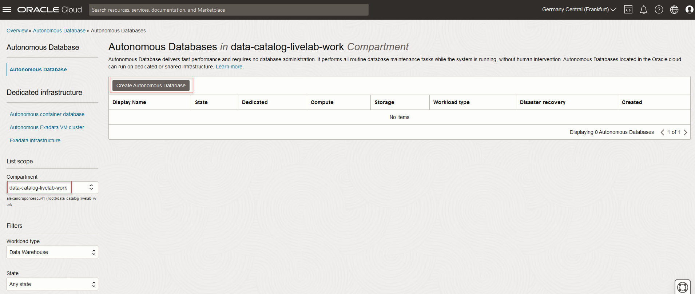
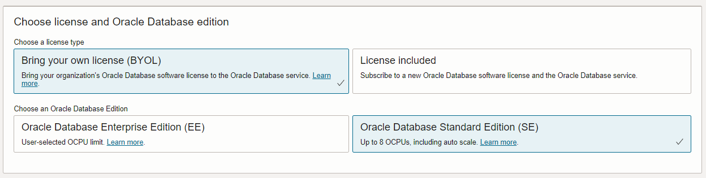
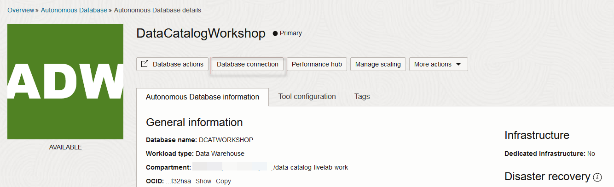
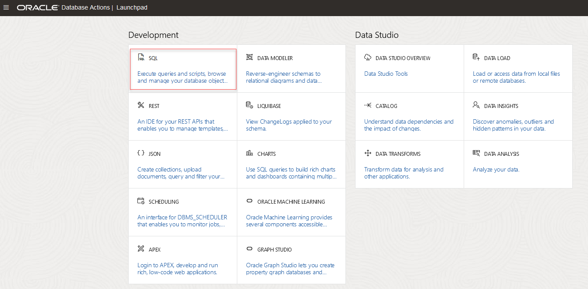
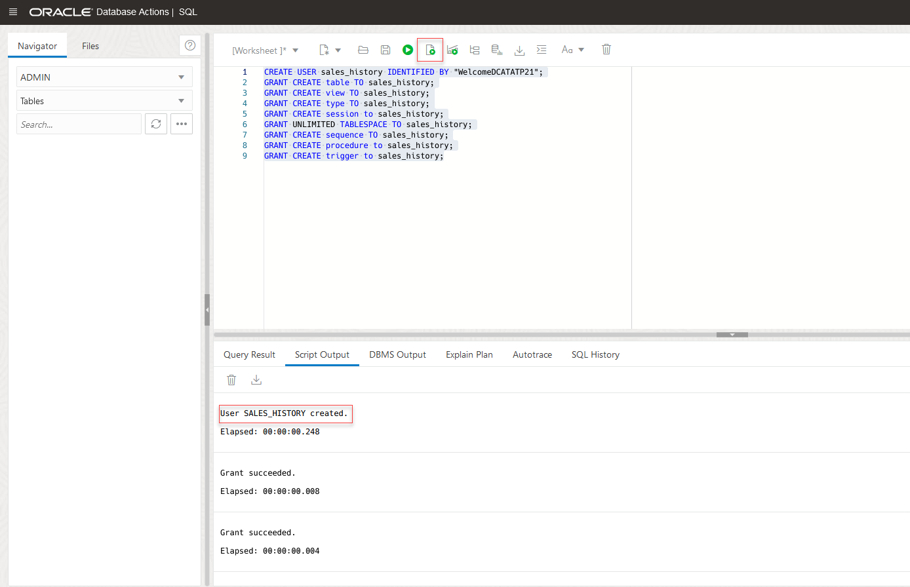

# Before Setting up Data Catalog

## Introduction

This lab will walk you through the steps to set up the prerequisites before starting your Data Catalog journey in Oracle Cloud Infrastructure. We will show you how to create the required Oracle Cloud Infrastructure resources for the workshop, including loading the Autonomous Data Warehouse with sample data.

Estimated Time: 45 minutes

### Objectives

In this lab, you will:
* Set up users and policies needed for Data Catalog.
* Set up an Autonomous Data Warehouse.
* Upload sample data to Autonomous Data Warehouse.

## Task 1: Log on to the Oracle Cloud Console

1. To sign in to Oracle Cloud at [cloud.oracle.com](https://cloud.oracle.com) you need:

    * Your cloud account name (also sometimes referred to as your tenancy name)
    * User name and password

  For more information about signing in to the console, see [Signing In to the Console](https://docs.oracle.com/en-us/iaas/Content/GSG/Tasks/signingin.htm) of the Oracle Cloud Infrastructure documentation.

2. On the **Oracle Cloud Infrastructure Sign In** page, select your tenancy, enter you user name and password, and    then click **Sign In**. The **Oracle Cloud Console** Home page is displayed.

        

In the **Get Started** tab of the Home page, scroll down to the **Start Exploring** section. Click **Key Concepts and Terminology**. In the **Learning Modules and Submodules** section of **Key Concepts and Terminology** you can find links to videos and PDFs about Core Infrastructure, Governance and Administration, and so on.

## Task 2: Create a Compartment

If you have already created a compartment, move to Task 3.

To create a compartment, follow these steps:

 1. From the Console navigation menu, select **Identity & Security** and under **Identity**, click **Compartments**.

    

 2. On the **Compartments** page, click **Create Compartment**.

       

 3. In the **Create Compartment** panel that appears, enter the following details

    * In the **Name** field, enter a name for your compartment. For example, **data-catalog-livelab-work**.
    * In the **Description** field, enter a description. For example, **Compartment for data catalog**.

 4. Click **Create Compartment**.

       

## Task 3: Create User Group and Policies

To create a user group, follow these steps:

 1. From the Console navigation menu, select **Identity & Security** and under **Identity**, click **Groups**.

    

 2. On the **Groups page**, click **Create Group**.

    

 3. In the **Create Group** panel that appears, enter the following details:

    * In the **Name** field, enter a name for your user group. For example, **data-catalog-livelab-users**.
    * In the **Description** field, enter a description. For example, **Group of data catalog users**.

    

 4. Click **Create**.

    The group is created. Now you can add users to the group. To add a user, click the group that you created and in the **Group Details** page that appears, click **Add User to Group**. In the **Add User to Group** dialog box, from the list of users, select the user that you want to add, and then click **Add**.
    > **NOTE:** Use the **Identity** service to create users.

### **Create Policies**

 1. From the Console navigation menu, select **Identity & Security** and under **Identity**, click **Policies**.

      

 2. On the **Policies** page, select the compartment **data-catalog-livelab-work** and click **Create Policy**.

      

 3. In the **Create Policy** panel that appears, enter the following details:

      * In the **Name** field, enter a name for the policy. For example, **data-catalog-livelab-user-policies**.
      * In the **Description** field, enter a description. For example, **Policies for data catalog users**.
      * Enable **Show manual editor**.
      * Enter the following statement to allow the users to perform all operations on all data catalog     
        Resources in a given compartment:

          ```
          <copy>allow group data-catalog-livelab-users to manage data-catalog-family in compartment data-catalog-livelab-work</copy>
          ```
 4. Click **Create**.

      

      For more examples, see [policy examples](https://docs.oracle.com/iaas/data-catalog/using/policies.htm#policy-examples)
      > **NOTE:** You can specify the compartment of your choice in the policy statement.

 5. You need to create a policy to access the user information. On the **Policies** page, select the **root** compartment and click **Create Policy**.

    

 6. In the **Create Policy** panel that appears, enter the following details:

      * In the **Name** field, enter a name for the policy. For example, **data-catalog-livelab-policies**.
      * In the **Description** field, enter a description. For example, **Policies for data catalog users**.
      * Enable **Show manual editor**.
      * Enter the following statement to allow the users to perform all operations on all data catalog     
        Resources in a given compartment:

          ```
          <copy>allow group data-catalog-livelab-users to inspect users in tenancy
          allow service datacatalog to inspect users in tenancy
          </copy>
          ```
    

  7. Click **Create**.

## Task 4: Set up Autonomous Data Warehouse

  1. From the Console navigation menu, select **Oracle Database**, and under **Autonomous Database**, click **Autonomous Data Warehouse**.

    

  2. On the **Autonomous Database** page, ensure that you are in the compartment that you have created for the **data-catalog-livelab-work** data catalog resources, and click **Create Autonomous Database**.

    

  3. Provide basic information for the Autonomous Database:

      - Choose a **Compartment** - Select a compartment for the database from the drop-down list (`data-catalog-livelab-work`).
      - **Display Name** - Enter a meaningful name for the database for display purposes. For this lab, use `Data Catalog Workshop`.
      - **Database Name** - Use letters and numbers only, starting with a letter. Maximum length is 14 characters. For this lab, use `DCATWORKSHOP`.

         > **NOTE:** The same database name cannot be used for multiple Autonomous Databases in your tenancy, in the same region.

     

  4. Select **Data Warehouse** as the workload type.

    

  5. Choose **Shared Infrastructure** as the deployment type.

    

  6. Configure the database:

      - **Always Free** - Leave this option unchecked.
      - **Choose database version** - Select a database version from the available versions. Leave the default version 19c.
      - **OCPU count** - Number of CPUs for your service. Specify 1 CPU.
      - **Storage (TB)** - Select your storage capacity in terabytes. Specify 1 TB of storage.
      - **Auto Scaling** - Keep auto scaling enabled, to allow the system to automatically use up to three times more CPU and IO resources to meet workload demand if needed.

      

  7. Create **Administrator credentials**:

      - Password and Confirm Password - Specify the password for `ADMIN` user of the service instance.

      

  8. Choose **Network access**:

     - For this lab, accept the default **Allow secure access from everywhere**.

        

  9. Choose a **license type**. For this lab, leave the default value **Bring Your Own License (BYOL)**. The two license types are:

      - Bring Your Own License (BYOL) - Select this type when your organization has existing database licenses.
      - License Included - Select this type when you want to subscribe to new database software licenses and the database cloud service.

      

  10. Click **Create Autonomous Database**.

    

  11. When the state of the database changes from **Provisioning** to **Available**, the autonomous data warehouse database that you created is ready for use.

    

Next, you download the client credentials wallet file for the database. This file is required to connect Data Catalog to the autonomous data warehouse. To download the wallet file, follow these steps:

   1. On the **Autonomous Database** Details page of your database, click **DB Connections**.

    

   2. On the **Database Connection** page, leave the **Wallet Type** as **Instance Wallet**, and click **Download Wallet**.

    

   3. In the **Download Wallet** dialog box, enter a password for the wallet and re-enter it to confirm.  

    

   4. Click **Download**.
      The wallet file gets downloaded as a zip file and is named **Wallet_&lt;databasename&gt;.zip**.

## Task 5: Prepare the Autonomous Data Warehouse

In this workshop, **Autonomous Data Warehouse** serves as the **target data asset** for our data catalog tasks. In this step, you will configure your target Autonomous Data Warehouse database in order to complete all the labs in this workshop.

In this task, you create a new user on the Autonomous Data Warehouse and then run an SQL script to create the database objects that you need for the data catalog tasks.

1. From the Console navigation menu, select **Oracle Database**, and under **Autonomous Database**, click **Autonomous Data Warehouse**.

  

2. On the **Autonomous Database** page, ensure that you are in the compartment that you have created for the **data-catalog-livelab-work** data catalog resources, and click the autonomous data warehouse that you created, that is **Data Catalog Workshop**.

  

3. On the **Autonomous Database Details** page, click the **Tools** tab.

  

4. In the **Tools** tab, in the **Database Actions** section, click **Open Database Actions**.

  

5. On the Database Actions Sign in page, enter your username and password, and click **Sign in**.

  

  

6. In the **Database Actions** page that appears, in the **Development** section, click **SQL**.

  

7. In the SQL worksheet that opens, create a new user named **sales_history**. To create the user copy the following code, paste it in the worksheet, and then run it:

    ```
    <copy>CREATE USER sales_history IDENTIFIED BY "password";
    GRANT CREATE table TO sales_history;
    GRANT CREATE view TO sales_history;
    GRANT CREATE type TO sales_history;
    GRANT CREATE session to sales_history;
    GRANT UNLIMITED TABLESPACE TO sales_history;
    GRANT CREATE sequence TO sales_history;
    GRANT CREATE procedure to sales_history;
    GRANT CREATE trigger to sales_history;</copy>
    ```

     > **NOTE:** Ensure that you enter a password in place of password. Also, make sure that the script output shows the success of the commands.

  

9. **Download** the zip file [DCAT Workshop files.zip](https://objectstorage.us-ashburn-1.oraclecloud.com/p/Ei1_2QRw4M8tQpk59Qhao2JCvEivSAX8MGB9R6PfHZlqNkpkAcnVg4V3-GyTs1_t/n/c4u04/b/livelabsfiles/o/oci-library/DCAT%20Workshop%20files.zip) to your local directories. Unzip this file.

9. In the same SQL worksheet, run the **DCAT\_Livelabs.sql** script from the unzipped archive from the previous step, to create the rest of the database objects that you need for the following labs.

   The SQL script creates tables CHANNELS, COSTS, COUNTRIES, CUSTOMERS, PRODUCTS, PROMOTIONS, SALES, and SUPPLEMENTARY_DEMOGRAPHICS and TIMES, which will serve as the target tables for the data catalog operations.

   

11. Refresh the browser and in the Navigator on the left, switch to the `sales_history` schema to verify that your tables were created successfully. If still your new user does not appear, kindly log out and login again.

  

## Learn More

* [Get Started with Data Catalog](https://docs.oracle.com/en-us/iaas/data-catalog/using/index.htm)
* [Data Catalog Overview](https://docs.oracle.com/en-us/iaas/data-catalog/using/overview.htm)
* [Autonomous Data Warehouse](https://docs.oracle.com/en/cloud/paas/autonomous-data-warehouse-cloud/index.html)
* [Object Storage](https://docs.oracle.com/en-us/iaas/Content/Object/Concepts/objectstorageoverview.htm)
* [Oracle Cloud Infrastructure Identity and Access Management](https://docs.oracle.com/en-us/iaas/Content/Identity/Concepts/overview.htm)
* [Managing Groups in Oracle Cloud Infrastructure](https://docs.oracle.com/en-us/iaas/Content/Identity/Tasks/managinggroups.htm)
* [Overview of VCNs and Subnets](https://docs.oracle.com/en-us/iaas/Content/Network/Tasks/managingVCNs_topic-Overview_of_VCNs_and_Subnets.htm#Overview)
* [Managing Compartments in Oracle Cloud Infrastructure](https://docs.oracle.com/en-us/iaas/Content/Identity/Tasks/managingcompartments.htm)

## Acknowledgements

* **Author** - Shreedhar Talikoti, Ramkumar Dhanasekaran
* **Contributors** -  Rashmi Badan, Sreekala Vyasan
* **Last Updated By/Date** - Ramkumar, Aug 2021
