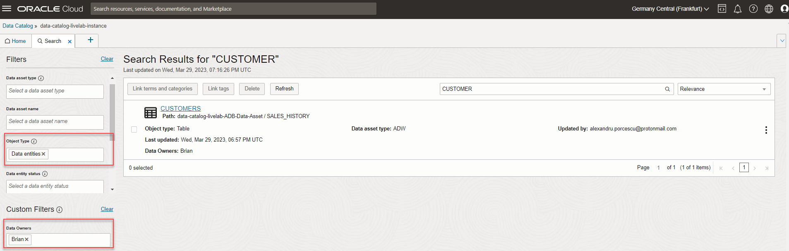
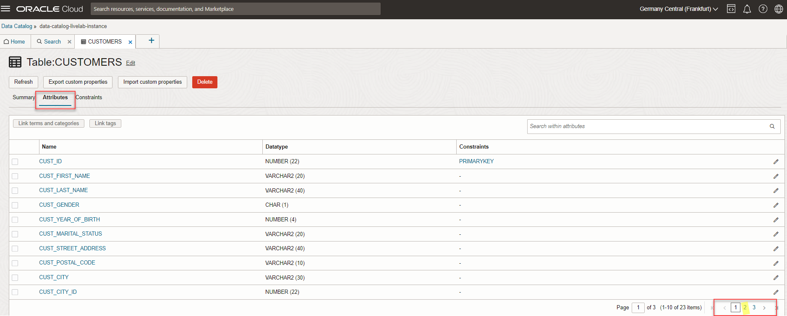
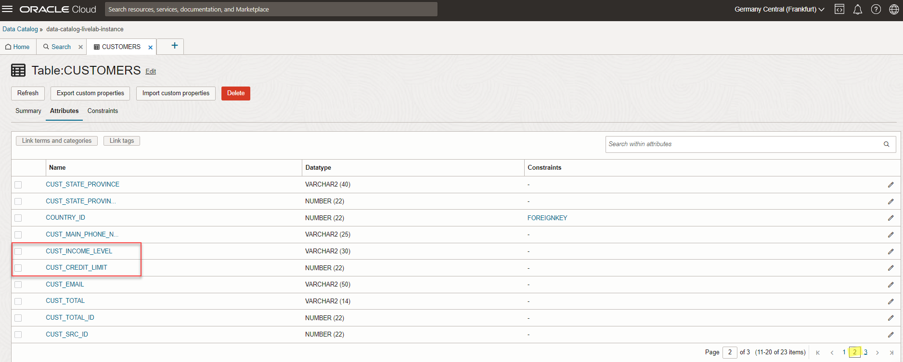
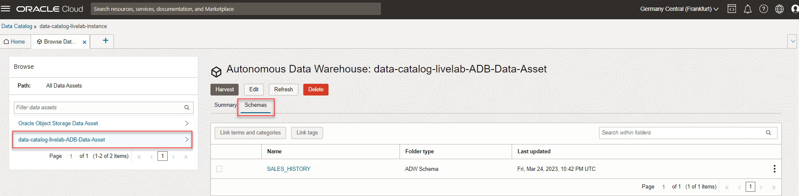
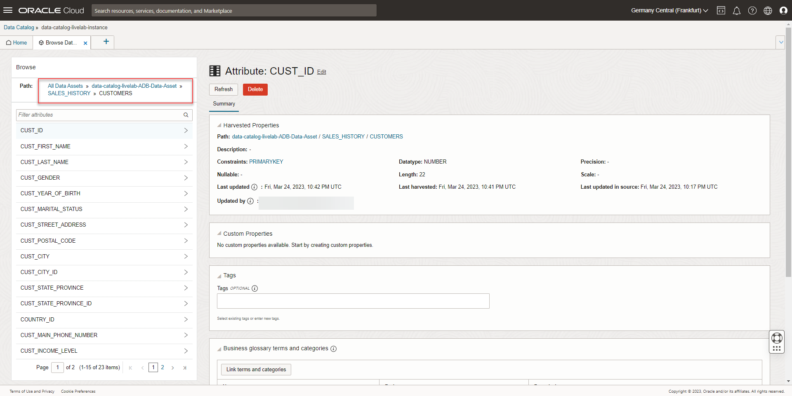
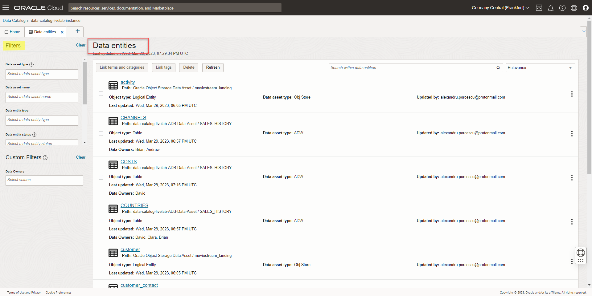
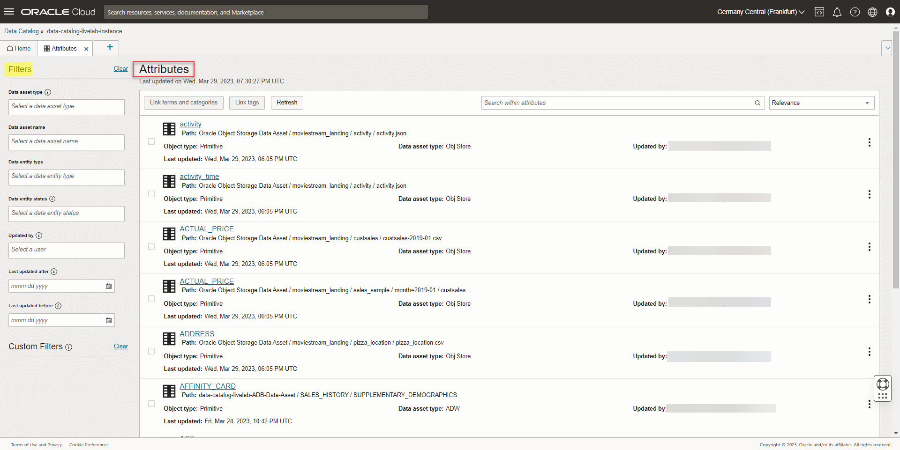
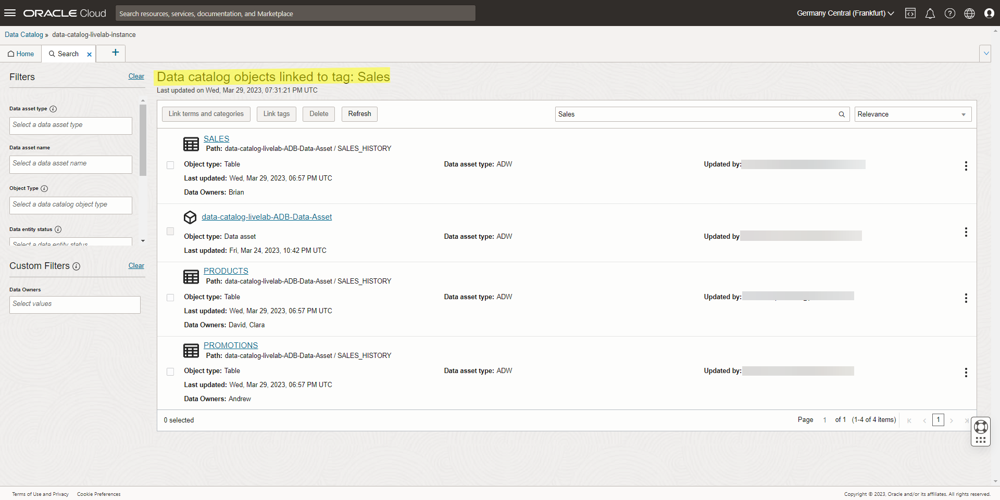

# Search and Discover your data

## Introduction

As a data consumer, data catalog provides a single place to search for data that is suitable for your needs. When the technical data has been harvested for all data sources in your organization, it is enriched with appropriate business context technical, and business users can easily search the catalog for data. Technical users may choose to browse the hierarchical view of data assets while business users can use business terms and names to search the catalog for relevant and related data.

In this lab you will be a data consumer who will search and explore the catalog to find data available to you.

Estimated Time: 45 minutes

### Objectives

In this lab, you will:
 * Use the Search field
 * Browse data assets
 * Explore Data Catalog by glossaries, tags, and categories

### Prerequisites

Complete Lab 0 to Lab 5.

## Task 1: Use the Search field

In this task, you will assume the role of a data consumer such as a data analyst who is analyzing the Credit Limit of Customers based on their income level. You will use the **Search** field to look for **Customer** related data entities owned by **Brian**. You will then check the attributes related to Credit Limit and Income Level.

1. Open the **Navigation** menu and click **Analytics & AI**. Under **Data Lake**, select **Data Catalog**.

2. On the **Data Catalogs** page, click the **`data-catalog-livelab-instance`** Data Catalog instance where you want to perform your Search operation.

   

3. Enter the **Search Text** in the **Search Field**. For example, enter **Customer** as the Search string. The system will show you the possible texts, and you can select the text if it matches your requirement. Click **Search** button or press Enter to show the results.

  

    > **NOTE:** The search is not case-sensitive.
                You can use * anywhere in your search text as a wildcard. For example, you can use customer* to search for Customer Full Name, Customer Identifier and so on.

4. A New tab **Search** is opened displaying the results.

  

5. Use **Filters** to refine your results. You will filter first by **Object Type** as **Data Entities** and then you will filter down further by **Data Owners** as **Brian**. Then you should be able to view only one entity for these filter criteria.

  

6. Click **Customers** entity which is displayed.

  

7. A new tab **Summary** is opened for **Customers**. You can also view **Number of Attributes** as 23 in addition to other information available.

  

8. Click the **Attributes** tab to further explore the Attributes. Go to the next page to explore if there any attributes related to our use case (Income Level and Credit Limit). Click number **2** at the bottom right to go to the next page.

  

  

  In the second page, you can view the relevant attributes for your use case. **CUST\_INCOME\_LEVEL** in the above screenshot approximately matches to the use case of Income Level, and **CUST\_CREDIT\_LIMIT** matches to Credit Limit.

## Task 2: Browse Data Assets

You can use the **Browse Data Assets** option to conveniently view and navigate all the data assets created in the data catalog repository. You can navigate the hierarchy of the data asset more easily with this option.

1. From the **Quick Actions** menu, click **Browse Data Assets**.

    
    The **Browse Data Assets** tab opens and it displays all the available data assets. When you click the arrow (>) next to the name of the data asset, such as **data-catalog-livelab-ADB-Data-Asset**, you can view its details in the **Summary** tab.

    

2. Click the **Schemas** tab to view the available schema for data-catalog-livelab-ADB-Data-Asset. The table displays the **SALES\_HISTORY** schema.

  

3. Click the name of the data asset in the left pane to drill down further into the schemas.

  

    > **NOTE:** You can always go back to the previous browse result by selecting the value in the **Path** in the left panel.

    

4. Click **SALES\_HISTORY**. On the right pane, you can view all the details of the schema. .

  

6. A list of **Data Entities** available under this particular Data Asset is shown.

  

7. Click one of the data entities, such as **CUSTOMERS**, to view its attributes.

  

  The left pane displays the list of attributes.

  

## Task 3: Exploring Data Entities/Attributes

You can directly search for entities and attributes by using the lists dedicated to these objects. You can narrow down on the items you are looking for by using the filters in the left panel.

1. Click the + icon in the Home page and then click **Data Entities** to list out the available Data Entities.

  

2. A new tab **Data Entities** is displayed showing the list of available Data Entities. You can use **Filters** in the left pane to restrict the data.

  

3. Click the + icon in the Home page and then click **Attributes** to list out the available Attributes.

  

4. A new tab **Attributes** is displayed showing the list of available Attributes. You can use **Filters** in the left pane to restrict the data.

  

## Task 4: Exploring the Data Catalog by Tags

You can explore data catalog objects by the tags linked with them. In the **Home** tab, the **Popular Data Catalog Tags** section shows the popular tags in the catalog. When you hover over the label of a tag, you can view the usage count of the tag. When you click on any tag, a search tab appears with the results of the data catalog objects that are linked to the tag.

1. In this workshop the **Sales** tag is created. Click on it to see all the objects linked to this tag.

    

    

## Learn More

* [Get Started with Data Catalog](https://docs.oracle.com/en-us/iaas/data-catalog/using/index.htm)
* [Data Catalog Overview](https://docs.oracle.com/en-us/iaas/data-catalog/using/overview.htm)
* [Autonomous Data Warehouse](https://docs.oracle.com/en/cloud/paas/autonomous-data-warehouse-cloud/index.html)
* [Object Storage](https://docs.oracle.com/en-us/iaas/Content/Object/Concepts/objectstorageoverview.htm)
* [OCI Identity and Access Management](https://docs.oracle.com/en-us/iaas/Content/Identity/Concepts/overview.htm)
* [Managing Groups in OCI](https://docs.oracle.com/en-us/iaas/Content/Identity/Tasks/managinggroups.htm)
* [Overview of VCNs and Subnets](https://docs.oracle.com/en-us/iaas/Content/Network/Tasks/managingVCNs_topic-Overview_of_VCNs_and_Subnets.htm#Overview)
* [Managing Compartments in OCI](https://docs.oracle.com/en-us/iaas/Content/Identity/Tasks/managingcompartments.htm)

## Acknowledgements

* **Author** - Shreedhar Talikoti, Ramkumar Dhanasekaran
* **Contributors** - Rashmi Badan, Sreekala Vyasan
* **Last Updated By/Date** - Ramkumar, Sep 2021
