# Export Log Data to Object Storage

## Introduction

In this Lab you will create an automated job to export log data to OCI Object storage for long-term storage and archival.  OCI makes this easy via service connectors: a framework for creating jobs to filter, process and move log data from Logging Service to Object Storage.

A service connector specifies the source Logs, optional filtering/processing, execution frequency and the destination Object Storage Bucket.  

Estimated Lab Time: 5 minutes

### Objectives

In this lab, you will:
* Export Log Content to an Object Storage Bucket.
* View the contents of the Bucket to verify data export.

### Prerequisites

* An Oracle Free Tier, Always Free, Paid or LiveLabs Cloud Account
* Access to the cloud environment and resources configured in Lab 1
* The Log Group created in Lab 2 and Custom Log created in Lab 3

## Task 1: Create Object Storage Archive Bucket

The target bucket must already exist prior to creating the service connector, so let's create a bucket now.

1.  In the OCI Management Console, ensure you have selected the same region where you have created the resources from the previous Labs in this workshop.  Navigate to the Object Storage service.

    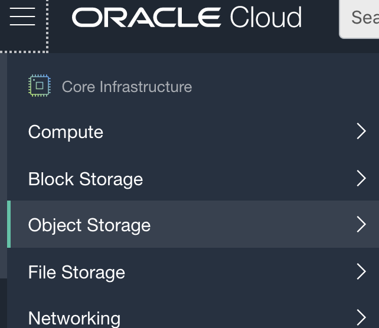

2.  In the Object Storage service landing page, ensure your scope is set to **Compartment** logservicedemo.
    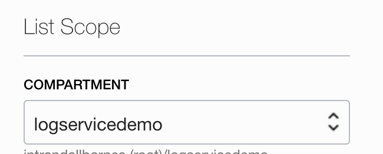

3.  Click on **Create Bucket** to bring up the create bucket panel.
    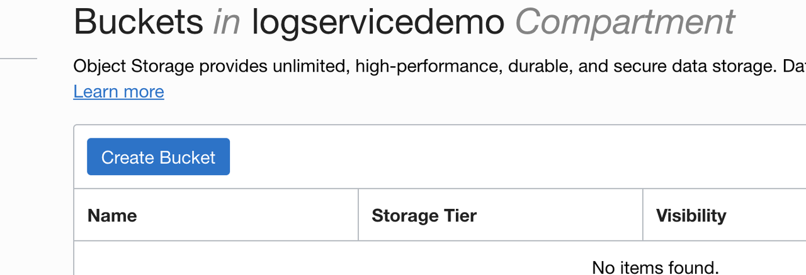

4.  In the **Create Bucket** panel, enter **BUCKET NAME** logarchivedemo, **STORAGE TIER** Standard, leave **OBJECT EVENTS** and **OBJECT VERSIONING** deselected, and ensure **ENCRYPTION** is configured to ENCRYPT USING ORACLE MANAGED KEYS as shown in the following image.
    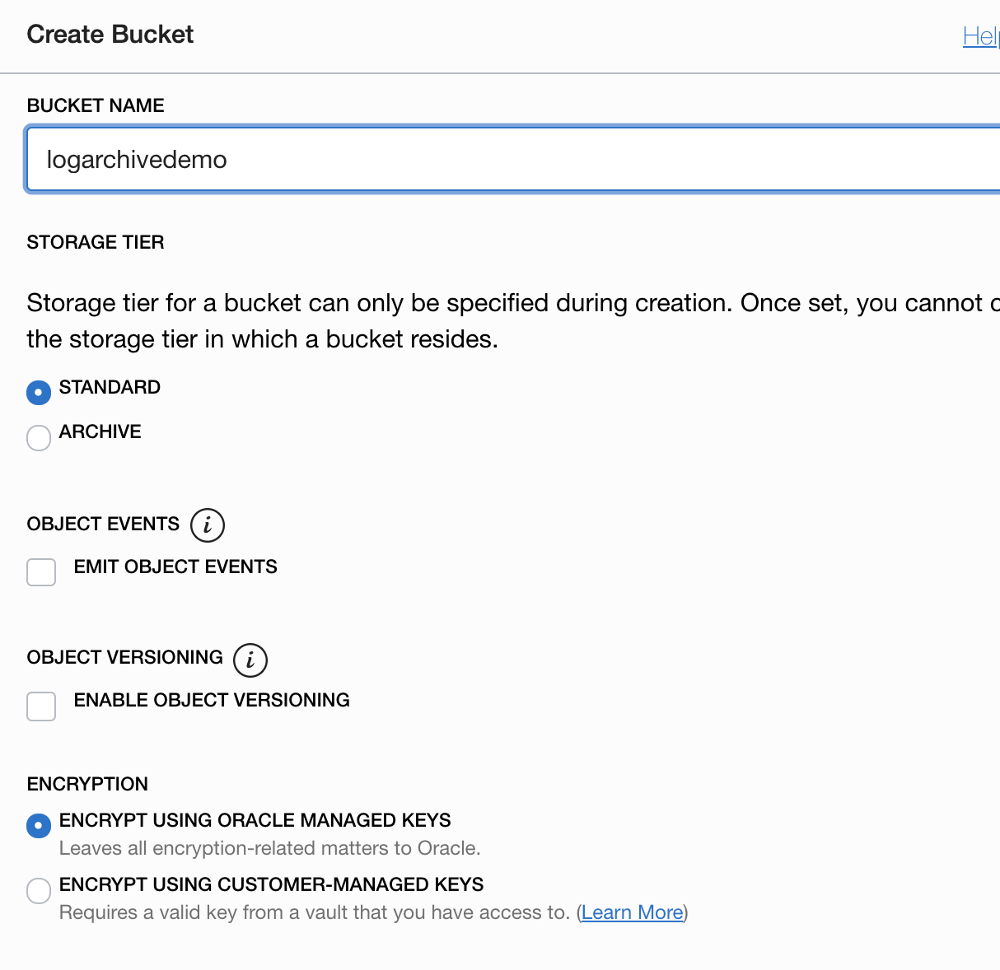

5.  Click **Create Bucket** to complete the new bucket creation task, and you're ready to move on to the next step.

## Task 2: Configure Automated Export

In this step you will create a **Service Connector** to export Log content to the bucket you created in Step 1.

1. In the OCI Management Console, navigate to **Logging** --> **Service Connectors**.

    

   
2. Ensure **Compartment** logservicedemo is selected in the left column.  If this is the first time you have visited this page the **Service Connector** list will be empty.  Open the new connector panel by selecting **Create Connector**.
    
    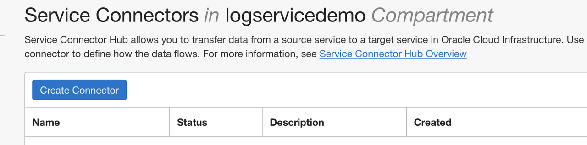

3. In the **Create Service Connector** panel, enter logdemoconnect for **CONNECTOR NAME**, add a brief description, and double-check that logservicedemo is specified for **RESOURCE COMPARTMENT**.
    
    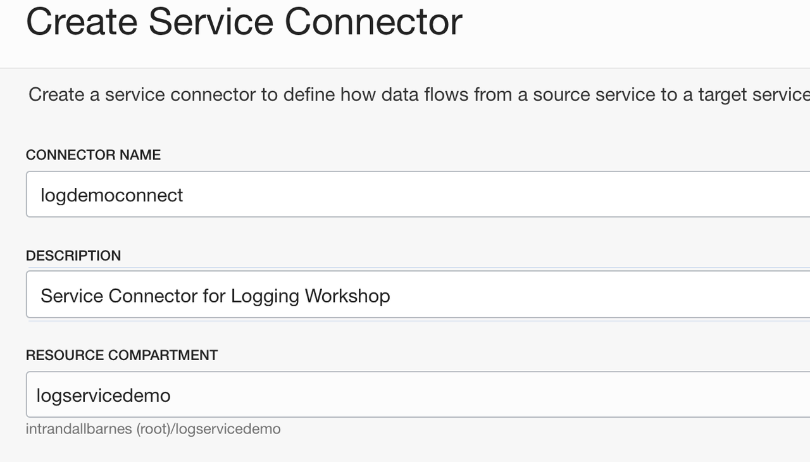

4. In the **Configure Service Connector** section, select **Logging** for **SOURCE** and **Object Storage** for **TARGET**.  Choose **Logservicelg** for **LOG GROUP**  and **customlog01** for **LOGS**.  In this Lab we will not configure more advanced filtering and processing parameters.  Please refer to the **Learn More** section for links on getting started with advanced configurations.
    
    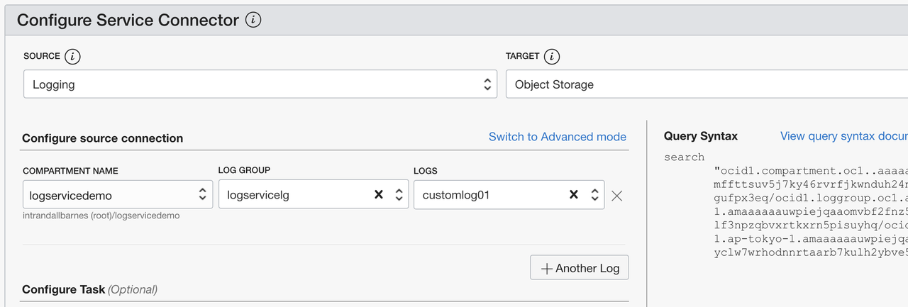

5. In the **Configure target connection** section, select the **BUCKET** you created in Step 1: logarchivedemo.    
    
    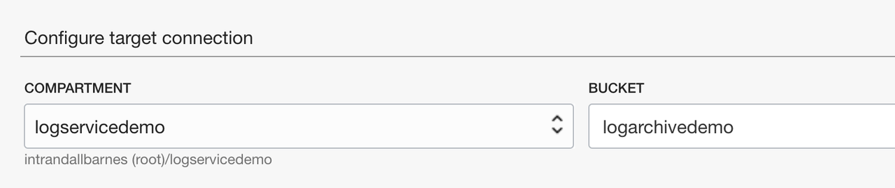

6. The Connector Service provides an option to automatically create the security policy (permissions) required for this connector job to export data.  Click **Create** in the box as shown in the image below.  **Note**: depending on your account type and previous setup steps, these permissions may have already been implicitly created.  In that case this option will not be presented and it's safe to proceed to the next item.
    
    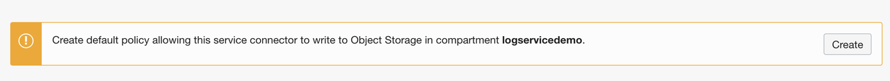

   The box confirms the policy creation and displays the policy name for future reference.
    
    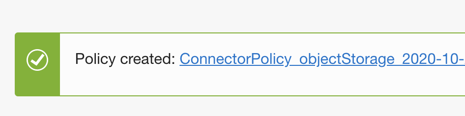

7. Complete the connector creation task by clicking **Create**

    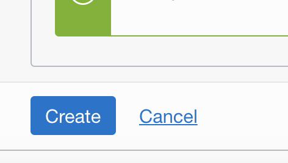

   The panel will close and then show the new connector properties page.  Here you may view/edit configurations and also verify the status of the data processing.  Log content is processed periodically in batches.  It may take a few minutes for activity and metrics to show in the console.

    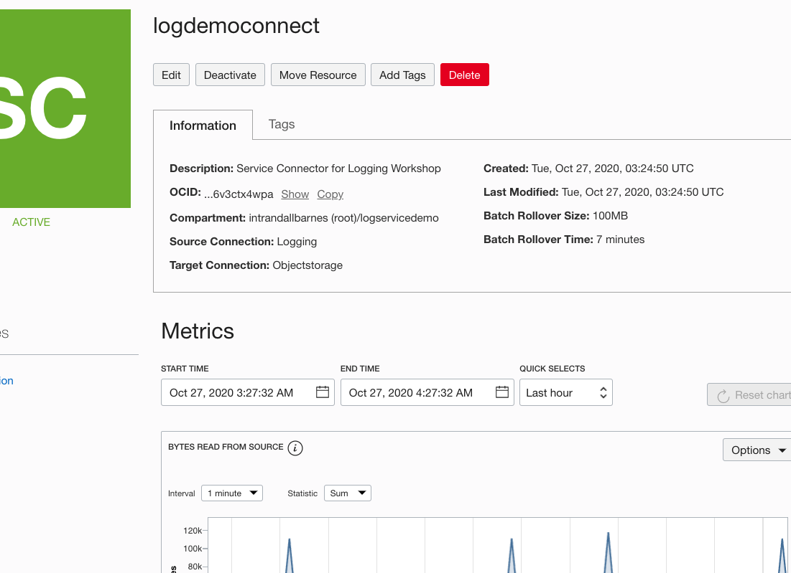

   
## Task 3: [Optional] View Log Archive Content

Log content archived to Object Storage is aggregated via batches (default every 7 minutes) and stored in .gz format. Timestamps allow easy retrieval by time range(s).  In this step you will locate archived content and optionally download/extract/view to validate the storage integrity.

1. Navigate to **Object Storage**, select **Compartment** logservicedemo to locate the bucket created in Step 1.

    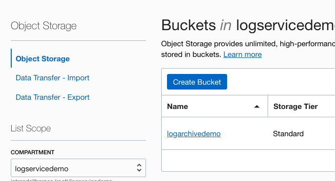

2. Click on the bucket name **logarchivedemo** to open the properties page.  Expand the bucket contents to view archive content in timestamped gzip format.  **Note: it may take a few minutes after creating the connector for initial content to land in the bucket**. 

    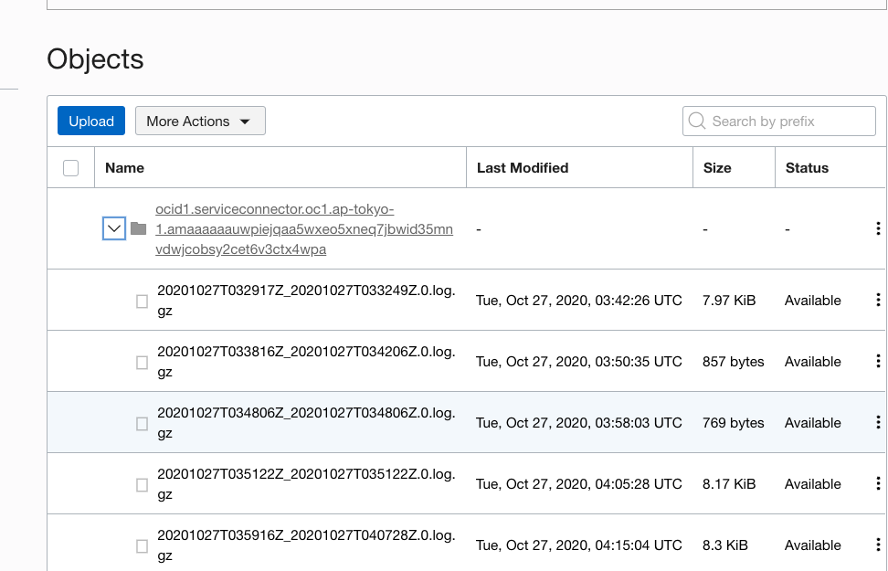

3. Select a file for download, extraction and viewing. The download option may be found by clicking the vertical dots in the far righthand column.  

    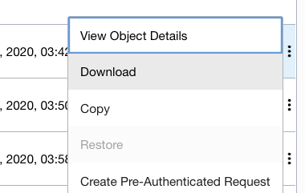

4. User your preferred log or text viewer to verify content.

    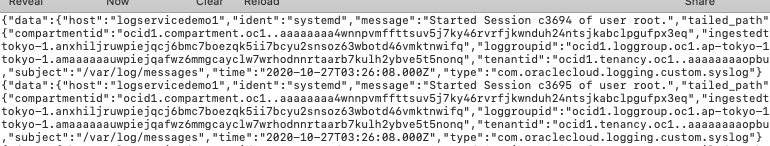

## Learn More

## Acknowledgements
* **Author** - Randall Barnes, Solution Architect, OCI Observability Team
* **Last Updated Date** - Kamryn Vinson, October 2020

