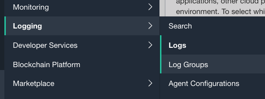
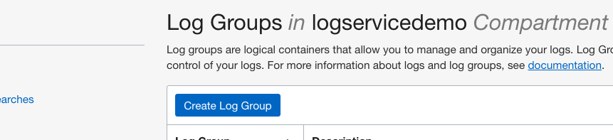
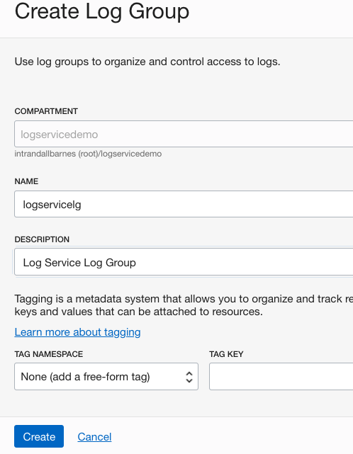
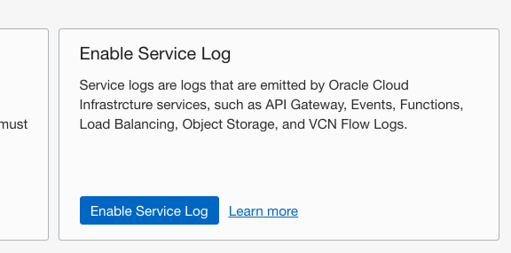
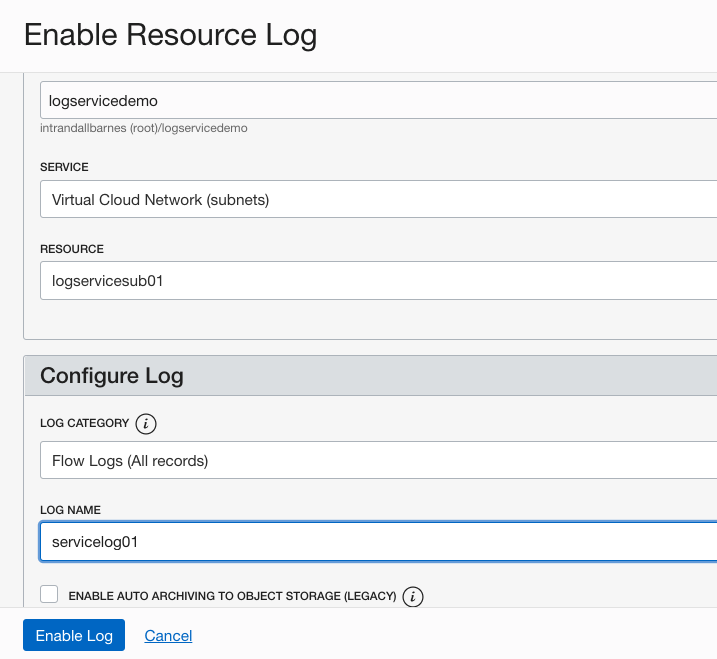
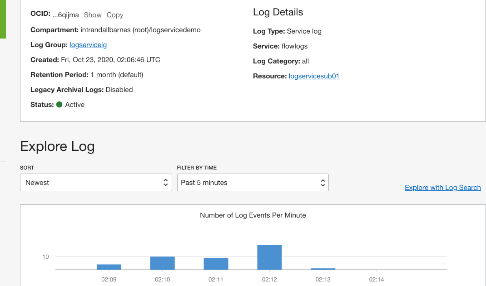
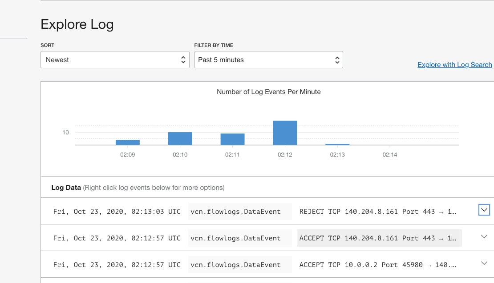

# Enable Your Service Resource Log

## Introduction

Logs contain critical diagnostic information that tells you how your resources are performing and being accessed. You can enable built-in logging on core cloud infrastructure resources.  In this lab you will enable automatic log collection for network activity in the Virtual Cloud Network created in Lab 1. 

Estimated Lab Time: 10 minutes

### Objectives

In this lab, you will:
* Create a Log Group
* Enable a Network Flow Log

### Prerequisites

* An Oracle Free Tier, Always Free, Paid or LiveLabs Cloud Account
* Access to the cloud environment and resources configured in Lab 1 

## Task 1: Create Log Group

Log groups are logical containers for organizing and managing logs. Logs must always be inside  a log group. You must first create a log group to enable or create logs.  Fortunately, this is a fast and easy activity.

1. In the OCI Management Console, ensure you have selected the same Region as Lab 1.  Navigate to **Logging** --> **Log Groups**

      

2. Ensure **Compartment** logservicedemo is selected in the left column.

    
   
3. Click the **Create Log Group** button.

    

4. On the **Create Log Group** dialog page ensure **Compartment** logservicedemo is specified.  **NAME** your Log Group logservicelg, provide a brief **DESCRIPTION**, and then click the **Create** button.

    

   
   You are now ready to move on to the next step.

## Task 2: Enable Network Flow Log

Many core cloud infrastructure services have built-in logging capabilities.  Now that you have created a Log Group in Step 1, let's select one of our core services and enable logging.  In this step, you will enable logging on the **Virtual Cloud Network** created in Lab 1.

1.  Select **Logs** in the left column of the OCI Management Console.  This can be found in the **Logging** service in case you no longer have that page open. 

    

2.  Select **Enable Service Log** to open the Enable Resource Dialog page.  

    

3.  On the **Enable Resource Log** page:
    - Ensure **Compartment** logservicedemo is listed
    - Choose **Virtual Cloud Network (subnets)** from the **Service** drop-down
    - Select **RESOURCE** logservicesub01
    - In the **Configure Log** section **Name** your log as shown in the image
    - Click **Enable Log** to complete the task

    

4.  Review the Log details page.  It may take a couple minutes for the service to complete configurations.

    

5.  You may explore log content directly from the Log properties page. Note: Full log search activities are covered in a later Lab section.

    

You may proceed to the next lab.

## Learn More

## Acknowledgements
* **Author** - Randall Barnes, Solution Architect, OCI Observability Team
* **Last Updated Date** - Kamryn Vinson, October 2020

