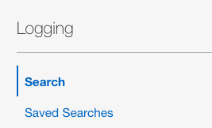
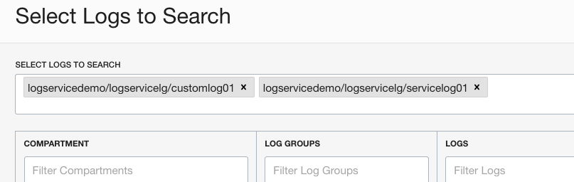
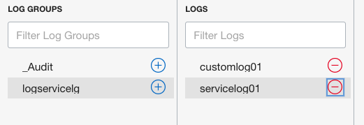
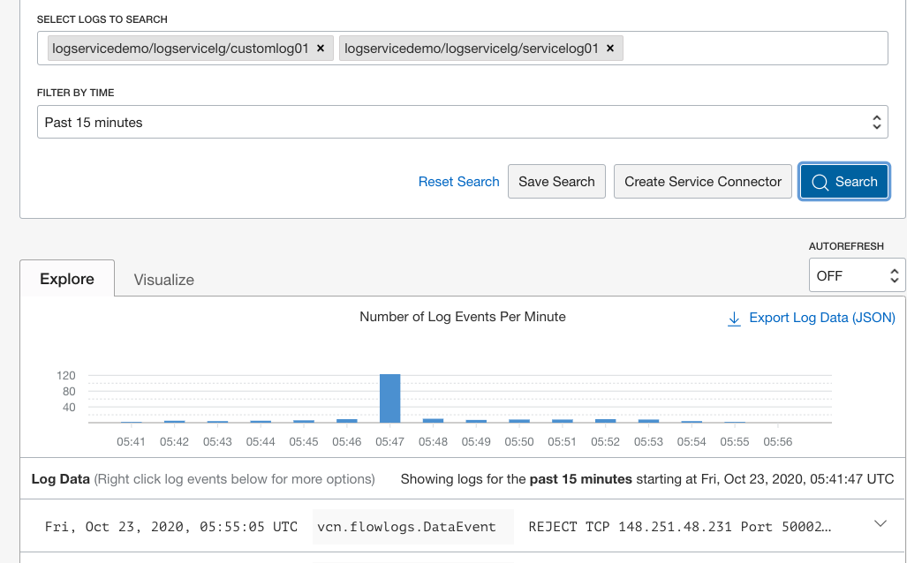

# Search Log Content

## Introduction

In this Lab you will explore the contents of your logs and become familiar with the built-in search capabilities provided by the Logging Service.

OCI Logging Service provides the tools to search over any combination or scale of Logs to identify events or patterns that may be difficult to observe via legacy methods. This is especially true when working in a distributed scale-out environment comprised of several services and platforms.

Estimated Lab Time: 5 minutes

### Objectives

In this lab, you will:

* Become familiar with the Log Search console.
* Search content from logs created in the preceding Labs.

### Prerequisites

* An Oracle Free Tier, Always Free, Paid or LiveLabs Cloud Account
* Access to the cloud environment and resources configured in Lab 1
* The Log Group created in Lab 2 and Custom Log created in Lab 3

## Task 1: Select Logs to be included in Search

1. In the OCI Management Console, ensure you have selected the same Region as the previous Labs.  Navigate to **Logging** --> **Search**.

    

2. Click inside the **SELECT LOGS TO SEARCH** box to bring up the pop-up search panel.  

3.  Select logservicedemo **COMPARTMENT**, logservicelg **Log Groups** and both the custom and service log listed in the **LOGS** section.

   This may take some time and a few extra clicks to become familiar with the log selection process.  In the end, your selection screen should look similar to the image below.  As long as **customlog01** and **servicelog01** are showing in the **SELECT LOGS TO SEARCH** box you're good to proceed.

  

  

4.  Click **Continue** to close the panel and return to the search landing page.

## Task 2: Search Content and Explore Logs

1.  On the log search page, click the **Search** button and review the results in the panel below.  

2.  In the **FILTER BY FIELD OR TEXT SEARCH** box enter candidate search keywords such as "ERROR" or "REJECT".  View the results in the results panel.  

  

3.  Click the **Search** button an review the filtered results.

4.  **Optional**: Update the search parameters to filter the results.

When complete, you may proceed to the next Lab.

## Learn More

## Acknowledgements
* **Author** - Randall Barnes, Solution Architect, OCI Observability Team
* **Last Updated Date** - Kamryn Vinson, October 2020

