# Setup the Environment

## Introduction
This lab walks you through the steps to configure your cloud environment, define security and access controls, and create a virtual network.

Estimated Lab Time: 15 minutes

### Objectives

In this lab, you will:
* Create a Compartment in your Tenancy
* Create and configure an IAM Group
* Create and configure a Virtual Cloud Network

### Prerequisites

* An Oracle Free Tier, Always Free, Paid or LiveLabs Cloud Account.  Please refer to the Prerequisites section for instructions on how to obtain a Free Tier account.
* A compatible browser


## Task 1: Create an IAM Compartment

A compartment is a virtual container within your Cloud account used to organize and group related resources for easier management.  When creating a compartment, you must provide a unique name and also a description. 

1. In the OCI Management Console, locate and expand the main menu control. This is typically in the upper left corner of your browser, but console layouts may vary between versions. 

    

      Expand the list of services and navigate down to **Identity** ---> **Compartments**.
      
      
  
2. Select the **Create Compartment** button.

    

3. Enter **logservicedemo** in the **Name** field and give your Compartment a brief description.  Click the **Create Compartment** button to complete the creation.

    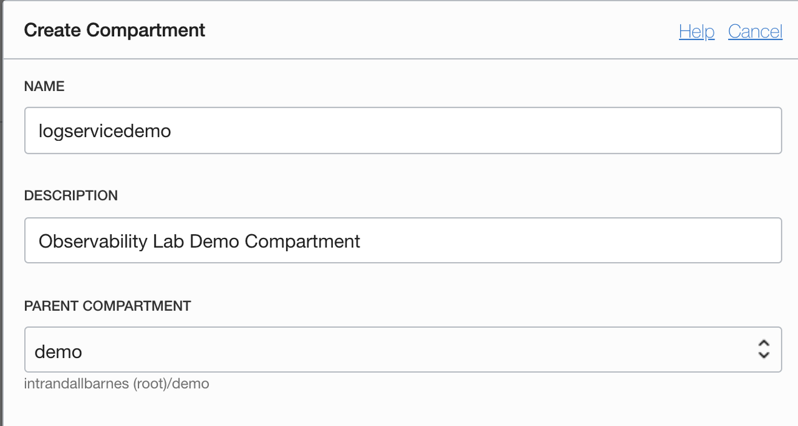

4. Most likely, you'll be returned to the **IAM** --> **Compartments** page. Click on your new Compartment name **logservicedemo** to open the Compartment Details page.  Locate and record the unique identifier (**OCID**) for this Compartment.  This identifier is required in Step 2.

    


## Task 2: Create and Configure an IAM Dynamic Group

Dynamic groups allow you to assign permissions to Virtual Machines and allow these systems to autonomously perform specific actions against Oracle Cloud Infrastructure services. In this manner you allow applications and systems running on your Virtual Machines to use the Logging Service, for example to dynamically push logs to the centralized service in near-real time.  When you create a dynamic group, rather than adding members explicitly to the group, you instead define a set of matching rules to define the group members. For example, a rule could specify that all instances in a particular compartment are members of the dynamic group. The members can change dynamically as instances are launched and terminated in that compartment.

1. In the OCI Management Console open the Main Menu, navigate to **Identity** --> **Dynamic Groups**. 

      

2. Select the **Create Dynamic Group** button.

      

3. Enter **logservicedg** in the **Name** field and give your Dynamic Group a brief description.

      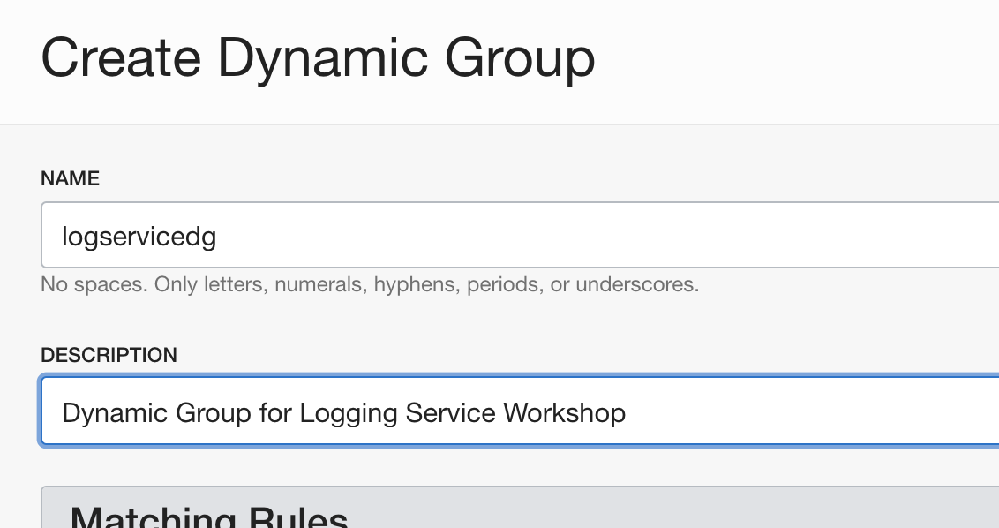

4. Next we will create **Matching Rules** to select which Virtual Machines should be included in this Dynamic Group.  In a production environment, you may be very selective about the specific Virtual Machines that may be included in this group to strictly limit the permissions they inherit.  In this workshop, we will create a rule to include all Virtual Machines within the logservicedemo Compartment created in Step 1.  **Add the following statement** in the **Matching Rules** --> **RULE 1** box. Note: change the OCID to match your OCID recorded in Step 1, keeping the single quotes surrounding this value.  If you no longer have this OCID readily available, it may be obtained by navigating to the **Identity** --> **Compartments** --> **logservicedemo** property page.  

    ```
    instance.compartment.id = 'ocid1.compartment.oc1..aaaaaaaaakqxljn2xvohyoe5hdpcabnpfitoh3ef3sjcnjfzjhfi2nbgv3yq'
    ```
      

5. Click **Create** to complete the process and close the dialog screen.

6. Next we will create a **Policy** for your Dynamic Group to grant Virtual Machines the ability to push logs to the Logging Service.  

7. Navigate to the **Identity** --> **Policies** page nd ensure **Compartment** logservicedemo is selected in the left column.

      
   
8. Click **Create**, name your new policy "logservicedg" and give it a brief description.  For **Compartment** select "logservicedemo".
 
      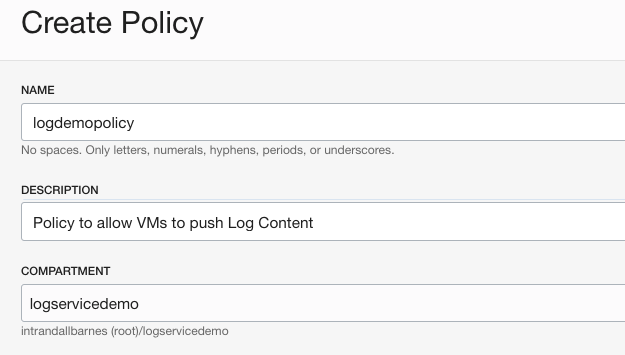

9. In the **Policy Builder** section select the "**Customize(Advanced)**" option. 
   
      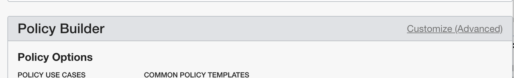
   
10.  Enter the following code in the policy box, as shown in the figure below:

    ```
    Allow dynamic-group logservicedg to use log-content in compartment logservicedemo
    ```
       

11. Click **Create** to complete the process and close the dialog screen.

## Task 3: Create a Virtual Cloud Network

A **Virtual Cloud Network** (**VCN**) defines a private network in your cloud environment where you can specify networking parameters such as CIDR block and route tables along with security controls, for example access control lists, virtual firewalls and optionally allow connectivity to the public internet.  In this step we will create a simple **VCN** suitable for this workshop.  Note: for a production **VCN** environment it is recommended to further restrict network access controls to meet your security requirements.

1. In the OCI Management Console, choose a region to create your VCN. 

      

2. Open the Main Menu, Navigate to **Networking** --> **Virtual Cloud Networks**

      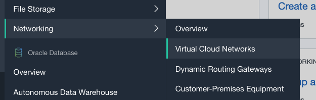

3. Ensure **Compartment** logservicedemo is selected in the drop down box on the left bar.

      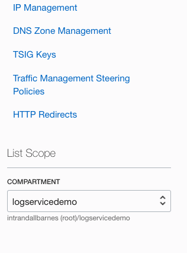

4. Select the **Create VCN** button

      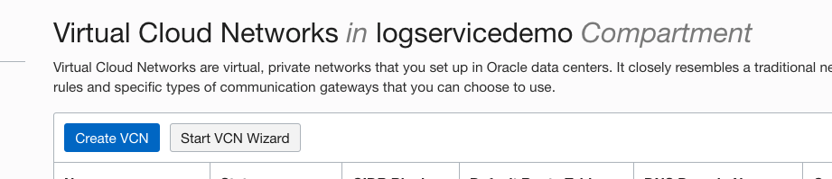

5.   In the **Create a Virtual Cloud Network** dialog screen enter "logservicevcn" for **NAME**, select "logservicedemo" for **CREATE IN COMPARTMENT** and define the **CIDR BLOCK** as "10.0.0.0/16".  Leave other settings as default and click the **Create VCN** button to complete the creation.

      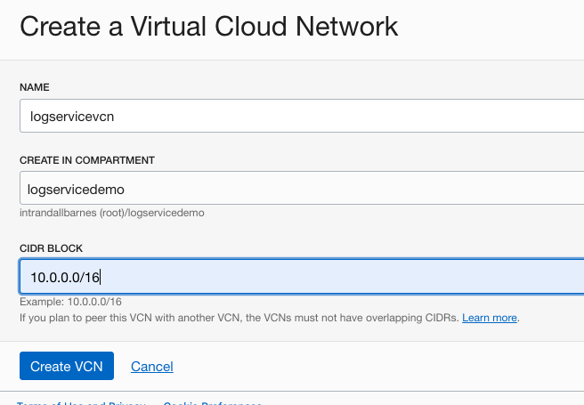

6.  On the **VCN** details page, select **Internet Gateways** in the left column and then click **Create Internet Gateway**.

      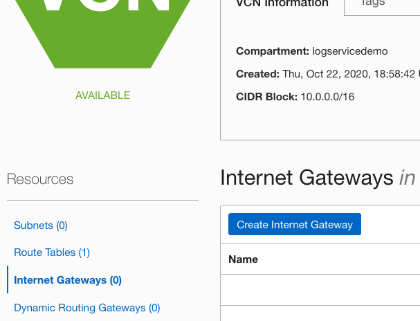

7.  In the **Create Internet Gateway** dialog page, specify "logserviceigw" for **NAME**, ensure **CREATE IN COMPARTMENT** shows "logservicedemo" and click the **Create Internet Gateway** button.

      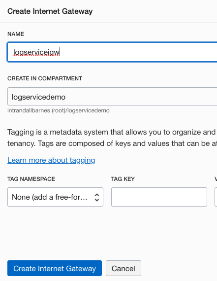

8.  Next we'll make a quick update the VCN Route table to make use of the Internet Gatreway created in the previous step.  In the VCN properties page, select **Route Tables** in the left column, then click on **Default Route Table for logservicevcn**

      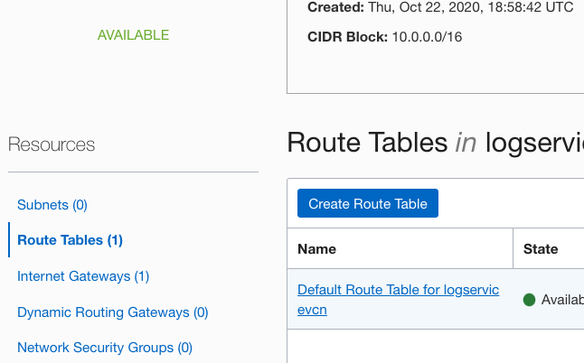
    
9.  Select **Add Route Rules** button.

      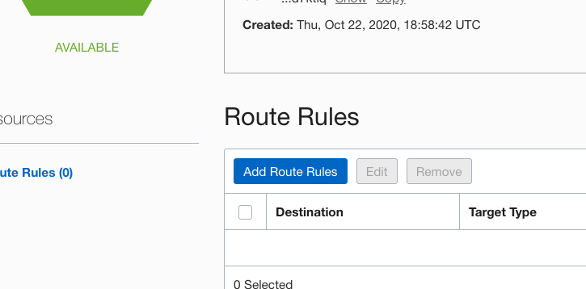

10.  In the **Add Route Rules** dialog, select **TARGET TYPE** Internet Gateway, **DESTINATION CIDR BLOCK** as 0.0.0.0/0 and finally select logserviceigw in the drop-down box.

      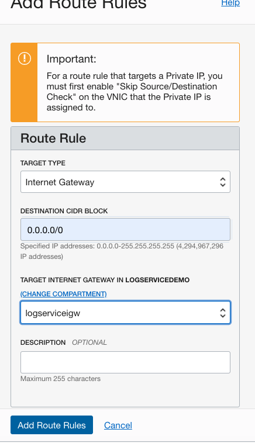

11. Click **Add Route Rules** button to complete the process.

12.  Finally, we will create a **Subnet** within the **VCN** to identify IP space to deploy a VM.  In the VCN details page, select **Subnets** in the left column and click the **Create Subnet** button.

      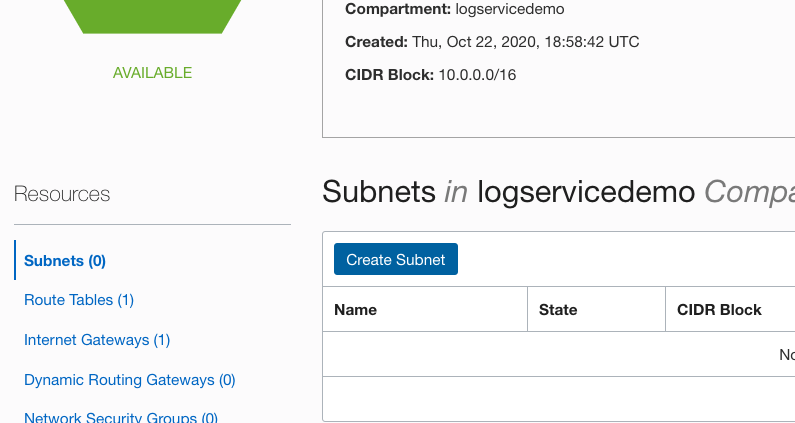

13.  In the **Create Subnet** page:
      - Provide **NAME** of logservicesub01 

      - Ensure **Create in Compartment** is showing logservicedemo 

      - Select **SUBNET TYPE** Regional 

      - Set **CIDR BLOCK** 10.0.0.0/24 

      - Check **ROUTE TABLE COMPARTMENT IN LOGSERVICEDEMO** is set to the **Default Route Table**...

      - Select **Public Subnet** type as shown in the following image.

      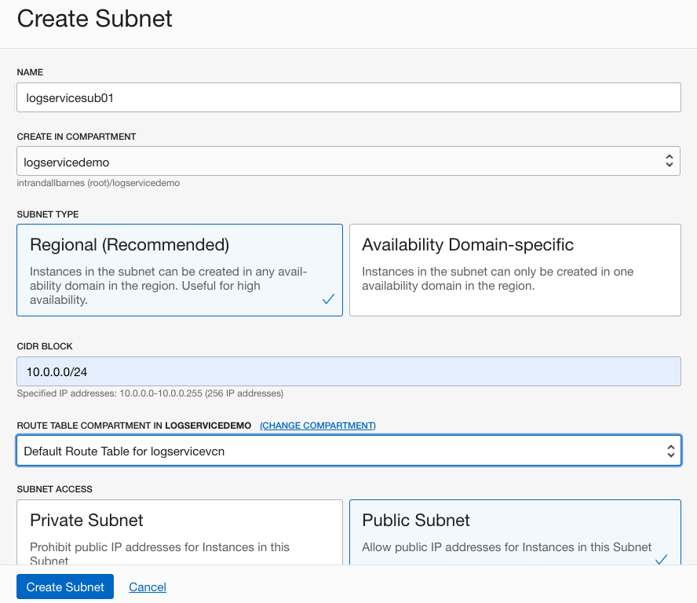

14. Click **Create Subnet** to complete the task and close the dialog page. 

## Task 4: Launch Virtual Machine

The final Step of this lab is to launch a small Virtual Machine in your newly created **VCN**.

1.  In the OCI Management Console, ensure you have selected the same region as your VCN created in Step 3.  Navigate to **Compute** --> **Instances**.

      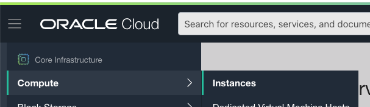

2.  Ensure the logservicedemo **Compartment** is selected in the left column.

      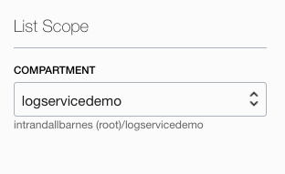

3.  Select **Create Instance** 

      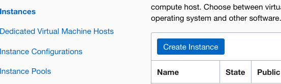

4. The **Create Compute Instance** dialog page opens.  Give your VM a short, descriptive name and ensure **Compartment** logservicedemo is selected.  The **Availability Domain** should be pre-populated to match the subnet you created in Step 3.  Note: your region and availability domain may not match the image below.  Continue with additional configuration fields below.

      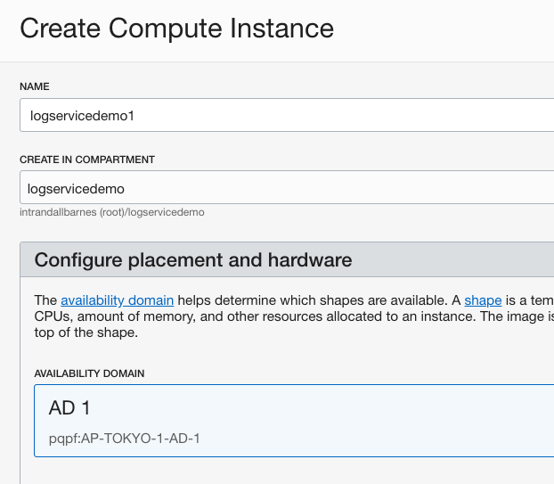

5.  Ensure **Image** is showing Oracle Linux 7.8 or 7.9.  The specific build version does not matter, and your option may not match the image below, however select **Change Image** if Oracle Linux 7.8 or 7.9 is not already set.
    
    Ensure **Shape** specifies a single core (1 core OCPU) Virtual Machine.  Please note your options and naming conventions may not exactly match the image below.

      

6.  Choose **Select Existing Virtual Cloud Network** and ensure logservicevcn is listed.  **Subnet** logservicesub01 should be listed.  If not, double-check the **Compartment** is set to logservicedemo.  You may have to switch to a different **Availability Domain** (see above) to allow the selection of your existing **Subnet**.

      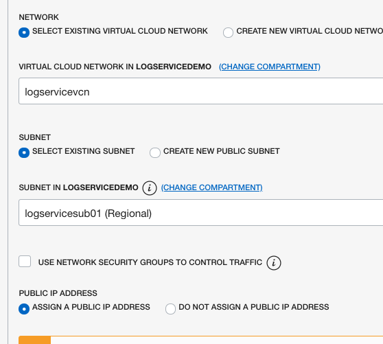

7.  Select **GENERATE SSH KEY PAIR** then click **Save Private Key** as shown in the image below.  You will need this key if you choose to later connect to your Virtual Machine (optional).

      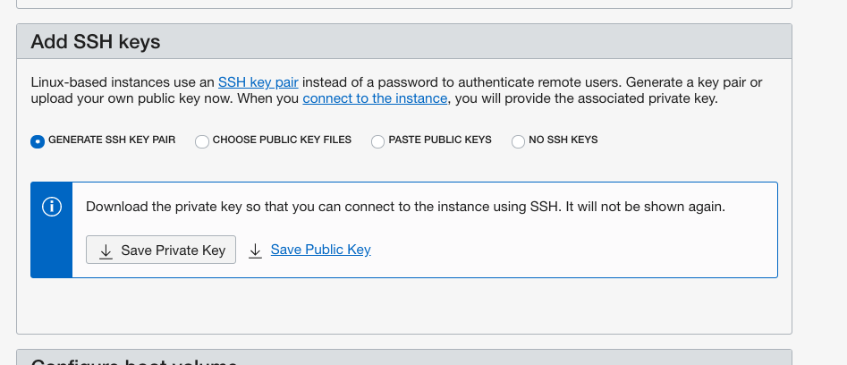

8.  Finally click the **Create** button to complete this task and close the dialog page.

    **Congratulations!**  You have launched a Virtual Machine and completed the Setup Lab.


You may proceed to the next lab.

## Learn More

* [Working with Compartments](https://docs.cloud.oracle.com/en-us/iaas/Content/Identity/Tasks/managingcompartments.htm#Working)
* [Managing Dynamic Groups](https://docs.cloud.oracle.com/en-us/iaas/Content/Identity/Tasks/managingdynamicgroups.htm)

## Acknowledgements
* **Author** - Randall Barnes, Solution Architect, OCI Observability Team
* **Last Updated Date** - Kamryn Vinson, October 2020

