# File System Storage Service

## Introduction

Welcome to the Cloud Storage (File System Storage) self-paced lab from Oracle!

Oracle Cloud Infrastructure (OCI) File Storage Service provides a durable, scalable, distributed, enterprise-grade network file system. You can connect to a File Storage Service file system from any bare metal, virtual machine, or container instance in your Virtual Cloud Network (VCN). You can also access a file system from outside the VCN using Oracle Cloud Infrastructure FastConnect and Internet Protocol security (IPSec) virtual private network (VPN).

Estimated Time: 60 minutes

### Objectives
In this lab, you will:
- Create and mount File Storage System to a compute instance
- Verify availability of the File Storage system

### Prerequisites
This lab assumes you have:
- Completed all preceding labs

> **Note:** OCI UI is being updated, thus some screenshots in the instructions may be different from the actual UI.

## Task 1: Create File System Storage

In this section, we will create File System Storage.

1. Click navigation button to open OCI Services menu. Click **Storage**, under **File Storage**, click **File Systems**.
    

2. Click **Create File System**.
    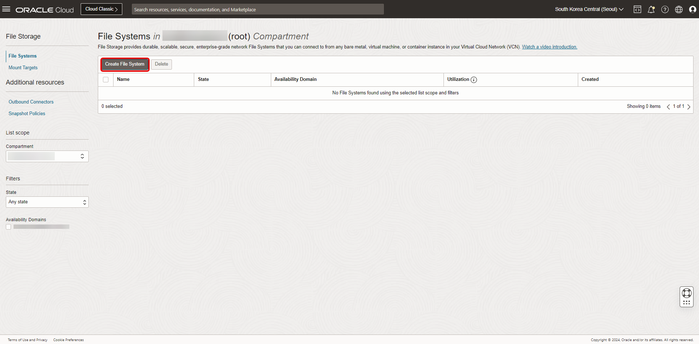

3. Under **Export Information**, click **Edit Details**.
      - Change **Export Path** to an easy-to-remember name

   Under **Mount Target Information**, click **Edit Details**.
      - Click **Create New Mount Target**, select the VCN you justed created for **Virtual Cloud Network**
      - Choose **Public Subnet-YOUR\_VCN\_NAME (Regional)** for **Subnet**

   Click **Create**.

     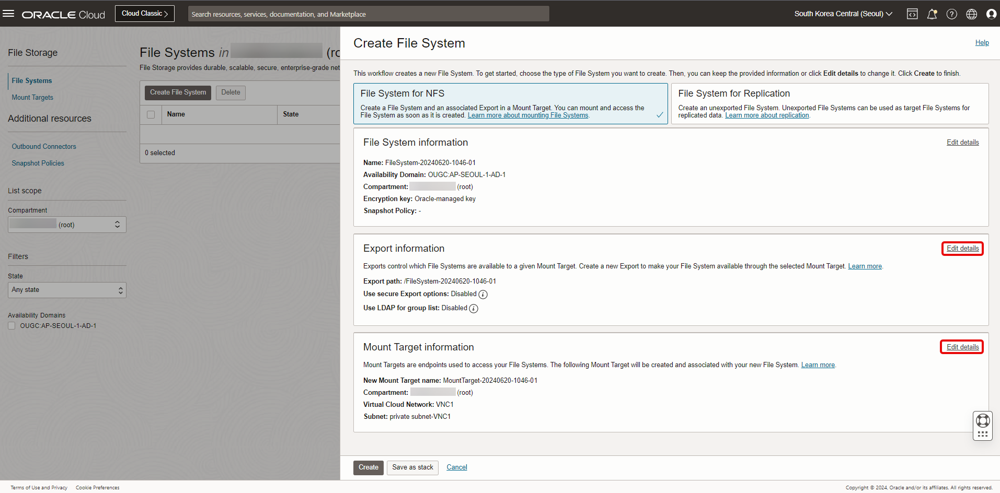

     

4. OCI console will show your File System details. Under **Exports**, click your mount target name under **Mount Target**. In Mount Target Details page, note down the IP Address.

	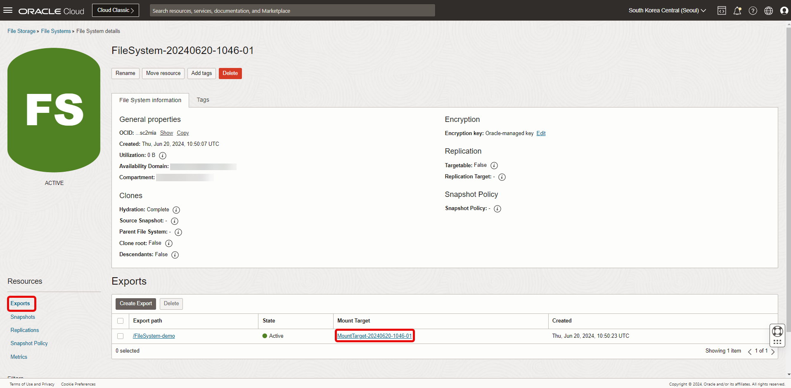
	

We now have a File System Storage created. Next we will use your SSH key pair to connect to a compute instance and mount the file system.

## Task 3: Create and Connect to Compute Instance

You are assumed to have generated your SSH Keys in the *Cloud Shell*.

1. In your OCI console, click the navigation button. Under **Compute**, click **Instances**.
    

2. On the left sidebar, select the **Compartment** in which you placed your VCN under **List Scope**. Click **Create Instance**.
   	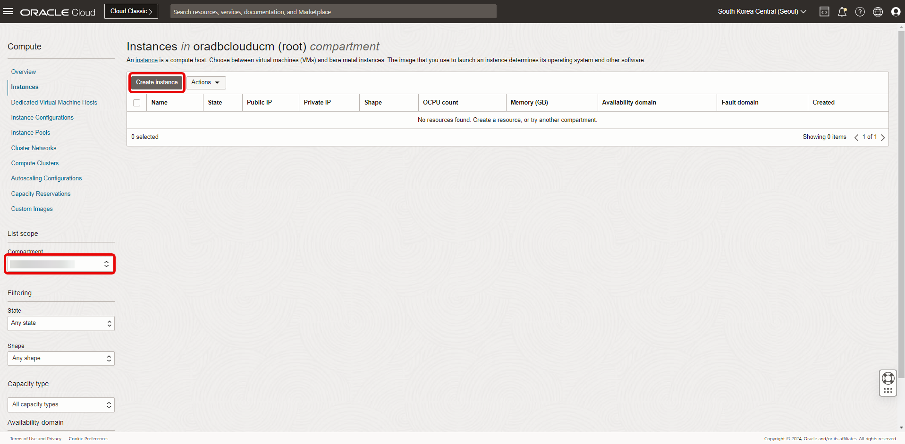

    Fill out the dialog box:

     - **Name**: Enter a name
     - **Create in Compartment**: Select the compartment in which you placed your VCN
     - Under **Placement**, Select an **Availability domain**

    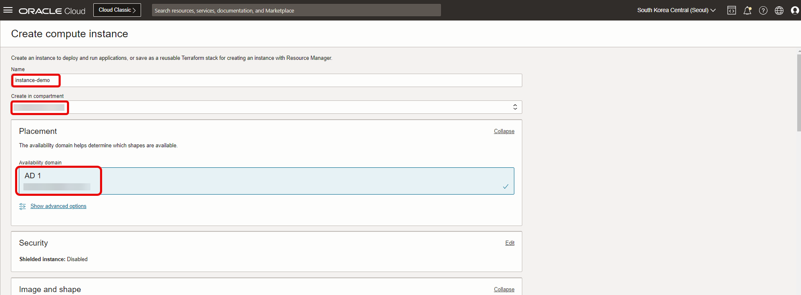

    For **Image and Shape**, click **Edit**: 
     - For the **image**, we recommend using the latest *Oracle Linux* available. Click **Change Image** to see available images' details.

    Click **Change Shape**:
     - **Instance Type**: Select **Virtual machine**
     - **Shape series**: Select a VM shape

    

    Under **Primary VNIC information**:
     - **Primary network Compartment**: Check "Select existing virtual cloud network" to select the compartment in which you created your VCN
     - **VNC in your compartment**: Choose the VCN you created in Task 1
     - **Subnet Compartment:** Check "Select existing subnet" to select the compartment in which you created your VCN
     - **Subnet in your compartment:** Choose the Public Subnet (Public Subnet-Name\_of\_VCN) under **Public Subnets**
     - **Primary VNIC IP addresses**: Check **Automatically assign private IPv4 address**
     - **Public IPv4 address** : Check **Automatically assign public IPv4 address**
    
    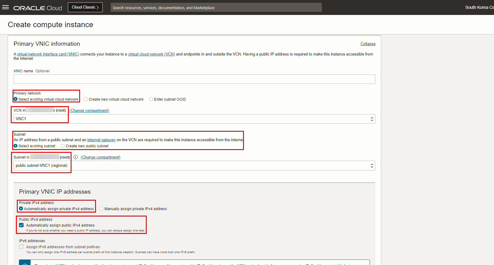

      - **Add SSH keys:** Choose **Paste public keys** and paste the public key you created and saved in Lab 1
      - **Boot volume:** Leave the default

    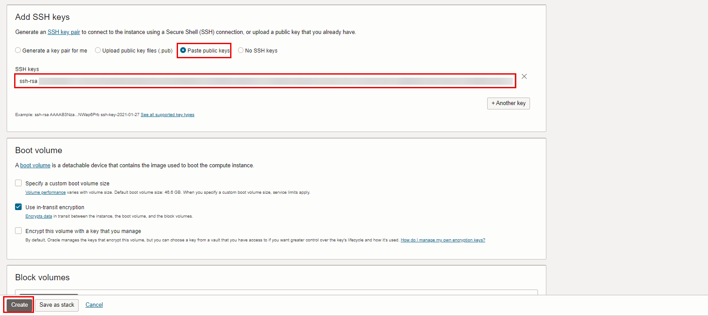

3. Click **Create**.

    > **Note:** If 'Service limit' error is displayed, choose a different shape from VM.Standard2.1, VM.Standard.E2.1, VM.Standard1.1, VM.Standard.B1.1, or choose a different Availability Domain.

4.  Wait for instance to be in **Running** state. Save the public IP address.

    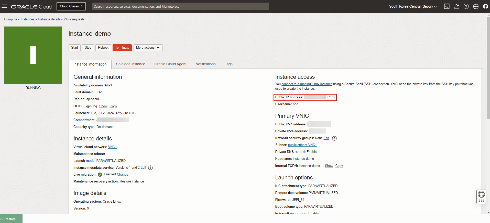

5. Go to the directory where you created you SSH Keys.

   For example, in Cloud Shell, enter command:
    ```
	<copy>cd .ssh</copy>
	```

6.  Enter **ls** to verify your SSH key file exists.

7.  Enter command
    ```
    <copy>bash</copy>
    ```

    ```
    ssh -i <SSH_Key_Name> opc@<PUBLIC_IP_OF_COMPUTE>
    ```

    *Hint: If 'Permission denied error' is seen, ensure you are using '-i' in the ssh command. You MUST type the command, do NOT copy and paste ssh command.*

8.  Enter 'yes' when prompted for security message.

     

9.  Verify opc@COMPUTE\_INSTANCE\_NAME appears on the prompt.

## Task 4: Mount the File System Storage to Compute Instance

Users of Ubuntu and Linux operating systems (we launched a Oracle Linux instance) can use the command line to connect to a file system and write files. Mount targets serve as file system network access points. After your mount target is assigned an IP address, you can use it to mount the file system. You need to install an NFS client and create a mount point. When you mount the file system, the mount point effectively represents the root directory of the File Storage system, allowing you to write files to the file system from the instance.

1. Click the navigation button, click **Storage**, under **File Storage**, click **File Systems**. Click your File System. Under **Exports**, you'll see the mount target name under **Mount Target**. Click on the mount target name and then on the Action icon on the right, and select **View Details**.

    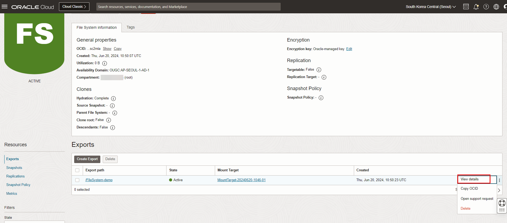

2. Click on **Mount commands** to see the commands.

    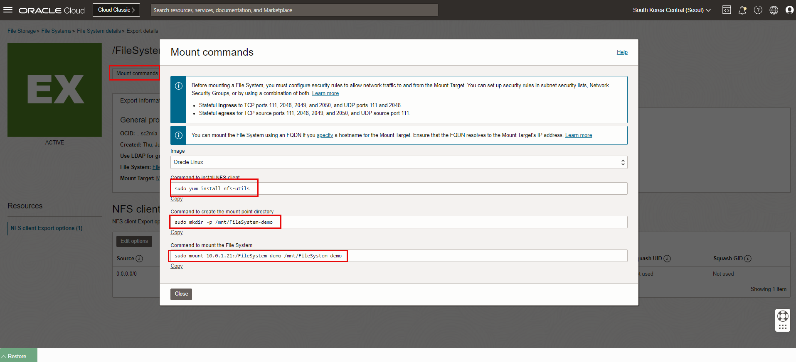  

3. After you, restore your cloud shell and enter command:

    ```
    <copy>sudo yum install nfs-utils</copy>
    ```
    (This is just to ensure nfs-utils is installed)


4. Enter command:

    ```
    <copy>sudo mkdir -p /mnt/nfs-data</copy>
    ```
    to create a mount point.

5. Mount the file system, enter command:

    ```
    <copy>bash</copy>
    ```

    ```
    <copy>sudo mount 10.x.x.x:/&lt;EXPORT_PATH_NAME> /mnt/nfs-data</copy>
    ```
    > **Note:** The 10.x.x.x should be replaced with the IP of File System Storage. EXPORT\_PATH\_NAME should be replaced with Export path name used earlier. (Example: If 10.0.0.3 is the IP of File System Storage, and '/' is the EXPORT\_PATH\_NAME, then **sudo mount 10.0.0.3:/ /mnt/nfs-data**).

6. Enter command:

    ```
    <copy>df -h</copy>
    ```
    and
    ```
    <copy>mount | grep /mnt/nfs-data</copy>
    ```
    and verify the mounted File System Storage.

    > **Note:** You may need to change `nfs-data` to the mount point directory you just created.

     

     

7. Go to your VCN instance, click **Security Lists** and then **Default Security List for YOUR\_VCN\_NAME**. If you do NOT see any Ingress Rule with *ICMP* as IP Protocal and want to ping the mount point, then you can add an Ingress Rule:

      - Source CIDR: 0.0.0.0/0
      - IP Protocol: ICMP
      - Leave other fields blank

    > **Note:** If you already had one or multiple ICMP Ingress Rules, you can skip this step.

8. **Optional:** Second compute instance can be created and have the same file system mounted on it, following Step 3 and Step 4.

You have now mounted Enterprise grade File System Storage created in OCI to your compute instance. You can place files in this file system. All other VM instances that have mounted this file system will have access to it.

## Task 5: Delete the Resources

In this section, we will delete all the resources we created in this lab.

### Delete File System Storage
1. From OCI Services menu, click **File Systems**, then click your File System name.

2. Under Exports, click the action icon and select **Delete**, and confirm **Delete**.

     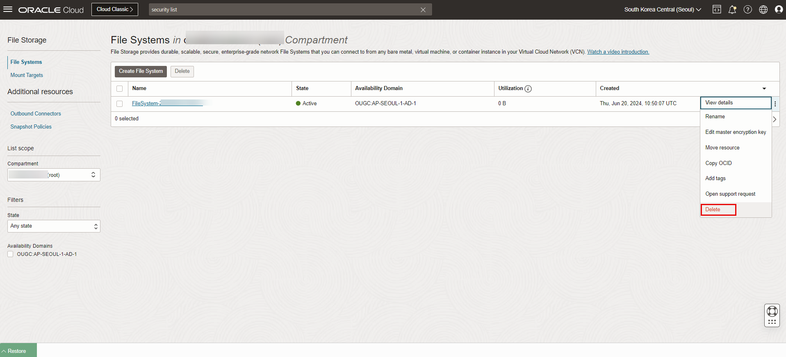

3. Verify there is no data under **Exports**. It may take some time.

4. Click **File Systems** on the top of the page, click the action icon next to your File System, and click **Delete**.

### Delete Mount Targets Storage from Storage menu
1. From OCI Services menu, click **Mount Targets**, then click your Mount target name.

2. Click on **Delete**, and confirm **Delete**.

     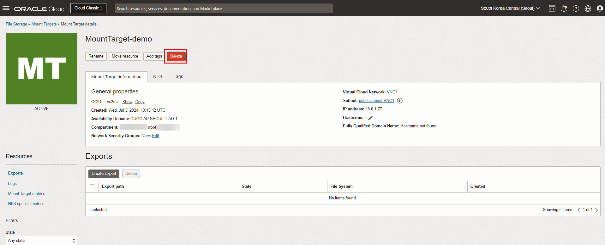

### Delete Compute Instance

1. From OCI services menu, under **Compute**, click **Instances**.

2. Locate your compute instance, click action icon, and then **Terminate**.

     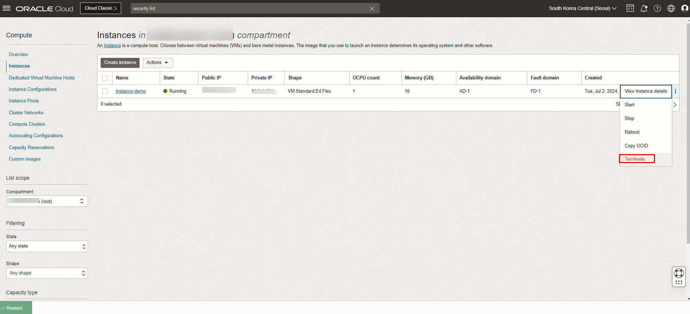

3. Make sure **Permanently delete the attached boot volume** is ***checked***, click **Terminate instance**. Wait for instance to fully terminated.

     

### Delete Security list

2. Under Resources, select **Subnets**. Select **private-subnet-YourVNC**. Click on **Terminate**.


3. Under Resources, select **Route Tables**. Select the one for your private subnet, then click **Terminate**. Go back, select the *default route table for YourVNC*. Click the action icon next to the route rules, and click **Remove**.

7. Under Resources, select **Subnets**. Select **public-subnet-YourVNC**. Click on **Delete**.

    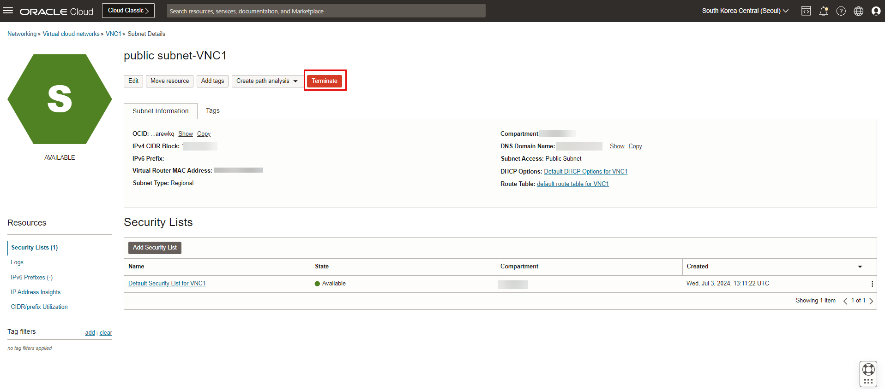

6. Under Resources, select **NAT Gateways**. Click the action icon next to the internet gateway, and click **Terminate**.

5. Under Resources, select **Service Gateways**. Click the action icon next to the internet gateway, and click **Terminate**.

4. Under Resources, select **Internet Gateways**. Click the action icon next to the internet gateway, and click **Terminate**.

    


1. From OCI services menu, under **Networking > Virtual cloud networks > Your VNC**, click **Security Lists**. Select **security-list-for-private-subnet-YourVNC**. Click on **Terminate**.

    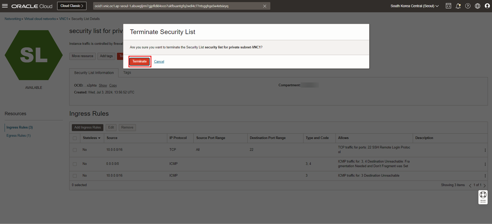


### Delete VCN

1. From OCI services menu, under **Networking**, click **Virtual Cloud Networks**. A list of all VCNs will appear.

    a. You can choose to check for all resources by clicking on **Search compartments for resources associated with this VCN**, then on **Delete All**.

     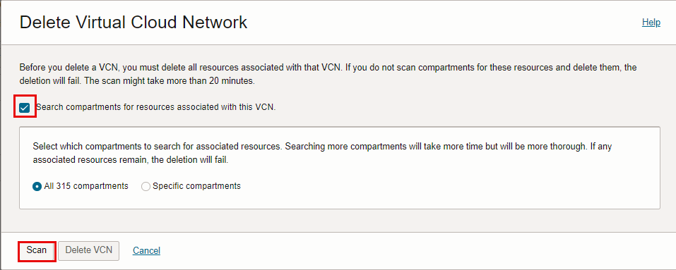

    b. Unclick the **Search compartments for resources associated with this VCN** and delete directly.

     
     

*Congratulations! You have successfully completed the lab.*

## Acknowledgements

- **Author** - Flavio Pereira, Larry Beausoleil
- **Adapted by** -  Yaisah Granillo, Cloud Solution Engineer
- **Contributors** - Isa Kessinger, QA Intern, LiveLabs QA Team
- **Last Updated By/Date** - Ramona Magadan, Technical Product Manager, Database Product Management, July 2024

