# Identity and Access Management

## Introduction

Oracle Cloud Infrastructure (OCI) Identity and Access Management (IAM) Service lets you control who has access to your cloud resources. You control the types of access a group of users has and to which specific resources. In November, with the inclusion of Identity Domains, OCI IAM and Oracle IDCS were unified into a single cloud service.

The purpose of this lab is to give you an overview of the IAM Service components with Identity domains and an example scenario to help you understand how they work together.

Estimated time: 30 minutes

### Objectives

In this lab, you will:

- Create a compartment
- Create a user
- Create a group
- Create a policy associated to the group
- Add user to the group

### Prerequisites

- An Oracle Cloud Account - please view this workshop's LiveLabs landing page to see which environments are supported.

>**Note:** If you have a **Free Trial** account, when your Free Trial expires, your account will be converted to an **Always Free** account. You will not be able to conduct Free Tier workshops unless the Always Free environment is available.

**[Click here for the Free Tier FAQ page.](https://www.oracle.com/cloud/free/faq.html)**

## Task 1: Create Compartments

A compartment is a collection of cloud assets, like compute instances, load balancers, databases, etc. By default, a root compartment was created for you when you created your tenancy (i.e., when you registered for the trial account). It is possible to create everything in the root compartment, but Oracle recommends that you create sub-compartments to help manage your resources more efficiently.

1. Click the **Navigation Menu** in the upper left, navigate to **Identity & Security** and select **Compartments**.

 

2. Click **Create Compartment**.
   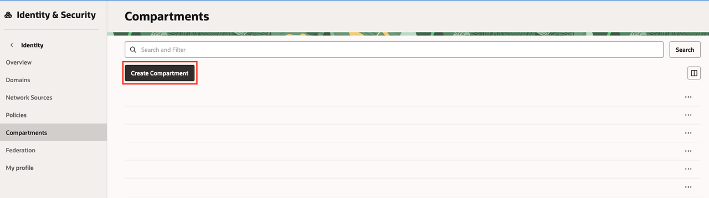

3. Name the compartment **Demo** and provide a short description. Be sure your root compartment is shown as the parent compartment. Press the blue **Create Compartment** button when ready.

   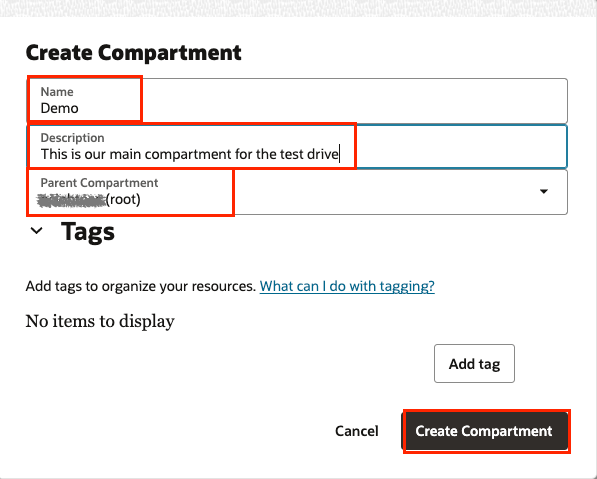

4. You have just created a compartment for all of your work in this Test Drive.

## Task 2: Manage Users, Groups, and Policies to Control Access

A user's permissions to access services comes from the _groups_ to which they belong. The permissions for a group are defined by policies. Policies define what actions members of a group can perform, and in which compartments. Users can access services and perform operations based on the policies set for the groups of which they are members.

We'll create a user, a group, and a security policy to understand the concept.

In 2022, OCI IAM introduced Identity Domains. An identity domain is a container for managing users and roles, federating and provisioning of users, secure application integration through Oracle Single Sign-On (SSO) configuration, and OAuth administration.

1. Click the **Navigation Menu** in the upper left. Navigate to **Identity & Security** and select **Domains**

For IAM with Identity Domains, what was previously identified as IAM users and groups is now under the default domain.

   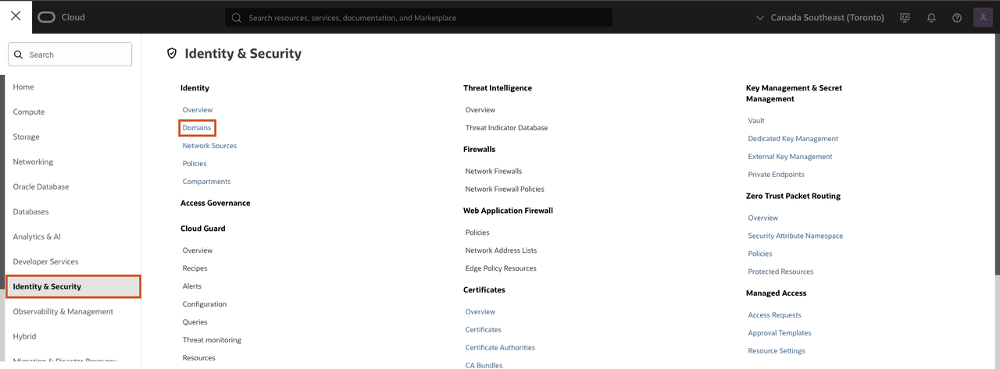

1. Select the default domain

   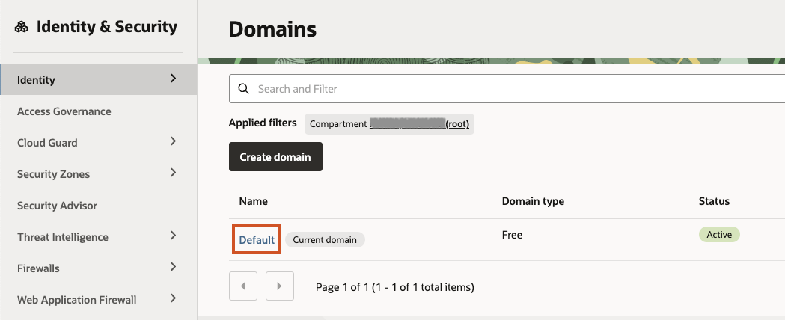

1. Under **User management** Select **Groups**

   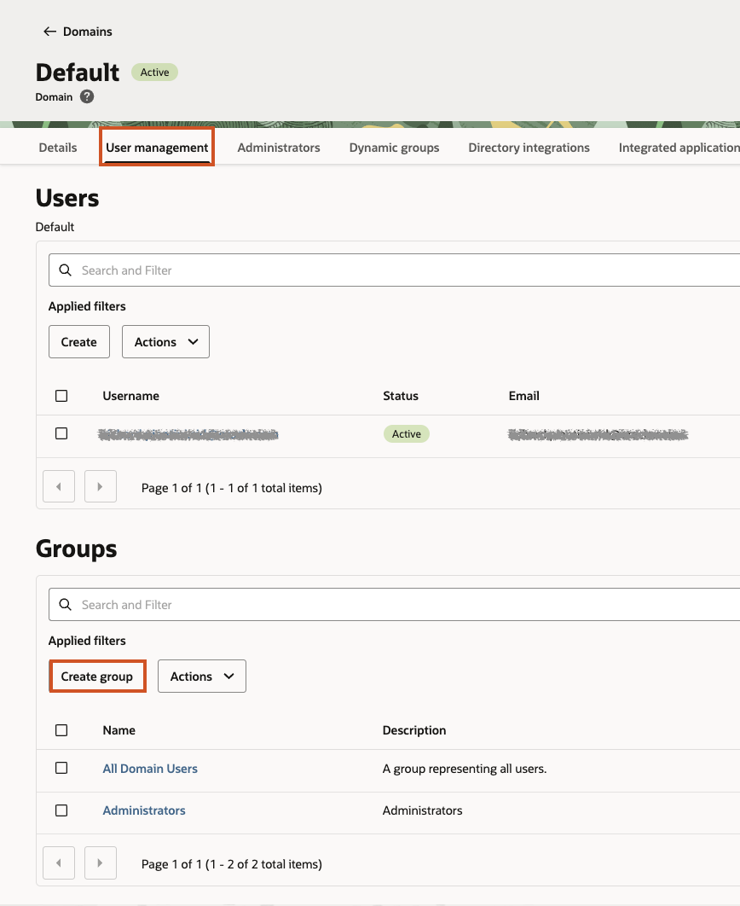

1. Click **Create Group**.

   In the **Create Group** dialog box, enter the following:

     - **Name:** Enter a unique name for your group, such as **oci-group**
         >**Note:** the group name cannot contain spaces.

     - **Description:** Enter a description, such as **New group for oci users**
     - Click **Create**

   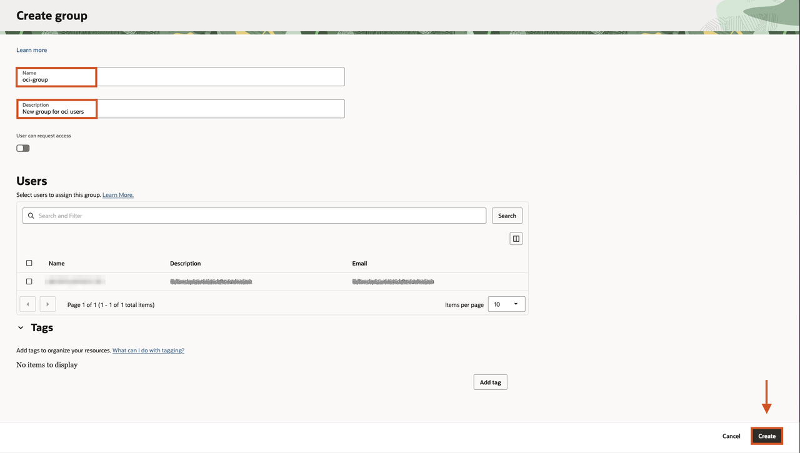

1. Click your new group to display it. Your new group is displayed.

   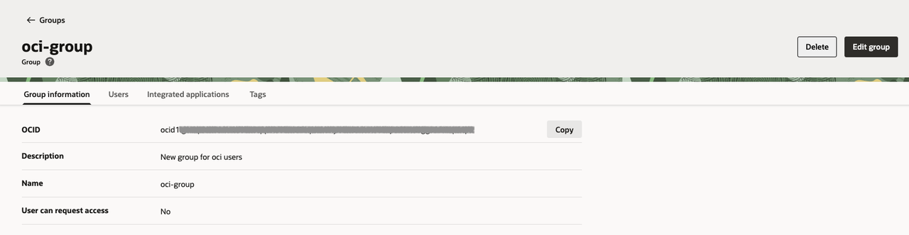

1. Create a New User

   a) Go back to Domains on the **Navigation Menu**, click on **Default Domain**

   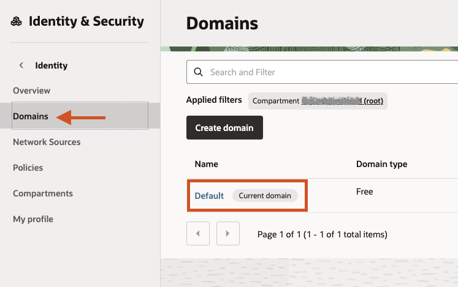

   b) Under **User Management**, select **Users**

   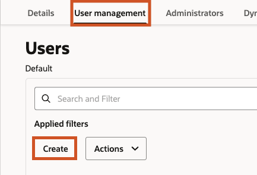

   c) Click **Create User**.

   In the **Create User** dialog box, enter the following:

      - **First Name** - your first name
      - **Last Name** - your last name
      - **Email:**  Preferably use a personal email address to which you have access (Gmail, Yahoo, etc) and different from any email already in use in the tenancy.
      - **Use the email address as the username:** Leave checked unless you want to use a username that is not the email address. This can be used if you want to avoid reusing an email already in the tenancy.
      - **Assign cloud account administrator role:** Leave unchecked.
      - Check the box beside **oci-group**

    Click **Create**.

      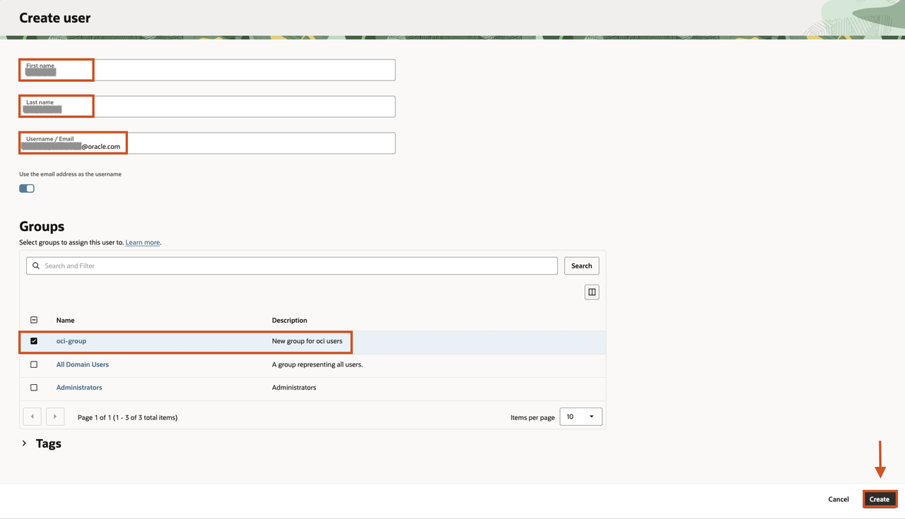

   After creating the user, you will be directed to the user details.

   The newly created user will receive an email with an activation link like this:

      

1. Check the messages in the email account you used for the new user. Open the activation link.

   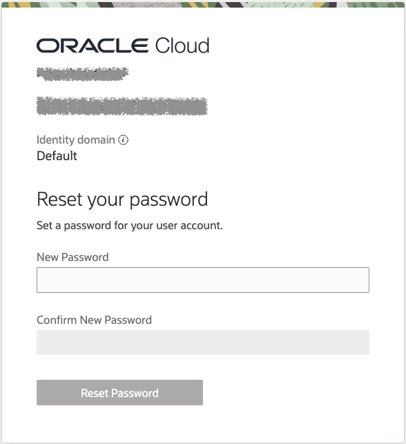

1. Now, let’s create a security policy that gives your group permissions in the assigned compartment. For example, create a policy that gives permission to members of group **oci-group** in compartment **Demo**:

   a) Click the **Navigation Menu** in the upper left. Navigate to **Identity & Security** and select **Policies**.

   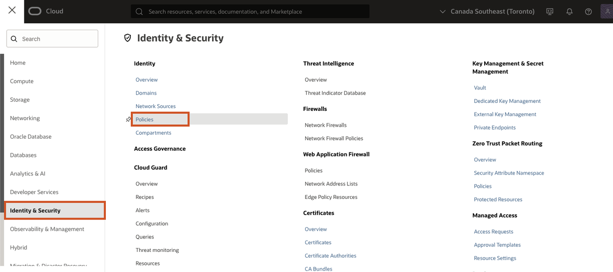

   b) On **Applied Filters**, select **Demo** compartment.

   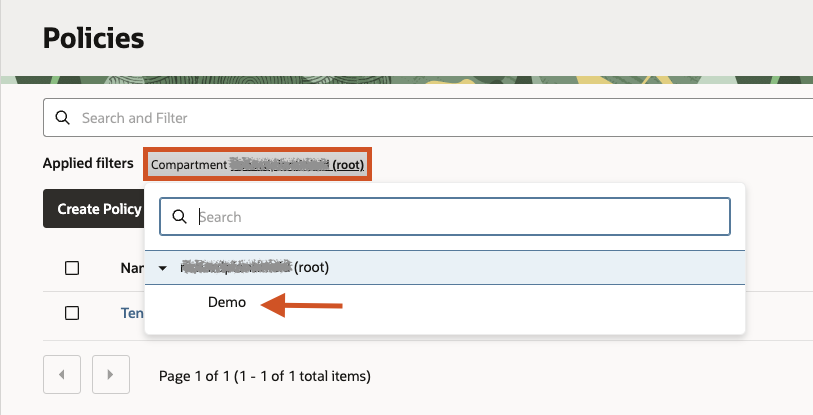

      >**Note:** You may need to click on the + sign next to your main compartment name to be able to see the sub-compartment ***Demo***. If you do and you still don't see the sub-compartment, ***refresh your browser***. Sometimes your browser caches the compartment information and does not update its internal cache.

   c) After you have selected the **Demo** compartment, click **Create Policy**.

      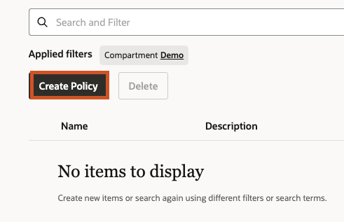

   d) Enter a unique **Name** for your policy (for example, "Policy-for-oci-group").
      >**Note:** the name CANNOT contain spaces.

   e) Enter a **Description** (for example, "Policy for OCI Group").

   f) Select **Demo** for compartment.

   g) Click **Show manual editor** and enter the following **Statement**:

     ```
     Allow group default/oci-group to manage all-resources in compartment Demo
     ```

     Note: If you do not include the *identity_domain_name* before the *group_name*, then the policy statement is evaluated as though the group belongs to the default identity domain.

   h) Click **Create**.

   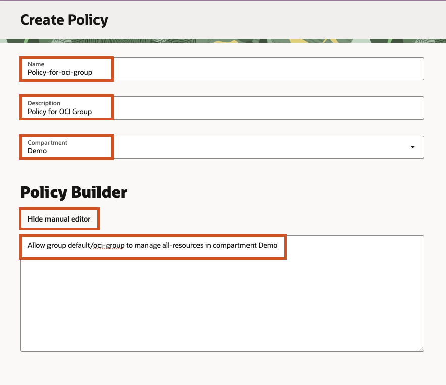

8. Verify user permissions.

   a) Click the **Navigation Menu** in the upper left. Click **Compute** and then click **Instances**.

   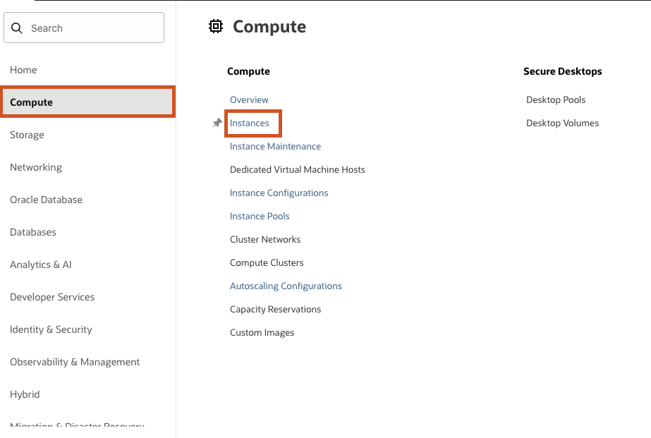

   b) Try to select any compartment from the menu.

   c) The message “**Couldn't load the data. Error Message: Authorization failed or requested resource not found.**” appears. This is normal as you did not add the user to the group where you associated the policy.
      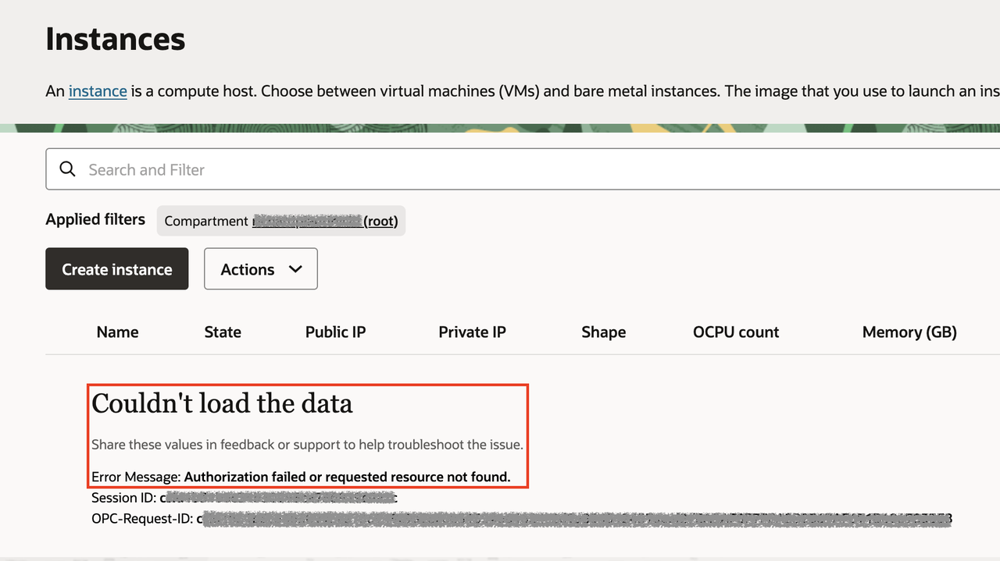

   d) Sign out of the Console.

9. Add User to a Group.

      a) Sign back in with the ***admin*** account.

      b) Click the **Navigation Menu** in the upper left. Navigate to **Identity & Security** and select **Users**. From the **Users** list, click the user account that you just created (for example, `User01`)  to go to the User Management page.
         

      c) Under the **User Management** page, click **Groups**.

      d) Click **Assign User to Group**.
         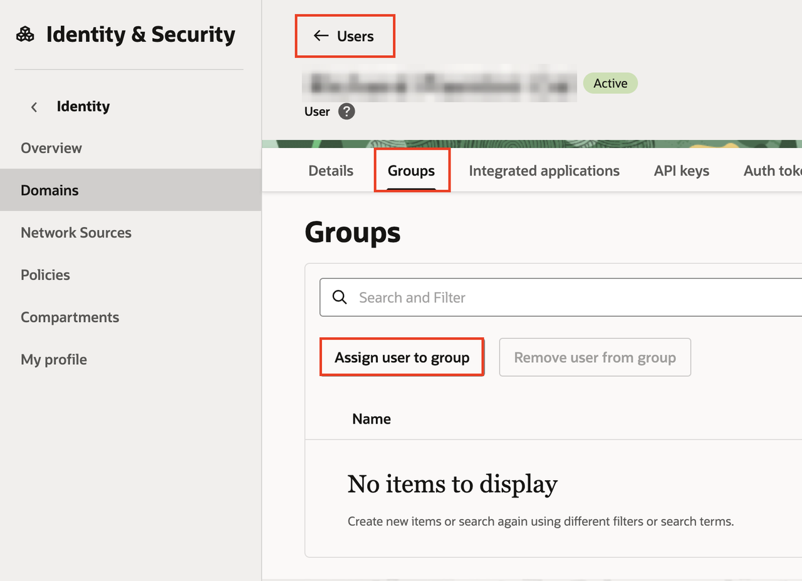

      e) From the **Groups** drop-down list, select the **oci-group** that you created.

      f) Click **Assign user**.
         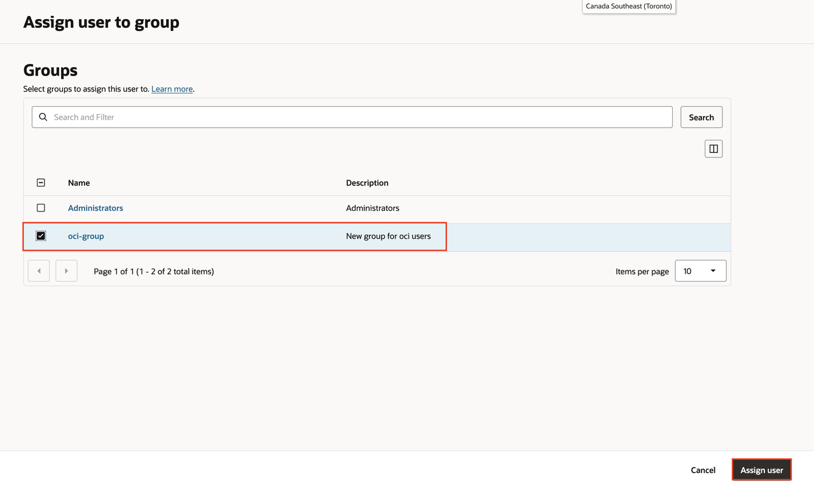

      g) Sign out of the Oracle Cloud website.

10. Verify user permissions when the user belongs to a specific group.

      a) Sign in with the local **User01** account you created. Remember to use the latest password you assigned to this user.

      b) Click the **Navigation Menu**. Click **Compute** and then click **Instances**.

      c) Select compartment **Demo** from the list of compartments on the left.

      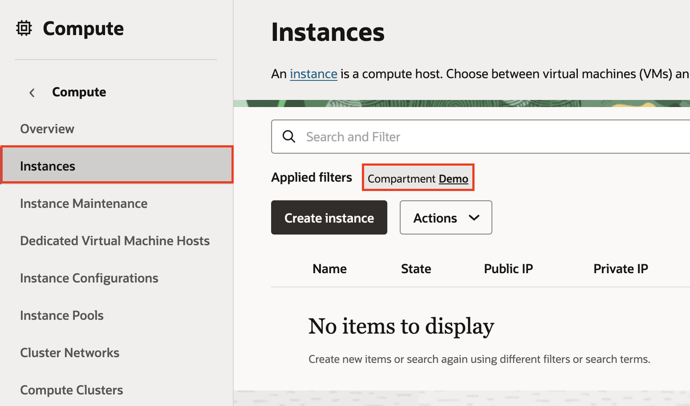

      d) There is no message related to permissions and you are allowed to create new instances.

      e) Click the **Navigation Menu**. Click **Identity & Security** and select **Domains**, to view **Groups** click on the hyperlink in the banner that goes to the **Default Domain**.

      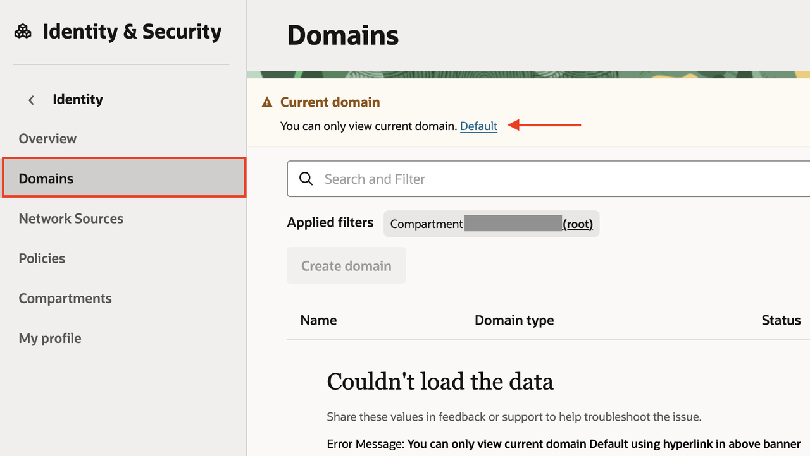

      f) The message **“You are not allowed to perform any actions on this page”** appears. This is expected, since your user has no permission to modify groups.
      >**Note:** You may get the "An unexpected error occurred" message instead. That is also fine.

      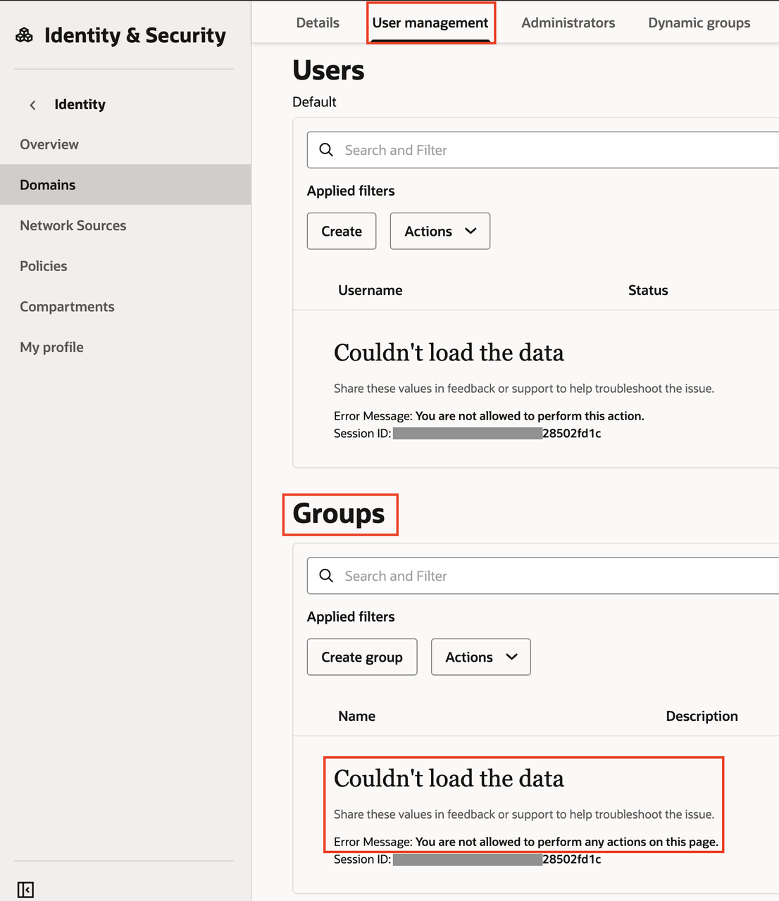

      g) Sign out.

_Congratulations! You have successfully completed the lab._

## Acknowledgements

- **Author** - Orlando Gentil
- **Last Updated By/Date** - Richard Piantini Cid, September, 2025
