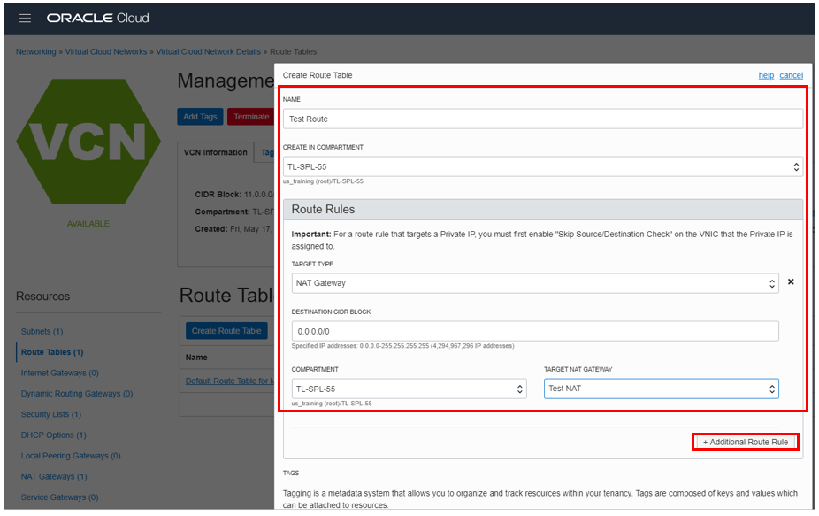
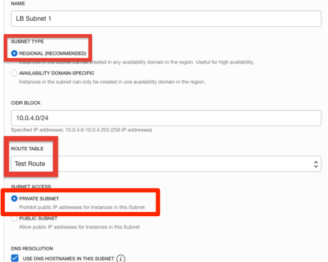
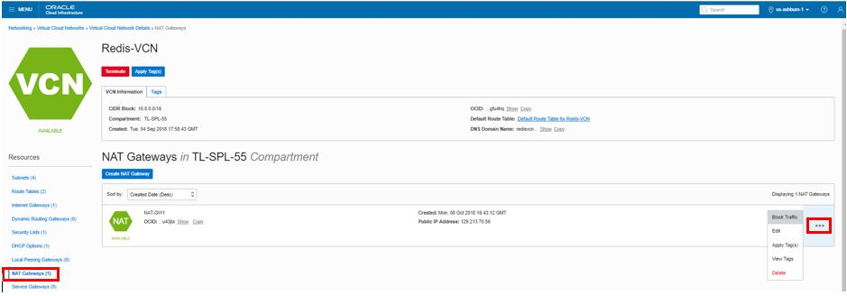
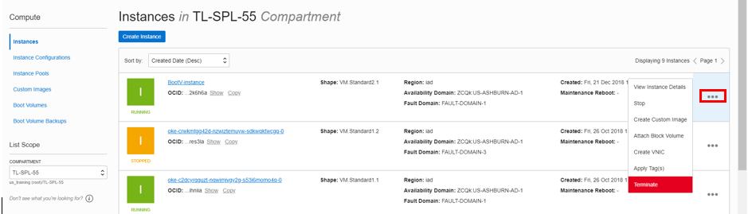

# Configuring NAT Gateway for Private Compute Instance

## Introduction

Many Oracle Cloud Infrastructure customers have compute instances in virtual cloud networks (VCNs) that, for privacy, security, or operational concerns, are connected to private subnets. To grant these resources access to the public internet for software updates, CRL checks, and so on, a customer’s only option has been to create a NAT instance in a public subnet and route traffic through that instance by using its private IP address as a route target from within the private subnet. Although many have successfully used this approach, it does not scale easily and provides a myriad of administrative and operational challenges.

NAT gateway,  addresses these challenges and provides Oracle Cloud Infrastructure customers with a simple and intuitive tool to address their networking security needs. NAT gateways provide the following features:

- Highly Scalable and Fully Managed: Instances on private subnets can initiate large numbers of connections to the public internet. Connections initiated from the internet are blocked.

- Secure: Traffic through NAT gateways can be disabled with the Click of a button.
Dedicated IP Addresses: Each NAT gateway is assigned a dedicated IP address that can be reliably added to security whitelists.


## Task 1: Sign in to OCI Console and create VCN

**Note:** OCI UI is being updated thus some screenshots in the instructions might be different than actual UI

1. Sign in using your tenant name, user name and password. Use the login option under **Oracle Cloud Infrastructure**.

    

2. From the OCI Services menu, click **Virtual Cloud Networks** under Networking. Select the compartment assigned to you from drop down menu on left part of the screen under Networking and Click **Start VCN Wizard**.

    **NOTE:** Ensure the correct Compartment is selected under COMPARTMENT list

3. Click **VCN with Internet Connectivity** and click **Start VCN Wizard**.

4. Fill out the dialog box:

      - **VCN NAME**: Provide a name
      - **COMPARTMENT**: Ensure your compartment is selected
      - **VCN CIDR BLOCK**: Provide a CIDR block (10.0.0.0/16)
      - **PUBLIC SUBNET CIDR BLOCK**: Provide a CIDR block (10.0.1.0/24)
      - **PRIVATE SUBNET CIDR BLOCK**: Provide a CIDR block (10.0.2.0/24)
      - Click **Next**

5. Verify all the information and  Click **Create**.

6. This will create a VCN with following components.

    *VCN, Public subnet, Private subnet, Internet gateway (IG), NAT gateway (NAT), Service gateway (SG)*

7. Click **View Virtual Cloud Network** to display your VCN details.

## Task 2: Create and connect to compute instance

1. Go to your OCI console. From OCI services menu, under **Compute**, click **Instances**.

2. Click **Create Instance**. Fill out the dialog box:

      - **Name your instance**: Enter a name
      - **Choose an operating system or image source**: For the image, we recommend using the Latest *Oracle Linux* available.
      - **Availability Domain**: Select availability domain
      - **Instance Type**: Select Virtual Machine
      - **Instance Shape**: Select VM shape

      **Under Configure Networking**
      - **Virtual cloud network compartment**: Select your compartment
      - **Virtual cloud network**: Choose the VCN
      - **Subnet Compartment:** Choose your compartment.
      - **Subnet:** Choose the Public Subnet under **Public Subnets**
      - **Use network security groups to control traffic** : Leave un-checked
      - **Assign a public IP address**: Check this option

    

      - **Boot Volume:** Leave the default
      - **Add SSH Keys:** Choose 'Paste SSH Keys' and paste the Public Key saved earlier.

3. Click **Create**.

    **NOTE:** If 'Service limit' error is displayed choose a different shape from VM.Standard2.1, VM.Standard.E2.1, VM.Standard1.1, VM.Standard.B1.1  OR choose a different AD

    

4.  Wait for Instance to be in **Running** state. In Cloud shell Terminal, enter command:

    ```
    <copy>cd .ssh</copy>
    ```

5.  Enter **ls** and verify you SSH key file exists.

6.  Enter command:
    ```
    <copy>bash</copy>
    ```

    ```
    <copy>ssh -i id_rsa opc@PUBLIC_IP_OF_COMPUTE</copy>
    ```
    **HINT:** If 'Permission denied error' is seen, ensure you are using '-i' in the ssh command. You MUST type the command, do NOT copy and paste SSH command.

7.  Enter 'yes' when prompted for security message.

    

8.  Verify opc@`<COMPUTE_INSTANCE_NAME>` appears on the prompt.

## Task 3: Configure NAT gateway

**We will now create a route table in the VCN.**

1. Switch to OCI console. From OCI services menu, click **Virtual Cloud Networks** under **Networking**. Locate your VCN and click the VCN name to display VCN details.

2. Click **NAT Gateways**.

3. Click **Route Tables**, then **Create Route Table**. Fill out the dialog box:

    - Create in Compartment: This field defaults to your current compartment. Make sure correct Compartment is selected.

    - Name: Enter a name

    **Click +Additional Route Rules**


    - Target Type: Select **NAT Gateway**
    - Destination CIDR Block: Enter 0.0.0.0/0
    - Compartment:  Make sure the correct Compartment is selected:
    - Target NAT Gateway: Select the NAT Gateway for your VCN.

4. Click **Create Route Table**.

    

5. Click your VCN name to display the VCN details. Click **Create Subnet**. Fill out the dialog box:

      - Name: Enter a name
      - Subnet Type: Regional
      - CIDR Block: Provide a CIDR (e.g. 10.0.5.0/24).
      - Route Table: Choose the Route table created earlier

      **NOTE:** Do not choose the 'Default route table'. This is being done so all routing for compute instances in this subnet are via the NAT gateway.

      - Subnet access: Private Subnet.
      - DHCP Options: Select the default.
      - Security Lists: Select the Security List you created earlier.

6. Leave all other options as default, Click **Create Subnet**.

    

7. Go to your Cloud shell Terminal. Generate ssh key pair, enter command:

    ```
    <copy>ssh-keygen</copy>
    ```
8. Press Enter When asked for ‘Enter File in which to save the key’, ‘Created Directory, ‘Enter passphrase’, and ‘Enter Passphrase'  again.

9. Enter command:
    ```
    <copy>cd ~/.ssh</copy>
    ```
    and then
    ```
    <copy>ls</copy>
    ```
    You should have the Private and Public keys: /home/opc/.ssh/&lt;sshkeyname> (Private Key) and /home/opc/.ssh/&lt;sshkeyname>.pub (Public Key)

10. Enter command:

    ```
    <copy>cat ~/.ssh/id_rsa.pub</copy>
    ```

    copy and paste the public key content to Notepad. We will use this public key to launch a compute instance in private subnet of the VCN.

11. Switch to OCI console window and launch a second compute instance as done previously (Step 2, Section 2). **Ensure the subnet chosen is the private subnet that we created previously**.

12. Once the Instance is running, Note down private IP address of the instance from instance detail page (by Clicking Instance name).

13. Switch to git-bash window with ssh session to Public compute instance (first compute instance created earlier). Enter command:
    ```
    <copy>
    cd ~/.ssh
    </copy>
    ```
    then
    ```
    <copy>
    bash
    ssh –i id_rsa opc@<Private_IP_OF_COMPUTE_INSTANCE>
    </copy>
    ```

    **NOTE:** User name is ‘opc’.

    **HINT:** If ‘Permission denied error’ is seen, ensure you are using ‘-i’ in the ssh command.

    **NOTE:** Use the private ip of second compute instance noted earlier.

14. Enter ‘Yes’ when prompted for security message.

15. In the private compute instance Enter command:
    ```
    <copy>
    ping 8.8.8.8
    </copy>
    ```
    and verify there is internet connectivity.

    **The compute instance in private subnet has internet access. This is possible since traffic is being routed through the NAT gateway that we created and attached to the VCN. Next we will use the traffic toggle function on NAT gateway to block/allow traffic with a single Click.**

16. Switch to OCI console window. In your VCN's detail page, Click **NAT Gateways**.

17. Hover over the Action icon  and choose Block Traffic.

18. Switch back to ssh session to the private compute instance and Enter command ping 8.8.8.8 (if not already running). Verify there is no response.

    

19. Switch back to OCI console window and using above step, this time choose Allow Traffic. Switch back to ssh session and verify ping response is received.

## Task 4: Delete the resources

1. Switch to  OCI console window.

2. If your Compute instance is not displayed, From OCI services menu Click **Instances** under **Compute**.

3. Locate compute instance, Click Action icon and then **Terminate**.

    

4. Make sure Permanently delete the attached Boot Volume is checked, Click Terminate Instance. Wait for instance to fully Terminate.

    

5. Repeat the steps to delete the second compute instance.

6. From OCI services menu Click **Virtual Cloud Networks** under Networking, list of all VCNs will
appear.

7. Locate your VCN, Click Action icon and then **Terminate**. Click **Terminate All** in the Confirmation window. Click **Close** once VCN is deleted.

    

## Acknowledgements
*Congratulations! You have successfully completed the lab.*

- **Author** - Flavio Pereira, Larry Beausoleil
- **Adapted by** -  Yaisah Granillo, Cloud Solution Engineer
- **Contributors** - Kamryn Vinson, QA Intern
- **Last Updated By/Date** - Madhusudhan Rao, Apr 2022

