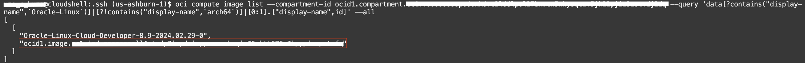
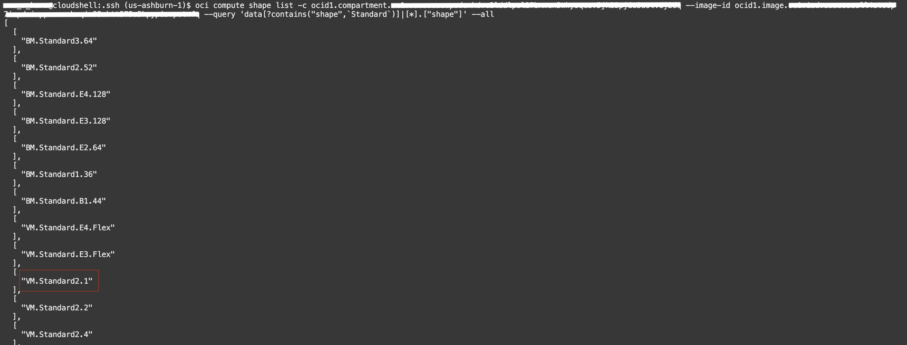

#  Getting started with the OCI Command Line Interface (CLI)

## Introduction

Automation is a critical component when it comes to managing Cloud workloads at scale.  Although the OCI UI is user-friendly, many tasks may be repetitive and could further reduce an administrator's effort if they can be automated. The OCI Command Line Interface (CLI) is a toolkit developed in Python that is capable of performing almost any task that can be executed in the OCI UI.  The toolkit runs on Linux, Mac, and Windows, making it easy to write BASH or PowerShell scripts that perform a series of commands when executed.

In this lab, you will use Oracle Cloud Shell (which has the OCI CLI preinstalled) to create and list resources. Upon completion of this lab you should have a good understanding of how to use the OCI CLI to automate common tasks in OCI.

Estimated Time: 45 minutes

## Task 1: Use the CLI to create a VCN with one public subnet

1. In the Cloud Shell, enter the following command:

    ```
    <copy>
    oci iam availability-domain list
    <copy>
    ```

    This will list all availability domains in the current region.  Make note of one of the availability domain names. It should look something like this `nESu:US-ASHBURN-AD-1`. You will use this in a future step.

    


3. Return to the OCI Console and navigate to **Identity & Security -> Compartments**. Copy the OCID of the assigned compartment and save for later use.

    

    

5. Create a new virtual cloud network with a unique CIDR block. You will need the OCID of your compartment. Save the OCID of the VCN to use later.

    ```
    <copy>
    oci network vcn create --cidr-block 192.168.0.0/16 -c <compartment ocid> --display-name CLI-Demo-VCN --dns-label clidemovcn
    </copy>
    ```

    

7. Enter the following command to list VCN's. Replace ```<compartment ocid>``` with your compartment OCID.

    ```
    <copy>
    oci network vcn list --compartment-id <compartment ocid>
    </copy>
    ```

    

    *Note: It should return the details of the VCN you created.*

8. Create a new security list. Make note of the OCID and save it for later.

    ```
    <copy>
    oci network security-list create --display-name PubSub1 --compartment-id <compartment ocid> --vcn-id $VCN_OCID --egress-security-rules  '[{"destination": "0.0.0.0/0", "destination-type": "CIDR_BLOCK", "protocol": "all", "isStateless": false}]' --ingress-security-rules '[{"source": "0.0.0.0/0", "source-type": "CIDR_BLOCK", "protocol": 6, "isStateless": false, "tcp-options": {"destination-port-range": {"max": 80, "min": 80}}}]'
    </copy>
    ```

    


10. Create a public subnet. Save the OCID of the subnet for later use.

    ```
    <copy>
    oci network subnet create --cidr-block 192.168.10.0/24 -c <compartment ocid> --vcn-id <vcn ocid> --security-list-ids '["$SECURITY_LIST_OCID"]'
    </copy>
    ```

    

    *Note: You have the option to specify up to 5 security lists and a custom route table.  In this case, we are only assigning one security list and allowing the system to automatically associate the default route table.*

12. Create an Internet Gateway. You will need the OCID of your VCN and Compartment. Make note of the OCID of the internet gateway and save it for later use.

    ```
    <copy>
    oci network internet-gateway create -c <compartment ocid> --is-enabled true --vcn-id <vcn ocid> --display-name DemoIGW
    </copy>
    ```

    

14. Next, we will update the default route table with a route to the internet gateway. First, you will need to locate the OCID of the default route table.

    ```
    <copy>
    oci network route-table list -c <compartment ocid> --vcn-id <vcn ocid>
    </copy>
    ```
    


15. Update the route table with a route to the internet gateway. When prompted to continue enter `y`.

    ```
    <copy>
    oci network route-table update --rt-id <route table ocid> --route-rules '[{"cidrBlock":"0.0.0.0/0","networkEntityId":"<internet gateway ocid>"}]'
    </copy>
    ```

    

    *Note: When updating route tables or security lists you cannot insert a single rule. You must ``update`` with the entire set of rules. The prompt shown in the screenshot above illustrates this point.*

    *Note: Use QUERY to find Oracle Linux Image ID, then launch a compute instance.*

15. Use the CLI `query` command to retrieve the OCID for the latest Oracle Linux image. Save the image OCID for later use.

    ```
    <copy>
    oci compute image list --compartment-id <compartment ocid> --query 'data[?contains("display-name",`Oracle-Linux`)]|[?!contains("display-name",`arch64`)]|[0:1].["display-name",id]' --all
    </copy>
    ```

    You may find more information on the Query command [here](https://docs.cloud.oracle.com/iaas/Content/API/SDKDocs/cliusing.htm#ManagingCLIInputandOutput).

    

16. Navigate to your .ssh directory and save the ssh key file path to your public key, you will need it for the next step.

    

    The path to my public ssh key will be ``` /home/<username for cloudshell>/.ssh/cloudshellkey.pub ```

17. To query Standard shapes compatible with the image and available in your tenancy, use this command:

    ```
    <copy>
    oci compute shape list -c <compartment OCID> --image-id <image OCID> --query 'data[?contains("shape",`Standard`)]|[*].["shape"]' --all
    </copy>
    ```

18. Find "VM.Standard2.1" from the output. Save the name of the shape for future use.

    

20. Launch a compute instance with the following command.  We previously created a regional subnet because our command did not include a specific availability domain. For compute instances, we must specify an availability domain and subnet.

    You will need the following pieces of information:

    - Availability domain name
    - Subnet OCID
    - Valid compute shape (i.e. VM.Standard2.1)
    - Your public SSH key file path

    ```
    <copy>
    oci compute instance launch --availability-domain <ad name> --display-name demo-instance --image-id <image id> --subnet-id <subnet id> --shape <shape name> --compartment-id <compartment id> --assign-public-ip true --ssh-authorized-keys-file <path to public ssh key>
    </copy>
    ```

    Capture the ``id:`` of the compute instance launch output.

    

21. Check the status of the instance

    ```
    <copy>
    oci compute instance get --instance-id <the instance OCID> --query 'data."lifecycle-state"'
    </copy>
    ```

22. Rerun the command every 30-60 seconds until the lifecycle-state is ``RUNNING``

    

## Task 2: Delete the resources

1. Switch to  OCI console window.

2. If your Compute instance is not displayed, From OCI services menu Click **Compute** -> **Instances**.

     

3. Locate your compute instance, Click the Action icon and then **Terminate**.

     

4. Make sure Permanently delete the attached Boot Volume is checked, Click **Terminate Instance**. Wait for instance to fully Terminate.

     

5. From OCI services menu Click **Networking** -> **Virtual Cloud Networks**, a list of all VCNs will
appear.

     

6. Locate your VCN , Click the Action icon and then **Terminate**. Click **Terminate All** in the Confirmation window. Click **Close** once VCN is deleted.

     

*Congratulations! You have successfully completed the lab.*

## Learn More
* [OCI CLI Reference](https://docs.cloud.oracle.com/iaas/tools/oci-cli/latest/oci_cli_docs/index.html)
* [OCI CLI GitHub repo](https://github.com/oracle/oci-cli)

## Acknowledgements
- **Author** - Flavio Pereira, Larry Beausoleil
- **Adapted by** -  Yaisah Granillo, Cloud Solution Engineer
- **Contributors** - Jaden McElvey, Technical Lead - Oracle LiveLabs Intern
- **Last Updated By/Date** - Kamryn Vinson, November 2021

