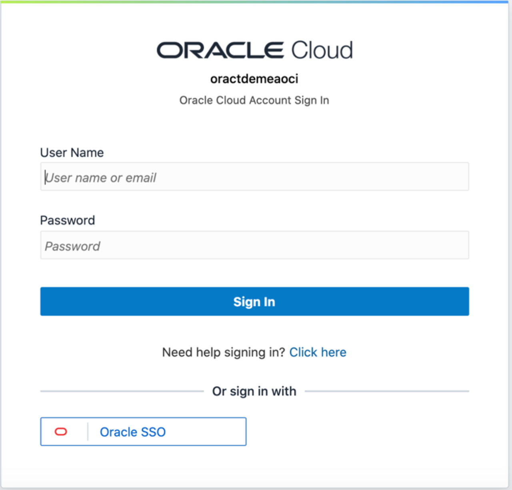
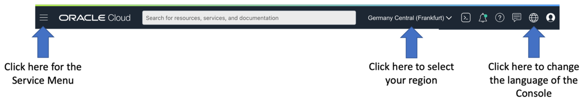
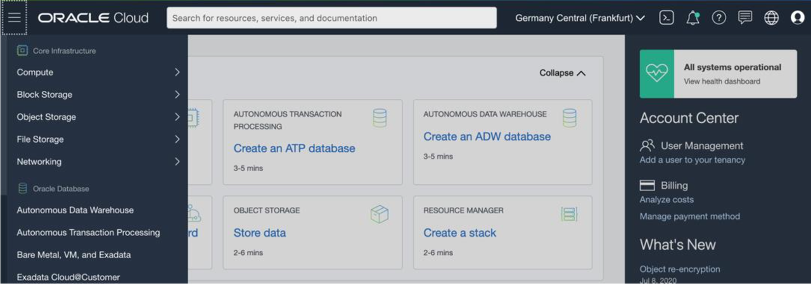

# Getting started in Oracle Cloud Infrastructure

## Introduction

During this workshop you will work in a shared tenancy. Your instructor will provide information regarding your login
credential.

Estimated Lab Time: 10 minutes

### Objectives
* Succesfully login to OCI
* Explorer the OCI Console

## Task 1: Log in to OCI and explorer OCI Console

Please go to [oci-workshop.com](https://www.oci-workshop.com/login) and select the correct region for your workshop. This link will take you to the login page of the cloud tenancy you will use during this workshop.

Your instructor will provide you with your User Name and Password. Accept the term of service and you will be directed to the main OCI Console page.

At the top of the OCI Console page you will see the main menu bar.

If you want to change the language of your interface, you can click on the Globe Icon on the right and select the language you want to console to be displayed in.

By Clicking on the left “hamburger menu” Icon, a list of the OCI services will be shown.

