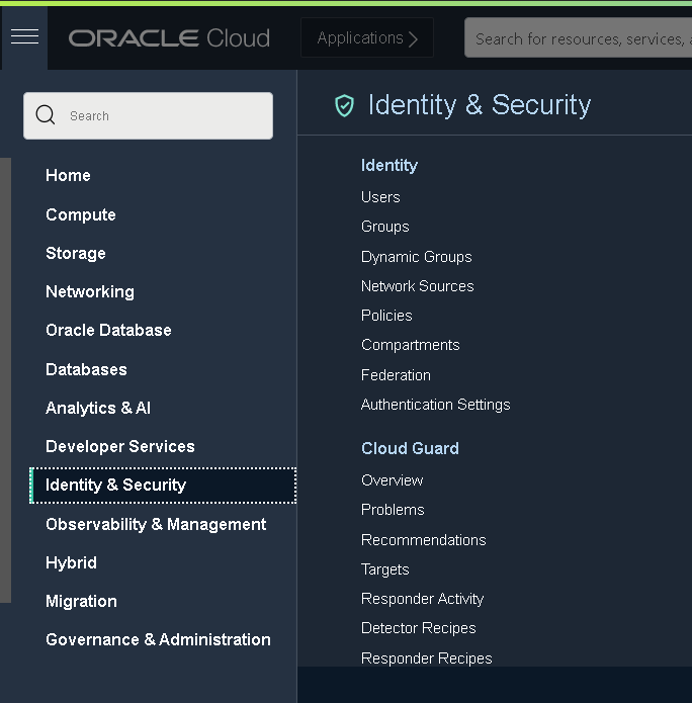

# Create Your own compartment

## Introduction

This lab guides you through the creation of a compartment as part of the workshop compartment

Estimated Lab Time: 10 minutes

### Objectives

* Create your own compartment, inside the already present workshop compartment

### Prerequisites
* Logged in to OCI

## Task 1: Identity Service

Navigate to the _Identity Service_ and click on the submenu _Compartments_. If you do not see the Identity service in the menu, you have to scroll down using 2 fingers on your touch pad or your middle mouse wheel. Alternatively, you can also use your _Arrow Down_ key.

You will be shown a list of existing compartments. Click on the Workshop compartment. This will navigate you inside this compartment. Now you are ready to create your own compartment.

**IMPORTANT: Make sure you are inside the workshop compartment, as this is the only area where you have full administrator privileges.**

## Task 2: Child compartments

Click on the _Create Compartment_ button and follow the steps to create your compartment.
**TIP:** After you have created your compartment, it is recommended to reload the page. Most elements in the OCI Console are dynamically updated and therefore do not require browser refreshes/reloads. One of the few exceptions is the Compartment Panel on most pages. To ensure they will show the newly created compartment, the page refresh is needed.
