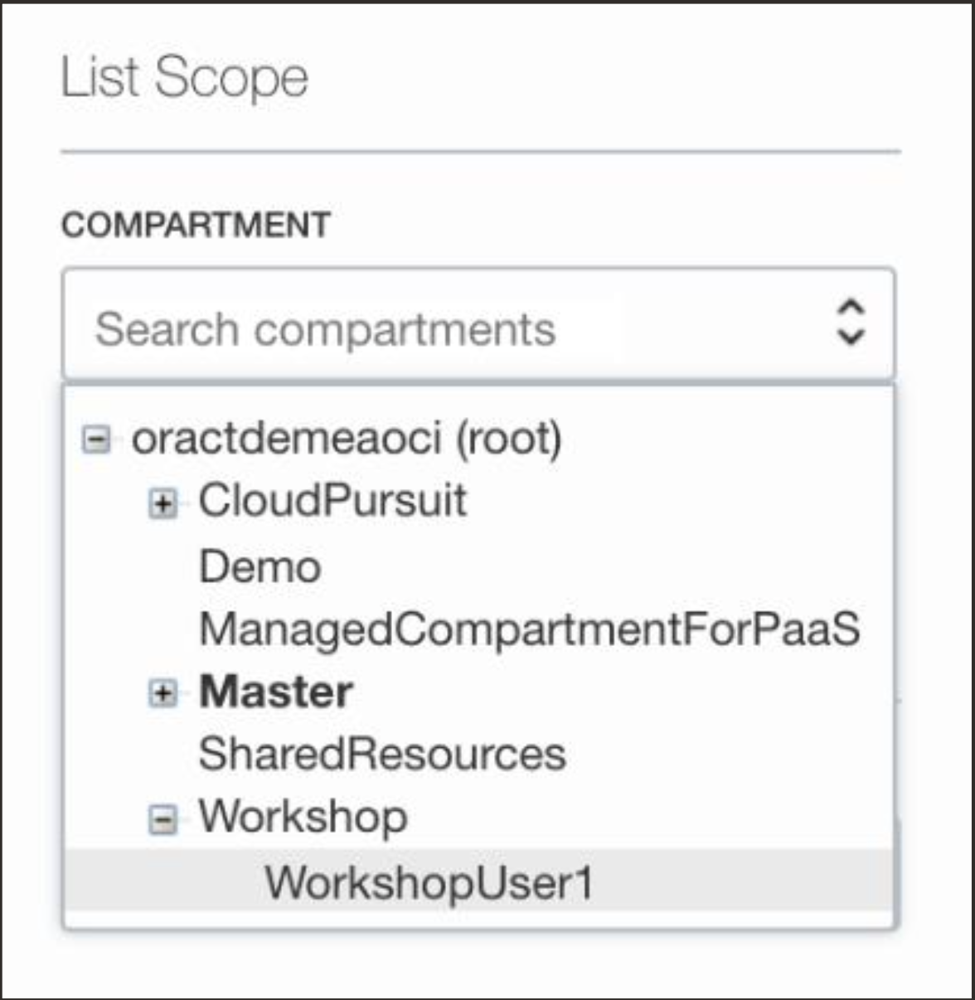
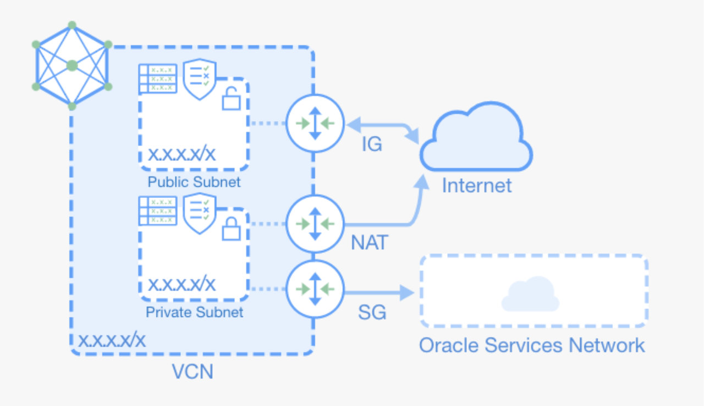
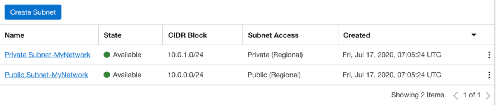

# Create a Virtual Cloud Network (VCN)

## Introduction
This lab shows how to create your first VCN.

Estimated time: 15 minutes

### Objectives

* Create a Virtual Cloud Network in your Compartment, that has as least one subnet with Internet connectivity.

### Prerequisities

* Make sure to have your own compartment created

## Task 1: Navigate to Virtual Cloud Networks Section

Using the top _Hamburger menu_ navigate to the _Networking -> Virtual Cloud Networks_ section. On the left toolbar you will see a Compartment explorer. Make sure it is set to your newly created compartment.
Use the [+] to expand the Workshop compartment.
If you do not see your newly created compartment, you want to refresh / reload your web browser.

## Task 2: Creating a VCN

You have 2 options on how to create your VCN. If this is your first time, it is
**recommended** to use the Wizard. The Wizard can automatically create the VCN with Subnets for you and also ensure there is an Internet Gateway configured with the correct routing tables for the public subnet.

When launching the wizard, choose the _VCN with Internet Connectivity_ option. Give your VCN a name and leave all other options as default.

The wizard will show you all the components that will be created.

All the resources we will create later in this hands-on workshop will need to be connected to the Public Subnet. When all finished, you should see you have 2 subnets in your VCN.

