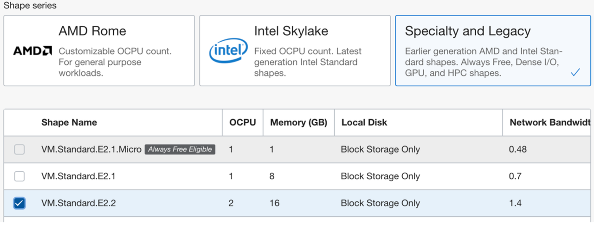
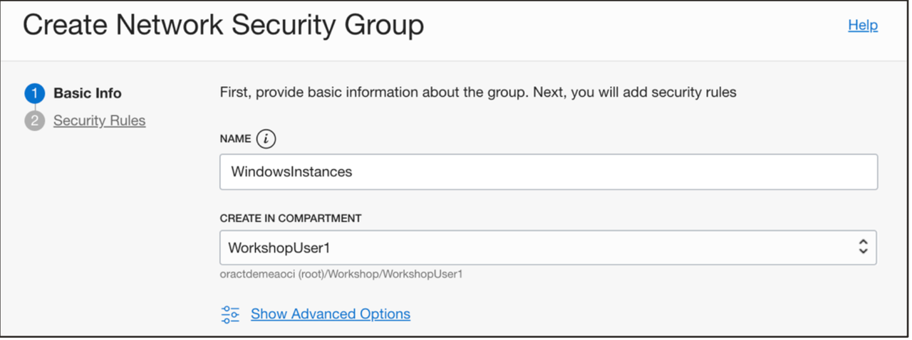
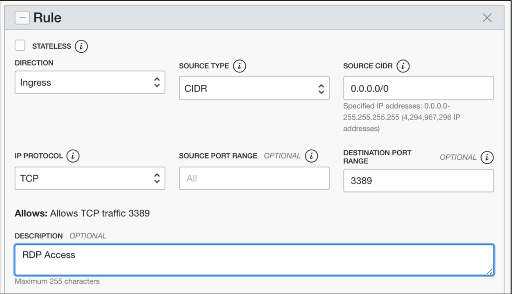
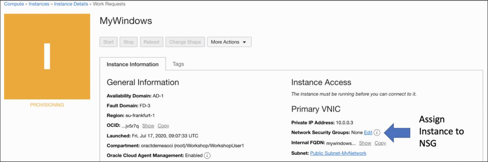
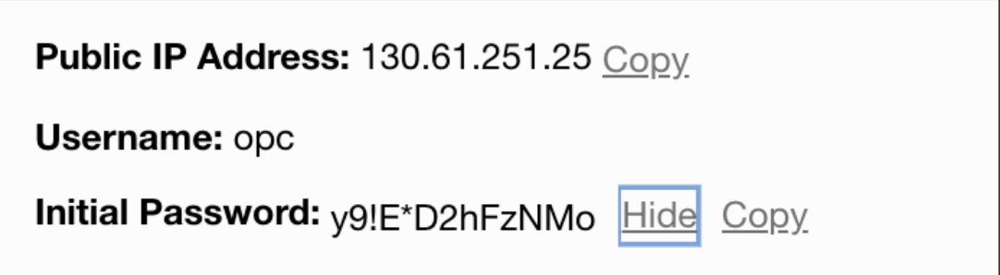

# Creating a Windows based Compute VM

## Introduction
In this lab, you will leanr how to create Windos-based compute instance and hwo to login via RDP to the Windows server. Furthermore, configure a Network Security Group so that port 3389 (RDP) is allowed and connect to you Windows Instance using a Remote Desktop client.

Estimated time: 30 minutes

### Objectives
* Create a Windows compute instance
* Create Network Security group 

### Prerequisites
* A VCN must exist

## Task 1: Create Windows Instance

Using the _hamburger menu_ navigate to _Compute -> Instances_ and click on the [create instance].
This time create the instance based on a Windows Image (you can choose any Windows instance).
For the shape type, select the **VM.Standard.E2.2** shape, you will find this in the _Specialty and Legacy_ Section.

Again, ensure your Instance is using the correct VCN and is connected to the Public Subnet.

Click the _create_ button and the Instance creation process will start. This will take a few minutes. While waiting for the instance to be up and running, you can configure a Network Security Group that will configure RDP access.

## Task 2: Create a Network Security Group

Using the _hamburger menu_ navigate to your VCN, by going to _Networking -> Virtual Cloud Networks_ and click on the name of your VCN.
On the left toolbar menu you will find the section _Network Security Group_. Click on this section and create a new Network Security Group.

Provide a name for your NSG (Network Security Group) and click _next_.

Create a rule that any IP Address (0.0.0.0/0) can access (Destination port) using the RDP Protocol (TCP port 3389)

Navigate back your windows instance and assign it to the Network Security Group you have created.

You can assign the NSG by clicking on the _edit_ link next to the Network Security Group title. Select your NSG and click on _assign_.

Wait for your windows Instance to be in a “running state”. After that you can try to use Microsoft Remote Desktop Client to connect to your Windows Instance. For Mac users you might first need to install the Microsoft Remote Desktop application, you can find this in the App store.

You will again find the Public IP address, needed username and the initial windows password on the Instance’s main page.

On the first login, you will be asked to change your password.
