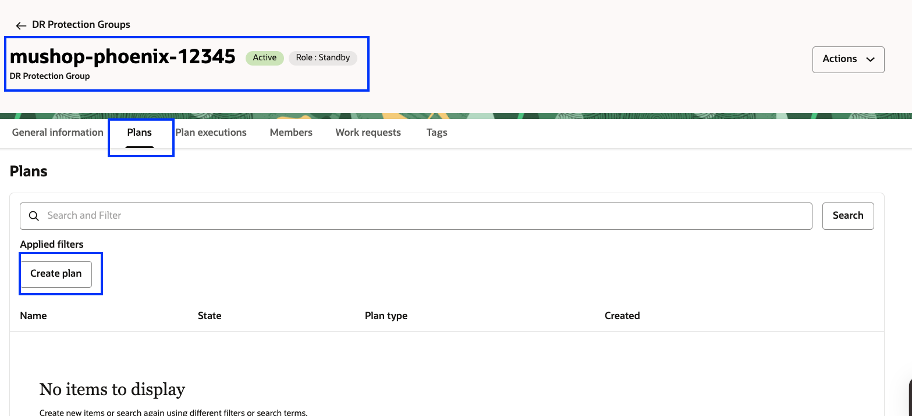
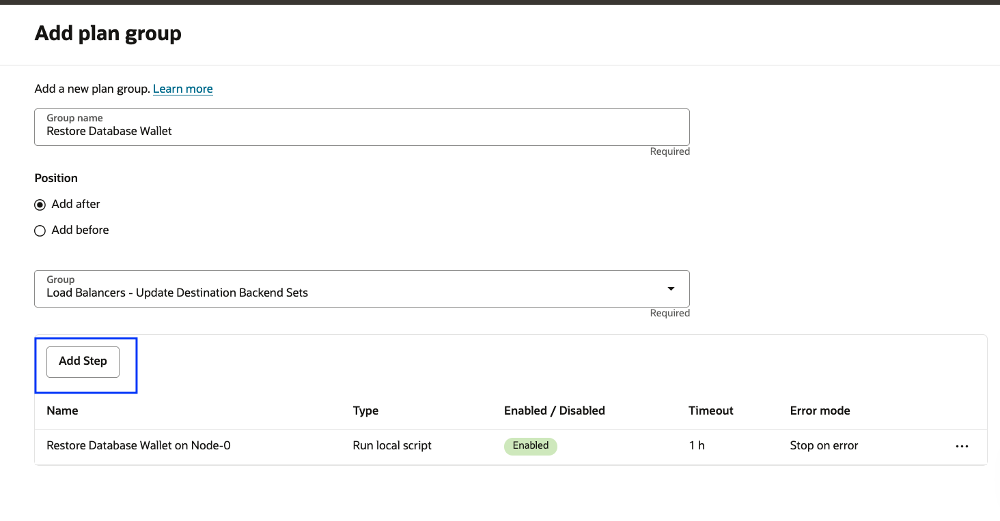
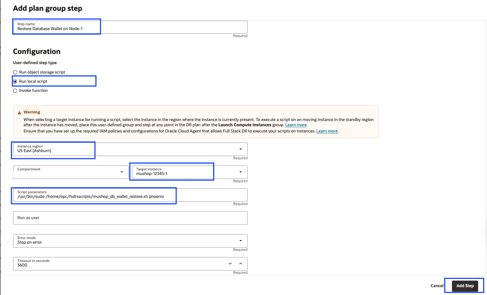
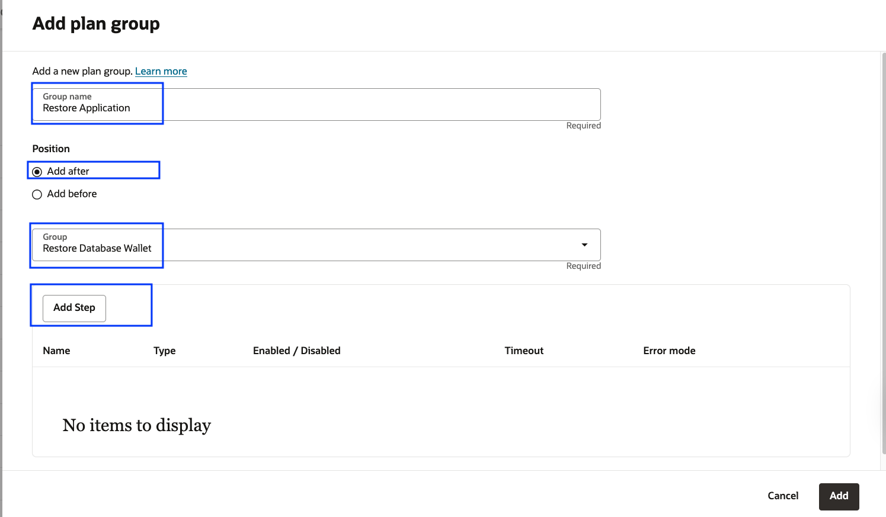
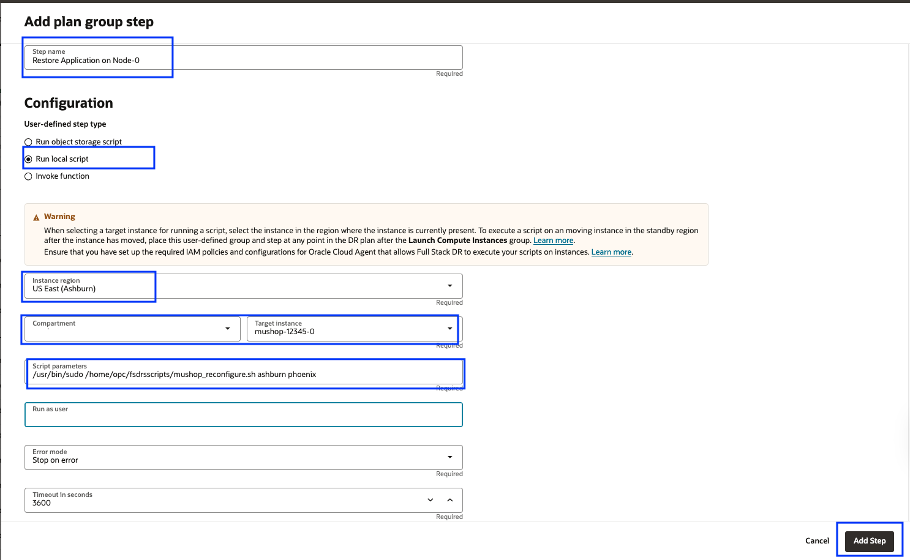
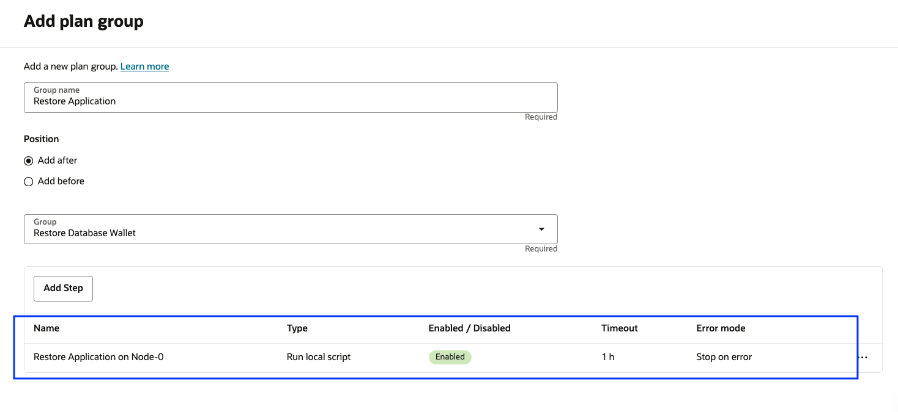
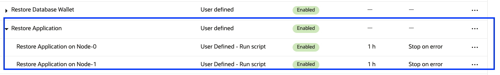
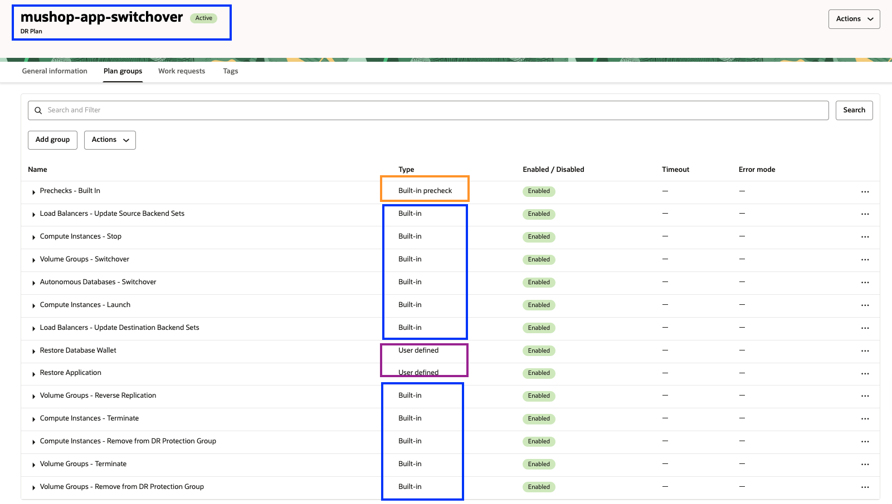

# Create and Customize the DR Switchover Plan

## Introduction

In this lab, we will create a DR Switchover plan and customize the plan with additional steps. Ashburn is a primary region, and Phoenix is the standby region. Full Stack DR support the below plan types

- Switchover: Shutdown at primary, then transition to standby
- Failover: Recover at standby
- Start Drill: Perform a complete dry run of a failover for validation
- Stop Drill: Tear down workload (created or converted during Start Drill plan) at standby

This lab will focus on how to create a Switchover plan and customize the plan as per MuShop application requirements. DR Plan *must* be created in the standby region (Phoenix). It is because, in the case of the worst-case scenario, the entire primary region outside the Full Stack DR will not be accessible from the primary region.

Estimated Time: 20 Minutes

### Objectives

- Create a Switchover plan
- Customize the Switchover plan- Restore Database Wallet group
- Customize the Switchover plan- Restore the Application Group
- Verify the Switchover plan and plan groups

## Task 1: Create a Switchover plan

1.  Login into OCI Console with your provided Credentials. Select region as **Phoenix**.

    

2.  Select Migration and Disaster Recovery from the Hamburger menu, then **Disaster Recovery** -> **DR Protection Groups**. Verify the region is **Phoenix**

    

3.  You will land on the Disaster Recovery Protection group home page; make sure you have selected the Phoenix region. **DR Plans always be created in the Standby DRPG (Phoenix region)**

    

4. Select the **mushop-phoenix** DRPG and navigate to Plans under the resources section.

    

    - Create plan
    - Name as **mushop-app-switchover**
    - Plan type as **Switchover (planned)**
    - Hit Create

    

    The plan will start creating; select the plan **mushop-app-switchover**.

    

    Refresh the DR Plan page if required. You can monitor the request's status in the **Work requests** section under Resources. Within a minute, the plan will get created, and it should be in *active* State.

    

    Select the **mushop-app-switchover** plan, and you should be able to various built-in plan groups.

    

    Based on the members we added in both primary and standby DRPG, Full Stack DR created these built-in plans. You can navigate the plan groups to see the various steps created.

    

    - **Built-in Prechecks** - These are prechecks for the app, DB, volume groups and Load balancer switchover.
    - **Update Source Load Balancers' Backend Sets** - Remove backend servers from the Load balancer backend set in the Ashburn region. 
    - **Stop Compute Instances** - Stop app virtual machines in the Ashburn region.
    - **Switchover Volume Groups** - Switchover volume groups in the phoenix region.
    - **Switchover Autonomous Databases** - Switchover ATP DB from Ashburn to Phoenix region
    - **Launch Compute Instances** - Create virtual machines in the phoenix region.
    - **Reverse Volume Groups' Replication** - Set up reverse volume group replication from Phoenix to Ashburn region.
    - **Terminate Compute Instances** - Terminate compute instances in the Ashburn region. By default the plan group is disabled, it can be enabled depending on the requirements.
    - **Remove Compute Instances From DR Protection Group** - Remove compute instances from the Ashburn DRPG.
    - **Terminate Volume Groups** - Terminate volume groups in the Ashburn region. By default the plan group is disabled, it can be enabled depending on the requirements.
    - **Remove Volume Groups From DR Protection Group** - Remove volume group from the Ashburn DRPG
    - **Update Destination Load Balancers' Backend Sets** - Add backend servers to the load balancer backend set in the Phoenix region. Backend servers IP will be mapped based on the launched VM's in the Phoenix region.
  
## Task 2: Customize the Switchover plan-Restore Database Wallet group

1.  Create a user-defined group for **Restore Database Wallet**.This can be done by selecting **Add group** in the *mushop-app-switchover* plan

    

2.  Add **Restore Database Wallet** in the Group name, select **Add after** radio button, select **Update Destination Load Balancers' Backend Sets** in the Group and Click **Add Step**

    

    - Add *Restore Database Wallet on Node-0* in Step name
    - Leave the enable step tick mark
    - Select Error mode as "Stop on error."
    - Leave the default "3600" seconds in Timeout in seconds
    - In the region, select "US East (Ashburn)"
    - Select the "Run local script" option
    - Select "mushop-xxxxx-0" instance in "Target instance in compartment"
    - In script parameters, add the below script

    ````
    <copy>/usr/bin/sudo /home/opc/fsdrsscripts/mushop_db_wallet_restore.sh phoenix</copy>
    ````
    - Leave the field blank in "Run as user"
    - Verify all the details and hit Add Step
    
    

    - Verify the step has been added successfully for Node-0

    

3.  Add step for *Restore Database Wallet on Node-1*

    

    - Add *Restore Database Wallet on Node-1* in Step name
    - Leave the enable step tick mark
    - Select Error mode as "Stop on error."
    - Leave the default "3600" seconds in Timeout in seconds
    - In the region, select "US East (Ashburn)"
    - Select the "Run local script" option
    - Select "mushop-xxxxx-1" instance in "Target instance in compartment"
    - In script parameters, add the below script

    ````
    <copy>/usr/bin/sudo /home/opc/fsdrsscripts/mushop_db_wallet_restore.sh phoenix</copy>
    ````
    - Leave the field blank in "Run as user"
    - Verify all the details and hit Add Step
    
    

    - Verify the step has been added successfully for Node-1

    
 
    - Click **Add**

    

    **mushop-phoenix** DRPG will go into updating state, and after a few seconds, it will return to the active state. Refresh the DRPG page if required. You should be able to see that the *Restore Database Wallet* Plan group is created successfully with both steps. **Restore Database Wallet** plan group will be added after **Update Destination Load Balancers' Backend Sets** plan group.

    
 

## Task 3: Customize the Switchover plan-Restore the Application Group

1.  Create a user-defined group for **Restore Application**.This can be done by selecting **Add group** in the *mushop-app-switchover* plan

    

2.  Add **Restore Application** in the Group name, select **Add after** radio button, select **Restore Database Wallet** in the Group and Click **Add Step**

    

    - Add *Restore Application on Node-0* in Step name
    - Leave the enable step tick mark
    - Select Error mode as "Stop on error."
    - Leave the default "3600" seconds in Timeout in seconds
    - In the region, select "US East (Ashburn)"
    - Select the "Run local script" option
    - Select "mushop-xxxxx-0" instance in "Target instance in compartment"
    - In script parameters, add the below script

    ````
    <copy>/usr/bin/sudo /home/opc/fsdrsscripts/mushop_reconfigure.sh ashburn phoenix</copy>
    ````
    - Leave the field blank in "Run as user"
    - Verify all the details and hit Add Step
    
    

    - Verify the step has been added successfully for Node-0

    

3.  Add step for *Restore Application on Node-1*

    

    - Add *Restore Application on Node-1* in Step name
    - Leave the enable step tick mark
    - Select Error mode as "Stop on error."
    - Leave the default "3600" seconds in Timeout in seconds
    - In the region, select "US East (Ashburn)"
    - Select the "Run local script" option
    - Select "mushop-xxxxx-1" instance in "Target instance in compartment"
    - In script parameters, add the below script

    ````
    <copy>/usr/bin/sudo /home/opc/fsdrsscripts/mushop_reconfigure.sh ashburn phoenix</copy>
    ````
    - Leave the field blank in "Run as user"
    - Verify all the details and hit Add Step
    
    

    - Verify the step has been added successfully for Node-1

    
 
    - Click **Add**

    

    **mushop-phoenix** DRPG will go into updating state, and after a few seconds, it will return to the active state. Refresh the DRPG page if required. You should be able to see that the *Restore Application* Plan group is created successfully with both steps. **Restore Application** plan group will be added after **Restore Database Wallet** plan group.

    
 
## Task 4: Verify the Switchover plan and plan groups

1.  We have created all the required (two) user-defined groups in the **mushop-app-switchover** switchover plan as part of the Mushop application switchover.

    

2.  Let's review the **mushop-app-switchover** switchover plan 

    -  Built-in Prechecks - These are the built-in prechecks groups for all the Plan groups (Built-in and User defined).
    -  Based on the members we have added in both Primary DRPG and Standby DRPG, Full Stack DR created **eleven** Built-in plan groups for the switchover plan.
    -  We have manually created **two** user-defined groups as per the Mushop application switchover requirement.
    -  In summary, the **mushop-app-switchover** switchover plan has created with *one*- Built-in prechecks plan group, *eleven*- Built-in Plan groups,*two*- User defined Plan groups

    

3.  Plan groups can be reordered as per the switchover workflow requirement.Since we have created the user defined plan groups in correct order, there is no need to reorder the user defined plan groups.

    

    You may now [Proceed to the next lab](#next)

## Acknowledgements

- **Author** - Suraj Ramesh, Principal Product Manager,Oracle Database High Availability (HA), Scalability and Maximum Availability Architecture (MAA)
- **Last Updated By/Date** -  Suraj Ramesh,November 2023