# Create and Customize DR plans

## Introduction
In this lab, you'll learn how to create **Switchover**, **Failover**, and **Drill Plans** in Oracle Full Stack DR. You will also customize these DR Plans using **user-defined plan groups** tailored to the MuShop application's requirements.

⚠️ **Note:**  
Full Stack DR does **not** allow the creation of DR Plans in a **Primary** role DR Protection Group.All DR Plans **must** be created in the **Standby** role DRPG.

**DR Plans**- A DR Plan represents a DR workflow associated with a pair of DR Protection Groups. A DR Plan is represented as a sequence of Plan Groups. These Plan Groups in turn consist of Plan Steps. A DR Plan can only be created at the Standby DR Protection Group.

There are four types of DR plans which you can create in Full Stack DR.

- Switchover Plan:Used for planned and controlled transition of services from a primary to a standby region. It involves shutting down services in the primary region and bringing them up in the standby region. 
- Failover Plan: Used for unplanned recovery during disasters or outages. It immediately activates services in the standby region whenever the primary is entirely inaccessible.
- Drill Plans: Performing DR drills is an essential DR service capability that allows users to exercise and validate their business continuity configuration and plans without disrupting their production stack.
    - Start Drill: It creates a replica of your production stack without impacting production.Perform a complete dry run of a failover for validation
    - Stop Drill: Removes the replica of your production stack created earlier by Start drill.
 
**Plan Group** – A group of steps in a DR Plan. A DR Plan consists of one or more Plan Groups that execute sequentially. All steps in a Plan Group execute in parallel. 

There are two types of plan groups

- Built-In Groups or Steps – A type of Plan Group or Step that is generated automatically by Full Stack DR when a DR Plan is created. Examples of Built-in Plan Steps are: Launch Compute Instance, Switchover Database, etc.

- User-Defined Groups or Steps– A type of Plan Group or Step that is added by the user to a DR Plan after the DR plan is created by Full Stack DR. 

> ⚠️ **Note:** The custom scripts used here are for example purposes only.  
It is assumed that the environment uses **Ashburn as Primary** and **Phoenix as Standby**.If you perform **role transitions** or use **different regions**, you must update the scripts and parameters accordingly to reflect your setup.


Estimated Time: 30 Minutes

### Objectives

- Create DR plans (Switchover,Failover and Start drill)
- Customize the DR plans - Restore Database Wallet group
- Customize the DR plans - Restore the Application Group
- Verify the DR plans and plan groups

## Task 1: Create DR plans

1.  Login into OCI Console with your provided Credentials. Select region as **Phoenix**.

    

2.  Open the **Hamburger menu (☰)** and select **Migration and Disaster Recovery**. Then go to **Disaster Recovery → DR Protection Groups** and Confirm that the **region is set to Phoenix**.

    

3.  You will land on the Disaster Recovery Protection group home page; make sure you have selected the Phoenix region. **DR Plans always be created in the Standby DRPG (Phoenix region)**

    

4. Select the **mushop-phoenix-xxxxx** DRPG and navigate to the **Plans** tab

    

    - Create plan
    - Name as **mushop-app-switchover-iad-phx** ( Provider any other names which is meaningful and see to understand)
    - Plan type as **Switchover (planned)**
    - Hit Create

    

    The plan will start creating; select the plan **mushop-app-switchover**.

    

    Refresh the DR Plan page if required. You can monitor the request's status in the **Work requests** tab and select the work request details. Within a minute, the plan will get created, and it should be in *active* State.

    

    Select the **mushop-app-switchover** plan, navigate to **Plan groups** tab and you should be able to various built-in plan groups.

    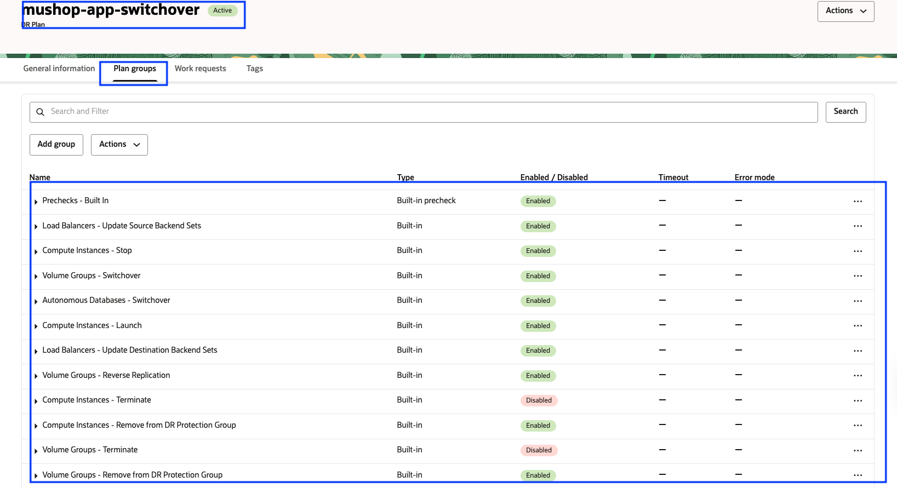

    Based on the members we added in both primary and standby DRPG, Full Stack DR created these built-in plans. You can navigate the plan groups to see the various steps created.

    

    - **Built-in Prechecks** - These are prechecks for the compute, DB, volume groups and Load balancer switchover.
    - **Load Balancers - Update Source Backend Setss** - Remove backend servers from the Load balancer backend set in the Ashburn region. 
    - **Compute Instances - Stop** - Stop app virtual machines in the Ashburn region.
    - **Volume Groups - Switchover** - Switchover volume groups in the phoenix region.
    - **Autonomous Databases - Switchover** - Switchover ATP DB from Ashburn to Phoenix region
    - **Compute Instances - Launch** - Create virtual machines in the phoenix region.
    - **Load Balancers - Update Destination Backend Sets** - Add backend servers to the load balancer backend set in the Phoenix region. Backend servers IP will be mapped based on the launched VM's in the Phoenix region.
    - **Volume Groups - Reverse Replication** - Set up reverse volume group replication from Phoenix to Ashburn region.
    - **Compute Instances - Terminate** - Terminate compute instances in the Ashburn region. By default the plan group is disabled, it can be enabled depending on the requirements.
    - **Compute Instances - Remove from DR Protection Group** - Remove compute instances from the Ashburn DRPG.
    - **Volume Groups - Terminate** - Terminate volume groups in the Ashburn region. By default the plan group is disabled, it can be enabled depending on the requirements.
    - **Volume Groups - Remove from DR Protection Group** - Remove volume group from the Ashburn DRPG

**Note:** **Compute Instances - Terminate* and **Volume Groups - Terminate** plan groups are disabled by default; to enable them, click the **`...`** menu at the end of the plan groups and select **Enable all steps**. This step is optional but recommended. In case if you leave it disabled, you might need to clean up the compute and volume groups in the Ashburn region manually.

5. Follow the same process described in Step 4 to create the **Failover** and **Start Drill** plans. Please ensure you select the correct **Plan Type** when creating each plan. Once the plans are created, they will appear as shown below.

    

6. Check the **Failover** and **Start Drill** plan groups. Based on the members added to both the primary and standby DR Protection Groups, Full Stack DR automatically created these built-in plans. You can navigate through the plan groups to review the various steps included.

    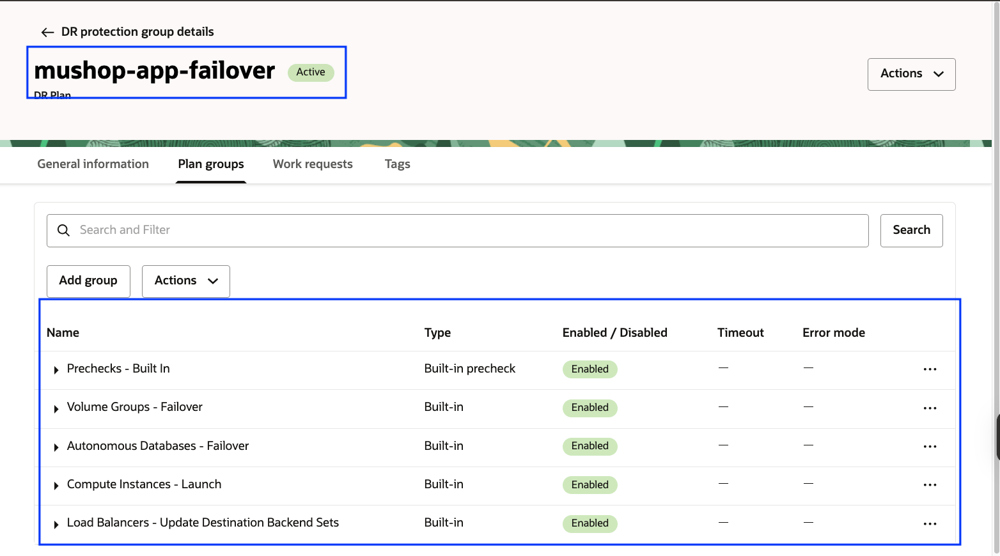

    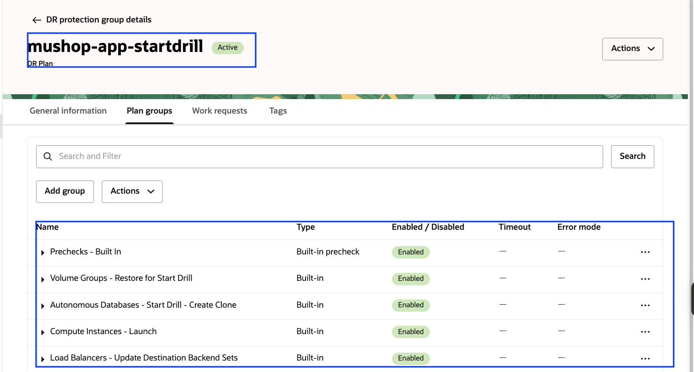

7. Full Stack DR allows creating a Stop Drill plan only after the Start Drill has been executed and the DR Protection Group is no longer in an Active state. You cannot create a Stop Drill plan at this point and will receive a warning if you attempt to do so, so we cannot create stop drill plan at the moment.

    

  
## Task 2: Customize the DR plans with user defined plan group for restoring Database wallet

1.  Create a User-Defined Group for **Restore Database Wallet**. Select the **mushshop-app-switchover** plan, navigate to the **Plan groups** tab, and click **Add Group** to create a new user-defined group for restoring the database wallet.

    

2.  Add **Restore Database Wallet** in the Group name, select the Position **Add after** radio button, select **Load Balancers - Update Destination Backend Sets** in the Group and Click **Add Step**

    

    - Add *Restore Database Wallet on Node-0* in Step name
    - Select the "Run local script" option
    - In the Instance region, select "US East (Ashburn)"
    - Select the correct compartment and select "mushop-xxxxx-0" instance
    - In script parameters, add the below script

    ````
    <copy>/usr/bin/sudo /home/opc/fsdrsscripts/mushop_db_wallet_restore.sh phoenix</copy>
    ````
    - Leave the field blank in "Run as user"
    - Select Error mode as "Stop on error."
    - Leave the default "3600" seconds in Timeout in seconds
    - Leave the Enable step as default
    - Verify all the details and hit **Add Step**
    
    

    - Verify the step has been added successfully for Node-0

    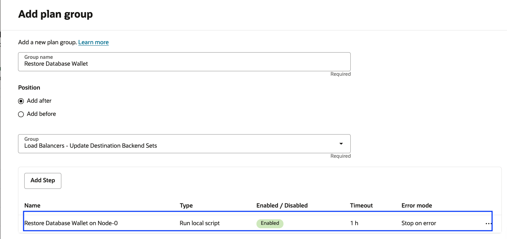

3.  Add step for *Restore Database Wallet on Node-1*

    

    - Add *Restore Database Wallet on Node-1* in Step name
    - Select the "Run local script" option
    - In the Instance region, select "US East (Ashburn)"
    - Select the correct compartment and select "mushop-xxxxx-1" instance
    - In script parameters, add the below script

    ````
    <copy>/usr/bin/sudo /home/opc/fsdrsscripts/mushop_db_wallet_restore.sh phoenix</copy>
    ````
    - Leave the field blank in "Run as user"
    - Select Error mode as "Stop on error."
    - Leave the default "3600" seconds in Timeout in seconds
    - Leave the Enable step as default
    - Verify all the details and hit **Add Step**
    
    

    - Verify the step has been added successfully for Node-1

    
 
    - Click **Add**

    

    **`mushop-phoenix-xxxxx`** DRPG will briefly enter the **Updating** state and then return to **Active** after a few seconds. Refresh the DRPG page if needed. You should now see the *Restore Database Wallet* plan group created successfully with both its steps. This plan group will appear **after** the *Load Balancers - Update Destination Backend Sets* plan group.
   

    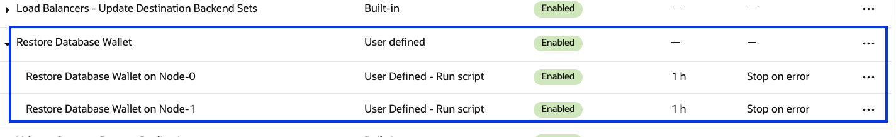
 
4. Repeat the same steps for **mushop-app-failover** and **mushop-app-startdrill** plans.


## Task 3: Customize the DR plans with user defined plan group for restoring the applicaiton

1.  Create a User-Defined Group for **Restore Application**. Select the **mushshop-app-switchover** plan, navigate to the **Plan groups** tab, and click **Add Group** to create a new user-defined group for restoring the mushop applicaiton.

    

2.  Add **Restore Application** in the Group name, select the Position **Add after** radio button, select **Restore Database Wallet** in the Group and Click **Add Step**

    

    - Add *Restore Application on Node-0* in Step name
    - Select the "Run local script" option
    - In the Instance region, select "US East (Ashburn)"
    - Select the correct compartment and select "mushop-xxxxx-0" instance
    - In script parameters, add the below script

    ````
    <copy>/usr/bin/sudo /home/opc/fsdrsscripts/mushop_reconfigure.sh ashburn phoenix</copy>
    ````
    - Leave the field blank in "Run as user"
    - Select Error mode as "Stop on error."
    - Leave the default "3600" seconds in Timeout in seconds
    - Leave the Enable step as default
    - Verify all the details and hit **Add Step**
    
    

    - Verify the step has been added successfully for Node-0

    

3.  Add step for *Restore Application on Node-1*

    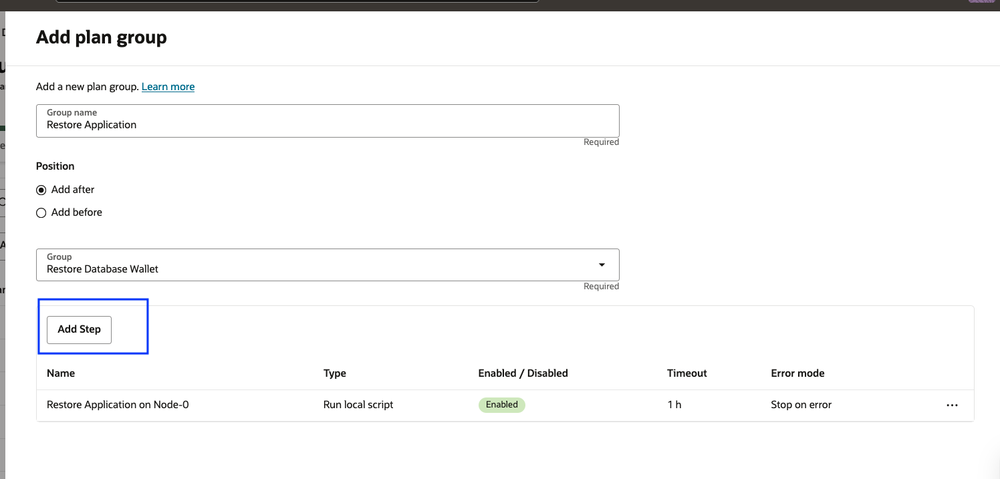

    - Add *Restore Application on Node-1* in Step name
    - Select the "Run local script" option
    - In the Instance region, select "US East (Ashburn)"
    - Select the correct compartment and select "mushop-xxxxx-0" instance
    - In script parameters, add the below script

    ````
    <copy>/usr/bin/sudo /home/opc/fsdrsscripts/mushop_reconfigure.sh ashburn phoenix</copy>
    ````
    - Leave the field blank in "Run as user"
    - Select Error mode as "Stop on error."
    - Leave the default "3600" seconds in Timeout in seconds
    - Leave the Enable step as default
    - Verify all the details and hit **Add Step**
    
    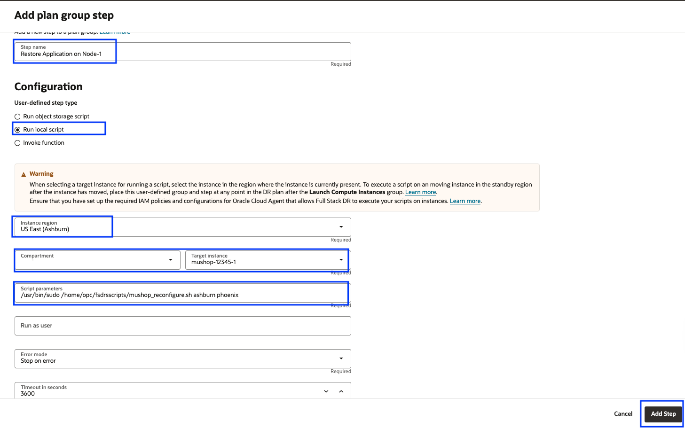

    - Verify the step has been added successfully for Node-1

    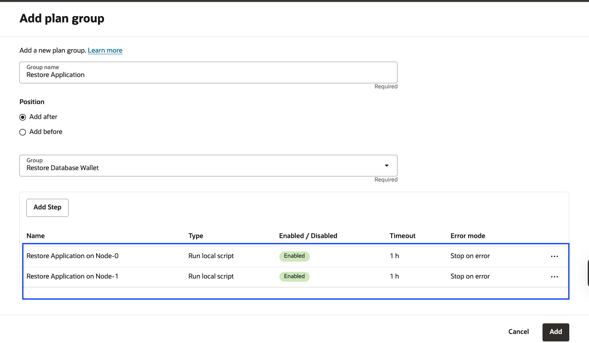
 
    - Click **Add**

    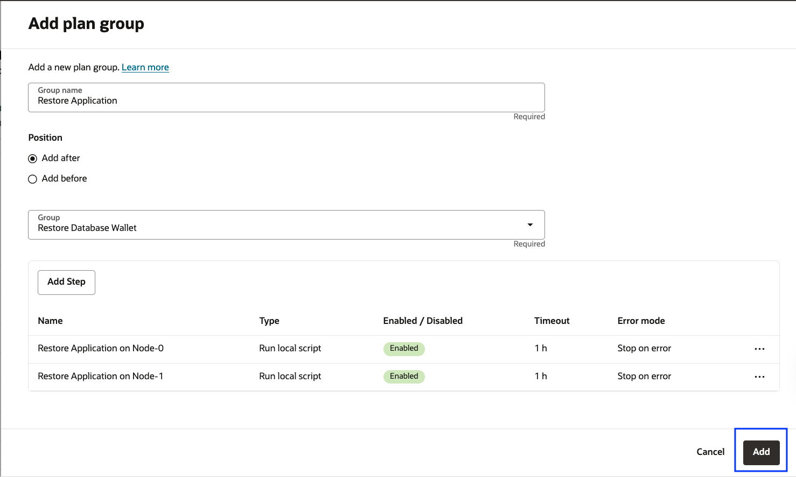

    **`mushop-phoenix-xxxxx`** DRPG will briefly enter the **Updating** state and then return to **Active** after a few seconds. Refresh the DRPG page if needed. You should now see the *Restore Application* plan group created successfully with both its steps. This plan group will appear **after** the *Restore Database Wallet* plan group.

    

4. Repeat the same steps for **mushop-app-failover** and **mushop-app-startdrill** plans.

 
## Task 4: Verify the DR plans and plan groups

1. We have created the required two user-defined groups in each of the following plans as part of the Mushop application workflows:

    - **mushop-app-switchover**
    - **mushop-app-failover**
    - **mushop-app-startdrill**


    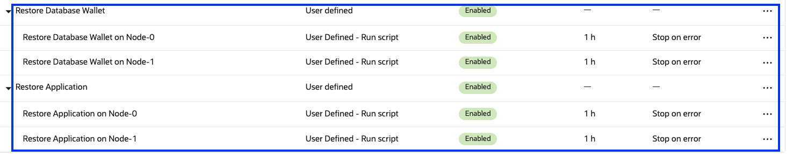

2.  Let's review the **mushop-app-switchover** switchover plan 

    -  Prechecks - Built In - These are the built-in prechecks groups for all the Plan groups (Built-in and User defined).
    -  Based on the members we have added in both Primary DRPG and Standby DRPG, Full Stack DR created **eleven** Built-in plan groups for the switchover plan.
    -  We have manually created **two** user-defined groups as per the Mushop application switchover requirement.
    -  In summary, the **mushop-app-switchover** switchover plan has created with *one*- Built-in prechecks plan group, *eleven*- Built-in Plan groups,*two*- User defined Plan groups

    

3.  Plan groups can be reordered based on the switchover workflow requirements. However, since we’ve already created the user-defined plan groups in the correct order, there’s no need to make any changes.You can also add a **Pause step** if you want to manually verify progress during plan execution. 

    

4. Similarly, you can verify the **mushop-app-failover** and **mushop-app-startdrill** plans. Please note that the built-in plan groups will differ for the **failover** and **startdrill** plans compared to
the **switchover** plan.

    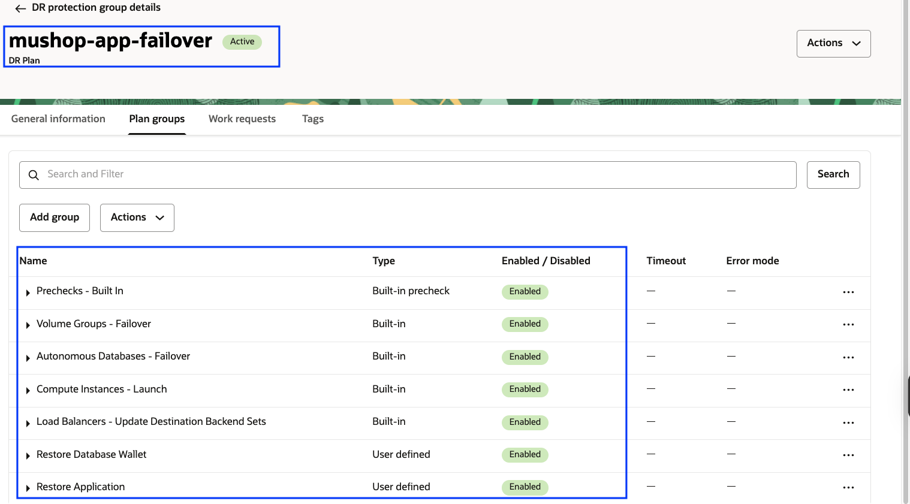

    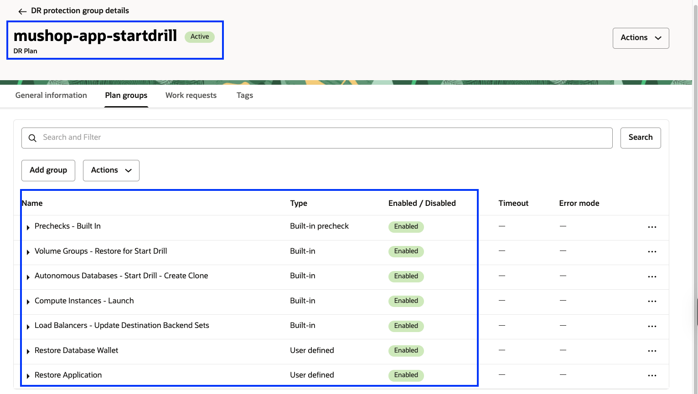
   

5. In the subsequent labs, we will run the **mushop-app-switchover** plan.If you're interested in running other DR plans, such as **failover** or **startdrill**, you’re welcome to do so as well.


    You may now [Proceed to the next lab](#next)

## Acknowledgements

- **Author** - Suraj Ramesh, Principal Product Manager,Oracle Database High Availability (HA), Scalability and Maximum Availability Architecture (MAA)
- **Last Updated By/Date** -  Suraj Ramesh, July 2025