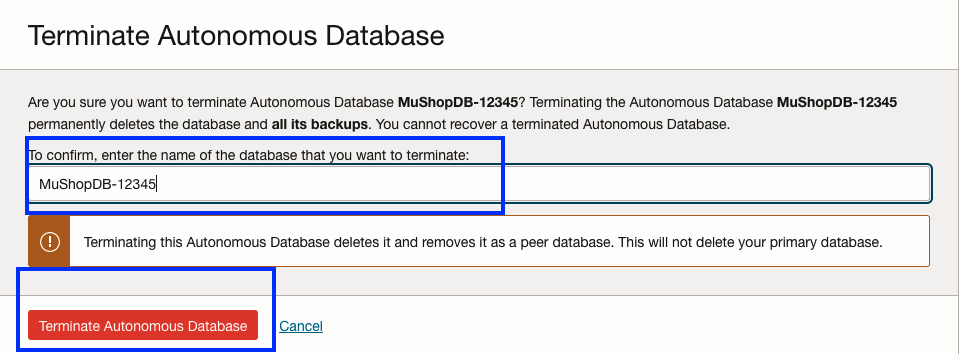
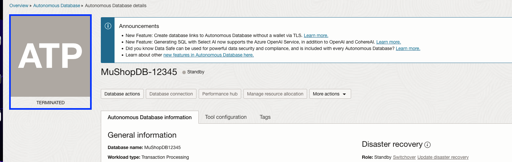
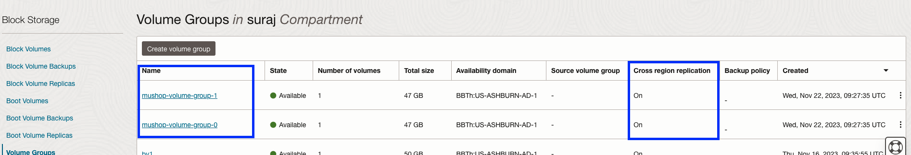
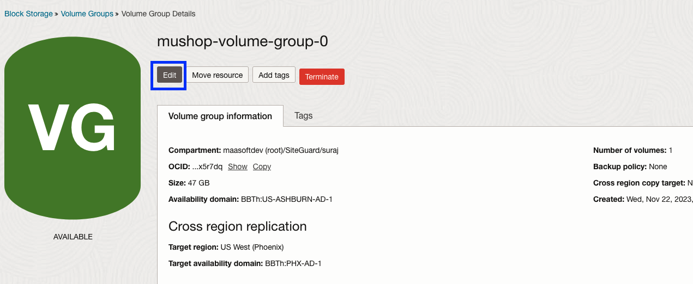
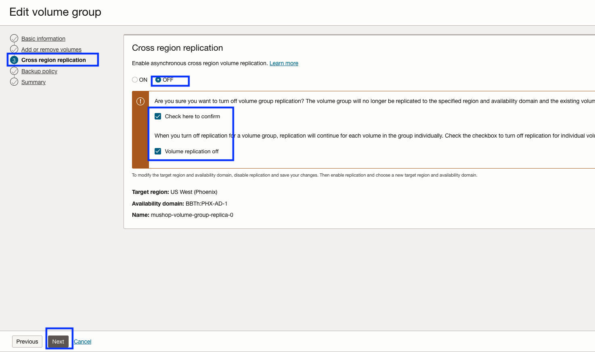
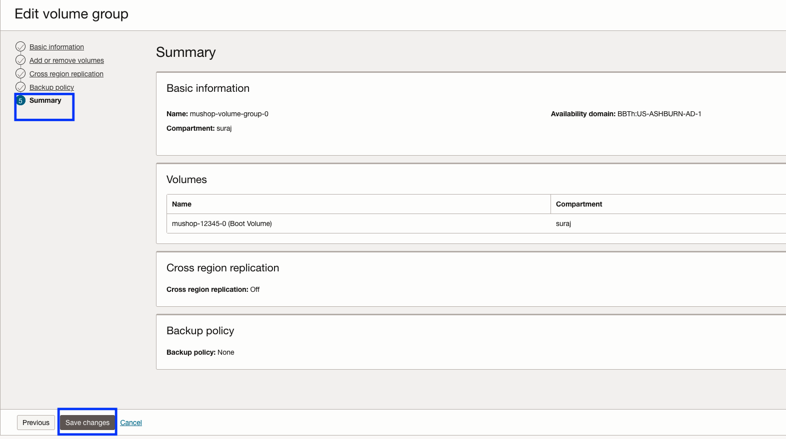
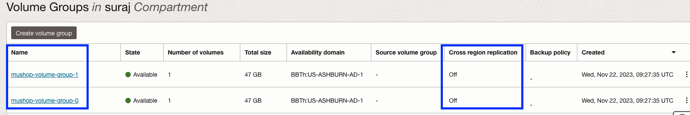

# Destroy the OCI resources

## Introduction

In this lab, we will teardown all the resources which was created. There are some OCI resources which has to be deleted manually before running the resource manager destroy job.

Estimated Time: 30 minutes

### Objectives

- Terminate the ATP Standby DB
- Disable the cross-region replication for the volume groups in both regions
- Delete the Pre-Authenticated requests (PAR) generated in the mushop-xxxxx bucket in both regions
- Run destroy job for the mushop stack in the resource manager
- Terminate Full Stack DR protection groups

## Task 1: Terminate ATP Standby DB

1. Login into OCI Console with your credentials. Select the region, where the standby ATP DB is running.

2. From the Hamburger menu,select Oracle Database-> Autonomous Transaction Processing.

3.Select **MuShopDB-XXXXX** DB, go to **More Actions tab** and select **Terminate**

4. Enter the database name and click **Terminate Autonomous Database**

    

5. In 2-3 minutes, the ATP database will be terminated.

    

## Task 2: Disable the cross-region replication for the Volume groups

1. From the Hamburger menu,select Storage-> Volume groups

2. You will find two volume groups **mushop-volume-group-0** and **mushop-volume-group-1**. 

    

3. Disable the cross-region replication. Select **mushop-volume-group-0** and click **Edit**

    

4. In the Wizard, navigate to **Cross region replication** section by clicking **Next**

5. Modify the radio button from **on** to **off and click the two check boxes to turn off the replication.

    

6. Click **Next**, you should be in **Summary** section, verify and click **Save changes**

    

7. Repeat the same steps (3 to 5) to disable the cross-region replication for **mushop-volume-group-1** volume group.

8. In few minutes, you should be able to see the cross region replication is set of **off** for both the volume groups.

    

## Task 3: Delete the Pre-Authenticated requests (PAR)

1. During Full Stack DR plan execution will create PAR requests in the mushop-xxxxx folder, where xxxxx is your reservation id.

2. From the Hamburger menu,select Storage-> Object Storage & Archive Storage

3. Select **mushop-xxxxx** bucket, navigate to **PreAuthenticated Requests** under Resources section.

4. If you have any active Preauthenticated Requests created during the DR plan execution, please delete those.

5. You should delete those in both primary and standby region buckets.

## Task 4: Run destroy job for the mushop stack in the resource manager

1. Click the Navigation Menu in the upper left, navigate to Developer Services, and select Stacks. Make sure you are in the **Ashburn** region. If you have used different regions, select your Primary region.

    

2. Click **Create Stack** and select the compartment.

    

3. In the **Stack information** section,provide the below details.

    - Choose **My configuration**
    - In the **Stack congiguration**, use **.Zip file** and upload **fullstackdr-mushop-updated.zip**. You should use the zip file from Task 1 -> Step 14.
    - In the **Name**,provide the name as **fullstackdr-mushop-stack**
        
    - Select the **compartment** of your choice
    - Leave the other values as default.
    - Click Next
    

4. In the **Configure variables** section, provide the below details  in the variables section.  
 
    - ociCompartmentOcid: Provide your compartment OCID
    - ociTenancyOcid: Provide your tenancy OCID
    - ociUserOcid: Provide your OCI user OCID
    - resId:Provide a random 5 digit number
    
    
    - Leave the rest of the variables section with default values.
    - Click Next

5. In the **Review** section
 
    - Review the **Stack Information** and **Variables**
    - Select the checkbox **Run apply** in the Run apply on selected stack
    - Click **Create**
    

## Task 3: Verify the OCI resource manager job

1. Navigate to **Stacks**, select **fullstackdr-mushop-stack**

    

2. You should be able a see oracle resource manager (orm) job which is in-progress state.Click the job details and monitor.

    

3. The job will take approximately 30 minutes to complete. Verify the status of job, it should show as **Succeeded**. In case if the job fails, verify the logs and take necessary action. Common causes for failures are missing IAM policies, resource quota not available.

    

You may now [Proceed to the next lab](#next)

## Acknowledgements

- **Author** - Suraj Ramesh,Principal Product Manager,Oracle Database High Availability (HA), Scalability and Maximum Availability Architecture (MAA)
- **Last Updated By/Date** - Suraj Ramesh,November 2023

