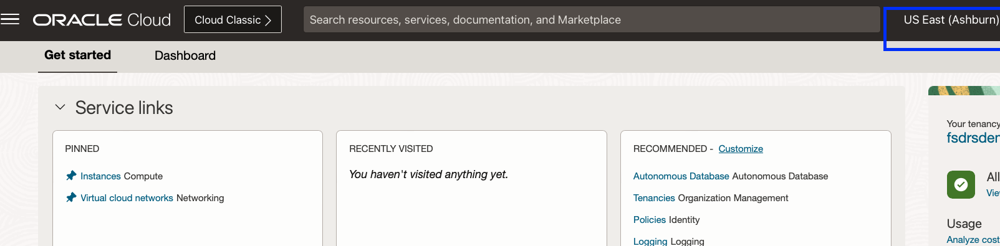
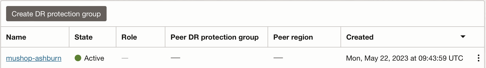
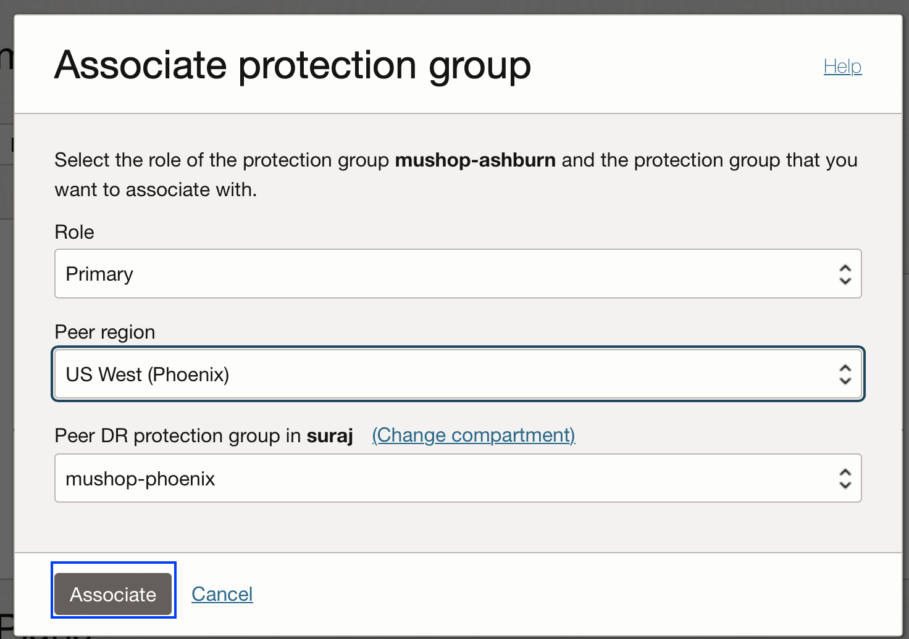
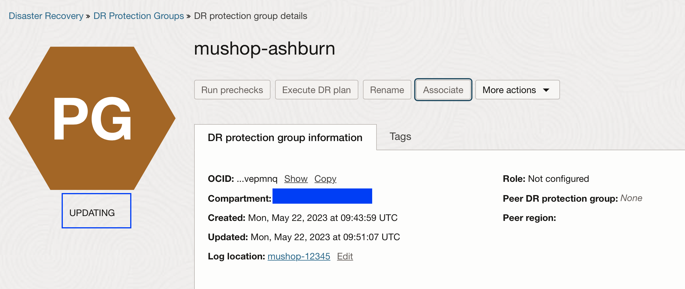
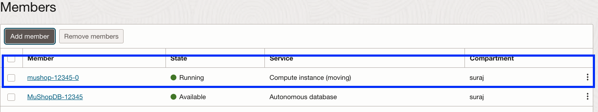
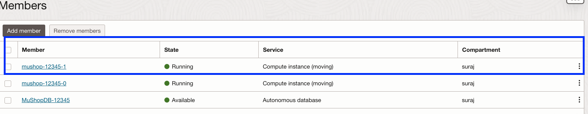
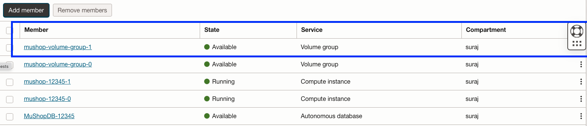
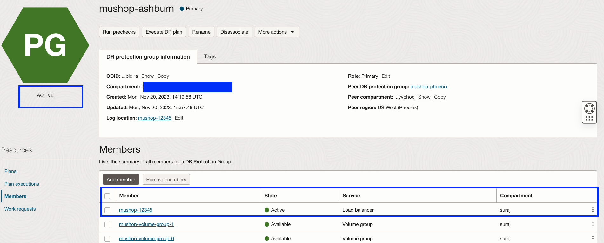

# Create DR Protection groups and add members

## Introduction

In this lab, we will Create and Associate Disaster Recovery Protection Groups (DRPG), Add required members in Primary and Standby DR protection groups. Ashburn is the primary region and Phoenix is the standby region.

**DR Protection group (DRPG)** – A resource type used by Full Stack DR.  A DR Protection Group represents a consistency grouping defined for the purposes of disaster recovery.  It is a collection of different OCI resources that comprise an application and must be treated as a combined group when performing disaster recovery operations.  For example, a DR Protection Group may consist of application servers (compute instances), associated block storage (grouped as volume groups), and databases.

**Members**- A resource type which can be added to a DRPG. Full Stack DR currently supports all the below member types. These resources can be added as member to a DRPG.

- Compute ( Standard Compute and Dedicated VM Host (DVH))
- Block Storage (Volume Groups)
- Oracle Autonomous Database Serverless (ADB-S)
- Oracle Autonomous Database on Dedicated Exadata Infrastructure (ADB-D)
- Autonomous Database on Exadata Cloud@Customer (ADB-C@C)
- Oracle Base Database Service (BaseDB/DBCS)
- Oracle Exadata Database Service on Dedicated Infrastructure (ExaDB-D/ExaCS)
- Oracle Exadata Database Service on Cloud@Customer (ExaCC)
- Oracle Exadata Database Service on Exascale Infrastructure (ExaDB-XS)
- Load Balancer and Network Load Balancer 
- File Storage Service
- Object Storage Bucket

Estimated Time: 25 Minutes

Watch the video below for a quick walk-through of the lab.
[Creation of DR protection group and switchover plan](videohub:1_bsr4qru5)

### Objectives

- Create DRPG in Ashburn and Phoenix regions.
- Associate Ashburn DRPG as primary and Phoenix DRPG as Standby
- Add members to Ashburn DRPG (Primary) - ATP(Primary DB),MuShop Compute VM's(node-0 and node-1),two volume groups( Boot volumes of MuShop Compute VM's),Load Balancer
- Add members to Phoenix DRPG (Standby)- ATP(Standby DB),Load Balancer

**As part of the MuShop architecture, virtual machines are deployed using either the Cold VM or Pilot Light pattern. During the DR plan execution, Full Stack DR will create the MuShop VMs in the Phoenix region.**

## Task 1: Create DRPG in Ashburn and Phoenix regions

1.  Login into OCI Console with your provided Credentials. The primary region should be **Ashburn**.

    

    Open another browser tab and then select region as **Phoenix** (Standby Region)

    

2.  In the first browser tab,Select **Migration and Disaster Recovery** from the Hamburger menu, then **Disaster Recovery** -> **DR Protection Groups**. Verify the region is **Ashburn**

    

3.  In the second browser tab,Select **Migration and Disaster Recovery** from the Hamburger menu, then **Disaster Recovery** -> **DR Protection Groups** Verify the region is **Phoenix**

    

4.  You will land up at the Disaster Recovery Protection group home page; make sure to have two tabs opened for Ashburn and Phoenix region.Make sure to select the right compartment.

    
    

5.  Create DRPG in the Ashburn region. Select **Create DR Protection group** in the Ashburn region browser tab and follow the below instructions.

    - Enter name as **mushop-ashburn**
    - Select the compartment assigned to you
    - In the object storage bucket, use the drop-down option and select **mushop-xxxxx** (mushop-12345)  ( Don't select mushop-media-xxxxx bucket)
    - In role, leave it as **Not Configured**
    - Ignore add member
    - Verify and hit create

    

    Navigate back to the DR Protection group page and refresh; the state of DRPG will change from creating to active in a few seconds.

    

6.  Create DRPG in the Phoenix region. Select **Create DR Protection group** in the Phoenix region browser tab and follow the below instructions.

    - Enter name as **mushop-phoenix**
    - Select the compartment assigned to you
    - In the object storage bucket, use the drop-down option and select **mushop-xxxxx** (mushop-12345) ( Don't select mushop-media-xxxxx bucket)
    - In role, leave it as **Not Configured**
    - Ignore add member
    - Verify and hit create

    

    Navigate back to the DR Protection group page and refresh; the state of DRPG will change from creating to active in a few seconds.

    

## Task 2: Associate Ashburn DRPG as primary and Phoenix DRPG as Standby

1. From the Ashburn region OCI console, select **mushop-Ashburn** DRPG. Select the **Associate** button

    

    - Select Role as **Primary**
    - Select Peer Region as **US West (Phoenix)**,
    - Select Peer DR Protection group in the compartment (change assigned compartment if required); you should select **mushop-phoenix**
    - Verify and associate

    

    **mushop-ashburn** DRPG will change to *Updating* State

    

    Navigate back to the DR Protection group home page. You should be able to see DRPG **mushop-ashburn** state as *Active*, role as *Primary*, peer region as *US West (Phoenix)*

    

2.  From the Phoenix region OCI console, navigate to the DR Protection group home page. You should be able to see DRPG **mushop-phoenix** state as *Active*, role as *Standby*, peer region as *US East (Ashburn)*

    

    Now, we have associated **mushop-Ashburn** as *Primary DRPG* and **mushop-phoenix**  as *Standby DRPG*

## Task 3: Add members to Ashburn DRPG (Primary)

1.  In the Ashburn region DRPG page, add the members required in the **mushop-ashburn** DRPG. *We will add ATP Primary Database, two mushop compute VMs,two-volume groups for the boot volumes of mushop compute VMs and Load Balancer*. Let's add those details.

2.  Add ATP Primary Database. 

    Select **mushop-ashburn** DRPG, navigate to **Members** in the *Resources* section, and hit **Add Member**

    

    It will show various resource types and select **Autonomous Database**
    

    Select the Database in your compartment; it will have MushopDB-XXXXX. 
    
    Default option for standby type of DR Drill is "Refreshable clone", so we will select this.

    Verify it and hit add. Make sure to check the box **"I understand that all existing plans will be deleted"**

    

    **mushop-ashburn** DRPG status will change to updating; wait for a few seconds. You should see that the ATP database is added as a member. Refresh the DRPG page if required. You can monitor the request's status in the **Work requests** section under Resources.

    

    Navigate back to the DR Protection group page; the status of DRPG should be active. In case if you don't see the ATP DB member, add it again.

3.  Add first Compute instance **mushop-xxxxx-0** as member,select **mushop-ashburn** DRPG, navigate to **Members** in the *Resources* section, and hit **Add Member**

    It will show various resource types and select **Compute**
    

    - Resource Type as **Compute**
    - Make sure to check the box **"I understand that all existing plans will be deleted"**
    - Instances in Compartment, select **mushop-xxxxx-0**
    - Compute instance type, select **Moving instance**
    - Click Add VNIC mapping. This will pop up inputs for Add VNIC mapping
    - Select VNIC as *primaryvnic*
    - Destination VCN as *mushop-main-xxxxx*
    - Destination subnet as *mushop-main-xxxxx (regional)*
    - No need to input any values for *Destination primary private IP address* and *Destination primary private IP hostname label*
    - Ignore Network security groups
    - Click Add

    

    -You should be see the added VNIC details, verify and click Add

    

    **mushop-ashburn** DRPG status will change to updating; wait for a few seconds. DRPG status will change to active.You should be able to see that compute instance **mushop-xxxxx-0** has been added as a member. Refresh the DRPG page if required. You can monitor the status in the *Work requests* section under Resources.

    

    Navigate back to the DR Protection group page; the status of DRPG should be active.

4.  Add second Compute instance **mushop-xxxxx-1** as member,select **mushop-ashburn** DRPG, navigate to **Members** in the *Resources* section, and hit **Add Member**

    It will show various resource types and select **Compute**
    

    - Resource Type as **Compute**
    - Make sure to check the box **"I understand that all existing plans will be deleted"**
    - Instances in Compartment, select **mushop-xxxxx-1**
    - Compute instance type, select **Moving instance**
    - Click Add VNIC mapping. This will pop up inputs for Add VNIC mapping
    - Select VNIC as *primaryvnic*
    - Destination VCN as *mushop-main-xxxxx*
    - Destination subnet as *mushop-main-xxxxx (regional)*
    - No need to input any values for *Destination primary private IP address* and *Destination primary private IP hostname label*
    - Ignore Network security groups
    - Click Add

    

    -You should be see the added VNIC details, verify and click Add

    

    **mushop-ashburn** DRPG status will change to updating; wait for a few seconds. DRPG status will change to active.You should be able to see that compute instance **mushop-xxxxx-1** has been added as a member. Refresh the DRPG page if required. You can monitor the status in the *Work requests* section under Resources.

    

    Navigate back to the DR Protection group page; the status of DRPG should be active.

5.  Add the first volume group  **mushop-volume-group-0**. This volume group consists of the boot volume of mushop-xxxx-0 VM and has cross-region replication configured to the phoenix region.

    Select **mushop-ashburn** DRPG, navigate to **Members** in the *Resources* section, and hit **Add Member**

    It will show various resource types and select **Volume group**
    

    - Resource Type as Volume Group
    - Make sure to check the box **"I understand that all existing plans will be deleted"**
    - Select volume group **mushop-volume-group-0**
    - Verify and add

    

    **mushop-ashburn** DRPG status will change to updating; wait for a few seconds. DRPG status will change to active.You should be able to see that volume group **mushop-volume-group-0** has been added as a member. Refresh the DRPG page if required. You can monitor the status in the *Work requests* section under Resources.

    

    Navigate back to the DR Protection group page; the status of DRPG should be active.

6. Add the second volume group **mushop-volume-group-1**. This volume group consists of the boot volume of mushop-xxxx-1 VM and has cross-region replication configured to the phoenix region.

    Select **mushop-ashburn** DRPG, navigate to **Members** in the *Resources* section, and hit **Add Member**

    It will show various resource types and select **Volume group**
    

    - Resource Type as Volume Group
    - Make sure to check the box **"I understand that all existing plans will be deleted"**
    - Select volume group **mushop-volume-group-1**
    - Verify and add

    

    **mushop-ashburn** DRPG status will change to updating; wait for a few seconds. DRPG status will change to active.You should be able to see that volume group **mushop-volume-group-1** has been added as a member. Refresh the DRPG page if required. You can monitor the status in the *Work requests* section under Resources.

    

    Navigate back to the DR Protection group page; the status of DRPG should be active.

7. Add Load Balancer as member.

    It will show various resource types and select **Load Balancer**
    
     
    - Resource Type as Load Balancer
    - Make sure to check the box **"I understand that all existing plans will be deleted"**
    - Select Load balancer **mushop-xxxxx**
    - Select Destination load balancer **mushop-xxxxx**
    - Select Source backend set **mushop-iad-xxxxx**
    - Select Destination backend set **mushop-phx-xxxxx**
    - Verify and add

    

    **mushop-ashburn** DRPG status will change to updating; wait for a few seconds. You should see that the Load Balancer is added as a member. Refresh the DRPG page if required. You can monitor the request's status in the **Work requests** section under Resources.

    

    Navigate back to the DR Protection group page; the status of DRPG should be active. In case if you don't see the Load Balancer member, add it again. **Make sure all the required members are added to the DRPG.**

8. We have added all the required members in the **mushop-ashburn** DRPG. It should show ADB (Primary) Database, two Compute Instances, two Volume groups and a Load Balancer.DRPG status should show as active.

    

## Task 4: Add members to Phoenix DRPG (Standby)

1.  Login into OCI Console with your provided Credentials. The Standby region should be **Phoenix**.

    

2.  Select **Migration and Disaster Recovery** from the Hamburger menu, then **Disaster Recovery** -> **DR Protection Groups** Verify the region in **Phoenix**

    

3.  You will land on the Disaster Recovery Protection group home page; make sure you have selected the Phoenix region.

    

4.  In the Phoenix region DRPG page, add the members required in the **mushop-phoenix** DRPG. *We will be adding ATP Standby Database and Load Balancer*. Let's add those details.  **We don't need to add compute and volume groups as we VM's are designed in cold VM DR pattern and those VM's will be created automatically during the DR Failover plan execution by Full Stack DR**

5.  Add ATP Standby Database. Select **mushop-phoenix** DRPG, navigate to **Members** in the *Resources* section, and hit **Add Member**

    

    It will show various resource types and select **Autonomous Database**
    

    Select the Database in your compartment; it will have **MushopDB-XXXXX**. 
    
    Default option for standby type of DR Drill is "Refreshable clone", so we will select this.

    Verify it and hit add. Make sure to check the box **"I understand that all existing plans will be deleted"**

    

    **mushop-phoenix** DRPG status will change to updating; wait for a few seconds. You should be able to see ATP database has been added as Member. Refresh the DRPG page if required. You can monitor the status in the *Work requests* section under Resources.

    

    Navigate back to the DR Protection group page; the status of DRPG should be active.

6. Add Load Balancer as member.

    It will show various resource types and select **Load Balancer**
    
     
    - Resource Type as Load Balancer
    - Make sure to check the box **"I understand that all existing plans will be deleted"**
    - Select Load balancer **mushop-xxxxx**
    - Select Destination load balancer **mushop-xxxxx**
    - Select Source backend set **mushop-phx-xxxxx**
    - Select Destination backend set **mushop-iad-xxxxx**
    - Verify and add

    

    **phoenix-ashburn** DRPG status will change to updating; wait for a few seconds. You should see that the Load Balancer is added as a member. Refresh the DRPG page if required. You can monitor the request's status in the **Work requests** section under Resources.

    

    Navigate back to the DR Protection group page; the status of DRPG should be active. **Make sure all the required members are added to the DRPG.**

7.  Now, we have added all the required members in the **mushop-phoenix** DRPG. It should ADB (Standby) Database and a Load Balancer. DRPG status will show as active.

    

    You may now [Proceed to the next lab](#next)

## Troubleshooting tips

1. After adding the member, in case if the member is not showing up. Re-add the member again.

## Acknowledgements

- **Author** - Suraj Ramesh, Principal Product Manager,Oracle Database High Availability (HA), Scalability and Maximum Availability Architecture (MAA)
- **Last Updated By/Date** -  Suraj Ramesh,September 2024
