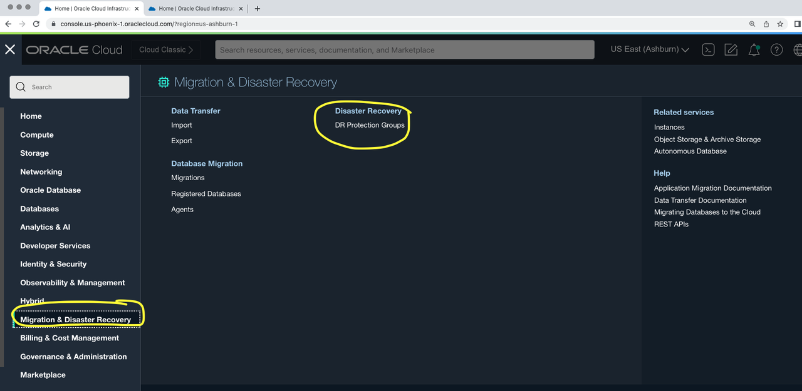
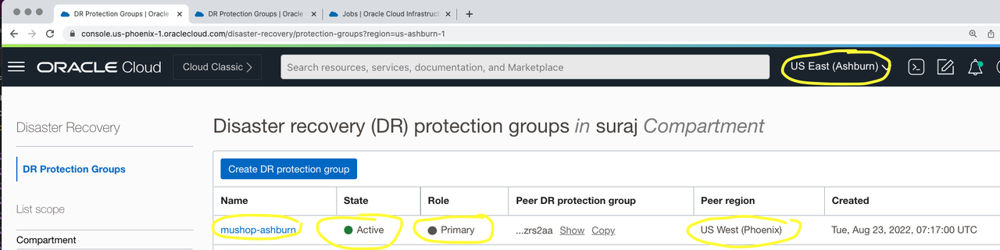
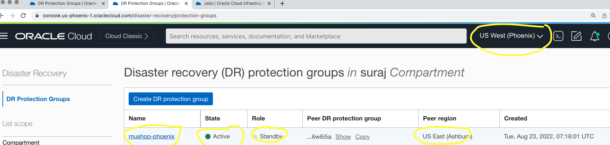

# Add members to the DR Protection groups

## Introduction

In this lab, we will add members to the DR Protection groups which was created and associated in previous lab. Ashburn is primary region and Phoenix is standby region.

Estimated Lab Time: 10 Minutes

Watch the video below for a quick walk through of the lab.

### Objectives

- Add members to Ashburn DRPG (Primary)
- Add members to Phoenix DRPG (Standby)

## Task 1: Add members to Ashburn DRPG (Primary)

<if type="livelabs">

1. Login into OCI Console with your provided Credentials. Primary region should be **Ashburn**.

  

  Open another browser tab and select region as **Phoenix** (Standby Region)

  

2.From the Hamburger menu, select **Migration and Disaster Recovery**, then **Disaster Recovery Protection Groups**.Verify the region in **Ashburn**

  

3.From the Hamburger menu, select **Migration and Disaster Recovery**, then **Disaster Recovery Protection Groups**.Verify the region in **Phoenix**

  

4.You will land up in the Disaster Recovery Protection group home page, make sure to have two tabs opened for Ashburn and Phoenix region.

  
  

5. In the Ashburn region DRPG page,add the members required in the **muhsop-ashburn** DRPG. *We will be adding ATP Primary Database, two mushop compute VM's, two volume groups for the boot volumes of mushop compute VM's*. Let's add those details. 

  a. Add ATP Primary Database 
   
- We will be adding ATP Primary Database, two mushop compute VM's, two volume groups for the boot volumes of mushop compute VM's.
- Enter name as **muhsop-ashburn**
- Select the compartment assigned to you
- In the object storage bucket, use the drop down option and select **mushop-xxxxx** (mushop-12345)
- In role, leave it as non configured
- Ignore add member
- Verify and hit create

  

Navigate back to DR Protection group page, the state of DRPG will change from creating to active in few seconds.

  

6. Create DRPG in the Phoenix region. Select Create DR Protection group in the Phoenix region browser tab and follow the below instructions.

- Enter name as **muhsop-phoenix**
- Select the compartment assigned to you
- In the object storage bucket, use the drop down option and select **mushop-xxxxx** (mushop-12345)
- In role, leave it as non configured
- Ignore add member
- Verify and hit create

  

Navigate back to DR Protection group page, the state of DRPG will change from creating to active in few seconds.

  

## Task 2:Associate Ashburn DRPG as primary and Phoenix DRPG as Standby

1.From the Ashburn region OCI console, select **mushop-ashburn** DRPG. Select **Associate** button 

  

- Select Role as **Primary**
- Select Peer Region as **US West (Phoenix)**, 
- Select Peer DR Protection group in compartment (change assigned compartment if required), you should select **mushop-phoenix**
- Verfiy and associate

  

 **mushop-ashburn** DRPG will change to *Updating* state 
 
  

 Navigate back to DR Protection group home page.You should be able to see DRPG **mushop-ashburn** state as *Active*, role as *Primary*, peer region as *US West (Phoenix)*

   

2.From the Phoenix region OCI console, navigate to DR Protection group home page.You should be able to see DRPG **mushop-phoenix** state as *Active*, role as *Standby*, peer region as *US East (Ashburn)*

   

Now, we have associated **mushop-ashburn** as *Primary DRPG* and **mushop-phoenix**  as *Standby DRPG*

This concludes Lab 2. Now you can move to Lab 3.

## Acknowledgements

- **Author** -  Suraj Ramesh, Principal Product Manager
- **Last Updated By/Date** -  Suraj Ramesh,August 2022
