# Add members to the DR Protection groups

## Introduction

In this lab, we will add members to the DR Protection groups which was created and associated in previous lab. Ashburn is primary region and Phoenix is standby region.

Estimated Lab Time: 10 Minutes

Watch the video below for a quick walk through of the lab.

### Objectives

- Add members to Ashburn DRPG (Primary)
- Add members to Phoenix DRPG (Standby)

## Task 1: Add members to Ashburn DRPG (Primary)

<if type="livelabs">

1. Login into OCI Console with your provided Credentials. Primary region should be **Ashburn**.

  

2. From the Hamburger menu, select **Migration and Disaster Recovery**, then **Disaster Recovery Protection Groups**.Verify the region in **Ashburn**

  

3. You will land up in the Disaster Recovery Protection group home page, make sure you have selected *Ashburn* region.

  

4. In the Ashburn region DRPG page,add the members required in the **muhsop-ashburn** DRPG. *We will be adding ATP Primary Database, two mushop compute VM's, two volume groups for the boot volumes of mushop compute VM's*. Let's add those details. 

5. Add ATP Primary Database. Select **muhsop-ashburn** DRPG, navigate to **Members** in the *Resources* section and hit **Add Member**

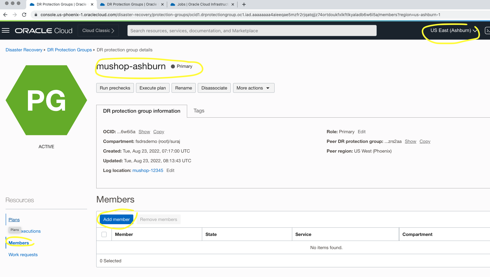 

It will show various resource types and select **Autonomous Database**
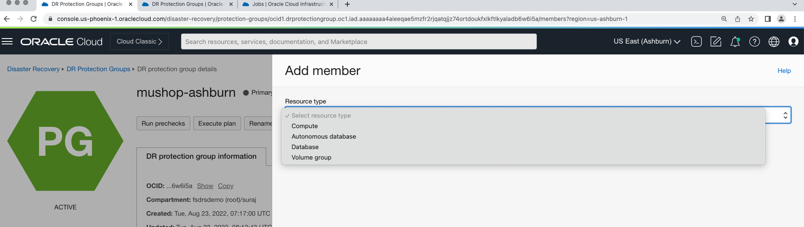

Select the Database in your compartment, it will have MushopDB-XXXXX. Verify it and hit add. Make sure to check the box **"I understand that all existing plans will be deleted"**

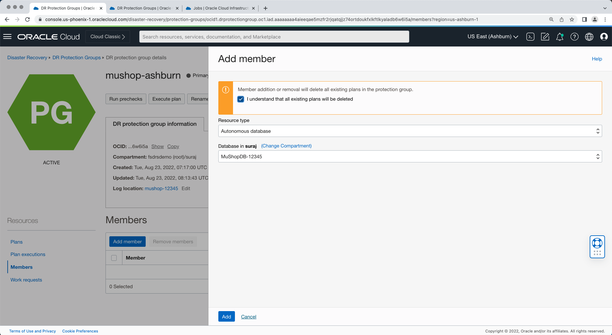 

**muhsop-ashburn** DRPG status will change to updating, wait for few seconds. You should be able to see ATP database has been added as member. Refresh the DRPG page if required. You can monitor the status of the request in **Work requests* section under Resources. 

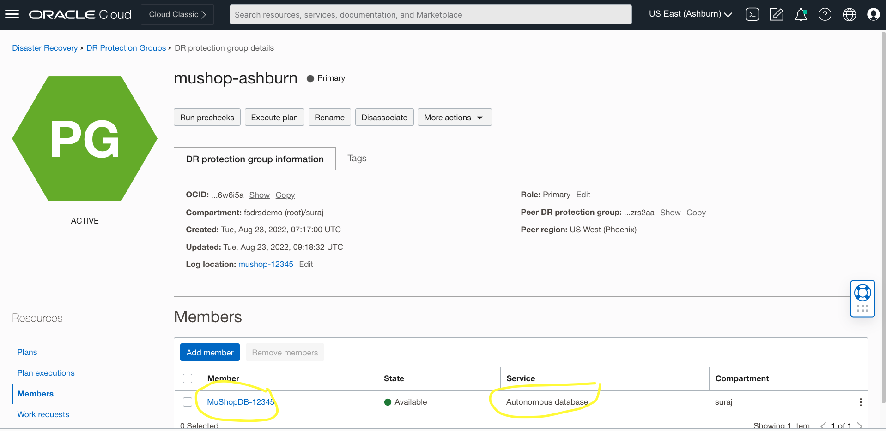 

Navigate back to DR Protection group page, status of DRPG should be active.

6.Add first Compute instance. We need to add **mushop-xxxxx-0**

Select **muhsop-ashburn** DRPG, navigate to **Members** in the *Resources* section and hit **Add Member**

 

It will show various resource types and select **Compute**

- Resource type as Compute
- Make sure to check the box **"I understand that all existing plans will be deleted"**
- Instances in Compartment, select *mushop-xxxxx-0*
- Click check mark in the Move instance on switchover or failover. 
- Destination compartment, select your compartment name
- Ignore Destination dedicated VM host section
- Click Add VNIC mapping. This will pop up inputs for Add VNIC mapping
- Select VNIC as *primarynic*
- Destination subnet as *mushop-main-xxxxx*
- Ignore Network security groups
- Click Add

  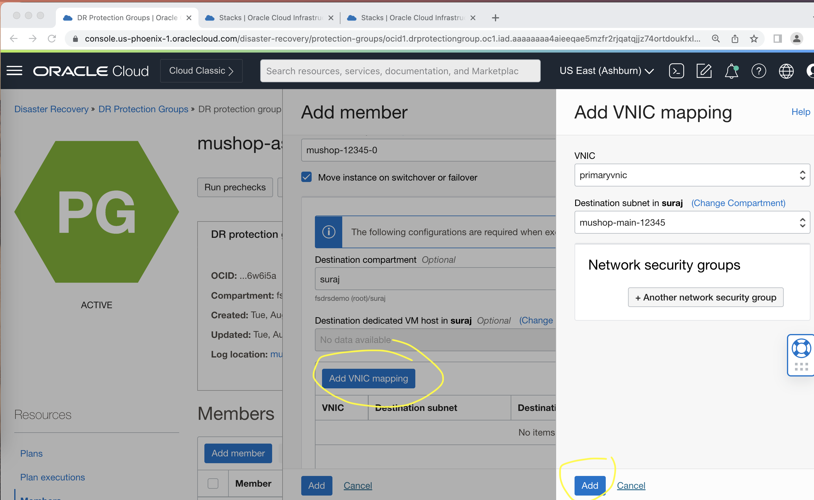

- You should be able to able to add VNIC details, verify and click Add

  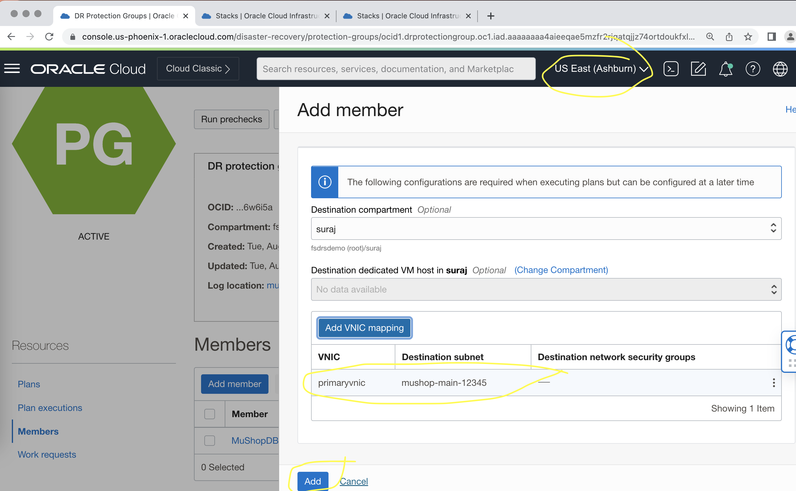

**muhsop-ashburn** DRPG status will change to updating, wait for few seconds. DRPG status will change to active.You should be able to see compute instance **mushop-xxxxx-0** has been added as member. Refresh the DRPG page if required. You can monitor the status of the request in *Work requests* section under Resources. 

  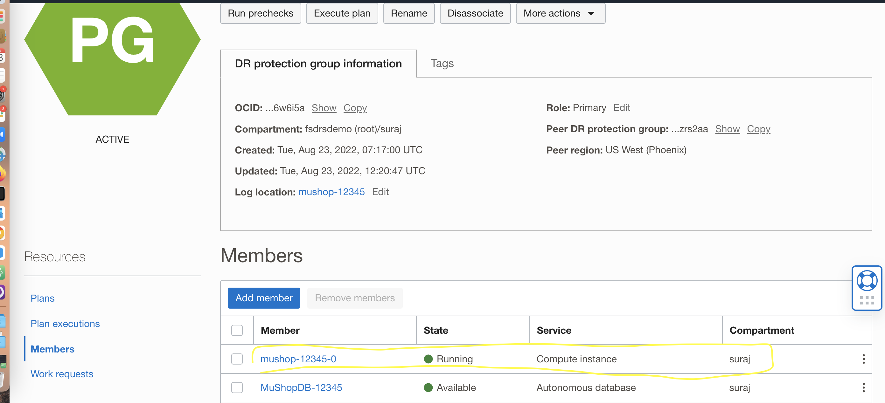

7. Add second Compute instance. We need to add **mushop-xxxxx-1**

Select **muhsop-ashburn** DRPG, navigate to **Members** in the *Resources* section and hit **Add Member**

 

It will show various resource types and select **Compute**

- Resource type as Compute
- Make sure to check the box **"I understand that all existing plans will be deleted"**
- Instances in Compartment, select *mushop-xxxxx-1*
- Click check mark in the Move instance on switchover or failover. 
- Destination compartment, select your compartment name
- Ignore Destination dedicated VM host section
- Click Add VNIC mapping. This will pop up inputs for Add VNIC mapping
- Select VNIC as *primarynic*
- Destination subnet as *mushop-main-xxxxx*
- Ignore Network security groups
- Click Add

  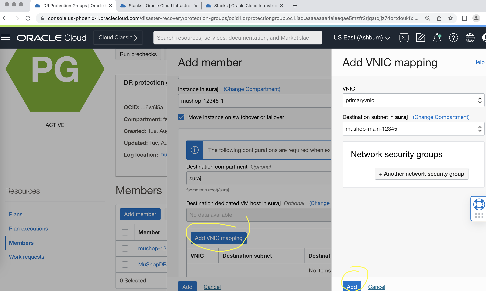

- You should be able to able to add VNIC details, verify and click Add

  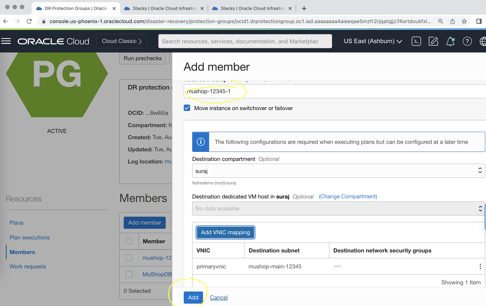

**muhsop-ashburn** DRPG status will change to updating, wait for few seconds. DRPG status will change to active.You should be able to see compute instance **mushop-xxxxx-1** has been added as member. Refresh the DRPG page if required. You can monitor the status of the request in **Work requests* section under Resources. 

  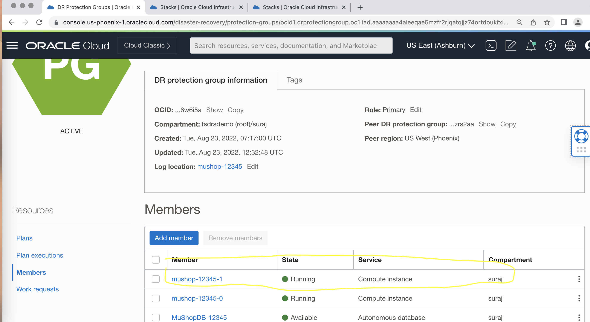

8. Add first volume group. We need to add **mushop-volume-group-0**. This volume group consists of boot volume of mushop-xxxx-0 VM and it has cross region replication configured to phoenix region. 

Select **muhsop-ashburn** DRPG, navigate to **Members** in the *Resources* section and hit **Add Member**

 

It will show various resource types and select **Volume group**

- Resource type as Volume group
- Make sure to check the box **"I understand that all existing plans will be deleted"**
- Select volume group **mushop-volume-group-0**
- Verify and add

  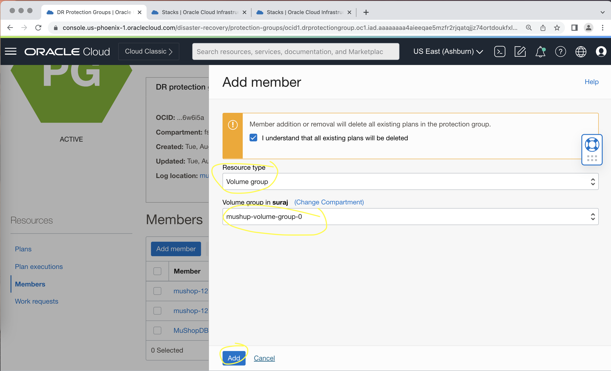

**muhsop-ashburn** DRPG status will change to updating, wait for few seconds. DRPG status will change to active.You should be able to see volume group **mushop-volume-group-0** has been added as member. Refresh the DRPG page if required. You can monitor the status of the request in **Work requests* section under Resources. 

  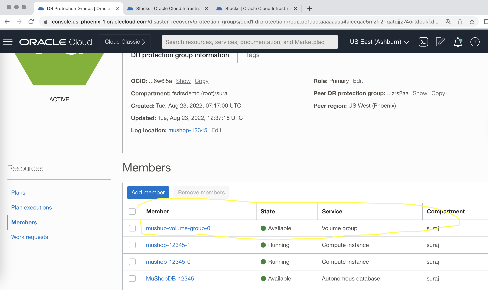

9. Add second volume group. We need to add **mushop-volume-group-1**. This volume group consists of boot volume of mushop-xxxx-1 VM and it has cross region replication configured to phoenix region. 

Select **muhsop-ashburn** DRPG, navigate to **Members** in the *Resources* section and hit **Add Member**

 

It will show various resource types and select **Volume group**

- Resource type as Volume group
- Make sure to check the box **"I understand that all existing plans will be deleted"**
- Select volume group **mushop-volume-group-1**
- Verify and add

  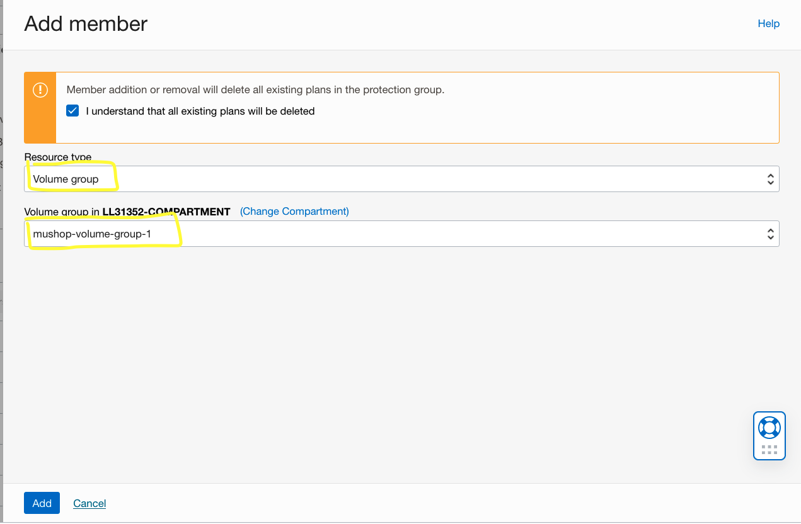

**muhsop-ashburn** DRPG status will change to updating, wait for few seconds. DRPG status will change to active.You should be able to see volume group **mushop-volume-group-1** has been added as member. Refresh the DRPG page if required. You can monitor the status of the request in **Work requests* section under Resources. 

   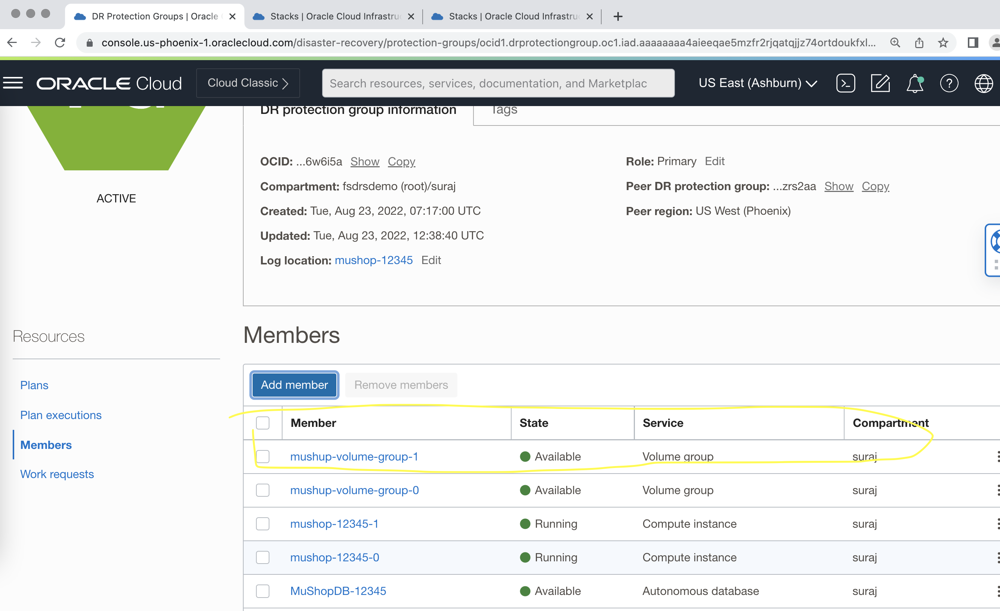

10. Now we have added all the required members in the **muhsop-ashburn** DRPG . It should show ATP Database, 2 Compute Instances and 2 Volume groups.

    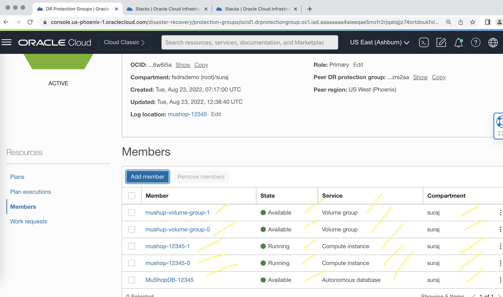

## Task 2: Add members to Phoenix DRPG (Standby)

<if type="livelabs">

1. Login into OCI Console with your provided Credentials. Standby region should be **Pheonix**.

  

2. From the Hamburger menu, select **Migration and Disaster Recovery**, then **Disaster Recovery Protection Groups**.Verify the region is **Phoenix**

  

3. You will land up in the Disaster Recovery Protection group home page, make sure you have selected the Phoenix region.

  

4. In the Phoenix region DRPG page,add the members required in the **muhsop-phoenix** DRPG. *We will be adding only ATP Primary Database*. Let's add those details.  **We dont need to add compute and volume groups, as those will be created automatically during the DR switchover process by FSDRS** 

6. Add ATP Primary Database. Select **muhsop-phoenix** DRPG, navigate to **Members** in the *Resources* section and hit **Add Member**

 

It will show various resource types and select **Autonomous Database**
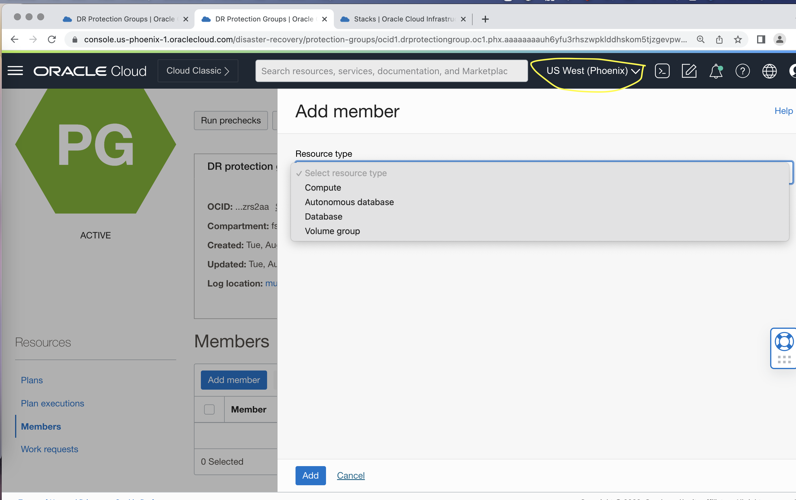

Select the Database in your compartment, it will have **MushopDB-XXXXX**. Verify it and hit add. Make sure to check the box **"I understand that all existing plans will be deleted"**

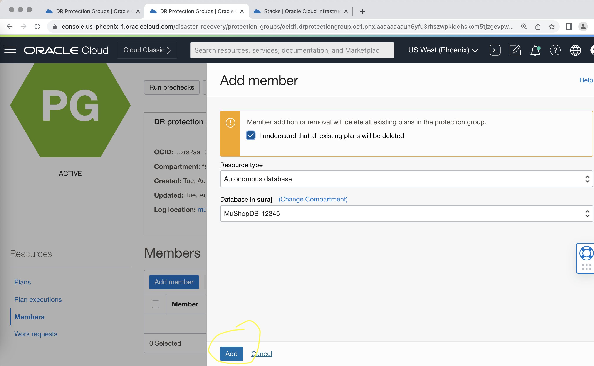 

**muhsop-phoenix** DRPG status will change to updating, wait for few seconds. You should be able to see ATP database has been added as member. Refresh the DRPG page if required. You can monitor the status of the request in **Work requests* section under Resources. 

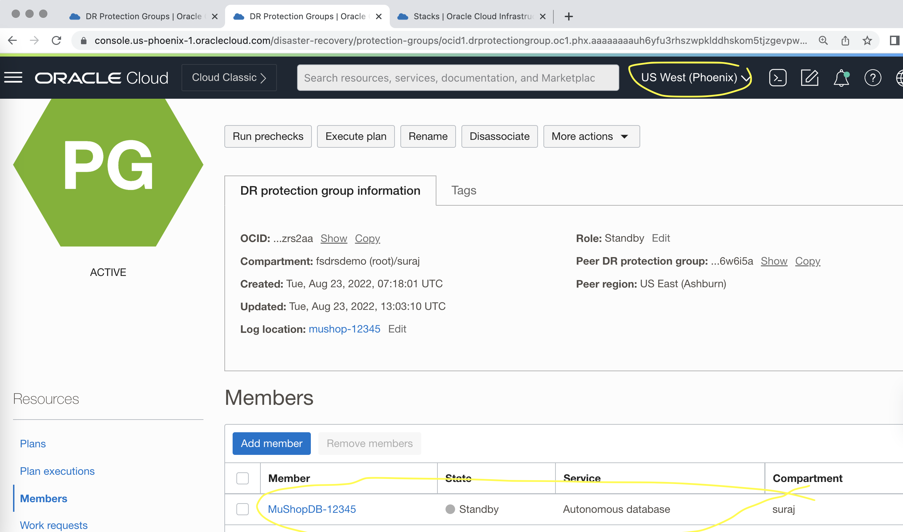 

Navigate back to DR Protection group page, status of DRPG should be active.

7. Now we have added all the required member in the **muhsop-ashburn** DRPG . It should show ATP Database.

    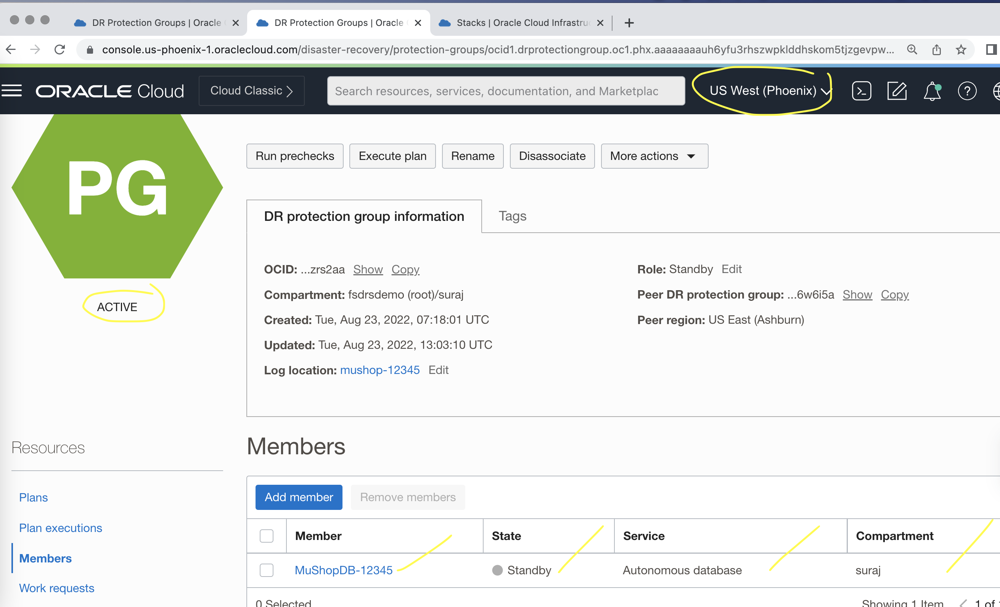

This concludes Lab 3. Now you can move to Lab 4.

## Acknowledgements

- **Author** -  Suraj Ramesh, Principal Product Manager
- **Last Updated By/Date** -  Suraj Ramesh,August 2022
