# Add members to the DR Protection groups

## Introduction

In this lab, we will add members to the DR Protection groups created and associated in the previous lab. Ashburn is a primary region, and Phoenix is the standby region. This is an optional lab, in case if you want to destroy all the OCI resources.

**Members**- A resource type which can be added to a DRPG. Full Stack DR currently supports all the below member types. These resources can be added as member to a DRPG.

- Compute ( Standard Compute and Dedicated VM Host (DVH))
- Block Storage (Volume Groups)
- Oracle Autonomous Database Serverless (ADB-S)
- Oracle Autonomous Database on Dedicated Exadata Infrastructure (ADB-D)
- Autonomous Database on Exadata Cloud@Customer (ADB-C@C)
- Oracle Base Database Service (BaseDB/DBCS)
- Oracle Exadata Database Service on Dedicated Infrastructure (ExaDB-D/ExaCS)
- Oracle Exadata Database Service on Cloud@Customer (ExaCC)
- Oracle Exadata Database Service on Exascale Infrastructure (ExaDB-XS)
- Load Balancer and Network Load Balancer 
- File Storage Service
- Object Storage Bucket
- Oracle Kubernetes Engine (OKE)

**Estimated Time**: 15 Minutes

### Objectives

- Add members to Ashburn DRPG (Primary)- ATP(Primary DB),MuShop Compute VM's(node-0 and node-1),two volume groups( Boot volumes of MuShop Compute VM's), Load Balancer
- Add members to Phoenix DRPG (Standby)-ATP(Standby DB), Load Balancer

As part of the MuShop architecture,Virtual machines are deployed as Cold VM or Pilot light pattern.Full Stack DR will create the MuShop VM's in the phoenix region during the Switchover.

## Task 1: Add members to Ashburn DRPG (Primary)

1.  Login into OCI Console with your Credentials. The primary region should be **Ashburn**.

    
    
2. Open the **Hamburger menu (☰)** and select **Migration and Disaster Recovery**. Then go to **Disaster Recovery → DR Protection Groups** and Confirm that the **region is set to Ashburn**.

    

3.  You will land on the Disaster Recovery Protection group home page; make sure you have selected *the Ashburn* region.

    

4. In the **Ashburn region**, open the **mushop-ashburn-xxxxx** DR Protection Group page.Add the following members:

    - **Autonomous Transaction Processing (ATP) Primary Database**
    - **Two mushop Compute VMs**
    - **Two Volume Groups** (for the boot volumes of the mushop Compute VMs)
    - **Load Balancer**

> 💡 Tip: Ensure each resource is added from the correct compartment and region.

5.  Add ATP Primary Database to DRPG.In the **Ashburn region**, open the **mushop-ashburn-xxxxx** DR Protection Group. Navigate to **Members** tab.
Click **Add Member** to begin adding resources.

    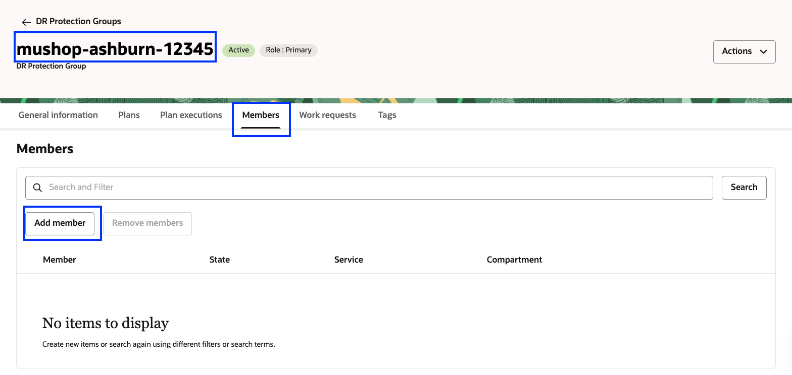

-   It will show various resource types and select **Autonomous Database**
    
    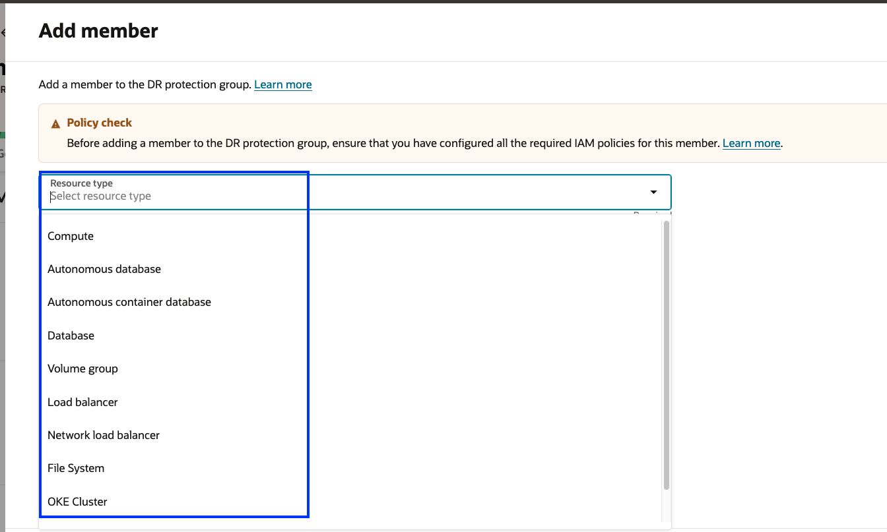

-   Select the Database in your compartment; it will have MushopDB-XXXXX. This is the primary ATP database.
    
-   Default option for standby type of DR Drill is "Refreshable clone", so we will select this.

-   Leave the remaining values as default

-  Verify it and click add. Make sure to check the box **"I understand that I must referesh and verify all the existing plans"**

    

-   **mushop-ashburn-xxxxx** DRPG status will change to updating; wait for a few seconds. You should see that the ATP database is added as a member. Refresh the DRPG page if required. You can monitor the request's status in the **Work requests** tab and select the latest **Update DR protection group** operation.

    

    Navigate back to the DR Protection group page; the status of DRPG should be active. In case if you don't see the ATP DB member, add it again.

6.  Add first Compute instance **mushop-xxxxx-0** as member,select **mushop-ashburn** DRPG, Navigate to **Members** tab. Click **Add Member** to begin adding resources.

    It will show various resource types and select **Compute**
    

    - Resource Type as **Compute**
    - Make sure to check the box **"I understand that I must referesh and verify all the existing plans"**
    - Instances in Compartment, select **mushop-xxxxx-0**
    - Compute instance type, select **Moving instance**
    - Click Add VNIC mapping. This will pop up inputs for Add VNIC mapping

    

    - Select VNIC as *primaryvnic*
    - Destination subnet as *mushop-main-xxxxx (regional)*
    - No need to input any values for *Destination reserved public ip*, *Destination primary private IP address*,*Destination primary private IP hostname label*
    - Ignore Network security groups
    - Click Add

    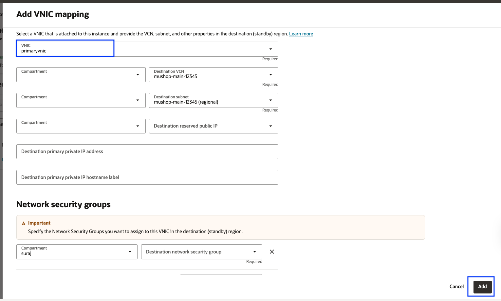

    - You should be able to see the added VNIC details, verify and click Add

    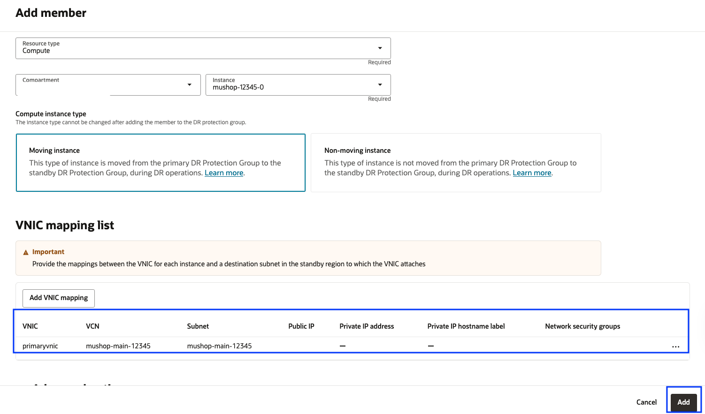

    **mushop-ashburn-xxxxx** DRPG status will change to updating; wait for a few seconds. DRPG status will change to active.You should be able to see that compute instance **mushop-xxxxx-0** has been added as a member. Refresh the DRPG page if required. You can monitor the request's status in the **Work requests** tab and select the latest **Update DR protection group** operation.

    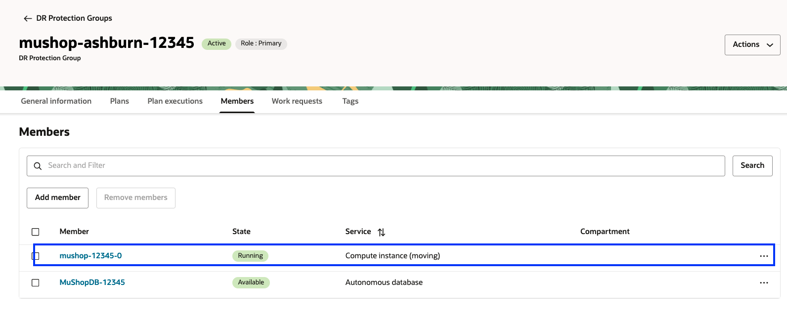

    Navigate back to the DR Protection group page; the status of DRPG should be active.

7.  Add second Compute instance **mushop-xxxxx-1** as member,select **mushop-ashburn** DRPG.Navigate to **Members** tab.Click **Add Member** to begin adding resources.

    It will show various resource types and select **Compute**
    

    - Resource Type as **Compute**
    - Make sure to check the box **"I understand that I must referesh and verify all the existing plans"**
    - Instances in Compartment, select **mushop-xxxxx-1**
    - Compute instance type, select **Moving instance**
    - Click Add VNIC mapping. This will pop up inputs for Add VNIC mapping

    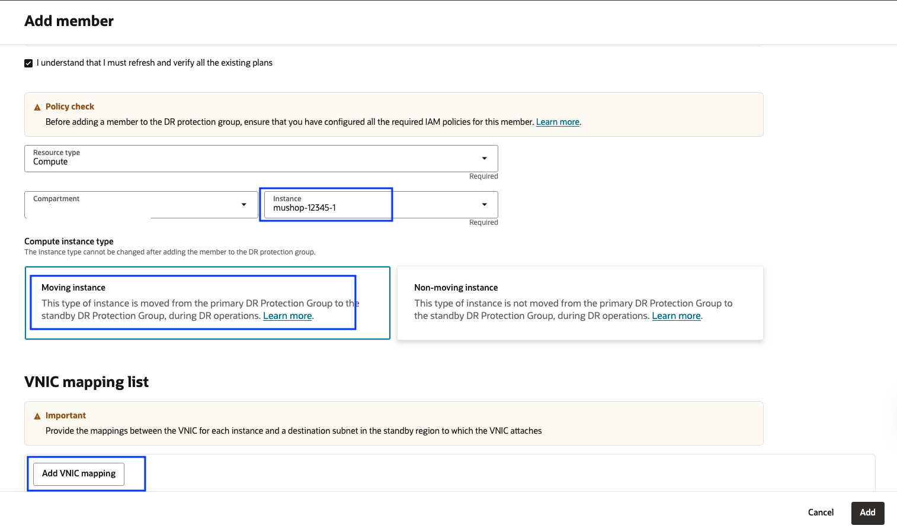

    - Select VNIC as *primaryvnic*
    - Destination subnet as *mushop-main-xxxxx (regional)*
    - No need to input any values for *Destination reserved public ip*, *Destination primary private IP address*,*Destination primary private IP hostname label*
    - Ignore Network security groups
    - Click Add

    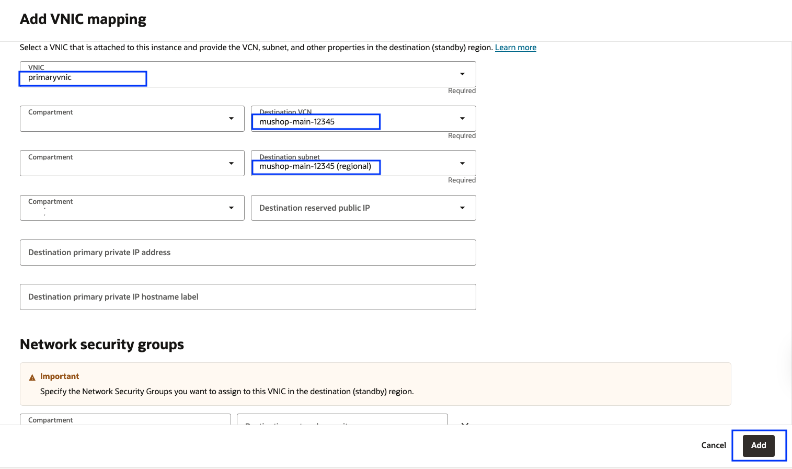

    - You should be able to see the added VNIC details, verify and click Add

    

    **mushop-ashburn-xxxxx** DRPG status will change to updating; wait for a few seconds. DRPG status will change to active.You should be able to see that compute instance **mushop-xxxxx-1** has been added as a member. Refresh the DRPG page if required. You can monitor the request's status in the **Work requests** tab and select the latest **Update DR protection group** operation.

    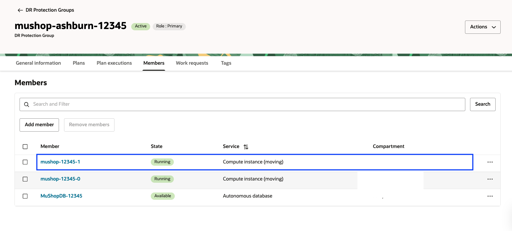

    Navigate back to the DR Protection group page; the status of DRPG should be active.

8.  Add the first volume group  **mushop-volume-group-0**. This volume group consists of the boot volume of mushop-xxxx-0 VM and has cross-region replication configured to the phoenix region.

    Select **mushop-ashburn-xxxxx** DRPG, Navigate to **Members** tab.Click **Add Member** to begin adding resources.

    It will show various resource types and select **Volume group**
    

    - Resource Type as **Volume group**
    - Make sure to check the box **"I understand that I must referesh and verify all the existing plans"**
    - Select volume group **mushop-volume-group-0**
    - Leave the remaining values as default
    - Verify and add

    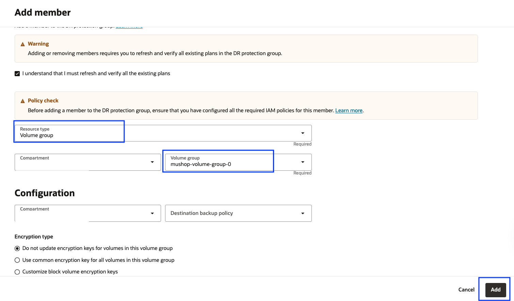

    **mushop-ashburn-xxxxx** DRPG status will change to updating; wait for a few seconds. DRPG status will change to active.You should be able to see that volume group **mushop-volume-group-0** has been added as a member. Refresh the DRPG page if required. You can monitor the request's status in the **Work requests** tab and select the latest **Update DR protection group** operation.

    

    Navigate back to the DR Protection group page; the status of DRPG should be active.

9. Add the second volume group **mushop-volume-group-1**. This volume group consists of the boot volume of mushop-xxxx-1 VM and has cross-region replication configured to the phoenix region.

    Select **mushop-ashburn-xxxxx** DRPG, Navigate to **Members** tab.Click **Add Member** to begin adding resources.

    It will show various resource types and select **Volume group**
    

    - Resource Type as **Volume group**
    - Make sure to check the box **"I understand that I must referesh and verify all the existing plans"**
    - Select volume group **mushop-volume-group-1**
    - Leave the remaining values as default
    - Verify and add

    

    **mushop-ashburn-xxxxx** DRPG status will change to updating; wait for a few seconds. DRPG status will change to active.You should be able to see that volume group **mushop-volume-group-1** has been added as a member. Refresh the DRPG page if required. You can monitor the request's status in the **Work requests** tab and select the latest **Update DR protection group** operation.

    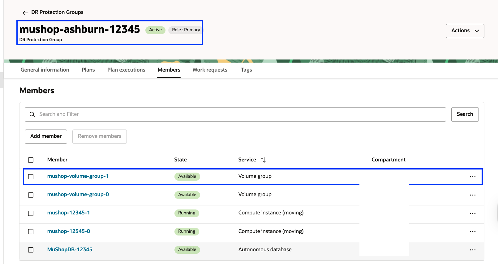

    Navigate back to the DR Protection group page; the status of DRPG should be active.

10. Add **Load Balancer** as member.

    It will show various resource types and select **Load Balancer**
    
     
    - Resource Type as **Load balancer**
    - Make sure to check the box **"I understand that I must referesh and verify all the existing plans"**
    - Select Load balancer **mushop-xxxxx**
    - Select Destination load balancer **mushop-xxxxx**
    - Select Source backend set **mushop-iad-xxxxx**
    - Select Destination backend set **mushop-phx-xxxxx**
    - Leave the remaining values as default
    - Verify and add

    

    **mushop-ashburn-xxxxx** DRPG status will change to updating; wait for a few seconds. You should see that the Load Balancer is added as a member. Refresh the DRPG page if required. You can monitor the request's status in the **Work requests** tab and select the latest **Update DR protection group** operation.

    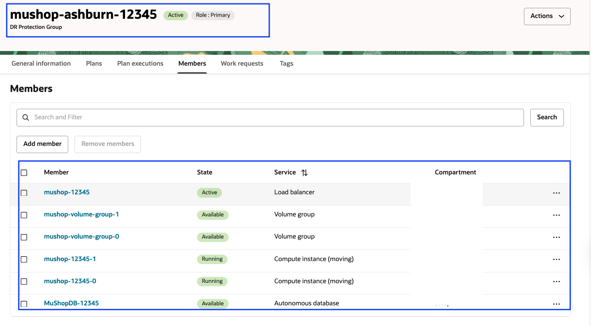

    Navigate back to the DR Protection group page; the status of DRPG should be active. In case if you don't see the Load Balancer member, add it again.

10. We have added all the required members in the **mushop-ashburn-xxxxx** DRPG. It should show a ATP Database, two Compute Instances, two Volume groups and a Load Balancer.DRPG status should show as active.

    

## Task 2: Add members to Phoenix DRPG (Standby)

1.  Login into OCI Console with your provided Credentials. The Standby region should be **Phoenix**.

    

2. Open the **Hamburger menu (☰)** and select **Migration and Disaster Recovery**. Then go to **Disaster Recovery → DR Protection Groups** and Confirm that the **region is set to Phoenix**.

    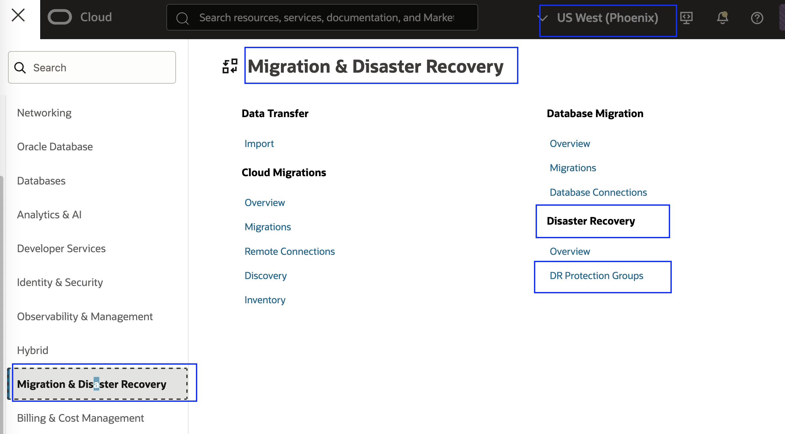

3.  You will land on the Disaster Recovery Protection group home page; make sure you have selected the Phoenix region.

    

4. On the **Phoenix region** DRPG page, add the required members to the **mushop-phoeni-xxxxxx** DRPG:

   - Add **ATP Standby Database**
   - Add **Load Balancer**

   > ℹ️ No need to add **Compute** and **Volume Groups**, as the VMs follow a **cold DR pattern** and will be automatically created during the DR plan execution by **Full Stack DR**.

6.  Add ATP Standby Database. Select **mushop-phoenix-xxxxx** DRPG. Navigate to **Members** tab.
Click **Add Member** to begin adding resources.

    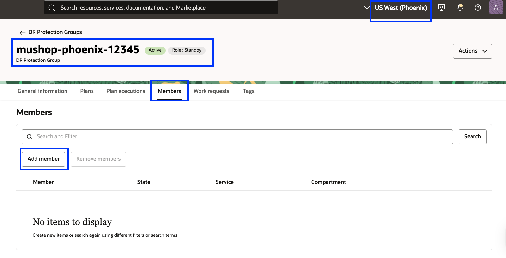

-   It will show various resource types and select **Autonomous Database**
    

-   Select the Database in your compartment; it will have MushopDB-XXXXX. This is the standby ATP database.
    
-   Default option for standby type of DR Drill is "Refreshable clone", so we will select this.

-   Leave the remaining values as default

-  Verify it and click add. Make sure to check the box **"I understand that I must referesh and verify all the existing plans"**

    

    **mushop-phoenix-xxxxx** DRPG status will change to updating; wait for a few seconds. You should be able to see ATP database has been added as Member. Refresh the DRPG page if required. You can monitor the status in the *Work requests* section under Resources.

    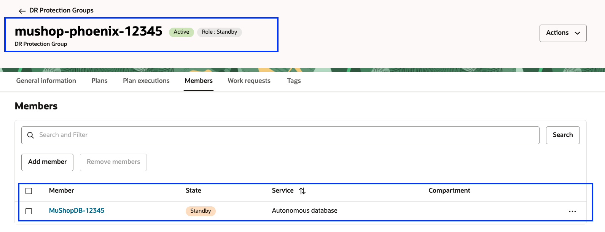

    Navigate back to the DR Protection group page; the status of DRPG should be active.

7. Add **Load Balancer** as member.

    It will show various resource types and select **Load Balancer**
    
     
    - Resource Type as **Load balancer**
    - Make sure to check the box **"I understand that I must referesh and verify all the existing plans"**
    - Select Load balancer **mushop-xxxxx**
    - Select Destination load balancer **mushop-xxxxx**
    - Select Source backend set **mushop-phx-xxxxx**
    - Select Destination backend set **mushop-iad-xxxxx**
    - Leave the remaining values as default
    - Verify and add

    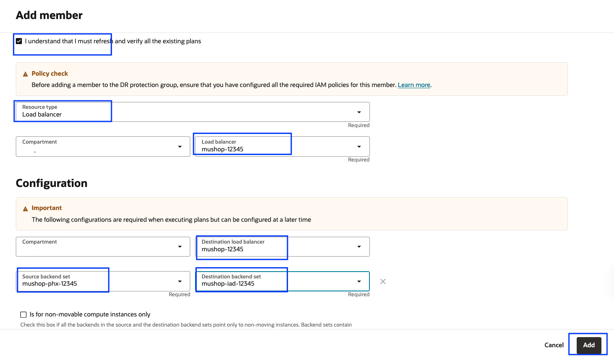

    **mushop-phoenix-xxxxx** DRPG status will change to updating; wait for a few seconds. You should see that the Load Balancer is added as a member. Refresh the DRPG page if required. You can monitor the request's status in the **Work requests** tab and select the latest **Update DR protection group** operation.

    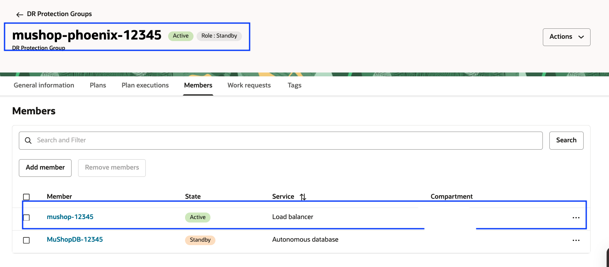

    Navigate back to the DR Protection group page; the status of DRPG should be active. In case if you don't see the Load Balancer member, add it again.

8.  Now, we have added all the required members in the **mushop-phoenix-xxxxx** DRPG. It should show ATP Database and Load Balancer. DRPG status will show as active.

    

    You may now [Proceed to the next lab](#next)

## Troubleshooting Tips

1. If a member doesn't appear after adding, try **re-adding the member**.
2. Check the **Work Request** status and review any **error messages** for further details.

## Acknowledgements

- **Author** - Suraj Ramesh, Principal Product Manager,Oracle Database High Availability (HA), Scalability and Maximum Availability Architecture (MAA)
- **Last Updated By/Date** -  Suraj Ramesh, July 2025
