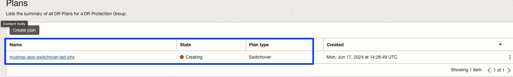
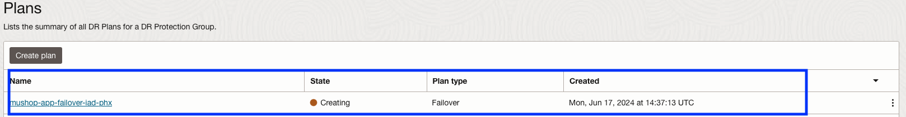
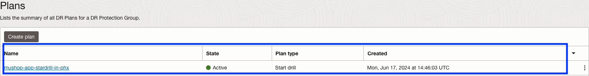
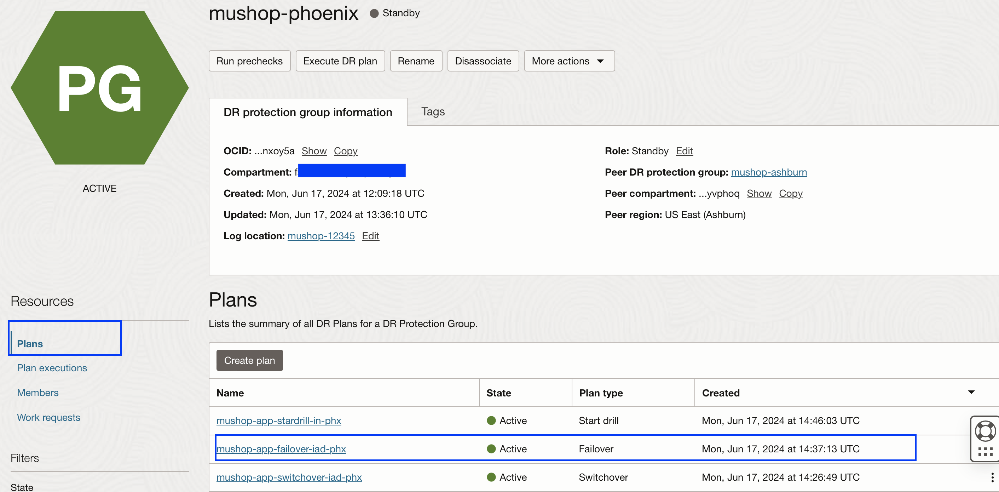
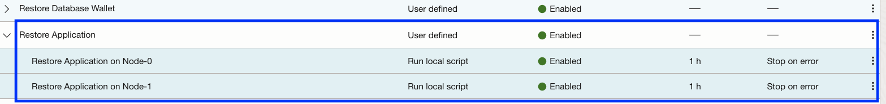

# Create DR plans and customize Failover plan

## Introduction

In this lab, we will focus on how to create switchover, failover, and start drill plans. We will also customize the failover plan according to MuShop application requirements. The Full Stack DR service does not allow the creation of DR plans in the DRPG with a **Primary** role (Ashburn). All DR plans must be created in the DRPG with a **standby** role (Phoenix). 

**DR Plans**- A DR Plan represents a DR workflow associated with a pair of DR Protection Groups. A DR Plan is represented as a sequence of Plan Groups. These Plan Groups in turn consist of Plan Steps. A DR Plan can only be created at the Standby DR Protection Group.

There are four types of DR plans which you can create in Full Stack DR.

- Switchover Plan:Used for planned and controlled transition of services from a primary to a standby region. It involves shutting down services in the primary region and bringing them up in the standby region. 
- Failover Plan: Used for unplanned recovery during disasters or outages. It immediately activates services in the standby region whenever the primary is entirely inaccessible.
- Drill Plans: Performing DR drills is an essential DR service capability that allows users to exercise and validate their business continuity configuration and plans without disrupting their production stack.
    - Start Drill: It creates a replica of your production stack without impacting production.Perform a complete dry run of a failover for validation
    - Stop Drill: Removes the replica of your production stack created earlier by Start drill.
 
**Plan Group** – A group of steps in a DR Plan. A DR Plan consists of one or more Plan Groups that execute sequentially. All steps in a Plan Group execute in parallel. 

There are two types of plan groups

- Built-In Groups or Steps – A type of Plan Group or Step that is generated automatically by FSDR when a DR Plan is created. Examples of Built-in Plan Steps are: Launch Compute Instance, Switchover Database, etc.

- User-Defined Groups or Steps– A type of Plan Group or Step that is added by the user to a DR Plan after the DR plan is created by FSDR. 

Estimated Time: 20 Minutes

Watch the video below for a quick walk-through of the lab.
[Creation of DR plans](videohub:1_i7lcn5q9)

### Objectives

- Create Switchover,Failover and Start drill plans
- Customize the failover plan- Restore Database Wallet group
- Customize the failover plan- Restore the Application Group
- Verify the failover plan and plan groups

## Task 1: Create Switchover,Failover and Start drill plans

1.  Login into OCI Console with your provided Credentials. Select region as **Phoenix**.

    

2.  Select Migration and Disaster Recovery from the Hamburger menu, then **Disaster Recovery** -> **DR Protection Groups**. Verify the region is **Phoenix**

    

3.  You will land on the Disaster Recovery Protection group home page; make sure you have selected the Phoenix region. **DR Plans always be created in the Standby DRPG (Phoenix region)**

    

4.  Select the **mushop-phoenix** DRPG and navigate to Plans under the resources section.

    

5.  Create Switchover plan. 

    - Create plan
    - Name as **mushop-app-switchover-iad-phx**
    - Plan type as **Switchover (planned)**
    - Hit Create

    

    The plan will start creating; select the plan **mushop-app-switchover-iad-phx**.

    

    Refresh the DR Plan page if required. You can monitor the request's status in the **Work requests** section under Resources. Within a minute, the plan will get created, and it should be in *active* State.

    

6.  Create Failover plan.

    - Create plan
    - Name as **mushop-app-failover-iad-phx**
    - Plan type as **Failover (unplanned)**
    - Hit Create

    

    The plan will start creating; select the plan **mushop-app-failover-iad-phx**.

    

    Refresh the DR Plan page if required. You can monitor the request's status in the **Work requests** section under Resources. Within a minute, the plan will get created, and it should be in *active* State.

    

7.  Create Start drill plan.

    - Create plan
    - Name as **mushop-app-stardrill-in-phx**
    - Plan type as **Start drill**
    - Hit Create

    

    The plan will start creating; select the plan **mushop-app-stardrill-in-phx**.

    

    Refresh the DR Plan page if required. You can monitor the request's status in the **Work requests** section under Resources. Within a minute, the plan will get created, and it should be in *active* State.

    

8.  In case if you try to create Stop drill plan, you will get a warning "**A stop drill plan can only be created after executing a start drill and the DR protection group is in inactive state**". Since we have not executed the start drill plan yet, it is not possible to create a stop drill plan as this moment.

    

9.  Select the **mushop-app-switchover-iad-phx** plan, and you should be able to various built-in plan groups.

    

10. Select the **mushop-app-failover-iad-phx** plan, and you should be able to various built-in plan groups.

    

11. Select the **mushop-app-stardrill-in-phx** plan, and you should be able to various built-in plan groups.

    

12. Full Stack DR will create the built-in plan groups depending on the members and type of DR plans. Summary of various built-in groups created by Full Stack DR.

    

13. For the rest of the tutorial, we are going to use **mushop-app-failover-iad-phx** plan. Based on the requirements, you can add respective user-defined plan groups for other DR plans.

## Task 2: Customize the Failover plan-Restore Database Wallet group

1. From the Plans section, select **mushop-app-failover-iad-phx** plan.

    

2.  Create a user-defined group for **Restore Database Wallet**.This can be done by selecting **Add group** in the *mushop-app-failover-iad-phx* plan

    

2.  Add **Restore Database Wallet** in the Group name, select **Add after** radio button, select **Load Balancers - Update Destination Backend Sets** in the Group and Click **Add Step**

    

    - Add *Restore Database Wallet on Node-0* in Step name
    - In the region, select "US East (Ashburn)"
    - Select the "Run local script" option
    - Select "mushop-xxxxx-0" instance in "Target instance in compartment"
    - In script parameters, add the below script

    ````
    <copy>/usr/bin/sudo /home/opc/fsdrsscripts/mushop_db_wallet_restore.sh phoenix</copy>
    ````
    - Leave the field blank in "Run as user"
    - Select Error mode as "Stop on error."
    - Leave the default "3600" seconds in Timeout in seconds
    - Leave the enable step tick mark
    - Verify all the details and hit Add Step
    
    

    - Verify the step has been added successfully for Node-0

    

4.  Add step for *Restore Database Wallet on Node-1*

    

    - Add *Restore Database Wallet on Node-1* in Step name
    - In the region, select "US East (Ashburn)"
    - Select the "Run local script" option
    - Select "mushop-xxxxx-1" instance in "Target instance in compartment"
    - In script parameters, add the below script

    ````
    <copy>/usr/bin/sudo /home/opc/fsdrsscripts/mushop_db_wallet_restore.sh phoenix</copy>
    ````
    - Leave the field blank in "Run as user"
    - Select Error mode as "Stop on error."
    - Leave the default "3600" seconds in Timeout in seconds
    - Leave the enable step tick mark
    - Verify all the details and hit Add Step
    
    

    - Verify the step has been added successfully for Node-1

    
 
    - Click **Add**

    

    **mushop-phoenix** DRPG will go into updating state, and after a few seconds, it will return to the active state. Refresh the DRPG page if required. You should be able to see that the *Restore Database Wallet* Plan group is created successfully with both steps. **Restore Database Wallet** plan group will be added after **Load Balancers - Update Destination Backend Sets** plan group.

    
 

## Task 3: Customize the Failover plan-Restore the Application Group

1.  Create a user-defined group for **Restore Application**.This can be done by selecting **Add group** in the *mushop-app-failover-iad-phx* plan

    

2.  Add **Restore Application** in the Group name, select **Add after** radio button, select **Restore Database Wallet** in the Group and Click **Add Step**

    

    - Add *Restore Application on Node-0* in Step name
    - In the region, select "US East (Ashburn)"
    - Select the "Run local script" option
    - Select "mushop-xxxxx-0" instance in "Target instance in compartment"
    - In script parameters, add the below script

    ````
    <copy>/usr/bin/sudo /home/opc/fsdrsscripts/mushop_reconfigure.sh ashburn phoenix</copy>
    ````
    - Leave the field blank in "Run as user"
    - Select Error mode as "Stop on error."
    - Leave the default "3600" seconds in Timeout in seconds
    - Leave the enable step tick mark
    - Verify all the details and hit Add Step
    
    

    - Verify the step has been added successfully for Node-0

    

3.  Add step for *Restore Application on Node-1*

    

    - Add *Restore Application on Node-1* in Step name
    - In the region, select "US East (Ashburn)"
    - Select the "Run local script" option
    - Select "mushop-xxxxx-1" instance in "Target instance in compartment"
    - In script parameters, add the below script

    ````
    <copy>/usr/bin/sudo /home/opc/fsdrsscripts/mushop_reconfigure.sh ashburn phoenix</copy>
    ````
    - Leave the field blank in "Run as user"
    - Select Error mode as "Stop on error."
    - Leave the default "3600" seconds in Timeout in seconds
    - Leave the enable step tick mark
    - Verify all the details and hit Add Step
    
    

    - Verify the step has been added successfully for Node-1

    
 
    - Click **Add**

    

    **mushop-phoenix** DRPG will go into updating state, and after a few seconds, it will return to the active state. Refresh the DRPG page if required. You should be able to see that the *Restore Application* Plan group is created successfully with both steps. **Restore Application** plan group will be added after **Restore Database Wallet** plan group.

    
 
## Task 4: Verify the Failover plan and plan groups

1.  We have created all the required (two) user-defined groups in the **mushop-app-failover-iad-phx** failover plan as part of the Mushop application failover.

    

2.  Let's review the **mushop-app-failover-iad-ph** failover plan 

    -  Prechecks-Built in - These are the built-in prechecks groups for all the Plan groups (Built-in and User defined).
    -  Based on the members we have added in both Primary DRPG and Standby DRPG, Full Stack DR created **four** Built-in plan groups for the failover plan.
    -  We have manually created **two** user-defined groups as per the Mushop application failover requirements.
    -  In summary, the **mushop-app-failover-iad-phx** failover plan has created with *one*- Built-in prechecks plan group, *four*- Built-in Plan groups,*two*- User defined Plan groups

    

3.  Plan groups can be reordered as per the failover workflow requirement.Since we have created the user defined plan groups in correct order, there is no need to reorder the user defined plan groups.

    

    You may now [Proceed to the next lab](#next)

## Acknowledgements

- **Author** - Suraj Ramesh, Principal Product Manager,Oracle Database High Availability (HA), Scalability and Maximum Availability Architecture (MAA)
- **Last Updated By/Date** -  Suraj Ramesh,September 2024
