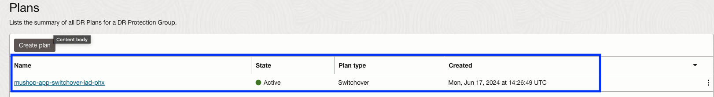
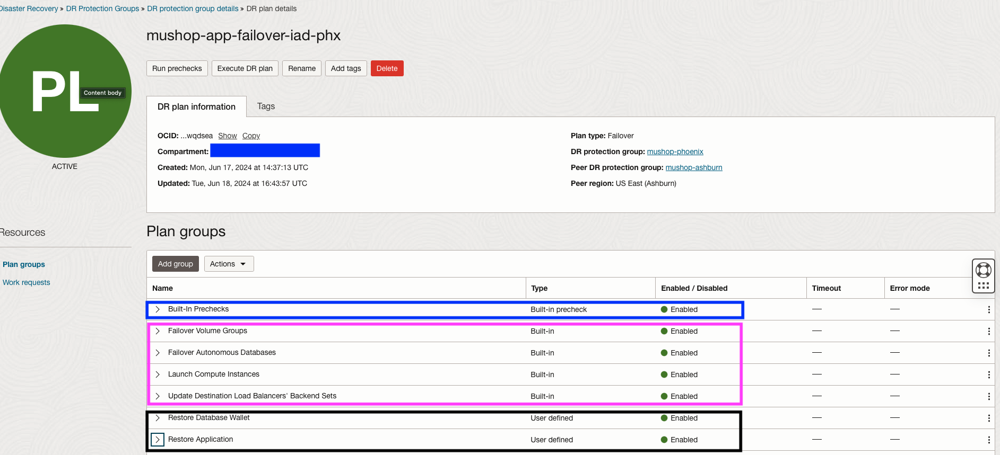

# Create DR Protection groups and Switchover plan

## Introduction

In this lab, we will Create and Associate Disaster Recovery Protection Groups (DRPG).Create and customize Switchover plan. Ashburn is a primary region, and Phoenix is the standby region.

**DR Protection group (DRPG)** – A resource type used by Full Stack DR.  A DR Protection Group represents a consistency grouping defined for the purposes of disaster recovery.  It is a collection of different OCI resources that comprise an application and must be treated as a combined group when performing disaster recovery operations.  For example, a DR Protection Group may consist of application servers (compute instances), associated block storage (grouped as volume groups), and databases.

**Members**- A resource type which can be added to DRPG.Full Stack Disaster Recovery Service currently supports disaster recovery for the following OCI resource types

- Compute Instances
- Boot and Block Volumes (Volume Groups)
- Oracle Exadata Database Service
- Oracle Enterprise Database Service
- racle Autonomous Database on Shared Exadata Infrastructure

**DR Plans**- DR plan is an automated DR workflow (a DR runbook) created by Full Stack Disaster Recovery to perform disaster recovery for all the resources in the primary DR protection group. 

There are two types of DR plans

- Switchover (Maintenance/Planned Disaster Recovery)
- Failover (Actual Disaster Recovery/Unplanned)

**Plan Group** – A group of steps in a DR Plan. A DR Plan consists of one or more Plan Groups that execute sequentially. All steps in a Plan Group execute in parallel. 

There are two types of plan group

- Built-In Groups or Steps – A type of Plan Group or Step that is generated automatically by FSDR when a DR Plan is created. Examples of Built-in Plan Steps are: Launch Compute Instance, Switchover Database, etc.

- User-Defined Groups or Steps– A type of Plan Group or Step that is added by the user to a DR Plan after the DR plan is created by FSDR. 

Estimated Time: 20 Minutes

### Objectives

- Create DRPG in Ashburn and Phoenix regions.
- Associate Ashburn DRPG as primary and Phoenix DRPG as Standby.
- Add members in Ashburn and Phoenix DRPG.
- Create switchover plan.
- Customize switchover plan with four user defined plan groups.
- Reorder user defined plan groups.

## Task 1: Gather Compartment OCID

1.  Login into OCI Console with your provided Credentials. The primary region should be **Ashburn**.

    


2.  Navigate to **search resources,services,documentation and Marketplace** section

    

3.  Type your allocated compartment, for example if your compartment is **LL52010-COMPARTMENT**.Compartment name will be in the format USERNAME-COMPARTMENT. You can find the username from the login credentials.

    

4.  From the search results select **your alloted compartment number correctly**. Copy the OCID of your compartment and make a note of it.

    

## Task 2: Download and execute Full Stack DR resources creation script

1.  Open the **Cloud Shell** using the icon next to the region.  Make sure you are selecting Ashburn region.

    
    

    The Cloud Shell opens after a few seconds and shows the **prompt**.

2. Download the Full Stack DR resources creation script using the below command in the Cloud Shell.

    ````
    <copy>wget https://bit.ly/mushoppk</copy>
    ````

    

3. Change the permission of the private key to `0600` in in the Cloud Shell

    ````
    <copy>chmod 0600 mushoppk</copy>
    ````

4. Execute the mushop\_dr\_setup.py script.Replace your compartment OCID which was noted down from step 1.4 in the below command. **You should remove the values after *compartment_ocid* in the below command and add your compartment ocid**. This script will create all the necessary Full Stack DR resources.

    ````
    <copy>python3 mushop_dr_setup.py --compartment_ocid=ocid1.compartment.oc1.xxxxx</copy>
    ````

    

5. Monitor for successful execution of the script. Approximately the script will run for 4-5 minutes.

    

## Task 3: Verify Full Stack DR resources

1.  Login into OCI Console with your provided Credentials. The primary region should be **Ashburn**.

    

2.  Select **Migration and Disaster Recovery** from the Hamburger menu, then **Disaster Recovery** -> **DR Protection Groups**. Verify the region in **Ashburn**

    

3.  You will land on the Disaster Recovery Protection group home page; make sure you have selected *the Ashburn* region. **mushop_ashburn** DRPG will have **primary** role.

    

4. We have added all the required members in the **mushop-ashburn** DRPG. It should show ATP Database, 2 Compute Instances, and 2 Volume groups.DRPG status should show as active.

    

5.  Login into OCI Console with your provided Credentials. The Standby region should be **Pheonix**.

    

6.  Select **Migration and Disaster Recovery** from the Hamburger menu, then **Disaster Recovery** -> **DR Protection Groups** Verify the region in **Phoenix**

    

7.  You will land on the Disaster Recovery Protection group home page; make sure you have selected the Phoenix region.**mushop_phoenix** DRPG will have **standby** role.

    

8.  Now, we have added all the required members in the **mushop-phoenix** DRPG. It should show ATP Database. DRPG status will show as active.

    

9. DR Plan *must* be created in the standby region (Phoenix). It is because, in the case of the worst-case scenario, the entire primary region outside the Full Stack DR will not be accessible from the primary region. From the phoenix region,select the **mushop-phoenix** DRPG and navigate to Plans under the resources section. 

    Select the **mushop-app-switchover** plan, and you should be able to various built-in prechecks,built-in plan groups, and user defined plan groups

    

10.  Let's review the **mushop-app-switchover** switchover plan 

    -  Built-in Precheck - These are the built-in prechecks groups for all the Plan groups (Built-in and User defined).
    -  Based on the members we have added in both Primary DRPG and Standby DRPG, Full Stack DR created nine Built-in switchover plan groups.
    -  We have manually created four user-defined groups per the Mushop application switchover requirement and reordered as per our requirements.
    -  In summary, the **mushop-app-switchover** switchover plan has created with *one*- Built-in precheck plan group, *nine*- Built-in Plan group,*four*- User defined Plan group

    

    You may now [Proceed to the next lab](#next)

    In case if you are interested to perform DRPG creation,association,add members,create switchover and customize switchover plan using OCI console refer Lab 2,3 and 4 using [Full Stack DR resources creation] (https://oracle-livelabs.github.io/oci-core/oci-fullstackdrs/workshops/sandbox/index.html?lab=drpg-setup)

## Acknowledgements

- **Author** - Suraj Ramesh, Principal Product Manager,Oracle Database High Availability (HA), Scalability and Maximum Availability Architecture (MAA)
- **Last Updated By/Date** -  Suraj Ramesh,May 2023
