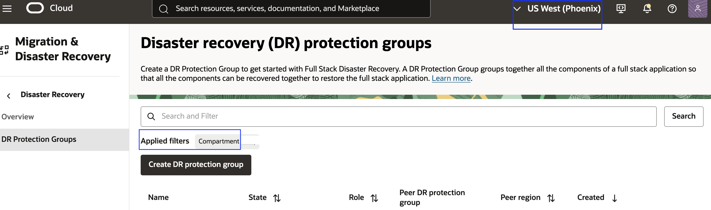
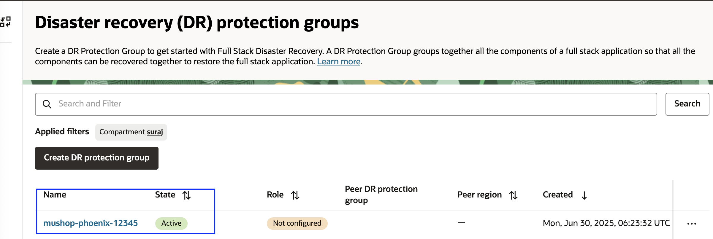
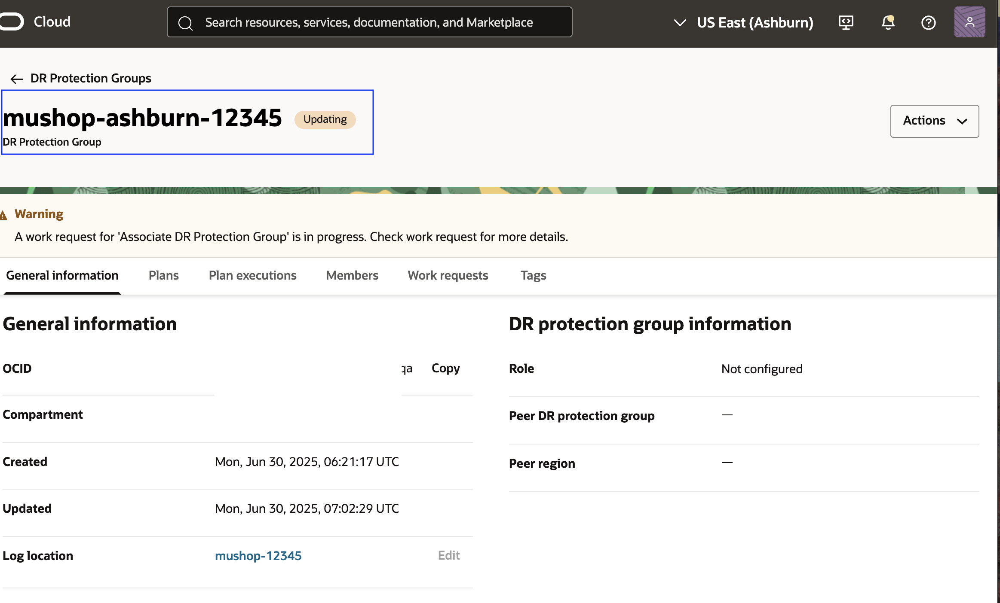
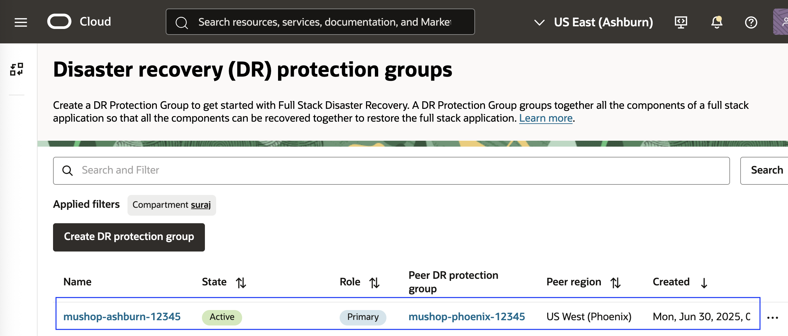

# Create and Associate Disaster Recovery Protection Groups

## Introduction

In this lab, we will create and associate **Disaster Recovery Protection Groups (DRPGs)**. **Ashburn** is the primary region, and **Phoenix** is the standby region.

**What is a Disaster Recovery Protection Groups?**  

-   A **Disaster Recovery Protection Group (DRPG)** is a resource type used by **OCI Full Stack DR**. It represents a consistency group of related OCI resources that must be recovered together during a disaster recovery operation.  

-   A DRPG can include resources like **compute instances**, **volume groups**, **databases** ,**loadbalancer** ,**OKE clusters** etc that form an application stack and should be treated as a single unit during switchover, failover, or drill operations.

**Estimated Time**: 10 Minutes

### Objectives

- Create DRPG in Ashburn and Phoenix regions.
- Associate Ashburn DRPG as primary and Phoenix DRPG as Standby

## Task 1: Create DRPG in Ashburn and Phoenix regions

1.  Login into OCI Console with your Credentials. The primary region should be **Ashburn**.

    

    Open another browser tab and then select region as **Phoenix** (Standby Region)

    

2.  In the first browser tab,Select **Migration and Disaster Recovery** from the Hamburger menu, then **Disaster Recovery** -> **DR Protection Groups**. Verify the region is **Ashburn**

    

3.  In the second browser tab,Select **Migration and Disaster Recovery** from the Hamburger menu, then **Disaster Recovery** -> **DR Protection Groups** Verify the region is **Phoenix**

    

4.  You will land up at the Disaster Recovery Protection group home page; make sure to have two tabs opened for Ashburn and Phoenix region.Make sure to select the right compartment.

    
    

5.  Create DRPG in the Ashburn region. Select **Create DR Protection group** in the Ashburn region browser tab and follow the below instructions.

    - Enter name as **mushop-ashburn**
    - Select the compartment assigned to you
    - In the object storage bucket, use the drop-down option and select **mushop-xxxxx** (mushop-12345)  ( Don't select mushop-media-xxxxx bucket)
    - In role, leave it as **Not Configured**
    - Ignore add member
    - Verify and hit create

    

    Navigate back to the DR Protection group page and refresh; the state of DRPG will change from creating to active in a few seconds.

    

6.  Create DRPG in the Phoenix region. Select **Create DR Protection group** in the Phoenix region browser tab and follow the below instructions.

    - Enter name as **mushop-phoenix**
    - Select the compartment assigned to you
    - In the object storage bucket, use the drop-down option and select **mushop-xxxxx** (mushop-12345) ( Don't select mushop-media-xxxxx bucket)
    - In role, leave it as **Not Configured**
    - Ignore add member
    - Verify and hit create

    

    Navigate back to the DR Protection group page and refresh; the state of DRPG will change from creating to active in a few seconds.

    

## Task 2: Associate Ashburn DRPG as primary and Phoenix DRPG as Standby

1. From the Ashburn region OCI console, select **mushop-Ashburn** DRPG. Select the **Associate** button

    

    - Select Role as **Primary**
    - Select Peer Region as **US West (Phoenix)**,
    - Select Peer DR Protection group in the compartment (change assigned compartment if required); you should select **mushop-phoenix**
    - Verify and associate

    

    **mushop-ashburn** DRPG will change to *Updating* State

    

    Navigate back to the DR Protection group home page. You should be able to see DRPG **mushop-ashburn** state as *Active*, role as *Primary*, peer region as *US West (Phoenix)*

    

2.  From the Phoenix region OCI console, navigate to the DR Protection group home page. You should be able to see DRPG **mushop-phoenix** state as *Active*, role as *Standby*, peer region as *US East (Ashburn)*

    

    Now, we have associated **mushop-Ashburn** as *Primary DRPG* and **mushop-phoenix**  as *Standby DRPG*

    You may now [Proceed to the next lab](#next)

## Acknowledgements

- **Author** - Suraj Ramesh, Principal Product Manager,Oracle Database High Availability (HA), Scalability and Maximum Availability Architecture (MAA)
- **Last Updated By/Date** -  Suraj Ramesh, July 2025
