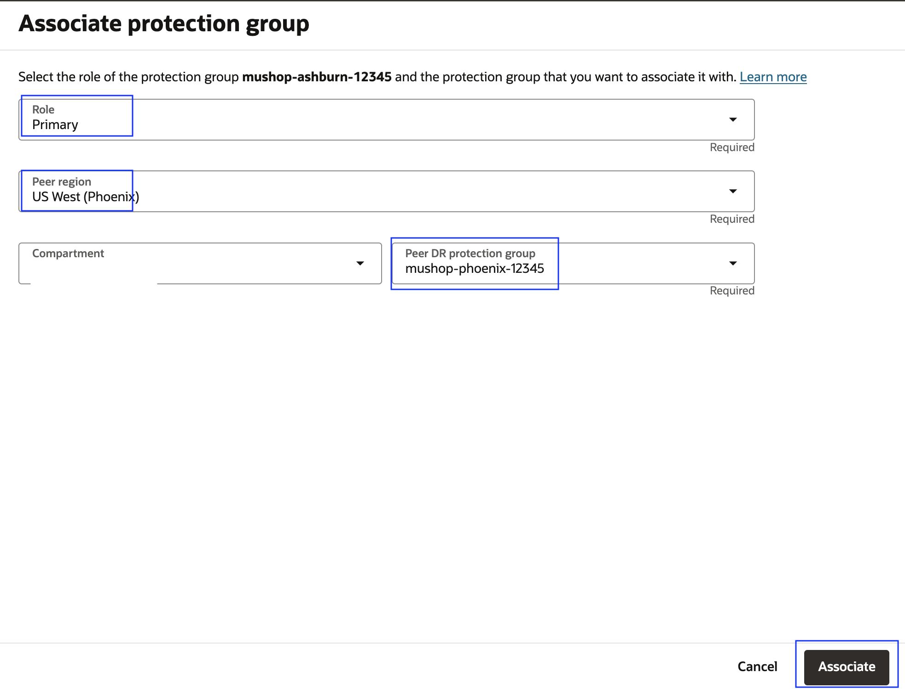
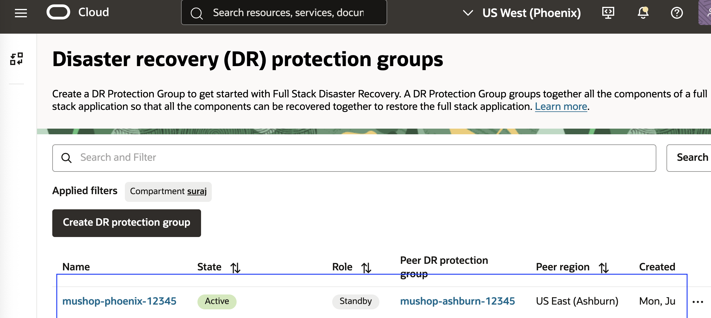

# Create and Associate Disaster Recovery Protection Groups

## Introduction

In this lab, we will create and associate **Disaster Recovery Protection Groups (DRPGs)**. **Ashburn** is the primary region, and **Phoenix** is the standby region.

**What is a Disaster Recovery Protection Groups?**  

-   A **Disaster Recovery Protection Group (DRPG)** is a resource type used by **OCI Full Stack DR**. It represents a consistency group of related OCI resources that must be recovered together during a disaster recovery operation.  

-   A DRPG can include resources like **compute instances**, **volume groups**, **databases** ,**loadbalancer** ,**OKE clusters** etc that form an application stack and should be treated as a single unit during switchover, failover, or drill operations.

**Estimated Time**: 10 Minutes

### Objectives

- Create DRPG in Ashburn and Phoenix regions.
- Associate Ashburn DRPG as primary and Phoenix DRPG as Standby

## Task 1: Create DRPG in Ashburn and Phoenix regions

1.  Login into OCI Console with your Credentials. The primary region should be **Ashburn**.

    

    Open another browser tab and then select region as **Phoenix** (Standby Region)

    

2.  In the **first browser tab**, open the **Hamburger menu (☰)** and select **Migration and Disaster Recovery**. Then go to **Disaster Recovery → DR Protection Groups** and Confirm that the **region is set to Ashburn**.

    

3.  In the **first second tab**, open the **Hamburger menu (☰)** and select **Migration and Disaster Recovery**. Then go to **Disaster Recovery → DR Protection Groups** and Confirm that the **region is set to Phoenix**.

    

4. On the DR Protection Group home page, ensure two tabs are open (Ashburn and Phoenix) and the correct compartment is selected in both.

    
    

5.  In the **Ashburn** region tab, click **Create DR Protection Group** and do the following: 
    - Set name to **mushop-ashburn-XXXXX**, select your assigned **compartment**. XXXXX - is the assigned reservation id.
    - Choose the **mushop-xxxxx** bucket (not **mushop-media-xxxxx**),  
    - Leave **Role** as **Not Configured**, skip **Add Member**, review, and click **Create**.

    

    Go back to the DR Protection Group page, refresh it, and wait for the DRPG state to change from **Creating** to **Active**.

    

6.  In the **Phoenix** region tab, click **Create DR Protection Group** and do the following: 
    - Set name to **mushop-phoenix-XXXXX**, select your assigned **compartment**. XXXXX - is the assigned reservation id.
    - Choose the **mushop-xxxxx** bucket (not **mushop-media-xxxxx**),  
    - Leave **Role** as **Not Configured**, skip **Add Member**, review, and click **Create**.

    

    Navigate back to the DR Protection group page and refresh; the state of DRPG will change from creating to active in a few seconds.

    

## Task 2: Associate Ashburn DRPG as primary and Phoenix DRPG as Standby

1. In the **Ashburn region** OCI console, open the **mushop-ashburn-xxxxx** DR Protection Group.

2. In the **Actions** tile, click the **Associate** button.  
   

3. In the association form:
    - Set **Role** to **Primary**.
    - Select **Peer Region** as **US West (Phoenix)**.
    - In **Peer DR Protection Group**, choose **mushop-phoenix-xxxxx** from the correct compartment  
     (change the compartment if needed).

4. Review your selections and click **Associate**
    

5. Wait for few seconds,**mushop-ashburn-xxxxx** DRPG will change to **Updating** State

    

6.  Navigate back to the **DR Protection Group** home page.You should now see **mushop-ashburn-xxxxx** with: 
    - **State:** *Active*  
    - **Role:** *Primary*  
    - **Peer Region:** *US West (Phoenix)*
    

7.  In the **Phoenix region** OCI console, go to the **DR Protection Group** home page. You should see **mushop-phoenix-xxxxx** with:
    - **State:** *Active*  
    - **Role:** *Standby*  
    - **Peer Region:** *US East (Ashburn)*
    

Now, we have associated **mushop-ashburn-xxxxx** as *Primary DRPG* and **mushop-phoenix-xxxxx**  as *Standby DRPG*

You may now [Proceed to the next lab](#next)

## Acknowledgements

- **Author** - Suraj Ramesh, Principal Product Manager,Oracle Database High Availability (HA), Scalability and Maximum Availability Architecture (MAA)
- **Last Updated By/Date** -  Suraj Ramesh, July 2025
