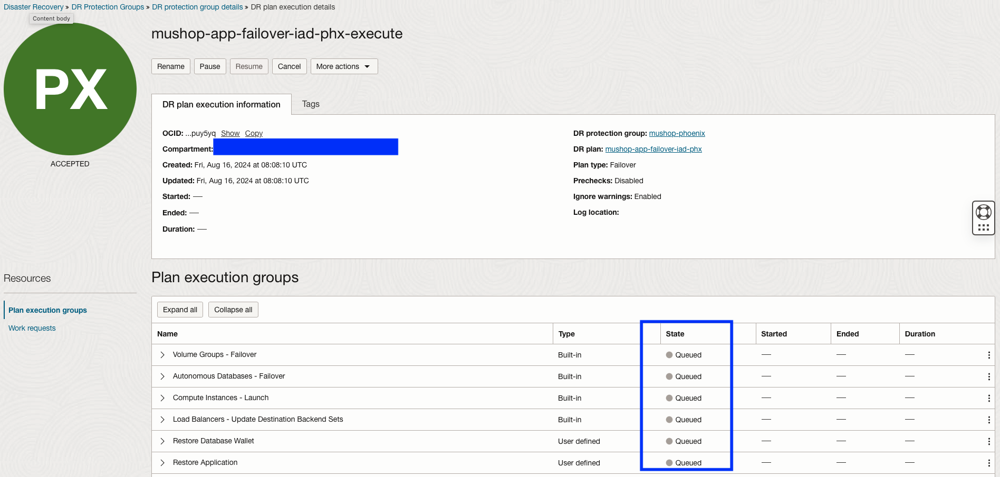
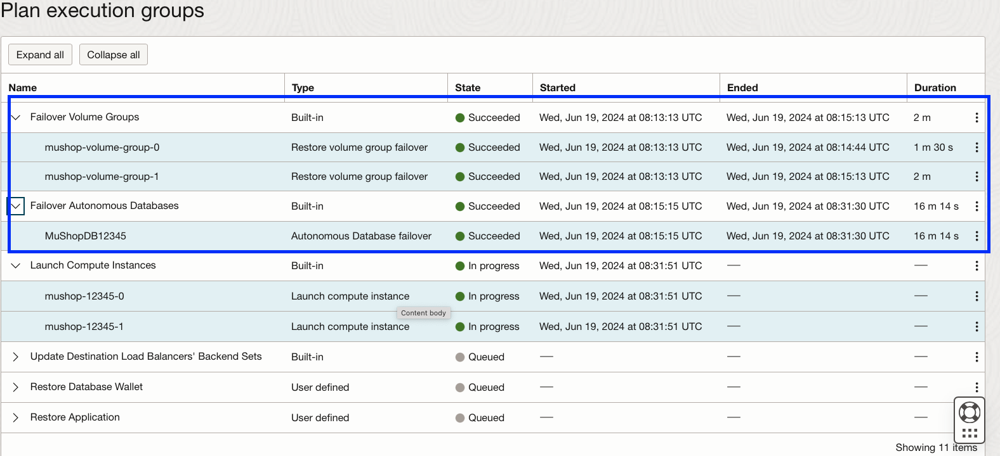
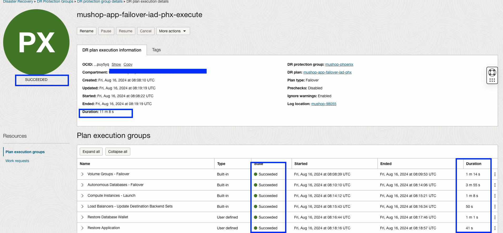

# Run failover DR plan

## Introduction

In this lab, we will run the actual failover plan for the **mushop-app-failover-iad-phx** plan, which we have created in lab 4. 

Estimated Time: 30 Minutes

Watch the video below for a quick walk-through of the lab.
[Perform Failover](videohub:1_sul2dd1i)

### Objectives

- Execute the Failover plan
- Monitor the Failover Plan
- Validate the Failover plan

## Task 1: Execute the failover plan

1.  Login into OCI Console with your provided Credentials. Select region as **Pheonix**.

    

2.  Select Migration and Disaster Recovery from the Hamburger menu, then **Disaster Recovery** -> **DR Protection Groups**. Verify the region is **Phoenix**

    

3.  You will land on the Disaster Recovery Protection group home page; make sure you have selected the Phoenix region.

    

4.  Select the **mushop-phoenix** DRPG and select **mushop-app-failover-iad-phx** plan

    

5.  Navigate to the **Execute DR Plan** section, which will be right below the **mushop-app-failover-iad-phx** plan, and select

    

6.  In the **Execute DR Plan** window

    - Provide the Plan execution name as **mushop-app-failover-iad-phx-execute**
    - Uncheck the **Enable prechecks**  (Prechecks was executed successfully in previous lab)
    - Leave the **Ignore warnings** as it is
    - Verify and hit **Execute Plan**

    

## Task 2: Monitor the Failover Plan

1.  Navigate to **Plan executions** section under **Resources** and select the **mushop-app-failover-iad-phx-execute** plan execution.Initially, it will show all the steps as *Queued*

    

2.  Refresh the page; within a few seconds, the **State** will change from *Queued* to *In Progress*.

    

3.  All the *plan groups* will run serially, but steps inside each *plan group* will run in parallel.

4.  Monitor the various plan group and steps which are running. Navigate to the three dots section for the respective plan group step and click. You get the option to view the log and download the log. These logs are stored in the object storage bucket provided during the DRPG creation. You can monitor the Progress and download the log if necessary for troubleshooting.

    

5.  Once each plan group is executed successfully, it will move on to the next groups for execution. Here you can see plan groups *Failover Volume Groups* and *Failover Autonomous Databases* are completed successfully (State-Succeeded), and the next group **Launch Compute Instances** started running (State: In progress).

    

6.  Keep monitoring the rest of the groups and steps; each step will complete depending on the actual task (DB Failover, Launch VM,Update Load Balancer, Execute scripts ), etc.). For example, Autonomous DB Failover will take more time when comparing to Launching VMs. You can verify the start and end of each step, total duration, logs, etc.

    

7.  Wait for all the steps to complete successfully.  It is important to monitor the progress of each step and take necessary actions in case of any failures.

    **Approximately it will take *20-30* mins to for successful failover plan execution**

## Task 3: Validate the Failover plan

1.  From the plan execution details, verify the duration of each step, status, duration of the entire failover plan, etc. *It is essential to have successful completion of all steps*. In this example it took around **12 minutes** to complete.These timings will vary as it has depending factors like ATP Data Guard failover,compute launch,update load balancer,script execution etc.Use the **Expand all** button to expand all the steps and the **Collapse all** button for collapse. Use the view or download log option to see step execution details.

    

You may now [Proceed to the next lab](#next)

Refer to the **Troubleshooting tips** section for known failures and corrective actions.

## Troubleshooting tips

1. If any of the Step fails, verify the log and take necessary actions.

## Acknowledgements

- **Author** - Suraj Ramesh,Principal Product Manager,Oracle Database High Availability (HA), Scalability and Maximum Availability Architecture (MAA)
- **Last Updated By/Date** - Suraj Ramesh,September 2024
