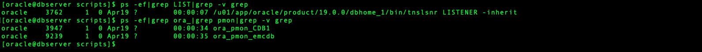
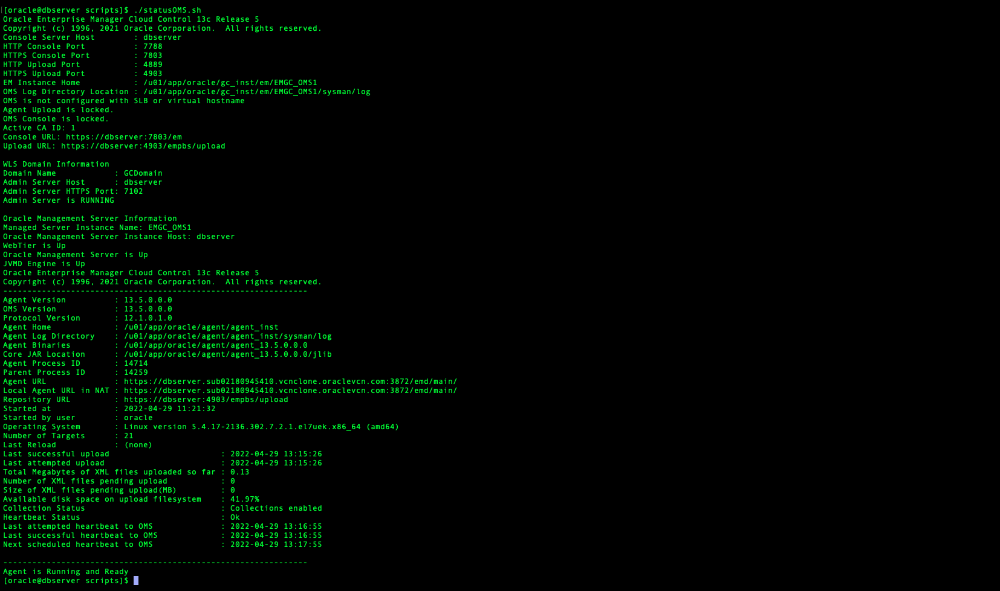
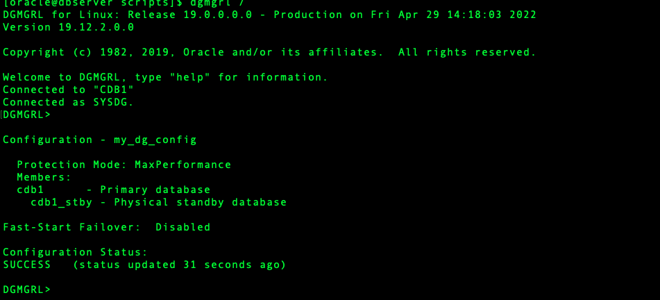
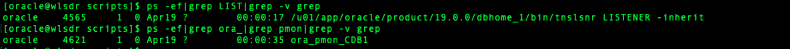
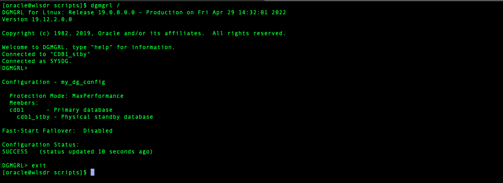

# Initialize Environment

## Introduction

In this lab we will review and startup all components required to successfully run this workshop in dbserver and wlsdr

*Estimated Lab Time:* 30 Minutes.

### Objectives
- Initialize the workshop environment.

### Prerequisites
This lab assumes you have:
- An Oracle Cloud account
- You have completed:
    - Lab: Prepare Setup (*Free-tier* and *Paid Tenants* only)
    - Lab: Environment Setup

**NOTE:** *When doing Copy/Paste using the convenient* **Copy** *function used throughout the guide, you must hit the* **ENTER** *key after pasting. Otherwise the last line will remain in the buffer until you hit* **ENTER!**

## Task 1: Validate That Required Processes are Up and Running in dbserver.

1. Now with access to your remote desktop session, proceed as indicated below to validate your environment before you start executing the subsequent labs. The following Processes should be up and running:

    - Database Listeners
        - LISTENER (1521)
    - Database Server Instances
        - CDB1
        - emcdb

2. Click the *Terminal* icon on the desktop to launch a session for dbserver, then run the following to validate that expected processes such as DB's,Oracle Enterprise manager processes are up and verify data guard synchornization.


    ```
    <copy>
    ps -ef|grep LIST|grep -v grep
    ps -ef|grep ora_|grep pmon|grep -v grep
    </copy>
    ```

    ```
    <copy>
    cd /home/oracle/scripts
    ./statusOMS.sh
    </copy>
    ```

    ```
    <copy>
    dgmgrl /
    show configuration     
    </copy>
    ```

    
    
    

    If all expected processes and dgmgrl status (SUCCESS) are shown in your output as seen above, then your environment is ready for the next task.  

## Task 2: Validate That Required Processes are Up and Running in wlsdr.

1. Now with access to your remote desktop session, proceed as indicated below to validate your environment before you start executing the subsequent labs. The following Processes should be up and running:

    - Database Listeners
        - LISTENER (1521)
    - Database Server Instances
        - CDB1

2. Click the *Terminal* icon on the desktop to launch a session for dbserver, then run the following to validate that expected processes such as DB's,Oracle Enterprise manager processes are up and verify data guard synchornization.


    ```
    <copy>
    ps -ef|grep LIST|grep -v grep
    ps -ef|grep ora_|grep pmon|grep -v grep
    </copy>
    ```

    ```
    <copy>
    dgmgrl /
    show configuration     
    </copy>
    ```

    
    

    If all expected processes and dgmgrl status (SUCCESS)  are shown in your output as seen above, then your environment is ready for the next task.


You may now [proceed to the next lab](#next).


## Acknowledgements
- **Author** -  Suraj Ramesh, Principal Product Manager & Eugene Simos,Principal Domain Specialist Cloud Engineer
- **Last Updated By/Date** -  Suraj Ramesh,April 2022
