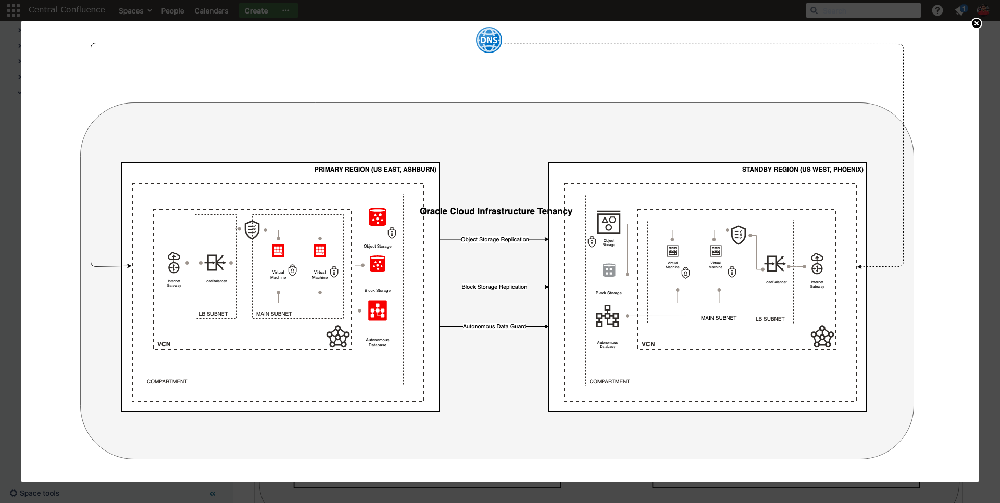

# Protect your business using Oracle Full Stack Disaster Recovery

## About the Workshop

In this workshop, we will see how easily Full Stack Disaster Recovery will help to orchestrate DR switchover operations for a Cloud-native Application deployed in OCI across two OCI regions.

- We will use the MuShop application and its underlying resources to perform the Switchover operations across regions.

- MuShop is a demo application purpose-built to showcase interoperable various cloud services on Oracle Cloud Infrastructure. The premise of MuShop is an e-commerce website offering a variety of cat products, and it is a 3-tier web application.

## Overview of OCI Full Stack Disaster Recovery

Full Stack Disaster Recovery Service is an fully managed OCI disaster recovery orchestration and management service that provides comprehensive disaster recovery capabilities for all layers of an application stack, including infrastructure, middleware, database, and application across  **OCI regions**.

Throughout this workshop, we will use Full Stack DR to denote OCI Full Stack Disaster recovery.

- Full Stack DR assures comprehensive business continuity from a variety of data center outages. Using Disaster Recovery Service for disaster recovery ensures that organizations are minimally impacted if there is a region-wide outage or Availability Domain outage.

- Full Stack DR provides fully automated, end-to-end disaster recovery for the entire Oracle stack, including infrastructure, databases, engineered systems, virtual infrastructure, storage, and full-stack applications in OCI. It integrates with underlying replication mechanisms that synchronize primary and standby environments and protects mission-critical data.

- Full Stack DR is flexible and integrates with various Oracle platforms and non-Oracle applications and infrastructure. It generates, runs, and monitors disaster recovery plans for services and applications deployed in your tenancy. Disaster recovery operations are at the service level, so there is no impact on running other services in your tenancy. You can customize the disaster recovery plans generated by Full Stack DR based on your specific needs.

Below are some of the critical functionalities of Full Stack Disaster Recovery Service

- Create and automate DR run books and make them more flexible.
- Manage DR operations (Switchover and Failover) using a single pane of glass.
- Provide comprehensive logs with error management and recovery.
- Perform pre-checks before the DR execution plan.
- Provide a framework to customize DR operations.

### Benefits of OCI Full Stack Disaster Recovery

Full Stack Disaster Recovery provides multiple benefits in the area of business continuity.

- Provides comprehensive disaster protection for the entire Application( Oracle/Non-Oracle) stack, including databases, VMs, attached volumes, storage, and applications across different OCI regions.
- Minimizes Recovery Time Objectives (RTO).
- Automates disaster recovery operations.
- Eliminates the need for domain specialists and dedicated administrators for disaster recovery.
- Provides highly flexible and customized disaster recovery plans. You can integrate your custom automation into the DR workflow.
- Provides a comprehensive dashboard for monitoring disaster recovery readiness and launching DR workflows.
- Executes scalable and reliable complete stack switchover and failover operations with a button.
- Operates at the service level instead of requiring the customer to manually failover VMs, databases, middleware, applications, storage, and load balancers.

### Estimated Workshop Time

Approximately 3 hrs

### Workshop Architecture

### Environment details

- **Ashburn** is the Primary region, and **Phoenix** is the Standby region.
- Pre-requisites for using Full Stack DR is to create various infrastructure resources and configure replication
- For this lab, LiveLabs provisions various resources like ATP-S Primary and Standby, Compute instances,Setup block volume replication,Load Balancers, Object storage etc as per the workshop Architecture diagram shown above.

### Workshop Objectives

- Prepare the environments in Ashburn (Primary) for using the Full Stack DR
- Create DR Protection groups (DRPG) in Ashburn (Primary) and Phoenix (Standby) regions.
- Associate Ashburn DRPG as Primary and Phoenix DRPG as Standby.
- Add members to Ashburn DRPG. Application Virtual machines, Volume groups, and Primary ATP database.
- Add members to Phoenix DRPG. Standby ATP Database.
- Create and Customize DR Switchover Plan in Phoenix( Standby) DRPG
- Run DR Switchover Pre-checks in Phoenix( Standby) DRPG
- Verify and create an outage to the MuShop application from Ashburn (Primary) region.
- Run DR Switchover Plan in Phoenix( Standby) DRPG
- Verify the MuShop application from Phoenix (New Primary) region.

### Reference links

- [MuShop Application](https://github.com/oracle-quickstart/oci-cloudnative/tree/master/deploy/basic)

### Disclaimer

The following is intended to outline our general product direction. It is intended for information purposes only, and may not be incorporated into any contract. It is not a commitment to deliver any material, code, or functionality, and should not be relied upon in making purchasing decisions. The development, release, and timing of any features or functionality described for Oracle’s products remains at the sole discretion of Oracle.

## Acknowledgements

- **Author** - Suraj Ramesh,Principal Product Manager,Oracle Database High Availability (HA), Scalability and Maximum Availability Architecture (MAA)
- **Last Updated By/Date** - Suraj Ramesh,May 2023

