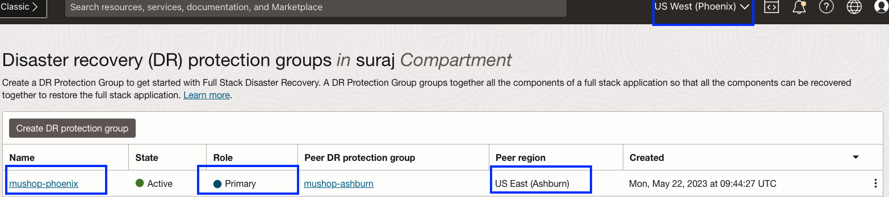
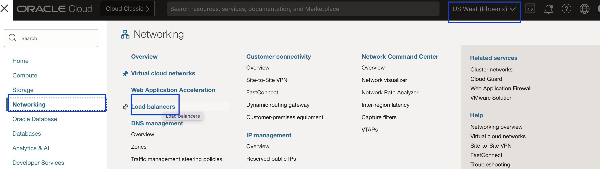
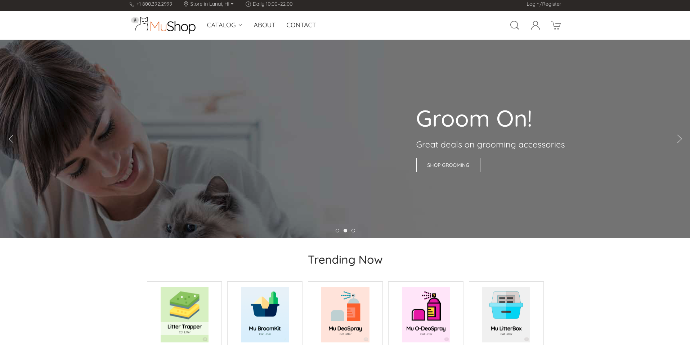

# Verify the DR Protection group status and MuShop Application post Failover

## Introduction

We will verify the DR Protection Group (DRPG) status and MuShop Application post failover.

Estimated Time: 5 Minutes

Watch the video below for a quick walk-through of the lab.
[Post Failover tasks](videohub:1_rc5k9ftv)

### Objectives

- Verify the DR protection group status
- Access the MuShop Application from the phoenix region
- Post failover DRPG tasks (Optional)

## Task 1: Verify the DR protection group status

1.  Login into OCI Console with your provided Credentials. Select region as **Pheonix**.

    

2.  Select Migration and Disaster Recovery from the Hamburger menu, then **Disaster Recovery** -> **DR Protection Groups**. Verify the region is **Phoenix**

    

3.  Notice the *Role* of the **mushop-phoenix** DRPG; it has automatically changed to *Primary*. Now we have our new primary region as *Phoenix region*

    

4.  Login into OCI Console with your provided Credentials. Select region as **Ashburn**.

    

5.  Select Migration and Disaster Recovery from the Hamburger menu, then **Disaster Recovery** -> **DR Protection Groups**. Verify the region is **Ashburn**

    

6.  Notice the *Role* of the **mushop-ashburn** DRPG; it has automatically changed to *Standby*. Now we have our new standby region as *Ashburn region*

    

## Task 2: Access MuShop Application from the phoenix region

1.  From the Hamburger menu, select **Networking**, then **Load Balancers** .Verify the region is **Phoenix**
  
    

    Gather the Public IP address of the Load Balancer

    

    Open a tab in your browser and verify the Mushop Application using the gathered public IP address. You should be able to see that the application is working as expected from the Phoenix region.

    

    **Mushop application is accessible from the new primary region (Phoenix)**

## Task 3:  Post failover DRPG tasks (Optional)

1. After executing the Failover plan, Full Stack DR will automatically add the required members in the new primary region (Phoenix) DRPG

2. If you want to failback, you might need to verify and ensure the correct members are in the respective DR protection groups.

3.  Create the DR plans in the new standby region (Ashburn) and customize the plans with user-defined groups.

4. Run prechecks and the DR plan.

    For more details refer [Resetting DR Configuration After a Failover](https://docs.oracle.com/en-us/iaas/disaster-recovery/doc/resetting-dr-configuration.html).

## Conclusion

You are a Disaster Recovery Hero Now!!!! Using OCI Full Stack DR, we have seen the complete automation of failing over the MuShop application (Full Stack) from the Ashburn region to the Phoenix region with just one click! 

## Acknowledgements

- **Author** - Suraj Ramesh,Principal Product Manager,Oracle Database High Availability (HA), Scalability and Maximum Availability Architecture (MAA)
- **Last Updated By/Date** - Suraj Ramesh,September 2024
