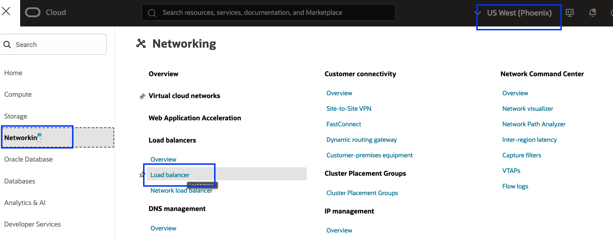
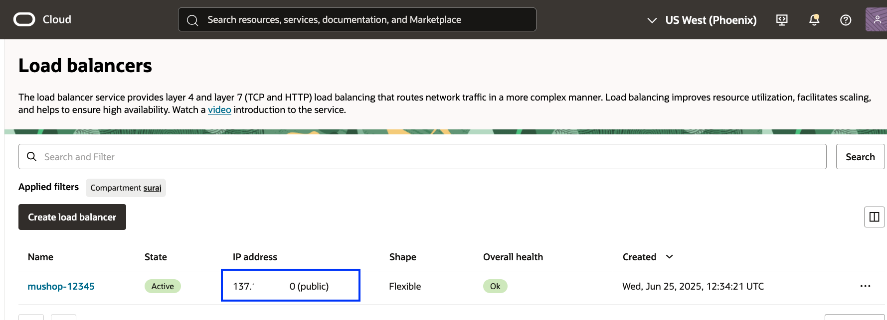

# Verify the DR Protection Group Status and MuShop Application Post-Switchover

## Introduction

In this lab, we will verify the status of the **DR Protection Group (DRPG)** and confirm that the **MuShop Application** is functioning correctly after the switchover.

**Estimated Time**: 5 Minutes

### Objectives

- Verify the DRPG status
- Access the MuShop Application from the phoenix region

## Task 1: Verify the DRPG status

1.  Login into OCI Console with your provided Credentials. Select region as **Phoenix**.

    

2.  Open the **Hamburger menu (☰)** and select **Migration and Disaster Recovery**. Then go to **Disaster Recovery → DR Protection Groups** and Confirm that the **region is set to Phoenix**.

    

3.  On the Disaster Recovery Protection Group home page, you will see that the *Role* of **`mushop-phoenix-xxxxx`** has changed to *Primary*, indicating that the Phoenix region is now the new primary.

    

4.  Login into OCI Console with your provided Credentials. Select region as **Ashburn**.

    

5.  Open the **Hamburger menu (☰)** and select **Migration and Disaster Recovery**. Then go to **Disaster Recovery → DR Protection Groups** and Confirm that the **region is set to Ashburn**.

    

6.  On the Disaster Recovery Protection Group home page, you will see that the *Role* of **`mushop-ashburn-xxxxx`** has changed to *Standby*, indicating that the Ashburn region is now the new standby.

    

## Task 2: Access MuShop Application from the phoenix region

1.  From the Hamburger menu, select **Networking**, then **Load Balancers** .Verify the region is **Phoenix**
  
    

2. Gather the Public IP address of the Load Balancer

    

3. Open a tab in your browser and verify the Mushop Application using the gathered public IP address. You should be able to see that the application is working as expected from the Phoenix region.

    
*
    You may now [Proceed to the next lab](#next)

## Acknowledgements

- **Author** - Suraj Ramesh,Principal Product Manager,Oracle Database High Availability (HA), Scalability and Maximum Availability Architecture (MAA)
- **Last Updated By/Date** - Suraj Ramesh, July 2025
