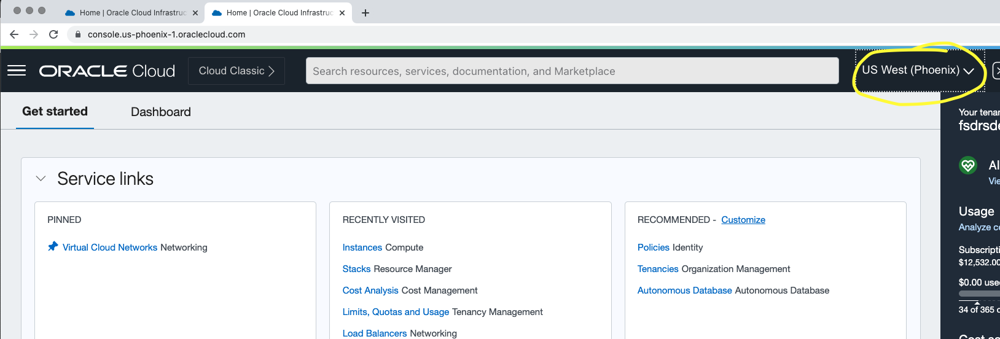
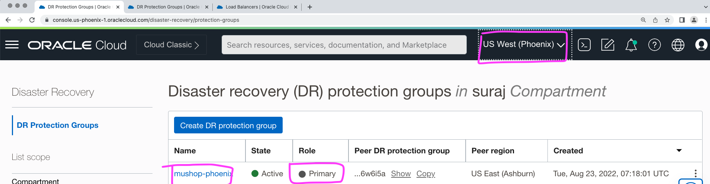
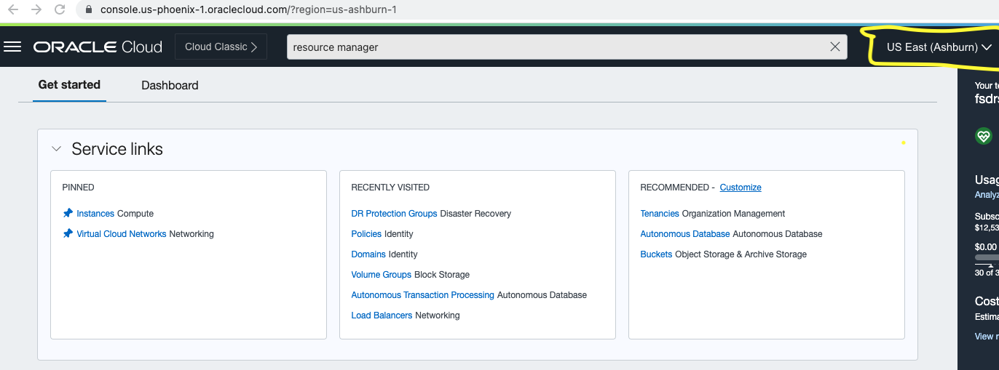
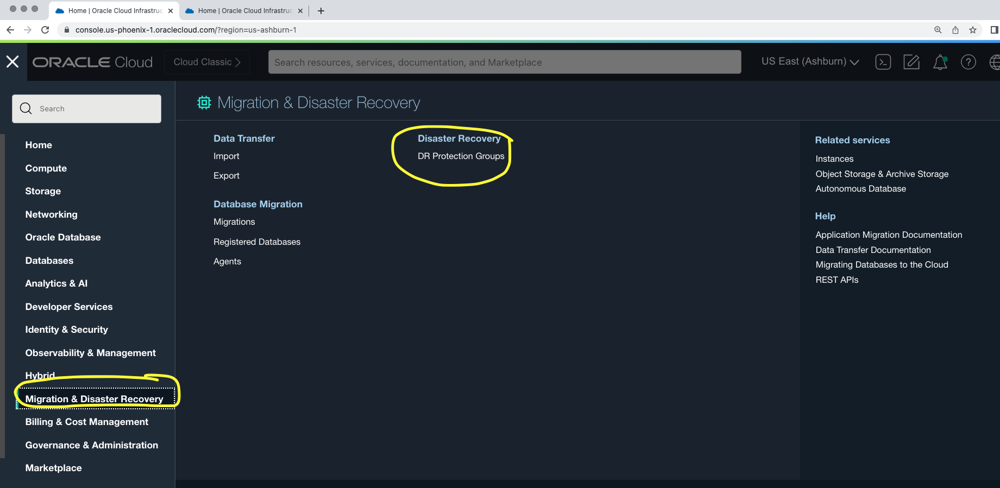
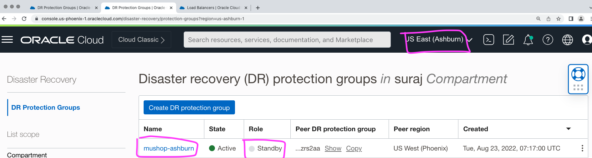
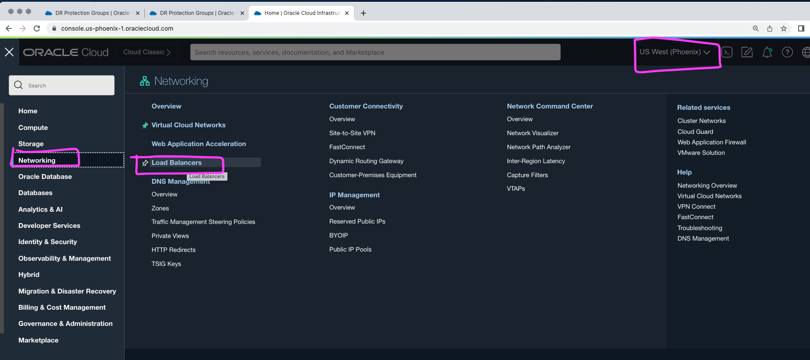
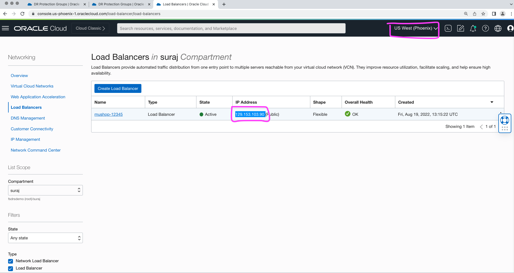
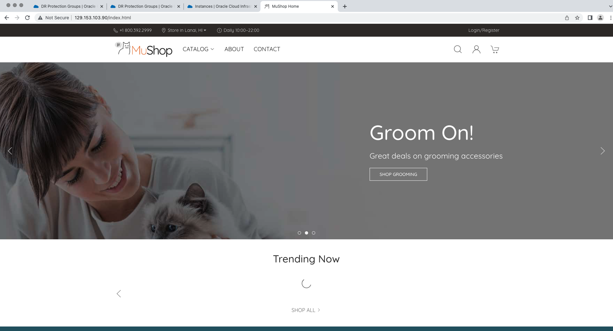

# Verify the DR Protection group status and MuShop Application post switchover

## Introduction

In this we will verify the DR Protection group (DRPG) status and MuShop Application post switchover

Estimated Time: 5 Minutes

Watch the video below for a quick walk through of the lab.

### Objectives

- Verify the DRPG status
- Access MuShop Application from phoenix region

## Task 1:Verify the DRPG status

1. Login into OCI Console with your provided Credentials. Select region as **Pheonix**.

  

2. From the Hamburger menu, select **Migration and Disaster Recovery**, then **Disaster Recovery Protection Groups**.Verify the region is **Phoenix**

  

3. Notice the *Role* of the **mushop-phoenix** DRPG, it has automatically changed to *Primary*. Now we have our new primary region as *Phoenix region*

  

4. Login into OCI Console with your provided Credentials. Select region as **Ashburn**.

  

5. From the Hamburger menu, select **Migration and Disaster Recovery**, then **Disaster Recovery Protection Groups**.Verify the region is **Ashburn**

  

6. Notice the *Role* of the **mushop-ashburn** DRPG, it has automatically changed to *Standby*. Now we have our new standby region as *Ashburn region*

  

## Task 2: Access MuShop Application from phoenix region

1. Gather the Load Balancer public IP

  From the Hamburger menu, select **Networking**, then **Load Balancers**
  
     

 Gather the Public IP address of the Load Balancer

     

  In your browser, open up a tab and verify the Mushop Application using the gathered public IP address. You should be able to see the application is working as expected from Phoenix region.

      

**Mushop application is accessible from the new primary region (Phoenix)**

This concludes the lab Protect your business using Oracle Full Stack Disaster Recovery Service. We have seen the complete automation of switching over a MuShop application (Full Stack) from Ashburn region to Phoenix region with a single click of a button! 

## Acknowledgements

- **Author** -  Suraj Ramesh, Principal Product Manager
- **Last Updated By/Date** -  Suraj Ramesh,August 2022
