# Prepare the environments for using the Full Stack DR Service

## Introduction

In this lab, you will download the **Autonomous Database Wallets** and prepare the **MuShop application virtual machines**, which are essential for working with the **Full Stack DR Service**.

**Estimated Time**: 15 Minutes


### Objectives

- Download the Autonomous Database (Autonomous Transaction Processing-ATP) Wallets using Cloud Shell and transfer the wallets to the application VM instances.  
- Connect to the application VM instances and execute the application change script

## Task 1: Download Autonomous Database Wallets using Cloud Shell and transfer the Wallets to application VM instances

1.  If you have provisioned your OCI resources in different regions (Primary and Standby), make sure to select those regions consistently throughout the labs. We will use **ASHBURN** as the primary region and **PHOENIX** as the standby region. Log in to the OCI Console using your provided credentials and select the **ASHBURN** region.

    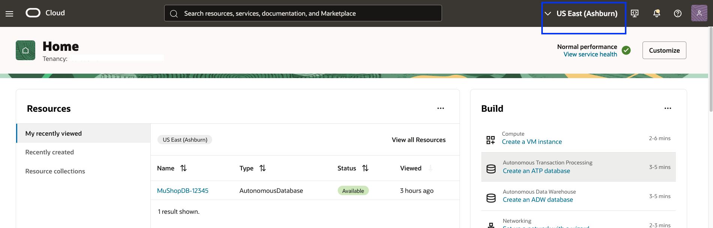

> 📌 **Note:** Make sure to complete the steps in the correct region context to avoid resource mismatch

2. We need to gather the OCID (Oracle Cloud Identifier) of the ATP database in Ashburn. From the Hamburger menu, select **Oracle Database**, then **Autonomous Database**.

    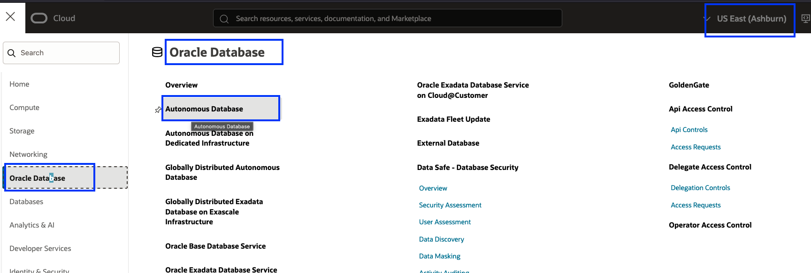

    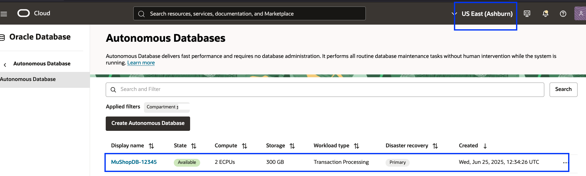

    Click the ATP database which should have like **"MuShopDB-XXXXX"** and in the Autonomous Database Information tab, copy the OCID of the ATP database and keep it safe. This is required for downloading the wallet in the next step.

    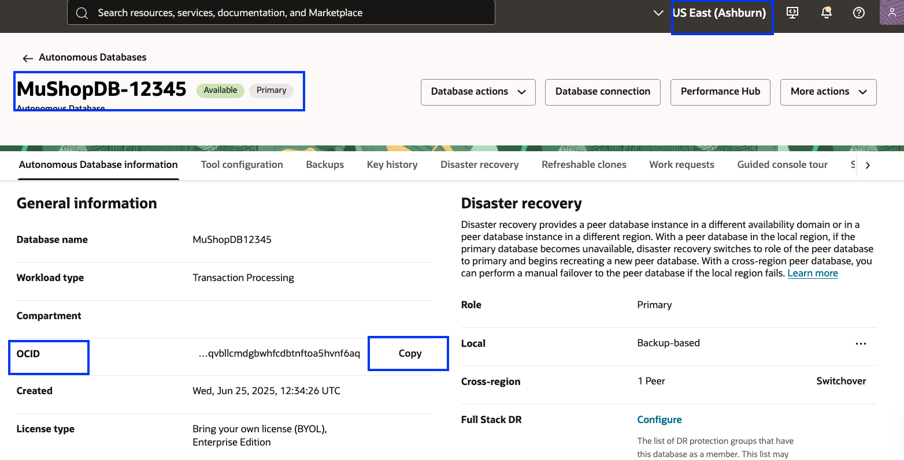

3.  Open the **Cloud Shell** using the icon next to the **Ashburn** region. The Cloud Shell will open after a few seconds and display the **prompt**; enter **N** to quit the tutorial.The cloudshell prompt should show **us-ashburn-1** region.

    


4. Download the ATP database wallet running in Ashburn using the Cloud Shell. If the Cloud Shell gets disconnected, reconnect it. You can maximize or restore the Cloud Shell view as needed for better visibility.


    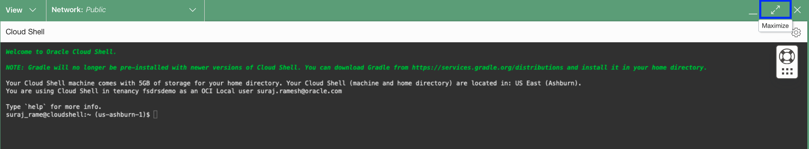

    **Make sure to modify the ATP database OCID for your database in the below command.You should replace the OCID after --autonomous-database-id  with your values which was captured in Step 2**

    ````
     <copy>oci db autonomous-database generate-wallet --generate-type ALL --file atpwallet_ashburn.zip --password Fsdrs@123 --autonomous-database-id ocid1.autonomousdatabase.oc1.iad.anuwcljt5h22avqazns5ncswf4jc7owrzb6nug53xxxxxxxxxxxx</copy>
    ````

    Copy the command and execute it in the Cloud Shell prompt. You should see the downloaded wallet file; verify it using the command.

    ````
     <copy>ls -ltr atpwallet_ashburn.zip</copy>
    ````
    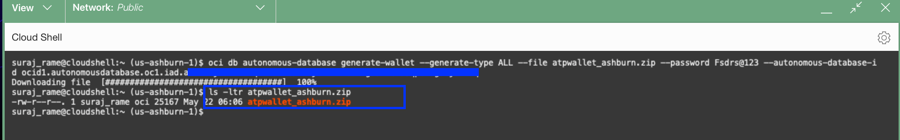

5. Open a new tab in your browser, log in to the OCI Console, and select the **PHOENIX** region.Ensure that you are working in the **PHOENIX** region before proceeding with the next steps. Duplicating the browser tab, from the previous step will have cloud shell assigned to **ASHBURN** region, so its recommended to Open a new tab in your browser, log in to the OCI Console.

    )

> 📌 **Note:** Make sure to complete the steps in the correct region context to avoid resource mismatch

6.  We need to gather the OCID (Oracle Cloud Identifier) of the ATP database in Phoenix. From the Hamburger menu, select **Oracle Database**, then **Autonomous Database**.

    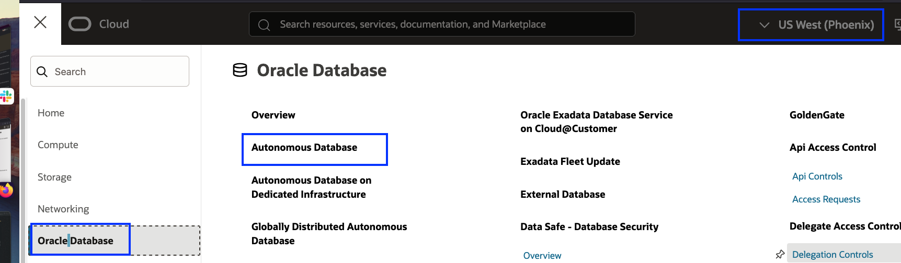

    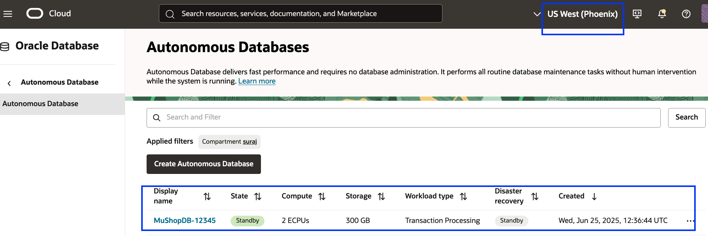

    Click the ATP database which should have like **"MuShopDB-XXXXX"** and in the Autonomous Database Information tab, copy the OCID of the ATP database and keep it safe. This is required for downloading the wallet in the next step.

    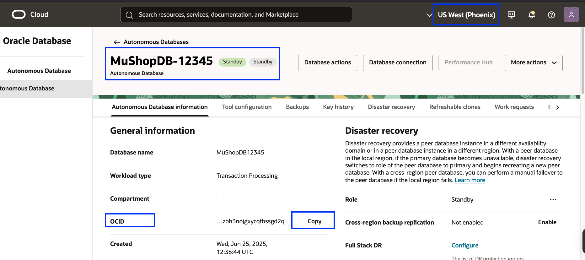

7.  Open the **Cloud Shell** using the icon next to the **Phoenix** region.  The Cloud Shell will open after a few seconds and shows the **prompt**. Input **N** for quitting the tutorial. The cloudshell prompt should show **us-phoenix-1** region.
  
    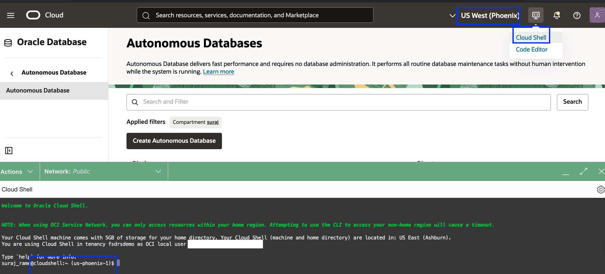

8. Download the ATP database wallet running in Phoenix using the Cloud Shell.In case if the Cloud Shell got disconnected, reconnect it again.

    You can maximize the Cloud Shell view and restore it as your requirements. For better viewing, you can use maximize option.

    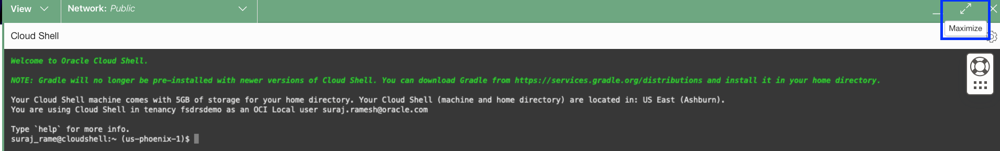

    **Make sure to modify the ATP database OCID for your database in the below command.You should replace the OCID after --autonomous-database-id  with your values which was captured in Step 6**

    ````
     <copy>oci db autonomous-database generate-wallet --generate-type ALL --file atpwallet_phoenix.zip --password Fsdrs@123 --autonomous-database-id ocid1.autonomousdatabase.oc1.phx.anyhqljt5h22avqaw32nmjoi7d5zhxbkt6txxxxxxxxxxxxx</copy>
    ````

    Copy the command and execute it in the Cloud Shell prompt. You should see the downloaded wallet file; verify it using the command.

    ````
     <copy>ls -ltr atpwallet_phoenix.zip</copy>
    ````

    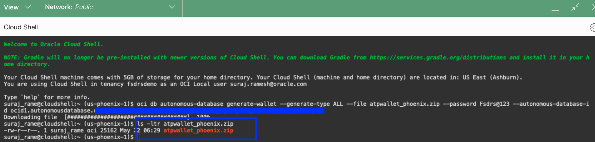

> 📌 **Note:** In case if you are getting "NotAuthorizedOrNotFound" error, make sure you are running the command in the Phoenix region and Cloud Shell shows phoenix region in the prompt.  

9.  Switch back to the **Ashburn** region Cloud Shell tab; the rest of Lab 1 will be completed in the **Ashburn** region.Rest of the Lab 1 steps must continue in the **Ashburn** region only.

    Download the private key for connecting to MuShop compute VM's using the below command in the Cloud Shell.

    ````
    <copy>wget https://c4u04.objectstorage.us-ashburn-1.oci.customer-oci.com/p/EcTjWk2IuZPZeNnD_fYMcgUhdNDIDA6rt9gaFj_WZMiL7VvxPBNMY60837hu5hga/n/c4u04/b/livelabsfiles/o/labfiles/mushoppk</copy>
    ````

    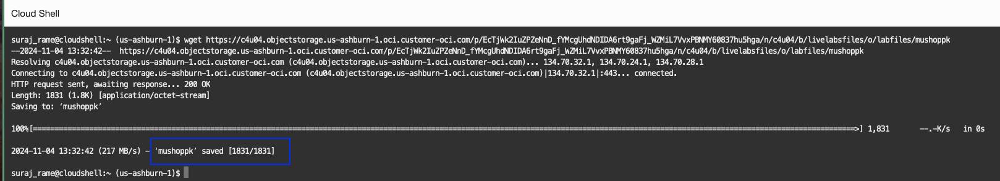

10. Change the permission of the private key to `0600` in in the Cloud Shell

    ````
    <copy>chmod 0600 mushoppk</copy>
    ````

11. Use the other tab of the browser, open the Hamburger menu, select **Compute**, then **Instances**, and verify that the selected region is **Ashburn**.

    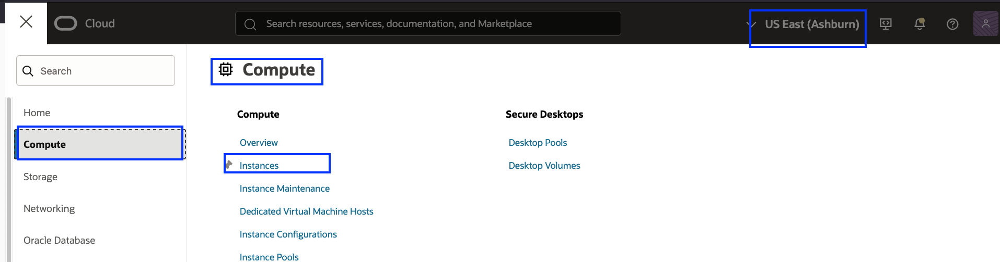

    Gather the Public IP from the two MuShop application instances. **mushop-xxxxx-0-->Node 0** and **mushop-xxxxx-1-->Node 1**. In case if you are not able to view the instances, select the correct compartment assigned to you. Refer Step-2 for more details.

    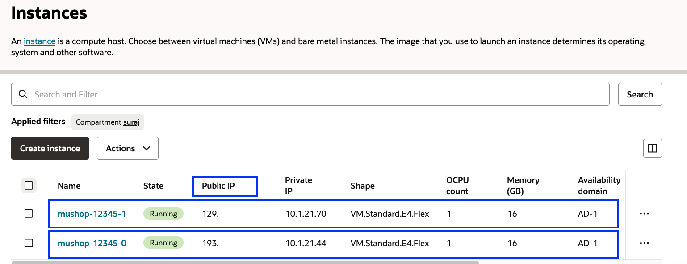

12. Navigate to the Cloud Shell browser tab in **Ashburn** region and use `scp` (Secure Copy) to transfer the ATP wallet files (Ashburn and Phoenix) to both MuShop application compute instances: `mushop-xxxxx-0` and `mushop-xxxxx-1`.

    ````
    <copy>scp -i mushoppk atpwallet_ashburn.zip atpwallet_phoenix.zip opc@publicipnode0:/home/opc</copy>
    ````

    ````
    <copy>scp -i mushoppk atpwallet_ashburn.zip atpwallet_phoenix.zip opc@publicipnode1:/home/opc</copy>
    ````

    Replace `publicipnode0` and `publicipnode1` with the public IP addresses (from Step 11) of `mushop-xxxxx-0` and `mushop-xxxxx-1` respectively in the `scp` commands.  

    Execute the `scp` commands in the Cloud Shell; when prompted for confirmation, type **yes**. Verify that the ATP wallets for both **Ashburn** and **Phoenix** are successfully transferred to both MuShop application compute instances.


    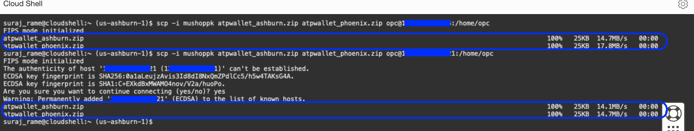

## Task 2: Connect to application VM instances and run the application script

1. **Use Ashburn region for all the steps**.From the existing Cloud Shell, Connect to MuShop App VM **mushop-xxxxx-0**, replace `publicipnode0` with the public IP address of mushop-xxxxx-0. Refer task 1.11 to get the public IP address of mushop-xxxxx-0.

    ````
    <copy>ssh -i mushoppk opc@publicipnode0</copy>
    ````

    Once its connected, use ls -ltr atpwa* command in the shell. You should be able to see the ATP wallet files from both Ashburn and phoenix region files which we transferred in previous step.

    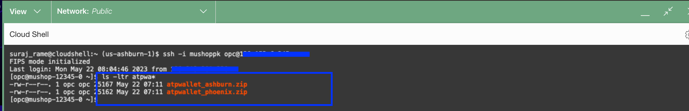

2. Mushopapp script has been created to unzip the wallet files,modify changes in the mushop env files,copy the wallet to oracle client and restart the mushoapp.

    Execute the mushopapp script

    ````
    <copy>./mushopapp</copy>

    ````
3. Verify for successful execution of script and exit from mushop-xxxxx-0 node

    ````
    <copy>exit</copy>
    ````
    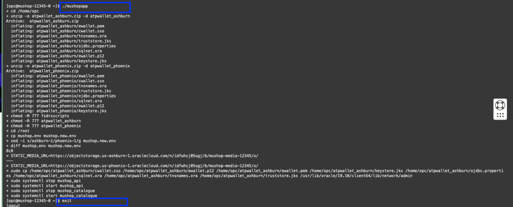

4. From the existing Cloud Shell,Connect to MuShop App VM **mushop-xxxxx-1**, replace `publicipnode1` with the public IP address of mushop-xxxxx-1.Refer task 1.11 to get the public IP address of mushop-xxxxx-1.

    ````
    <copy>ssh -i mushoppk opc@publicipnode1</copy>
    ````
    Once its connected, use ls -ltr atpwa* command in the shell. You should be able to see the ATP wallet files from both Ashburn and phoenix region files which we transferred in previous step.

    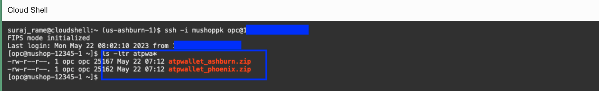

5. Execute the mushopapp script

    ````
    <copy>./mushopapp</copy>
    ````

6.  Verify for successful execution of script and exit from mushop-xxxxx-1 node

    ````
    <copy>exit</copy>
    ````
    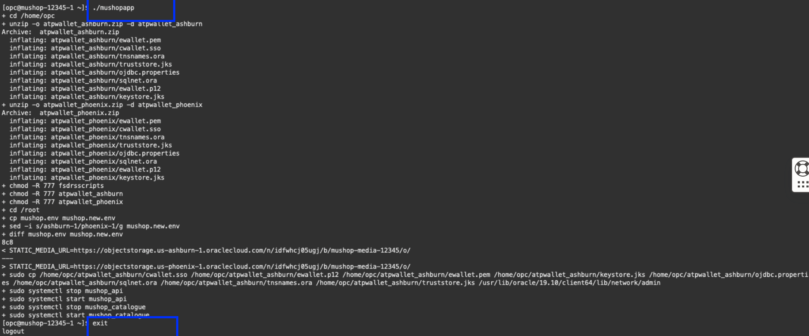

You may now [Proceed to the next lab](#next)

## Acknowledgements

- **Author** - Suraj Ramesh,Principal Product Manager,Oracle Database High Availability (HA), Scalability and Maximum Availability Architecture (MAA)
- **Last Updated By/Date** - Suraj Ramesh, July 2025

