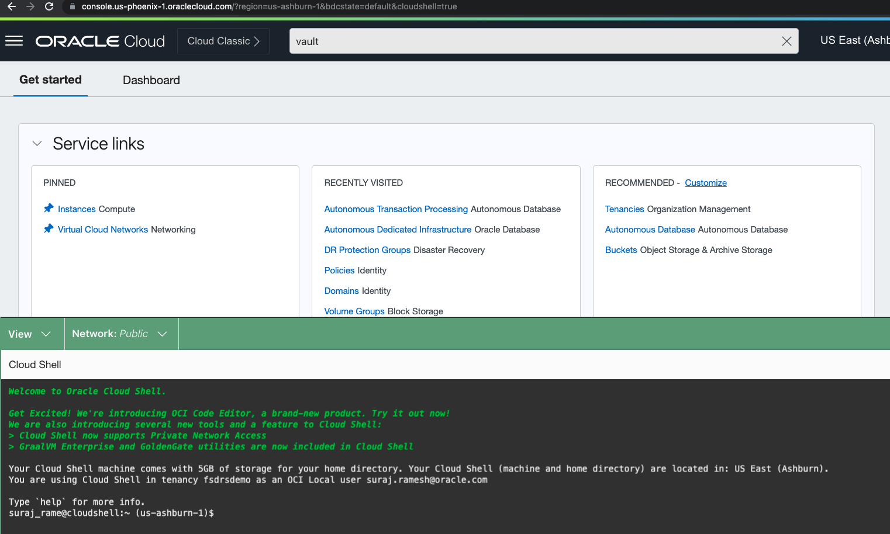
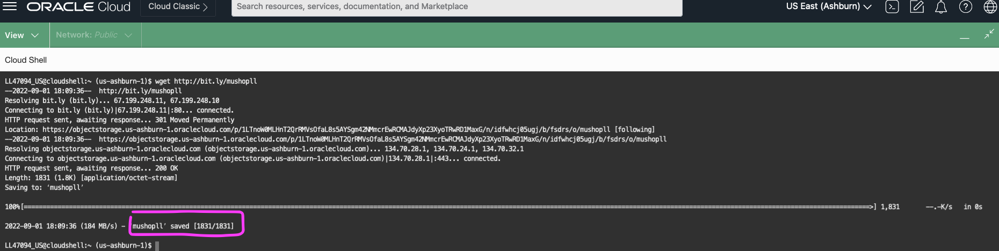

# **Prepare the environments for using the Full Stack DR Service**

## Introduction

In this lab, we will download Autonomous Database Wallet and the prepare the MuShop application virtual machines which are required to work with Full Stack DR Service

Estimated Lab Time: 10 Minutes

Watch the video below for a quick walk through of the lab.

[](youtube:6Dp49VXqjtQ)

### Objectives

- Download Autonomous Database Wallet using Cloud Shell and transfer the Wallet to application VM instances.
- Connect to application VM instances and create application environment files

*****Primary Region is Ashburn and all the steps as part of this lab has to be performed in Ashburn Region*****

## Task 1: Download Autonomous Database Wallet using Cloud Shell and transfer the Wallet to application VM instances

1. Login into OCI Console with your provided Credentials. Primary region should be **Ashburn**.

  

2. Open the **Cloud Shell** using the icon next to the region.  If you get a policy error, ensure you have chosen the correct compartment which was assigned to you.

  
  

  The Cloud Shell opens after a few seconds and shows the **prompt**.

3. As next step, need to gather the OCID( Oracle Cloud Identifier) of the ATP database.Leave the existing Cloud Shell browser tab and use duplicate tab to open a new tab in browser.

   From the Hamburger menu, select **Oracle Database**, then **Autonomous Transaction Processing**.

  

  You should be able to see an ATP database, similar to below. Make sure who change to the compartment which was assigned to you.

  

  Click the ATP database which should have like **"MuShopDB-XXXXX"** and in the Autonomous Database Information tab, copy the OCID of the ATP database and keep it safe. This is required for downloading the wallet in the next step.

  

4. Download the ATP Wallet for this lab using the Cloud Shell. Switch to the first tab of your browser, where Cloud Shell was initially opened. In case if the Cloud Shell got disconnected, reconnect it again.

   You can maximize the Cloud Shell view and restore it as your requirements. For better viewing, you can use maximize option.

   

   **Make sure to modify the ATP database OCID for your database in the below command.You should replace the OCID after --autonomous-database-id  with your values which was captured in Step 3**

    ````
     <copy>oci db autonomous-database generate-wallet --generate-type ALL --file atpwallet.zip --password Fsdrs@123 --autonomous-database-id ocid1.autonomousdatabase.oc1.iad.xxxxxxxxxxxxxxxxxxxxxx</copy>
    ````

    Copy the command and execute in Cloud Shell prompt.You should be able to see the Wallet file which was downloaded. Verify that using the list command ls -ltr as provided in the screenshot.

   

5. Download the private key for the Oracle Cloudworld LiveLab using the below command in the Cloud Shell.

    ````
    <copy>wget http://bit.ly/mushopll</copy>
    ````

    

6. Change the permission of the private key to `0600` in in the Cloud Shell

    ````
    <copy>chmod 0600 mushopll</copy>
    ````

7. Use the other tab of the browser, From the Hamburger menu, select **Compute**, then **Instances**. Verify the region as **Ashburn**

    

    Gather the Public IP from the two MuShop application instances. **mushop-xxxxx-0  -- Node 0** and **mushop-xxxxx-1  -- Node 1**

    

8. Scp (Secure copy) the ATP Wallet to MuShop Application compute instances (both Node 0 and Node 1)

    ````
    <copy>scp -i mushopll atpwallet.zip opc@publicipnode0:/home/opc</copy>
    ````

    ````
    <copy>scp -i mushopll atpwallet.zip opc@publicipnode1:/home/opc</copy>
    ````

Replace `publicipnode0` and `publicipnode1` with the public IP address of both mushop-xxxxx-0 and mushop-xxxxx-1 respectively in the scp commands.

   Execute the scp commands in the cloud shell and while it prompts for confirmation key in as yes. Make sure the ATP Wallet is transferred successfully to both MuShop Applicaiton nodes.

   

## Task 2: Connect to application VM instances and customize the application environment files

1. Connect to MuShop App VM mushop-xxxxx-0, replace `publicipnode0` with the public IP address of mushop-xxxxx-0. Refer task 1.7 to get the public IP address of mushop-xxxxx-0.

    ````
    <copy>ssh -i mushopll opc@publicipnode0</copy>
    ````
   Once its connected, use ls -ltr command in the shell. You should be able to see the atpwallet.zip file which we transferred in previous step.

   

2.  Download the script to run custom changes as part of MuShop application requirement

    ````
    <copy>wget http://bit.ly/mushopapp.sh</copy>
    ````

3. Provide execute permission for the mushopapp.sh script in /hom/opc directory. 

    ````
    <copy>chmod +x mushopapp.sh</copy>
     ````

4.  Execute the mushoapp.sh script

    ````
    <copy>./mushopapp.sh</copy>
    ````

    

5. Connect to MuShop App VM mushop-xxxxx-1, replace `publicipnode1` with the public IP address of mushop-xxxxx-1. Refer task 1.7 to get the public IP address of mushop-xxxxx-1.

    ````
    <copy>ssh -i mushopll opc@publicipnode1</copy>
    ````
   Once its connected, use ls -ltr command in the shell. You should be able to see the atpwallet.zip file which we transferred in previous step.

   

2.  Download the script to run custom changes as part of MuShop application requirement

    ````
    <copy>wget http://bit.ly/mushopapp.sh</copy>
    ````

3. Provide execute permission for the mushopapp.sh script in /hom/opc directory. 

    ````
    <copy>chmod +x mushopapp.sh</copy>
     ````

4.  Execute the mushoapp.sh script

    ````
    <copy>./mushopapp.sh</copy>
    ````

    


This concludes this Lab 1. Now you can move to Lab 2.

## Acknowledgements

- **Author** -  Suraj Ramesh, Principal Product Manager, Oracle Database Maximum Availability Architecture Team
- **Last Updated By/Date** -  Suraj Ramesh,August 2022
