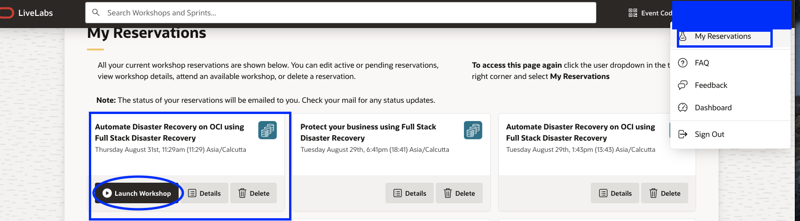
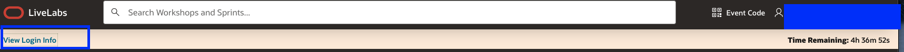

# Get started - LiveLabs login

## Introduction

Welcome to your LiveLabs Sandbox environment.
In order to start your workshop, you need to login to our LiveLabs Sandbox.

In this lab, we are going to show you where you can find the login information and how to log in to the LiveLabs Sandbox.

Estimated Time: 5 minutes

### Objectives

- View login information to LiveLabs Sandbox
- Login to LiveLabs Sandbox

## Task 1: View Login Information

1. After creating a reservation for a LiveLab Workshop, you will receive an e-mail indicating that your reservation is being processed, followed by an e-mail indicating that your environment has been created.

  

  >**Note:** You will receive the second created e-mail just before your selected reservation time.

2. Log into LiveLabs. Click your username, and click **My Reservations**. Then click the **Launch Workshop** link for the Workshop environment you'd like to use. Note that you may have several Workshops listed.

  

3. Click **View Login Info** and click **Launch OCI**.
  

4. Follow the instructions provided to log in to your Oracle Cloud account,provide the username and password, change your password, and complete your login to Oracle Cloud.

  
  

5. If you need to view your login information anytime, click **View Login Info**.
  

You may now [Proceed to the next lab](#next)

## Acknowledgements

- **Author** - Suraj Ramesh, Principal Product Manager,Oracle Database High Availability (HA), Scalability and Maximum Availability Architecture (MAA)
- **Last Updated By/Date** -  Suraj Ramesh, Jul 2025