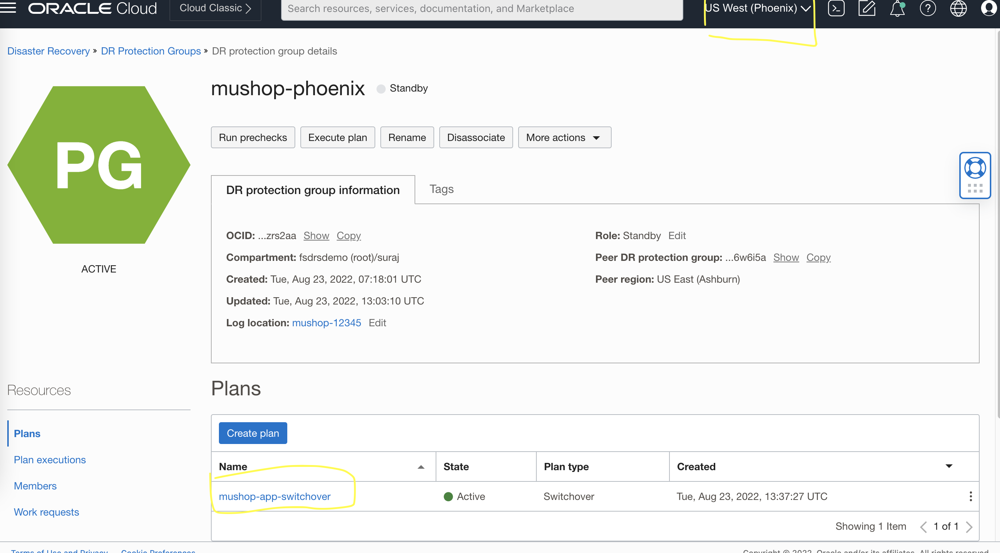
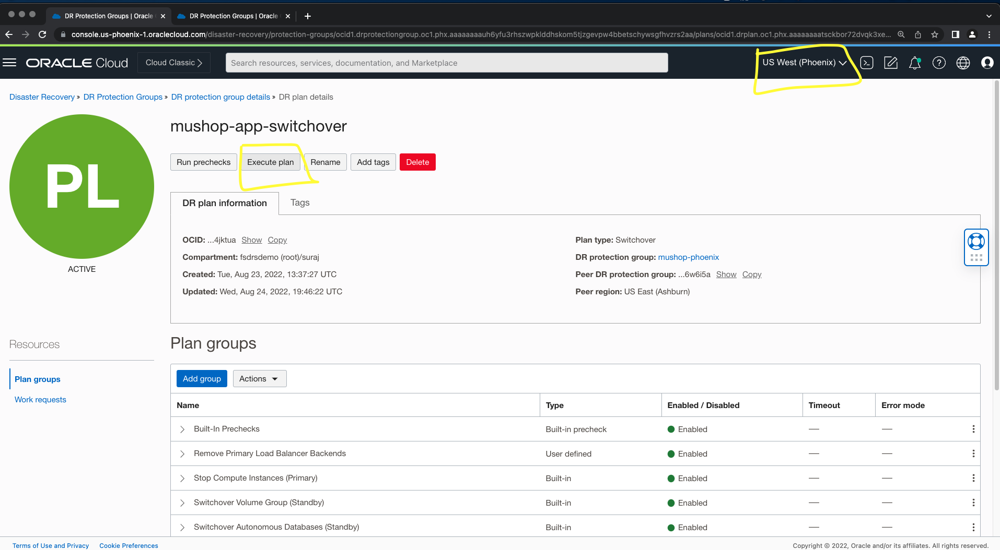
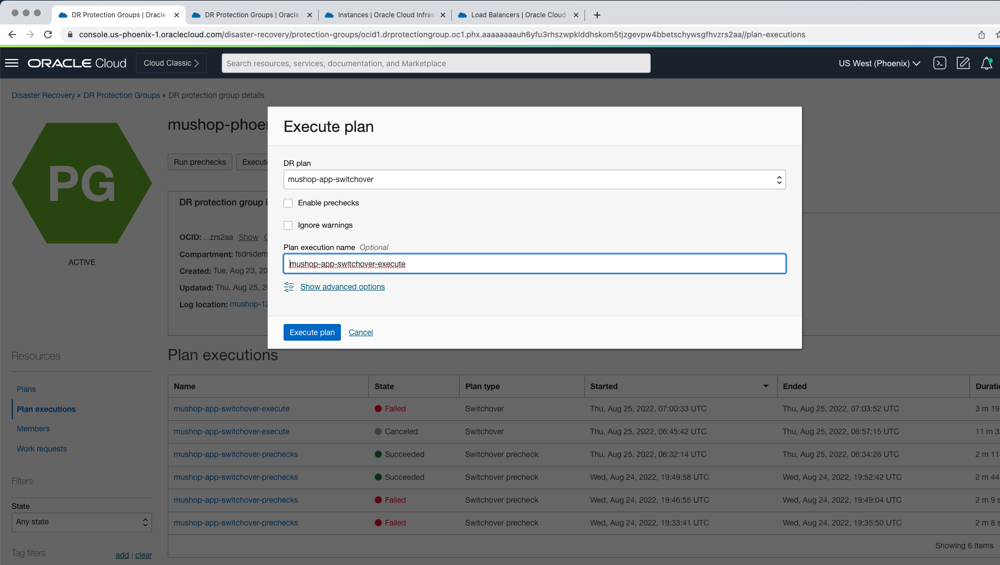
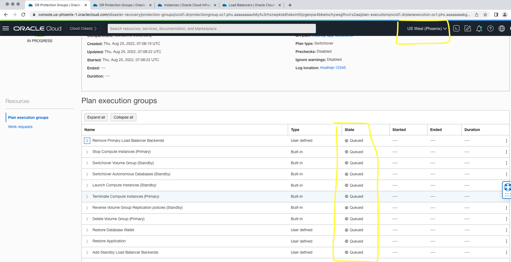
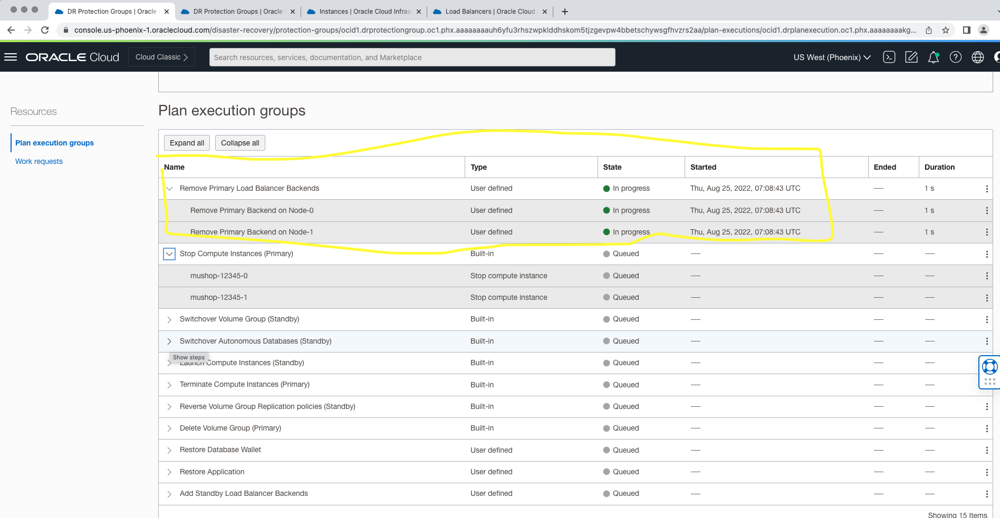
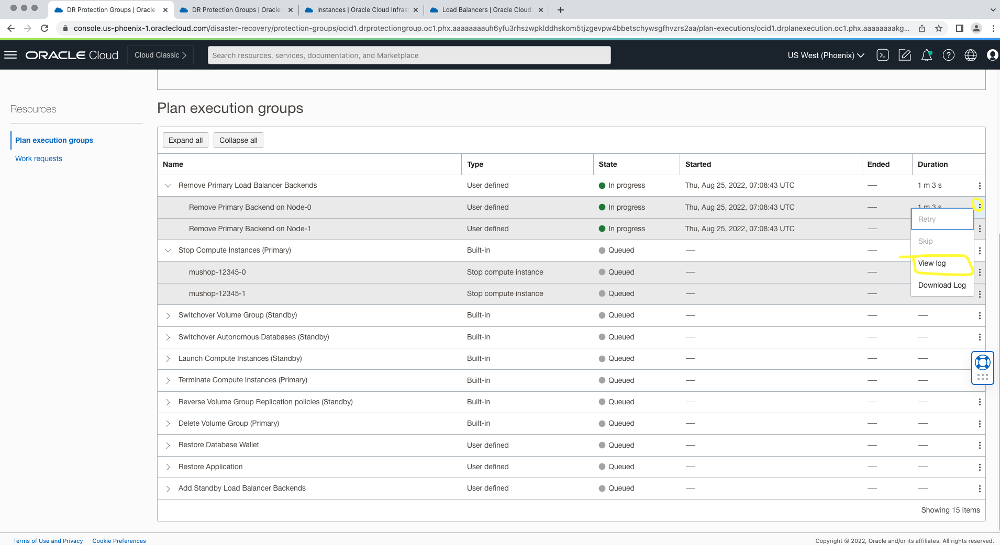
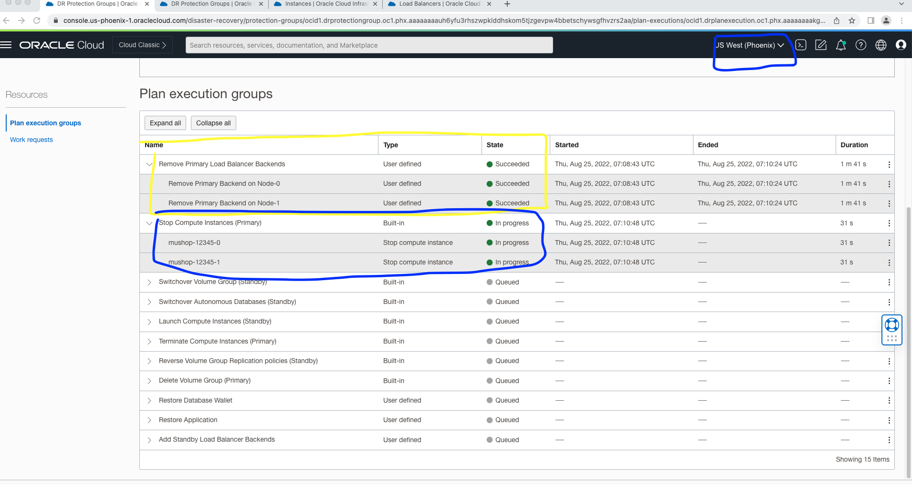
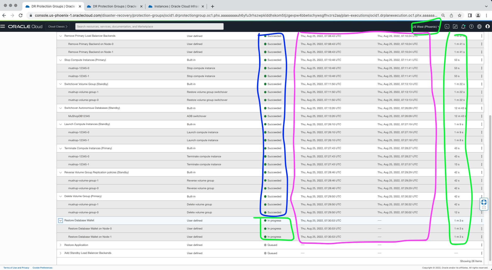
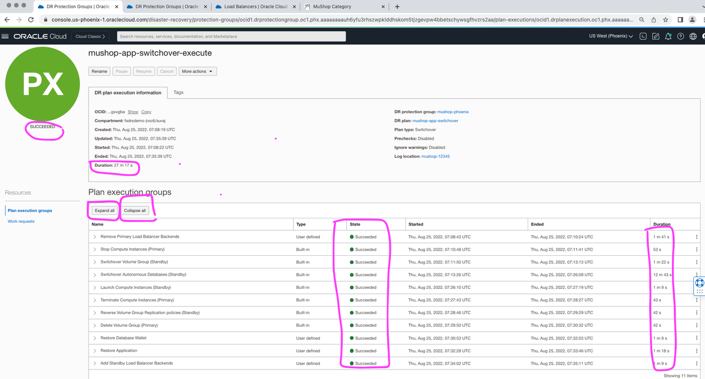

# Perform pre-checks for the DR Switchover Plan

## Introduction

In this lab, we will execute actual switchover plan for the **mushop-app-switchover** switchover plan which we have created in lab4. The  switchover plan will execute the series of steps as per the switchover plan.

Estimated Lab Time: 20 Minutes

Watch the video below for a quick walk through of the lab.

### Objectives

- Execute the switchover plan
- Monitor the executed switchover plan
- Verify the executed switchover plan

## Task 1: Execute switchover for mushop-app-switchover plan

1. Login into OCI Console with your provided Credentials. Select region as **Pheonix**.

  

2. From the Hamburger menu, select **Migration and Disaster Recovery**, then **Disaster Recovery Protection Groups**.Verify the region is **Phoenix**

  

3. You will land up in the Disaster Recovery Protection group home page, make sure you have selected the Phoenix region.

  

4. Select the **mushop-phoenix** DRPG and select **mushop-app-switchover** plan

  

5. Navigate to **Execute Plan** section which will be right below the **mushop-app-switchover** plan and select

  

6. In the **Execute Plans** window

- Provide the Plan execution name as **mushop-app-switchover-execute**
- Uncheck the **Enable prechecks**  (  Prechecks was executed successfully in Lab 5)
- Leave the **Ignore warnings** as it is
- Verfiy and hit **Execute Plan**

  

## Task 2: Monitor the executed mushop-app-switchover plan

1. Navigate to **Plan executions** section under **Resources** and select the **mushop-app-switchover-execute** plan execution.Initially it will show as all the steps as *Queued**.

  

2. Refresh the page, within few seconds the **State** will change from *Queued* to *In Progess*. 

  

3. All the *plan group* will run serially, but steps inside each *plan group* will in parallel.  As an example, *Remove Primary Load Balancer Backends* group will start first, the steps (Remove Primary Backend on Node-0 and Remove Primary Backend on Node-1) which are part of this group will run in parallel.

4. Monitor the various plan group and steps which are running. Navigate to three dots section for the respective plan group step and click. You get option to view log and download log. These logs are stored in the object storage bucket which was provided during the DRPG creation. You can monitor the progress and download log if required for any troubleshooting.

   

5. Once the each plan group is executed successfully, it will move on to next group for execution. Here you can see  *Remove Primary Load Balancer Backends*  completed successfully (State-Succeeded) and the next group **Stop Compute Instances (Primary)** started running (State-In-progress).

   

6. Keep monitoring the rest of groups and steps, each step will complete depending on the actual task (DB Switchover, VM Stop, Script execution ) etc). For example, ATP DB Switchover will take more time when comparing to stop VM. You can verify the start and end of each step, total duration, logs etc.
 
   
 
7. Wait for all the steps to complete successfully. Approximately it will take *20-30* mins to complete the switchover plan. This timings may vary.

## Task 3: Verify the executed switchover plan

1. From the plan execution detail verify the duration of each step, status, duration of entire switchover plan etc. *It is important to have successful completion of all steps* . Use the Expand all button for expanding all the steps and Collapse all button for collapsing all the steps.Use the view or download log option to see the details of step execution.

      

This concludes this Lab 6. Now you can move to Lab 7. 

Refer the **Troubleshooting tips** section for known failures and correction actions.

## Troubleshooting tips 

1. 

## Acknowledgements

- **Author** -  Suraj Ramesh, Principal Product Manager
- **Last Updated By/Date** -  Suraj Ramesh,August 2022
