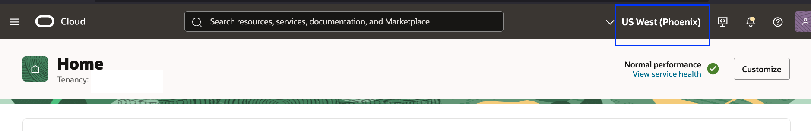
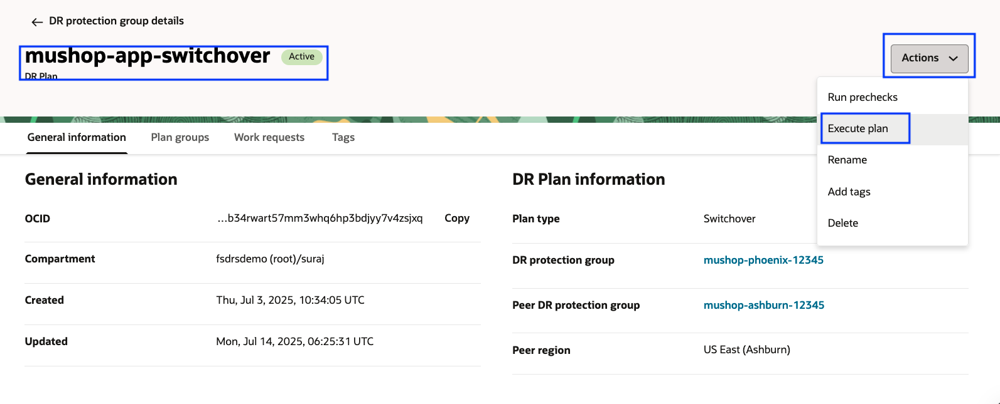
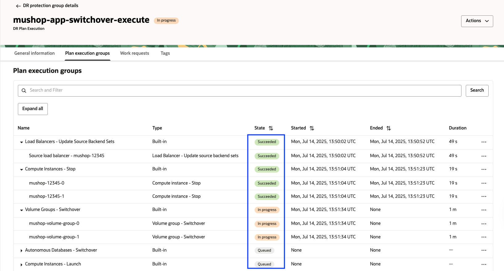
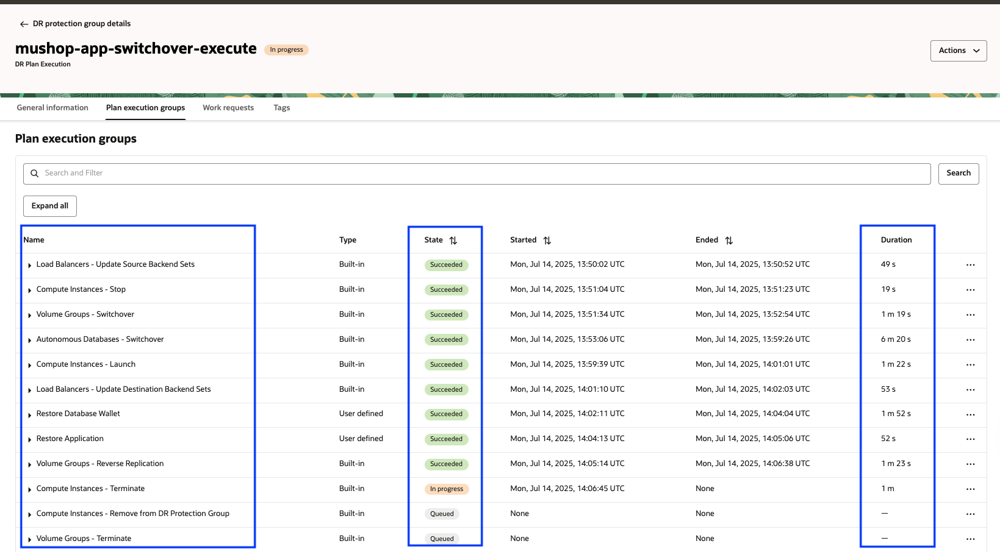
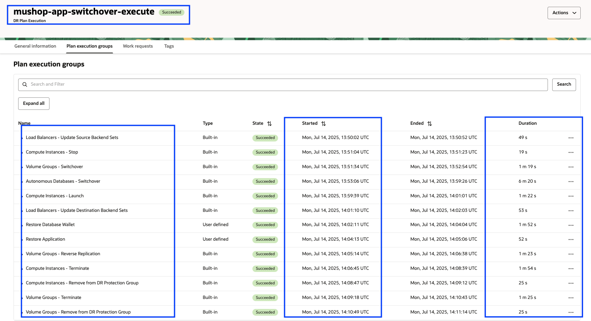

# Execute the DR Switchover plan

## Introduction

In this lab, we will execute the actual **switchover** using the **mushop-app-switchover** plan created in the previous lab.The switchover plan will carry out a predefined series of steps to transition the application environment as part of the switchover process.

**Estimated Time**: 30 Minutes

### Objectives

- Execute the switchover plan
- Monitor the executed switchover plan
- Verify the executed switchover plan

## Task 1: Execute the switchover plan

1.  Login into OCI Console with your provided Credentials. Select region as **Phoenix**.

    

2.  Open the **Hamburger menu (☰)** and select **Migration and Disaster Recovery**. Then go to **Disaster Recovery → DR Protection Groups** and Confirm that the **region is set to Phoenix**.

    

3.  You will land on the Disaster Recovery Protection group home page; make sure you have selected the Phoenix region. **DR Plans always be created and executed in the Standby DRPG (Phoenix region)**

    

4.  Select the **mushop-phoenix-xxxxx** DRPG, navigate to the **Plans** tab, and select the **mushop-app-switchover** plan.

    

5.  Use the **Actions** button and click **Execute Plan**

    

6.  In the **Execute DR Plan** window

    - Toggle the **Enable prechecks** button (Prechecks was executed successfully in previous lab)
    - Leave the **Ignore warnings** as it is
    - Provide the Plan execution name as **mushop-app-switchover-execute**
    - Verify and hit **Execute Plan**

    

## Task 2: Monitor the executed switchover plan

1.  Navigate to the **Plan Executions** section and select the **mushop-app-switchover-execute** plan execution. Then, go to the **Plan Execution Group** tab.Initially, you will see all the **Built-in Prechecks** listed with the status *Queued*.

    

2.  Refresh the page; within a few seconds, the **State** will change from *Queued* to *In Progress*.

    

3.  All the *plan groups* will run serially, but steps inside each *plan group* will run in parallel.

4.  Monitor the various plan group and steps which are running.To do this, navigate to the **three dots (...)** next to the respective built-in step and click on it. You will see options to **View Log** and **Download Log**. These logs are stored in the **Object Storage bucket** that was provided during the DRPG creation. Downloading the logs can be helpful for **troubleshooting**, if needed.

    

5.  Keep monitoring the rest of the groups and steps; each step will complete depending on the actual task (DB Switchover, VM Stop, Script execution ), etc.). For example, ATP DB Switchover will take more time when comparing to stopping the VM. You can verify the start and end of each step, total duration, logs, etc.

    

6.  Wait for all the steps to complete successfully.  It is important to monitor the progress of each step and take necessary actions in case of any failures.

    **Approximately it will take *20-30* mins to for successful switchover plan execution**

## Task 3: Verify the executed switchover plan

1. From the **Plan Execution Group** details, verify the **duration of each step**, overall **status**, and **total execution time** of the switchover plan. *It is essential to have successful completion of all steps.* 

   In this example, the overall switchover plan execution took approximately **22 minutes** to complete.Timings may vary depending on factors such as **Autonomous Database switchover**, **Compute stop/launch**, and **Custom script execution**. Use the **Expand All** button to view all steps and **Collapse All** to minimize them. Click **View Log** or **Download Log** to examine step execution details.  

    

    

You may now [Proceed to the next lab](#next)

Refer to the **Troubleshooting tips** section for known failures and corrective actions.

## Troubleshooting tips

1. If any of the Step fails, verify the log and take necessary actions.
2. If you cancel the plan, the DR protection groups goes to need attention, then you must reset the DR protection groups in both regions. Refer to [Full Stack DR documentation](https://docs.oracle.com/en-us/iaas/disaster-recovery/doc/cancel-dr-plan-executions.html) for more details. 

## Acknowledgements

- **Author** - Suraj Ramesh,Principal Product Manager,Oracle Database High Availability (HA), Scalability and Maximum Availability Architecture (MAA)
- **Last Updated By/Date** - Suraj Ramesh, July 2025
