# Create and Customize the DR Switchover Plan

## Introduction

In this lab, we will create a DR Switchover plan and customize the plan with additional steps. Ashburn is a primary region, and Phoenix is the standby region. Full Stack DR support the below plan types

- Switchover: Shutdown at primary, then transition to standby
- Failover: Recover at standby
- Start Drill: Perform a complete dry run of a failover for validation
- Stop Drill: Tear down workload (created or converted during Start Drill plan) at standby

This lab will focus on how to create a Switchover plan and customize the plan as per MuShop application requirements. DR Plan *must* be created in the standby region (Phoenix). It is because, in the case of the worst-case scenario, the entire primary region outside the Full Stack DR will not be accessible from the primary region.

Estimated Time: 20 Minutes

### Objectives

- Create a Switchover plan
- Gather Load Balancer OCID's
- Customize the Switchover plan- Remove Primary Load Balancer Backends group
- Customize the Switchover plan- Restore Database Wallet group
- Customize the Switchover plan- Restore the Application Group
- Customize the Switchover plan- Add Standby Load Balancer Backends group
- Review the Switchover plan- Reorder groups

## Task 1: Create a Switchover plan

1.  Login into OCI Console with your provided Credentials. Select region as **Phoenix**.

    

2.  Select Migration and Disaster Recovery from the Hamburger menu, then **Disaster Recovery** -> **DR Protection Groups**. Verify the region is **Phoenix**

    

3.  You will land on the Disaster Recovery Protection group home page; make sure you have selected the Phoenix region. **DR Plans always be created in the Standby DRPG (Phoenix region)**

    

4. Select the **mushop-phoenix** DRPG and navigate to Plans under the resources section.

    

    - Create plan
    - Name as **mushop-app-switchover**
    - Plan type as **Switchover (planned)**
    - Hit Create

    

    The plan will start creating; select the plan **mushop-app-switchover**.

    

    Refresh the DR Plan page if required. You can monitor the request's status in the **Work requests** section under Resources. Within a minute, the plan will get created, and it should be in *active* State.

    

    Select the **mushop-app-switchover** plan, and you should be able to various built-in plan groups.

    

    Based on the members we added in both primary and standby DRPG, Full Stack DR created these built-in plans. You can navigate the plan groups to see the various steps created.

    

    - Built-in Prechecks - These are prechecks for the app, DB, and volume group switchover
    - Stop Compute Instances (Primary) - Stop app virtual machines in the Ashburn region (primary)
    - Switchover Volume Group (Standby) - Switchover volume group in the phoenix region (standby)
    - Switchover Autonomous Databases (Standby) - Switchover ATP DB from Ashburn to Phoenix region
    - Launch Compute Instances (Standby) - Create virtual machines in the phoenix region (standby)
    - Remove Compute Instances From DR Protection Group (Primary)- Remove compute instances from the Ashburn(primary) DRPG
    - Terminate Compute Instances (Primary) - Terminate compute instances in the Ashburn region (primary). By default the plan group is disabled, it can be enabled depending on the requirements.
    - Reverse Volume Group Replication (Standby)- Set up reverse volume group replication from Phoenix to Ashburn region
    - Remove Volume Groups From DR Protection Group (Primary)-Remove volume group from the Ashburn(primary) DRPG
    - Terminate Volume Group (Primary)- Terminate volume groups in the Ashburn region (primary). By default the plan group is disabled, it can be enabled depending on the requirements.

## Task 2: Gather Load Balancer OCID's

1.  As a prerequisite, we need to gather OCIDs (Oracle Cloud Identifier) of load balancers running in the Ashburn (Primary) and Phoenix (Standby) region.

2.  Leave the existing DRPG console tabs as running. Now open two new OCI console tabs and ensure you are logged into the auburn region and phoenix region, respectively.

3.  From the Hamburger menu, select **Networking**, then **Load Balancers**. Make sure you are logged in to **Ashburn** region.
  
    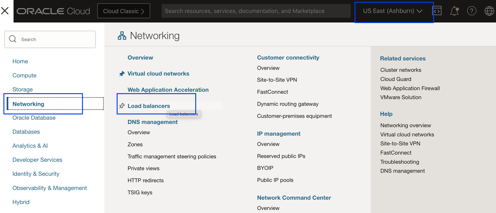

4. You should have a load balancer with the name **mushop-xxxx**; choose the right compartment assigned to you. Select the three dots on the right end of the load balancer details. Select **Copy OCID** and paste the OCID details safely into any preferred notes. You should have something similar to below

    **ocid1.loadbalancer.oc1.iad.aaaaaaaa2t4kwwavlgwghuebrcxxxxxxxxxxxxxxxxxxxxxxxxxxxxxxxxxx** (**Don't use this**)

    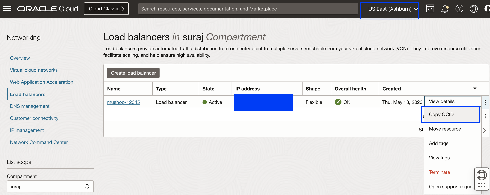

5.  From the Hamburger menu, select **Networking**, then **Load Balancers**. Make sure you are logged in to **Phoenix** region.
  
    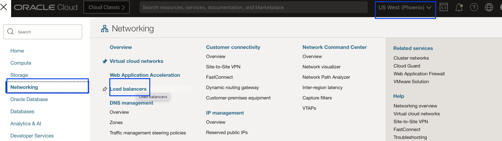

6.  You should have a load balancer with the name **mushop-xxxx**; choose the right compartment assigned to you. Select the three dots on the right end of the balancer details. Select **Copy OCID** and paste the OCID details safely into any preferred notes. You should have value something similar to below

    **ocid1.loadbalancer.oc1.phx.aaaaaaaaqo6sn6xku3vcuiqjbxxxxxxxxxxxxxxxxxxxxxxxxxxxxxxxxxxx**  (**Don't use this**)

    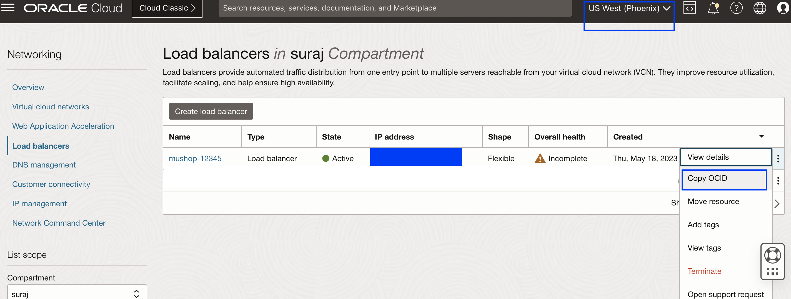


## Task 3: Customize the Switchover plan-Remove Primary Load Balancer Backends group

1.  Use the browser tab where you have created the switchover plan in phoenix region. Create user-defined groups for mushop application switchover. We need to create four user-defined groups. Let's create those. You can do this by selecting **Add group** in the *mushop-app-switchover* plan

    

2.  Enter **Remove Primary Load Balancer Backends** in the Group name and Click **Add Step**

    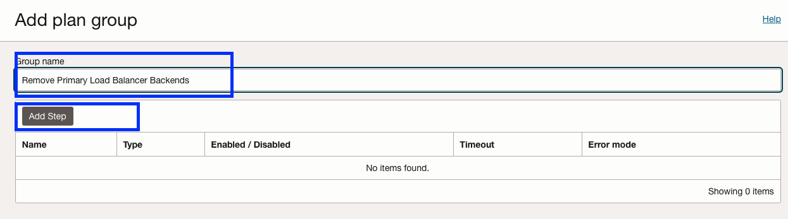

    - Add *Remove Primary Backend on Node-0* in Step name
    - Leave the enable step tick mark
    - Leave the default "3600" seconds in Timeout in seconds
    - In the region, select "US East (Ashburn)"
    - Select the "Run local script" option
    - Select "mushop-xxxxx-0" instance in "Target instance in compartment"
    - In script parameters, add the below script

    ````
    <copy>/usr/bin/sudo /home/opc/fsdrsscripts/removeFromBackendset.py <REPLACE WITH YOUR OCID></copy>
    ````

    **Replace the OCID of the primary (Ashburn) load balancer as per step 2.4; make sure you replace the OCID of your load balancer without fail in the above command,remove angle brackets,note there is space after removeFromBackendset.py**

    - Leave the field blank in "Run as user"
    - Verify all the details and hit Add Step

    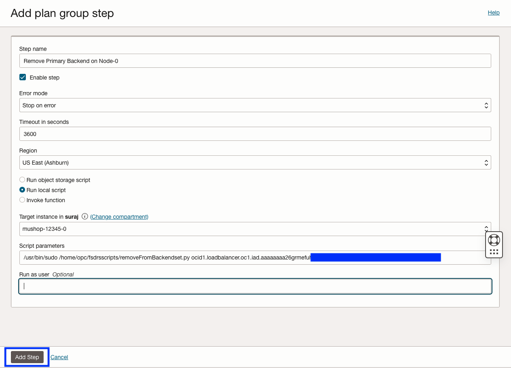

    - Verify the step has been added successfully for Node-0

    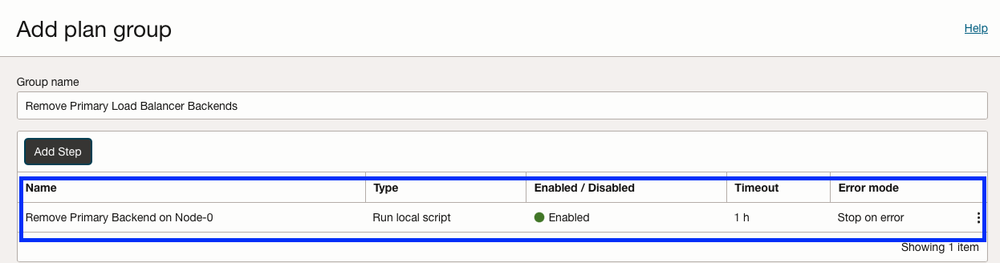

3. Add step for *Remove Primary Backend on Node-1*

    

    - Add *Remove Primary Backend on Node-1* in Step name
    - Leave the enable step tick mark
    - Select Error mode as "Stop on error"
    - Leave the default "3600" seconds in Timeout in seconds
    - In the region, select "US East (Ashburn)"
    - Select the "Run local script" option
    - Select "mushop-xxxxx-1" instance in "Target instance in compartment"
    - In script parameters, add the below script

    ````
    <copy>/usr/bin/sudo /home/opc/fsdrsscripts/removeFromBackendset.py <REPLACE WITH YOUR OCID></copy>
    ````

    **Replace the OCID of the primary (Ashburn) load balancer as per step 2.4; make sure you replace the OCID of your load balancer without fail in the above command,remove angle brackets,note there is space after removeFromBackendset.py**

    - Leave the field blank in "Run as user"
    - Verify all the details and hit Add Step

    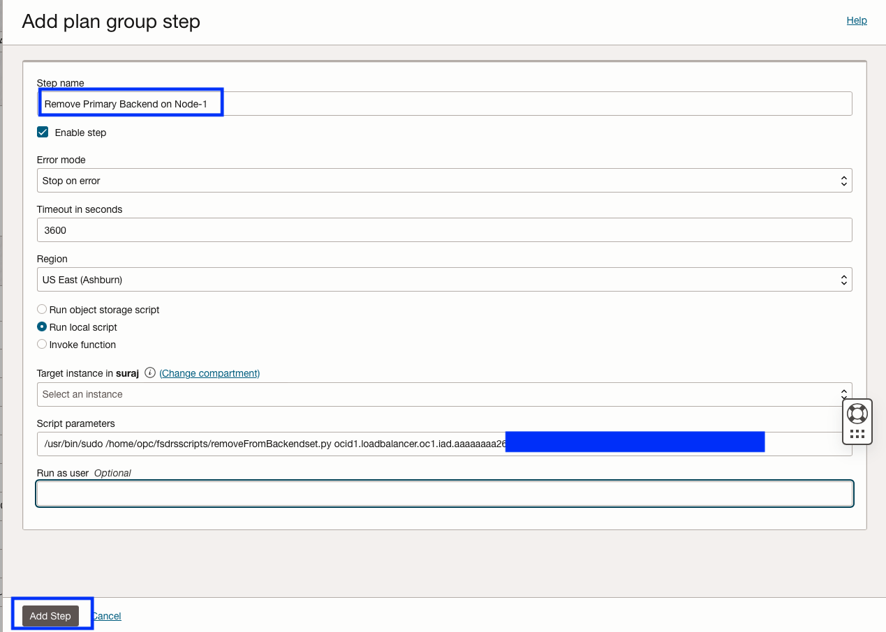

    - Verify the step has been added successfully for Node-1

    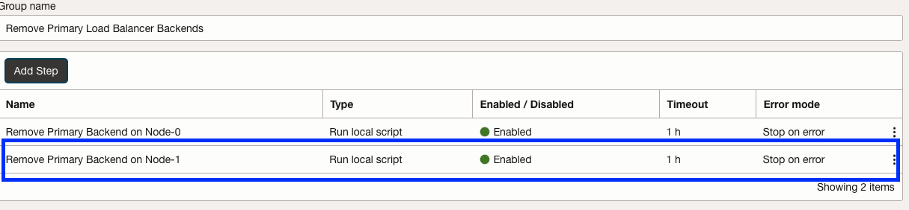
 
    - Click **Add**

    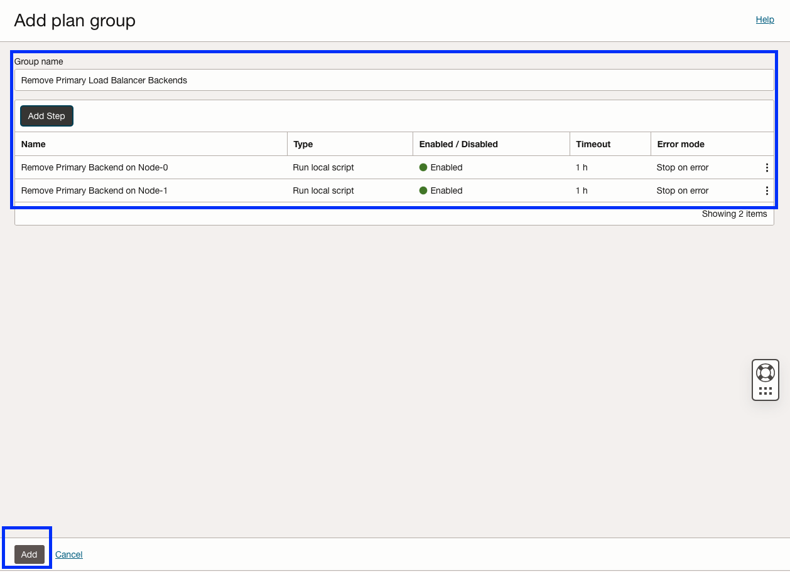

    **mushop-phoenix** DRPG will go into updating state, and after a few seconds, it will return to the active state. Refresh the DRPG page if required. You should be able to see that the *Remove Primary Load Balancer Backends* Plan group has created successfully with both steps.

    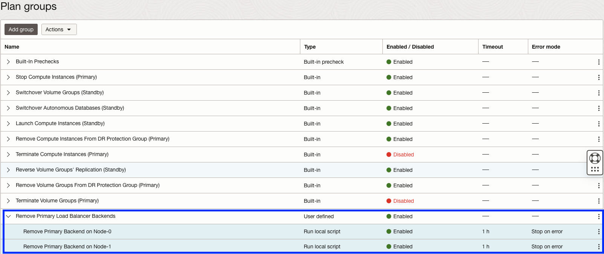


## Task 4: Customize the Switchover plan-Restore Database Wallet group

1.  Create a user-defined group for **Restore Database Wallet** This can be done by selecting **Add group** in the *mushop-app-switchover* plan

    

2.  Add **Restore Database Wallet** in the Group name and Click **Add Step**

    

    - Add *Restore Database Wallet on Node-0* in Step name
    - Leave the enable step tick mark
    - Select Error mode as "Stop on error."
    - Leave the default "3600" seconds in Timeout in seconds
    - In the region, select "US East (Ashburn)"
    - Select the "Run local script" option
    - Select "mushop-xxxxx-0" instance in "Target instance in compartment"
    - In script parameters, add the below script

    ````
    <copy>/usr/bin/sudo /home/opc/fsdrsscripts/mushop_db_wallet_restore.sh phoenix</copy>
    ````
    - Leave the field blank in "Run as user"
    - Verify all the details and hit Add Step
    
    

    - Verify the step has been added successfully for Node-0

    

3.  Add step for *Restore Database Wallet on Node-1*

    

    - Add *Restore Database Wallet on Node-1* in Step name
    - Leave the enable step tick mark
    - Select Error mode as "Stop on error."
    - Leave the default "3600" seconds in Timeout in seconds
    - In the region, select "US East (Ashburn)"
    - Select the "Run local script" option
    - Select "mushop-xxxxx-1" instance in "Target instance in compartment"
    - In script parameters, add the below script

    ````
    <copy>/usr/bin/sudo /home/opc/fsdrsscripts/mushop_db_wallet_restore.sh phoenix</copy>
    ````
    - Leave the field blank in "Run as user"
    - Verify all the details and hit Add Step
    
    

    - Verify the step has been added successfully for Node-1

    
 
    - Click **Add**

    

    **mushop-phoenix** DRPG will go into updating state, and after a few seconds, it will return to the active state. Refresh the DRPG page if required. You should be able to see that the *Restore Database Wallet* Plan group has created successfully with both steps.

    
 

## Task 5: Customize the Switchover plan-Restore the Application Group

1.  Create a user-defined group for **Restore Application**.This can be done by selecting **Add group** in the *mushop-app-switchover* plan

    

2.  Add **Restore Application** in the Group name and Click **Add Step**

    

    - Add *Restore Application on Node-0* in Step name
    - Leave the enable step tick mark
    - Select Error mode as "Stop on error."
    - Leave the default "3600" seconds in Timeout in seconds
    - In the region, select "US East (Ashburn)"
    - Select the "Run local script" option
    - Select "mushop-xxxxx-0" instance in "Target instance in compartment"
    - In script parameters, add the below script

    ````
    <copy>/usr/bin/sudo /home/opc/fsdrsscripts/mushop_reconfigure.sh ashburn phoenix</copy>
    ````
    - Leave the field blank in "Run as user"
    - Verify all the details and hit Add Step
    
    

    - Verify the step has been added successfully for Node-0

    

3.  Add step for *Restore Application on Node-1*

    

    - Add *Restore Application on Node-1* in Step name
    - Leave the enable step tick mark
    - Select Error mode as "Stop on error."
    - Leave the default "3600" seconds in Timeout in seconds
    - In the region, select "US East (Ashburn)"
    - Select the "Run local script" option
    - Select "mushop-xxxxx-1" instance in "Target instance in compartment"
    - In script parameters, add the below script

    ````
    <copy>/usr/bin/sudo /home/opc/fsdrsscripts/mushop_reconfigure.sh ashburn phoenix</copy>
    ````
    - Leave the field blank in "Run as user"
    - Verify all the details and hit Add Step
    
    

    - Verify the step has been added successfully for Node-1

    
 
    - Click **Add**

    

    **mushop-phoenix** DRPG will go into updating state, and after a few seconds, it will return to the active state. Refresh the DRPG page if required. You should be able to see that the *Restore Application* Plan group has created successfully with both steps.

    
 
## Task 6: Customize the Switchover plan- Add Standby Load Balancer Backends group

1.  Create a user-defined group for **Add Standby Load Balancer Backends**.This can be done by selecting **Add group** in the *mushop-app-switchover* plan

    

2.  Enter **Add Standby Load Balancer Backends** in the Group name and Click **Add Step**

    

    - Add *Add Standby Backend on Node-0* in Step name
    - Leave the enable step tick mark
    - Leave the default "3600" seconds in Timeout in seconds
    - In the region, select "US East (Ashburn)"
    - Select the "Run local script" option
    - Select "mushop-xxxxx-0" instance in "Target instance in compartment"
    - In script parameters, add the below script

    ````
    <copy>/usr/bin/sudo /home/opc/fsdrsscripts/addToBackendset.py <REPLACE WITH YOUR OCID></copy>
    ````

    **Replace the OCID of the standby (Phoenix) load balancer as per step 2.6; make sure you replace the OCID of your load balancer without fail in the above command,remove angle brackets,note there is space after addToBackendset.py**

    - Leave the field blank in "Run as user"
    - Verify all the details and hit Add Step

    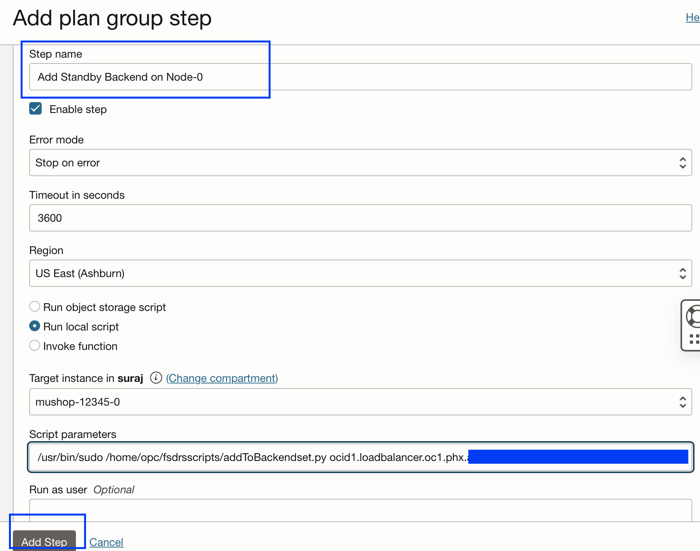

    - Verify the step has been added successfully for Node-0

    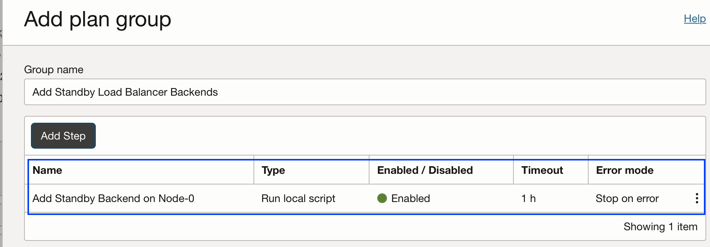

3. Add step for *Add Standby Backend on Node-1*

    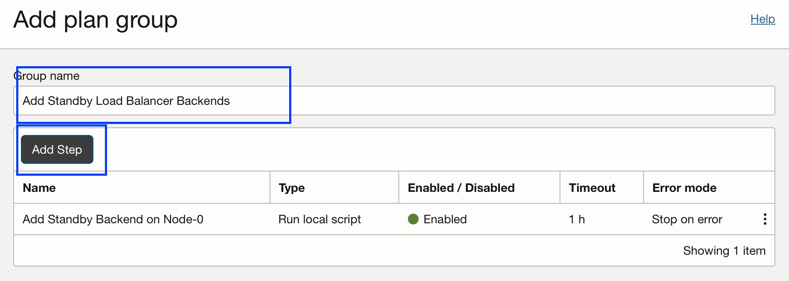

    - Add *Add Standby Backend on Node-1* in Step name
    - Leave the enable step tick mark
    - Select Error mode as "Stop on error"
    - Leave the default "3600" seconds in Timeout in seconds
    - In the region, select "US East (Ashburn)"
    - Select the "Run local script" option
    - Select "mushop-xxxxx-1" instance in "Target instance in compartment"
    - In script parameters, add the below script

    ````
    <copy>/usr/bin/sudo /home/opc/fsdrsscripts/addToBackendset.py <REPLACE WITH YOUR OCID></copy>
    ````

    **Replace the OCID of the standby (Phoenix) load balancer as per step 2.6; make sure you replace the OCID of your load balancer without fail in the above command,remove angle brackets,note there is space after addToBackendset.py**

    - Leave the field blank in "Run as user"
    - Verify all the details and hit Add Step

    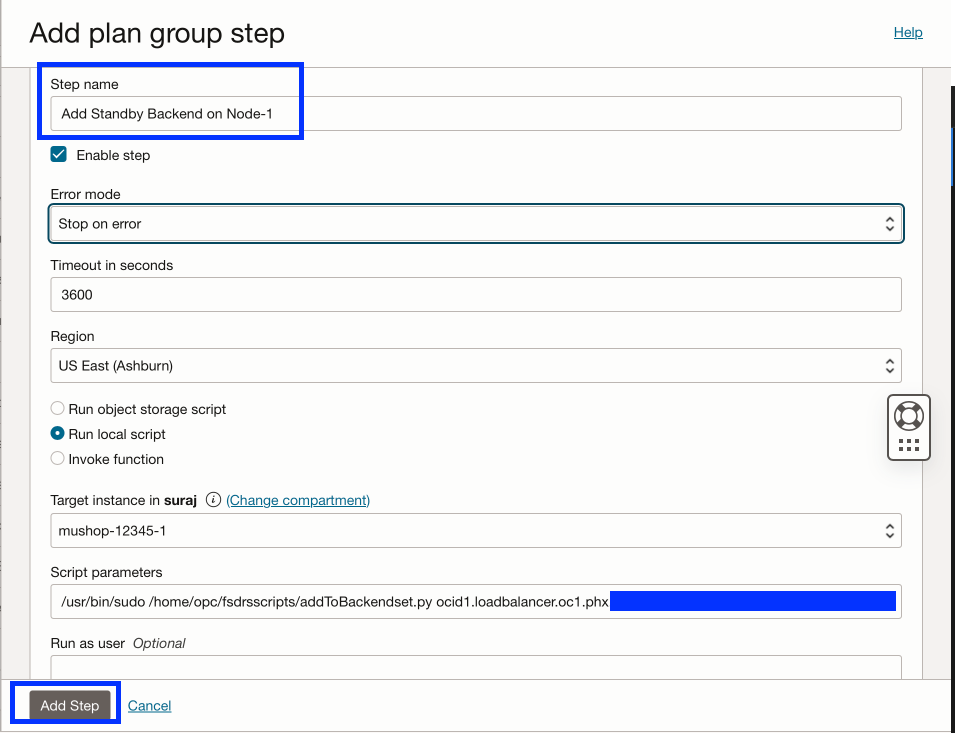

    - Verify the step has been added successfully for Node-1

    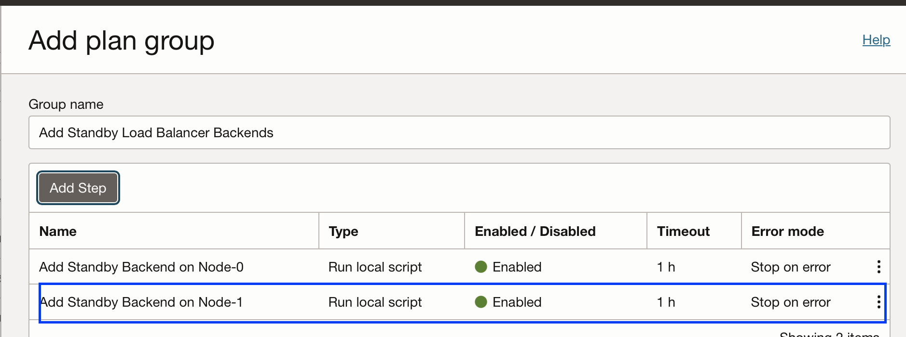
 
    - Click **Add**

    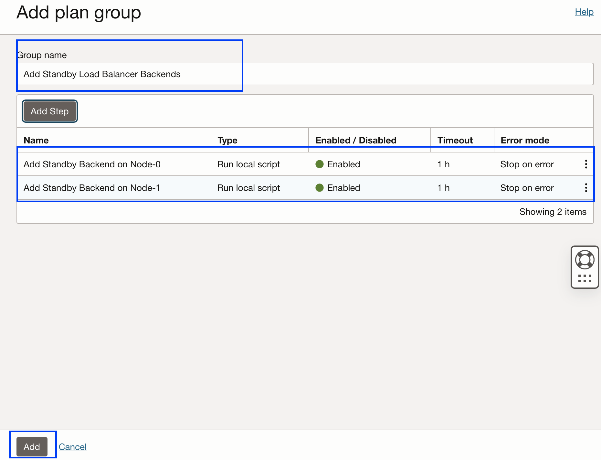

    **mushop-phoenix** DRPG will go into updating state, and after a few seconds, it will return to the active state. Refresh the DRPG page if required. You should be able to see that the *Add Standby Load Balancer Backends* Plan group has created successfully with both steps.

    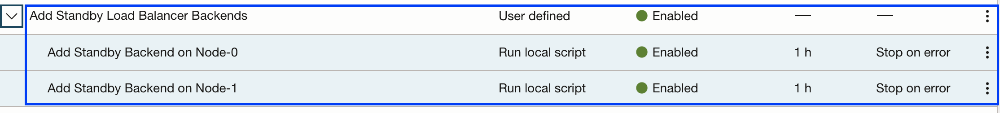

## Task 7: Verify and reorder the User defined groups

1.  We have created all the required (Four) user-defined groups in the **mushop-app-switchover** switchover plan as part of the Mushop application switchover.

    

2.  Let's review the **mushop-app-switchover** switchover plan 

    -  Built-in Precheck - These are the built-in prechecks groups for all the Plan groups (Built-in and User defined).
    -  Based on the members we have added in both Primary DRPG and Standby DRPG, Full Stack DR created nine Built-in switchover plan groups.
    -  We have manually created four user-defined groups per the Mushop application switchover requirement.
    -  In summary, the **mushop-app-switchover** switchover plan has created with *one*- Built-in precheck plan group, *nine*- Built-in Plan group,*four*- User defined Plan group

    

3.  Plan groups can be reordered as per the switchover workflow requirement. As part of the Mushop Switchover plan, we would like to execute **Remove Primary Load Balancer Backends** plan group after the **Built-In Prechecks** plan group. Use the **Actions** after the Add group, and select **Reorder groups**

    

4.  Go to the **Remove Primary Load Balancer Backends** plan group, use the move up **^** symbol, and keep moving up the **Remove Primary Load Balancer Backends** plan group and place it after the **Built-In Prechecks** plan group. This is very important to execute the plan groups in the proper order. Verify and hit **Save changes**. Don't move the other groups. 

    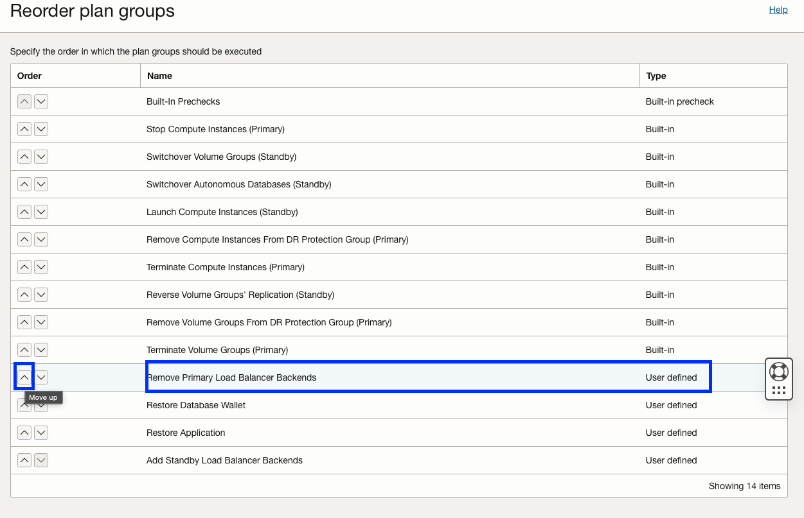
    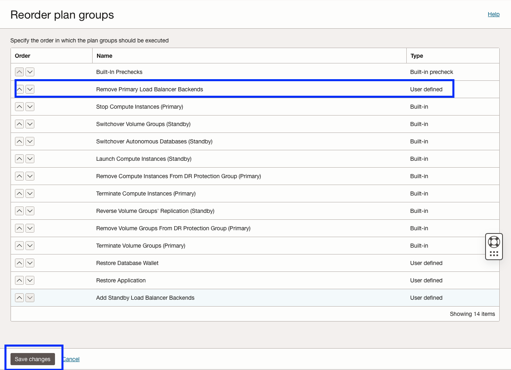 

5.  You should be able to see **Remove Primary Load Balancer Backends** plan group moved after the **Built-In Prechecks** plan group.

    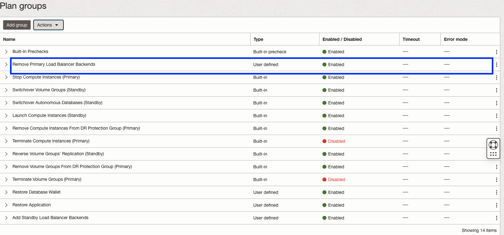

    You may now [Proceed to the next lab](#next)

## Acknowledgements

- **Author** - Suraj Ramesh, Principal Product Manager,Oracle Database High Availability (HA), Scalability and Maximum Availability Architecture (MAA)
- **Last Updated By/Date** -  Suraj Ramesh,November 2023