# Create and Customize DR plans

## Introduction
In this lab, you'll learn how to create **Switchover**, **Failover**, and **Drill Plans** in Oracle Full Stack DR. You will also customize these DR Plans using **user-defined plan groups** tailored to the MuShop application's requirements.

⚠️ **Note:**  
Full Stack DR does **not** allow the creation of DR Plans in a **Primary** role DR Protection Group.All DR Plans **must** be created in the **Standby** role DRPG.

**DR Plans**- A DR Plan represents a DR workflow associated with a pair of DR Protection Groups. A DR Plan is represented as a sequence of Plan Groups. These Plan Groups in turn consist of Plan Steps. A DR Plan can only be created at the Standby DR Protection Group.

There are four types of DR plans which you can create in Full Stack DR.

- Switchover Plan:Used for planned and controlled transition of services from a primary to a standby region. It involves shutting down services in the primary region and bringing them up in the standby region. 
- Failover Plan: Used for unplanned recovery during disasters or outages. It immediately activates services in the standby region whenever the primary is entirely inaccessible.
- Drill Plans: Performing DR drills is an essential DR service capability that allows users to exercise and validate their business continuity configuration and plans without disrupting their production stack.
    - Start Drill: It creates a replica of your production stack without impacting production.Perform a complete dry run of a failover for validation
    - Stop Drill: Removes the replica of your production stack created earlier by Start drill.
 
**Plan Group** – A group of steps in a DR Plan. A DR Plan consists of one or more Plan Groups that execute sequentially. All steps in a Plan Group execute in parallel. 

There are two types of plan groups

- Built-In Groups or Steps – A type of Plan Group or Step that is generated automatically by Full Stack DR when a DR Plan is created. Examples of Built-in Plan Steps are: Launch Compute Instance, Switchover Database, etc.

- User-Defined Groups or Steps– A type of Plan Group or Step that is added by the user to a DR Plan after the DR plan is created by Full Stack DR. 

Estimated Time: 20 Minutes

### Objectives

- Create DR plans (Switchover,Failover and Start drill)
- Customize the DR plans - Restore Database Wallet group
- Customize the DR plans - Restore the Application Group
- Verify the DR plans and plan groups

## Task 1: Create DR plans

1.  Login into OCI Console with your provided Credentials. Select region as **Phoenix**.

    

2.  Open the **Hamburger menu (☰)** and select **Migration and Disaster Recovery**. Then go to **Disaster Recovery → DR Protection Groups** and Confirm that the **region is set to Phoenix**.

    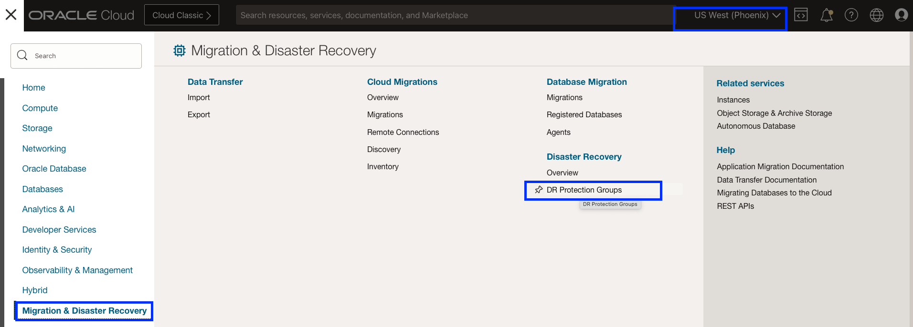

3.  You will land on the Disaster Recovery Protection group home page; make sure you have selected the Phoenix region. **DR Plans always be created in the Standby DRPG (Phoenix region)**

    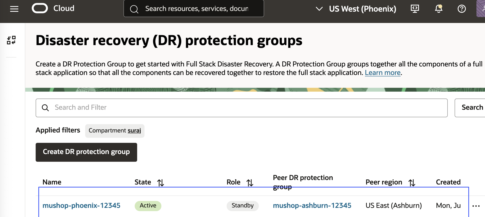

4. Select the **mushop-phoenix-xxxxx** DRPG and navigate to the **Plans** tab

    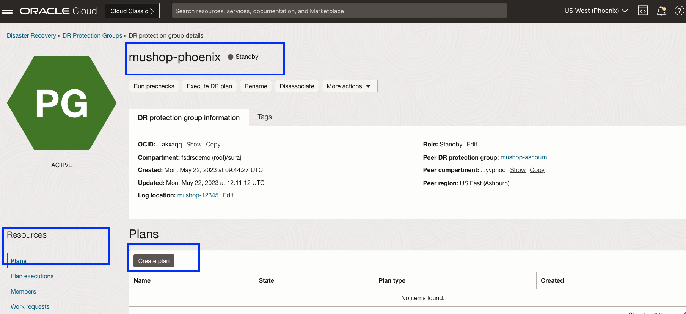

    - Create plan
    - Name as **mushop-app-switchover-iad-phx** ( Provider any other names which is meaningful and see to understand)
    - Plan type as **Switchover (planned)**
    - Hit Create

    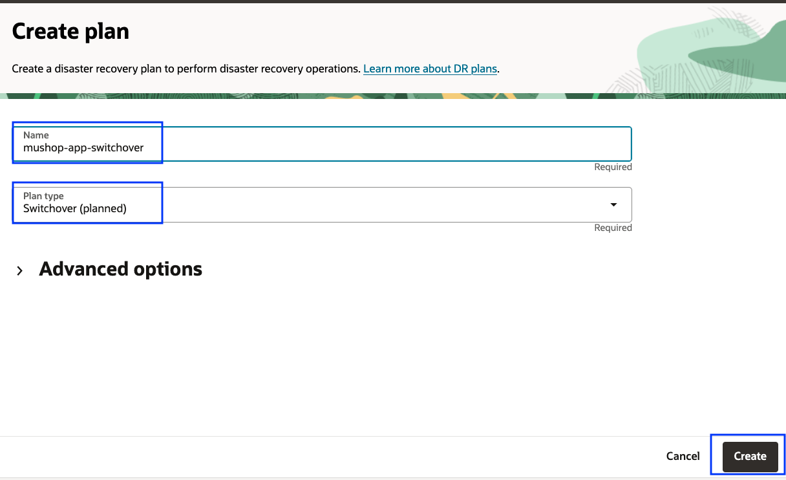

    The plan will start creating; select the plan **mushop-app-switchover**.

    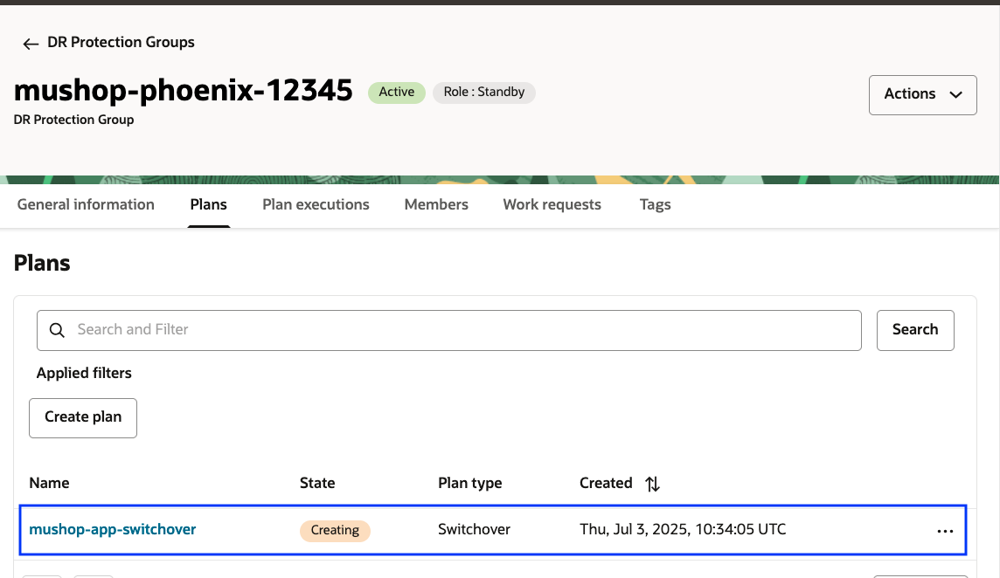

    Refresh the DR Plan page if required. You can monitor the request's status in the **Work requests** tab and select the work request details. Within a minute, the plan will get created, and it should be in *active* State.

    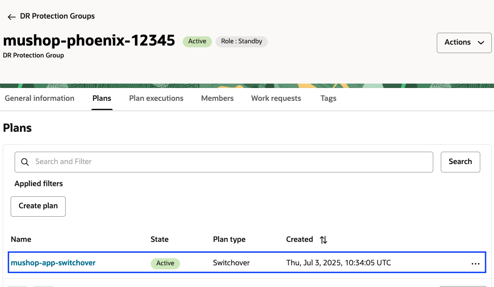

    Select the **mushop-app-switchover** plan, navigate to **Plan groups** tab and you should be able to various built-in plan groups.

    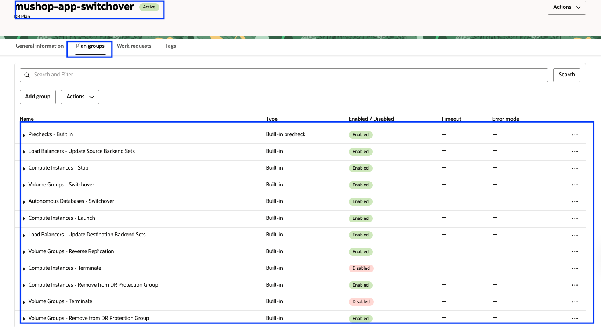

    Based on the members we added in both primary and standby DRPG, Full Stack DR created these built-in plans. You can navigate the plan groups to see the various steps created.

    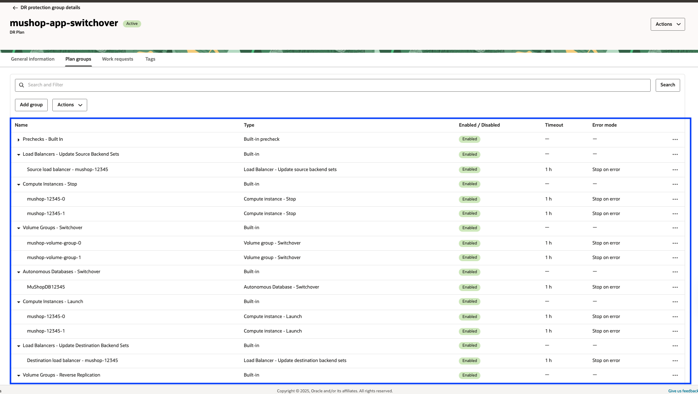

    - **Built-in Prechecks** - These are prechecks for the compute, DB, volume groups and Load balancer switchover.
    - **Load Balancers - Update Source Backend Setss** - Remove backend servers from the Load balancer backend set in the Ashburn region. 
    - **Compute Instances - Stop** - Stop app virtual machines in the Ashburn region.
    - **Volume Groups - Switchover** - Switchover volume groups in the phoenix region.
    - **Autonomous Databases - Switchover** - Switchover ATP DB from Ashburn to Phoenix region
    - **Compute Instances - Launch** - Create virtual machines in the phoenix region.
    - **Load Balancers - Update Destination Backend Sets** - Add backend servers to the load balancer backend set in the Phoenix region. Backend servers IP will be mapped based on the launched VM's in the Phoenix region.
    - **Volume Groups - Reverse Replication** - Set up reverse volume group replication from Phoenix to Ashburn region.
    - **Compute Instances - Terminate** - Terminate compute instances in the Ashburn region. By default the plan group is disabled, it can be enabled depending on the requirements.
    - **Compute Instances - Remove from DR Protection Group** - Remove compute instances from the Ashburn DRPG.
    - **Volume Groups - Terminate** - Terminate volume groups in the Ashburn region. By default the plan group is disabled, it can be enabled depending on the requirements.
    - **Volume Groups - Remove from DR Protection Group** - Remove volume group from the Ashburn DRPG

**Note:** **Compute Instances - Terminate* and **Volume Groups - Terminate** plan groups are disabled by default; to enable them, click the **`...`** menu at the end of the plan groups and select **Enable all steps**. This step is optional but recommended.

5. Follow the same process as part Step 4 to create the *Failover* and *Start Drill* plans — please make sure to select the correct **Plan Type** while creating them. Once the plans are created it will look like.


  
## Task 2: Customize the Switchover plan-Restore Database Wallet group

1.  Create a user-defined group for **Restore Database Wallet**.This can be done by selecting **Add group** in the *mushop-app-switchover* plan

    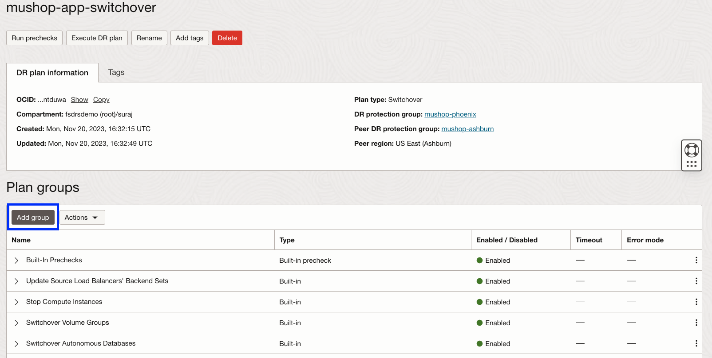

2.  Add **Restore Database Wallet** in the Group name, select **Add after** radio button, select **Update Destination Load Balancers' Backend Sets** in the Group and Click **Add Step**

    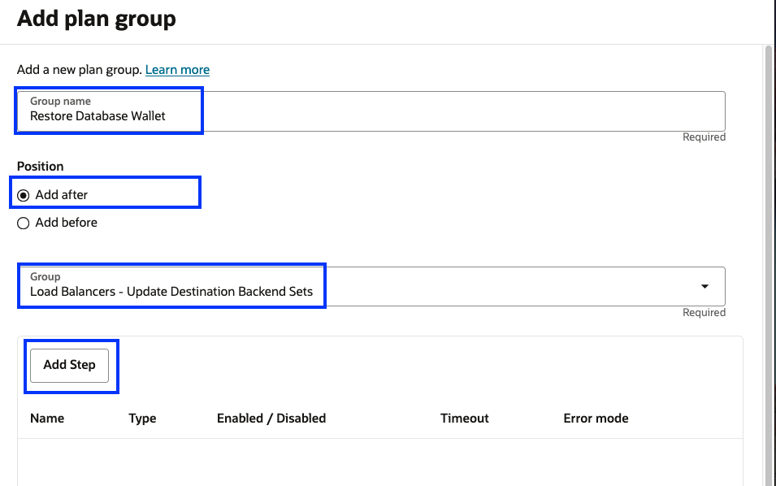

    - Add *Restore Database Wallet on Node-0* in Step name
    - In the region, select "US East (Ashburn)"
    - Select the "Run local script" option
    - Select "mushop-xxxxx-0" instance in "Target instance in compartment"
    - In script parameters, add the below script

    ````
    <copy>/usr/bin/sudo /home/opc/fsdrsscripts/mushop_db_wallet_restore.sh phoenix</copy>
    ````
    - Leave the field blank in "Run as user"
    - Select Error mode as "Stop on error."
    - Leave the default "3600" seconds in Timeout in seconds
    - Leave the enable step tick mark
    - Verify all the details and hit Add Step
    
    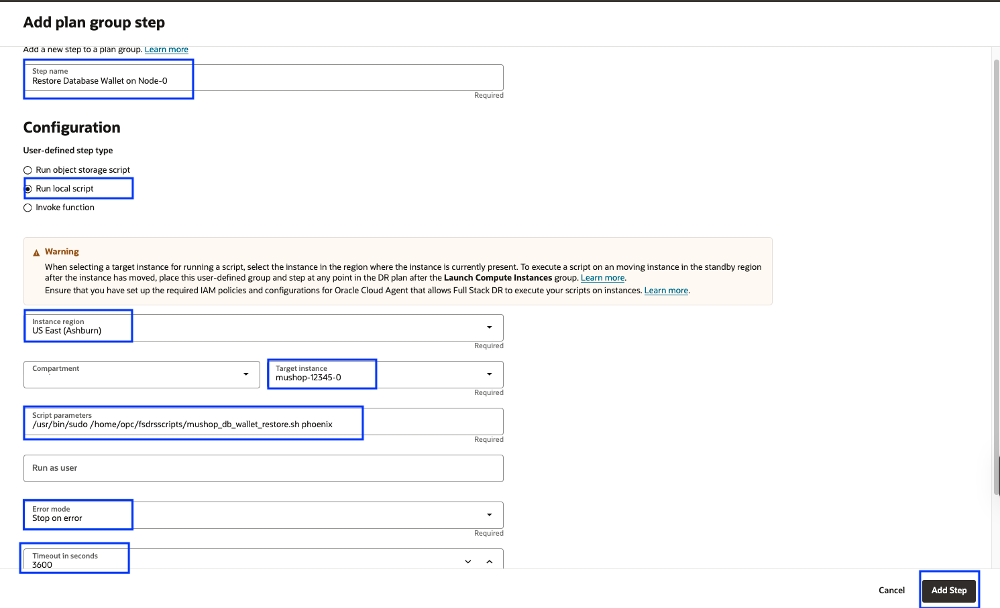

    - Verify the step has been added successfully for Node-0

    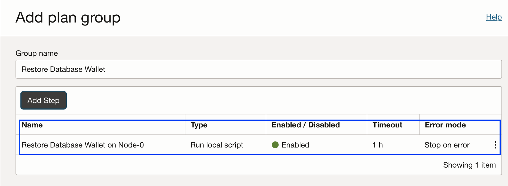

3.  Add step for *Restore Database Wallet on Node-1*

    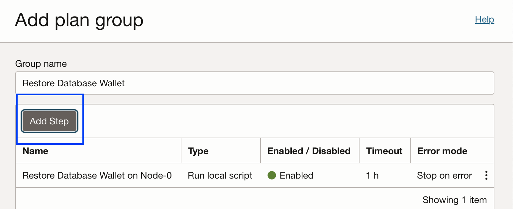

    - Add *Restore Database Wallet on Node-1* in Step name
    - In the region, select "US East (Ashburn)"
    - Select the "Run local script" option
    - Select "mushop-xxxxx-1" instance in "Target instance in compartment"
    - In script parameters, add the below script

    ````
    <copy>/usr/bin/sudo /home/opc/fsdrsscripts/mushop_db_wallet_restore.sh phoenix</copy>
    ````
    - Leave the field blank in "Run as user"
    - Select Error mode as "Stop on error."
    - Leave the default "3600" seconds in Timeout in seconds
    - Leave the enable step tick mark
    - Verify all the details and hit Add Step
    
    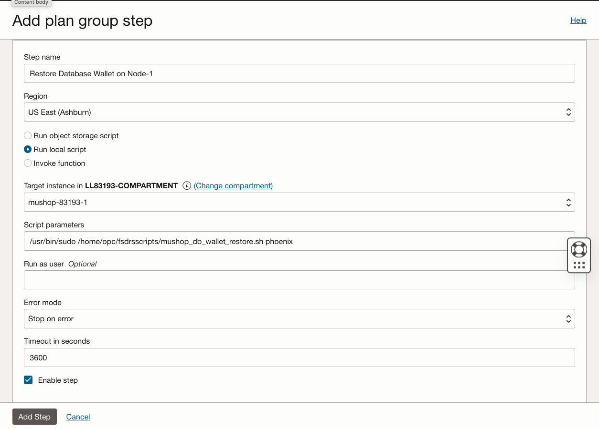

    - Verify the step has been added successfully for Node-1

    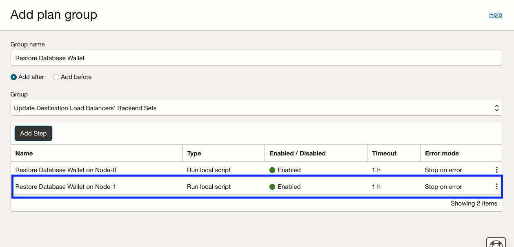
 
    - Click **Add**

    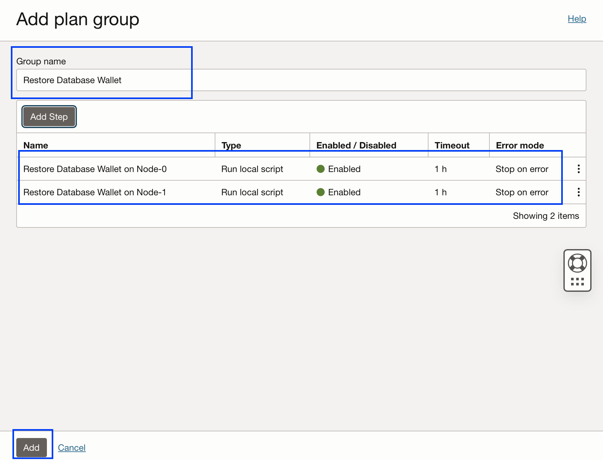

    **mushop-phoenix** DRPG will go into updating state, and after a few seconds, it will return to the active state. Refresh the DRPG page if required. You should be able to see that the *Restore Database Wallet* Plan group is created successfully with both steps. **Restore Database Wallet** plan group will be added after **Update Destination Load Balancers' Backend Sets** plan group.

    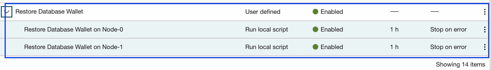
 

## Task 3: Customize the Switchover plan-Restore the Application Group

1.  Create a user-defined group for **Restore Application**.This can be done by selecting **Add group** in the *mushop-app-switchover* plan

    

2.  Add **Restore Application** in the Group name, select **Add after** radio button, select **Restore Database Wallet** in the Group and Click **Add Step**

    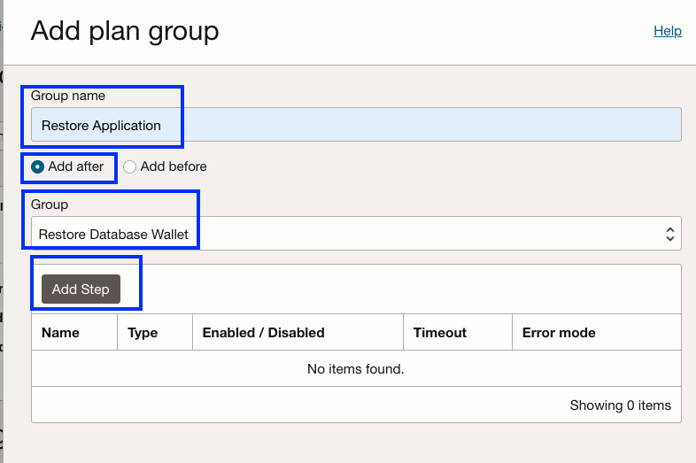

    - Add *Restore Application on Node-0* in Step name
    - In the region, select "US East (Ashburn)"
    - Select the "Run local script" option
    - Select "mushop-xxxxx-0" instance in "Target instance in compartment"
    - In script parameters, add the below script

    ````
    <copy>/usr/bin/sudo /home/opc/fsdrsscripts/mushop_reconfigure.sh ashburn phoenix</copy>
    ````
    - Leave the field blank in "Run as user"
    - Select Error mode as "Stop on error."
    - Leave the default "3600" seconds in Timeout in seconds
    - Leave the enable step tick mark
    - Verify all the details and hit Add Step
    
    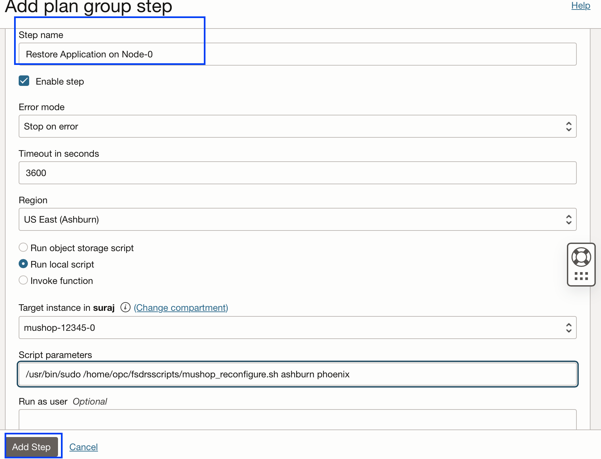

    - Verify the step has been added successfully for Node-0

    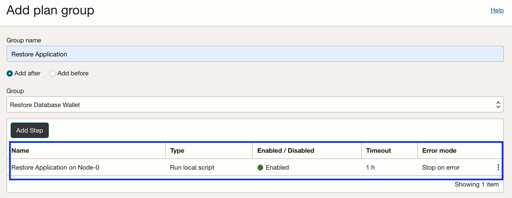

3.  Add step for *Restore Application on Node-1*

    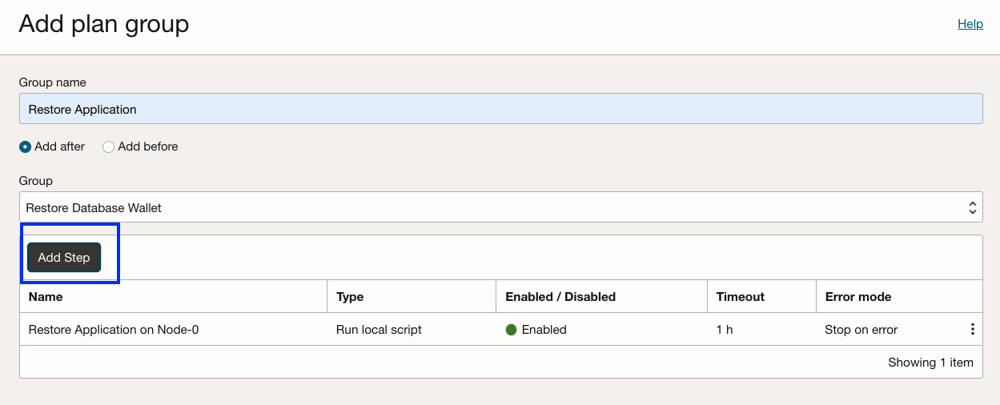

    - Add *Restore Application on Node-1* in Step name
    - In the region, select "US East (Ashburn)"
    - Select the "Run local script" option
    - Select "mushop-xxxxx-1" instance in "Target instance in compartment"
    - In script parameters, add the below script

    ````
    <copy>/usr/bin/sudo /home/opc/fsdrsscripts/mushop_reconfigure.sh ashburn phoenix</copy>
    ````
    - Leave the field blank in "Run as user"
    - Select Error mode as "Stop on error."
    - Leave the default "3600" seconds in Timeout in seconds
    - Leave the enable step tick mark
    - Verify all the details and hit Add Step
    
    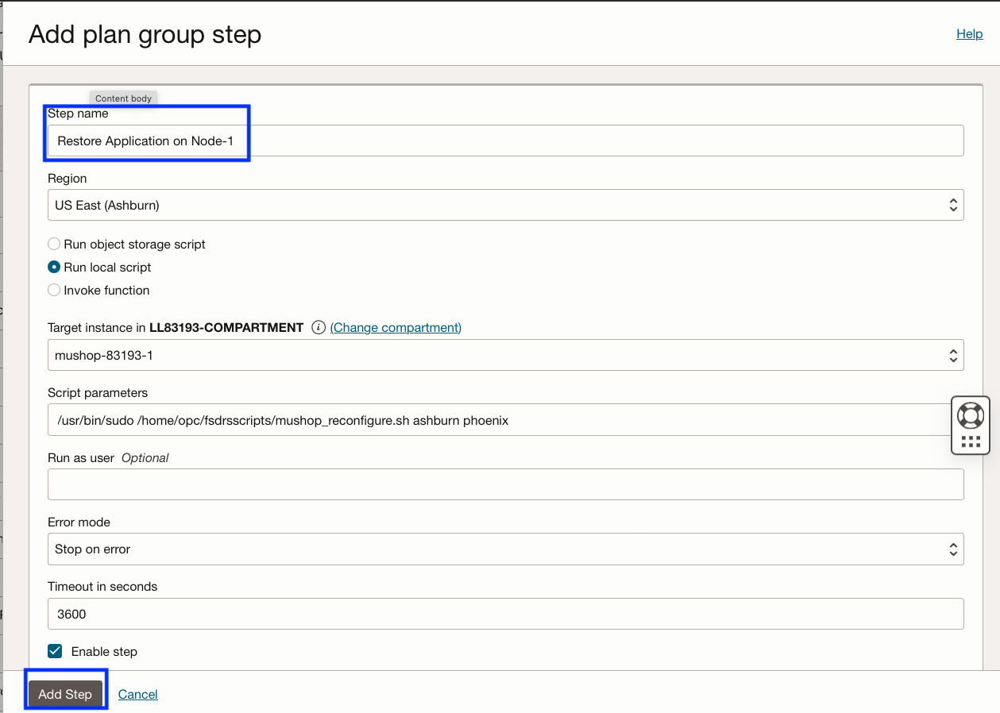

    - Verify the step has been added successfully for Node-1

    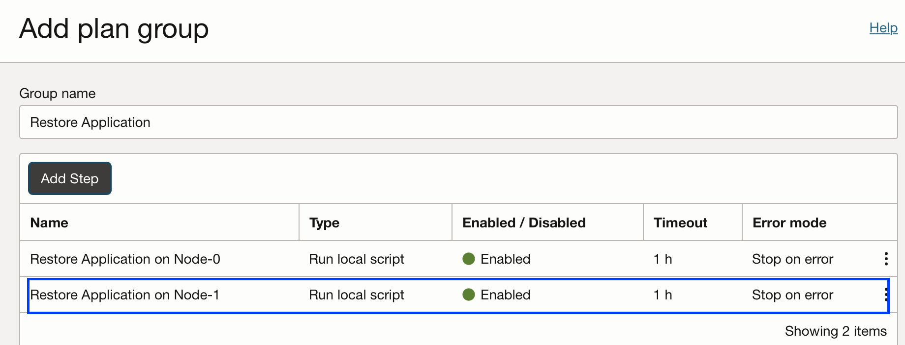
 
    - Click **Add**

    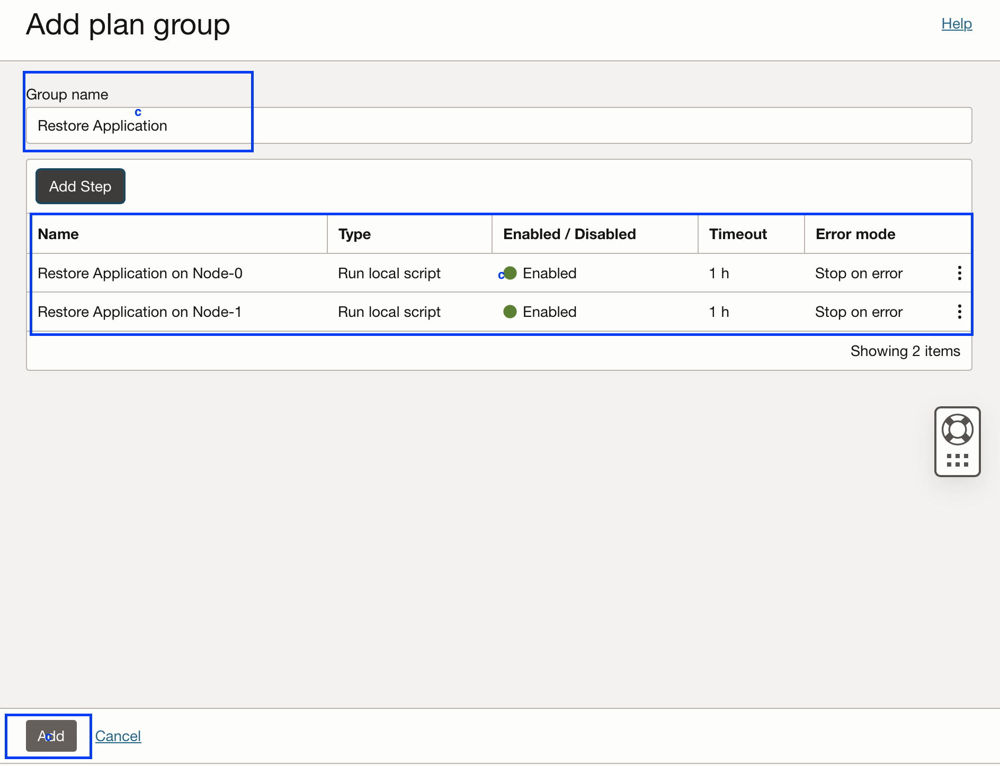

    **mushop-phoenix** DRPG will go into updating state, and after a few seconds, it will return to the active state. Refresh the DRPG page if required. You should be able to see that the *Restore Application* Plan group is created successfully with both steps. **Restore Application** plan group will be added after **Restore Database Wallet** plan group.

    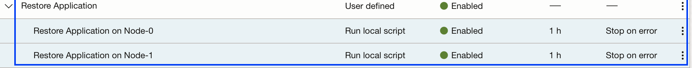
 
## Task 4: Verify the Switchover plan and plan groups

1.  We have created all the required (two) user-defined groups in the **mushop-app-switchover** switchover plan as part of the Mushop application switchover.

    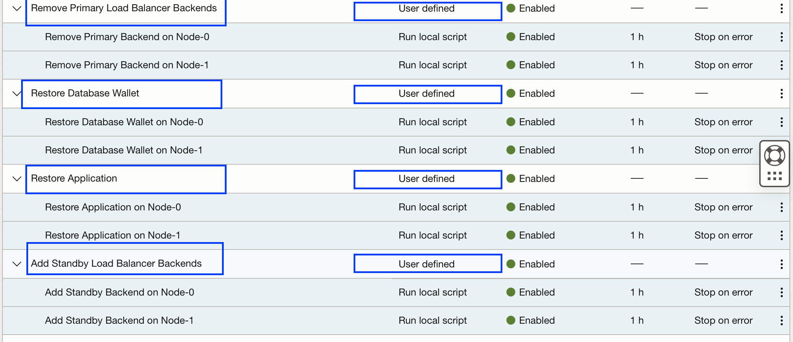

2.  Let's review the **mushop-app-switchover** switchover plan 

    -  Built-in Prechecks - These are the built-in prechecks groups for all the Plan groups (Built-in and User defined).
    -  Based on the members we have added in both Primary DRPG and Standby DRPG, Full Stack DR created **eleven** Built-in plan groups for the switchover plan.
    -  We have manually created **two** user-defined groups as per the Mushop application switchover requirement.
    -  In summary, the **mushop-app-switchover** switchover plan has created with *one*- Built-in prechecks plan group, *eleven*- Built-in Plan groups,*two*- User defined Plan groups

    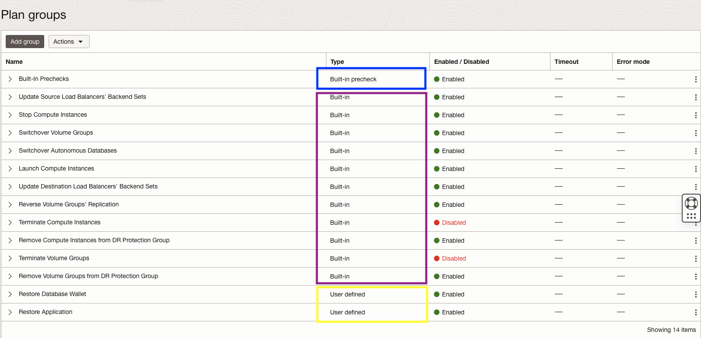

3.  Plan groups can be reordered as per the switchover workflow requirement.Since we have created the user defined plan groups in correct order, there is no need to reorder the user defined plan groups.

    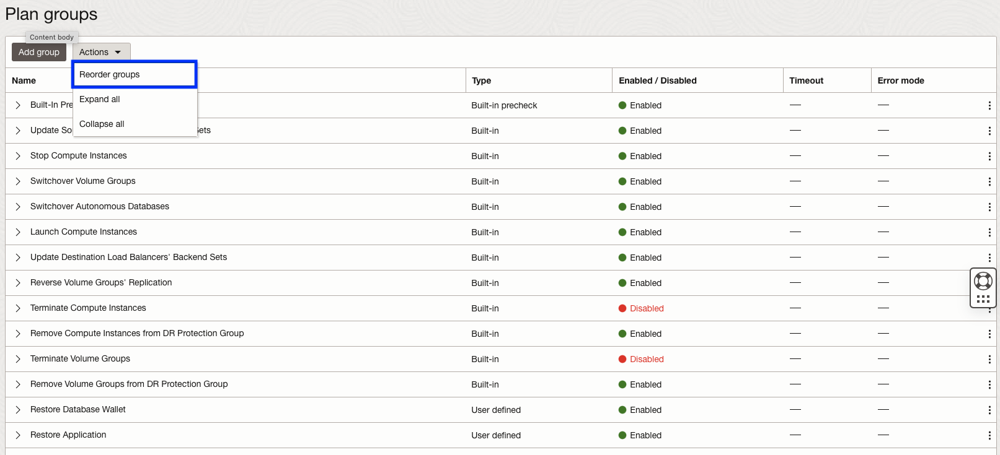

    You may now [Proceed to the next lab](#next)

## Acknowledgements

- **Author** - Suraj Ramesh, Principal Product Manager,Oracle Database High Availability (HA), Scalability and Maximum Availability Architecture (MAA)
- **Last Updated By/Date** -  Suraj Ramesh, July 2025