# Create and Customize the DR Switchover Plan

## Introduction

In this lab, we will create DR plan and customize the plan with additional steps. Ashburn is primary region and Phoenix is standby region. FSDRS provides two types of plan

- Switchover ( Maintenance/Planned Disaster Recovery)
- Failover   (Actual Disaster Recovery/Unplanned)

This lab will focus of how to create Switchover plan and customize the plan as per Mushop application requirements. DR Plan will be created only in Standby region (Phoenix). This is because in case of worst case scenario of  unplanned DR ( complete primary region outage) the FSDRS will not be accessible from the primary region.

Estimated Lab Time: 20 Minutes

Watch the video below for a quick walk through of the lab.

### Objectives

- Create Switchover plan
- Gather Load Balancer OCID's
- Customize the Switchover plan- Remove Primary Load Balancer Backends group
- Customize the Switchover plan- Restore Database Wallet group
- Customize the Switchover plan- Restore Application group
- Customize the Switchover plan- Add Standby Load Balancer Backends group

## Task 1: Create Switchover plan

<if type="livelabs">

1. Login into OCI Console with your provided Credentials. Select region as **Pheonix**.

  

2. From the Hamburger menu, select **Migration and Disaster Recovery**, then **Disaster Recovery Protection Groups**.Verify the region is **Phoenix**

  

3. You will land up in the Disaster Recovery Protection group home page, make sure you have selected the Phoenix region.

  

4. Select the **mushop-phoenix** DRPG and navigate to Plans under resources section.

  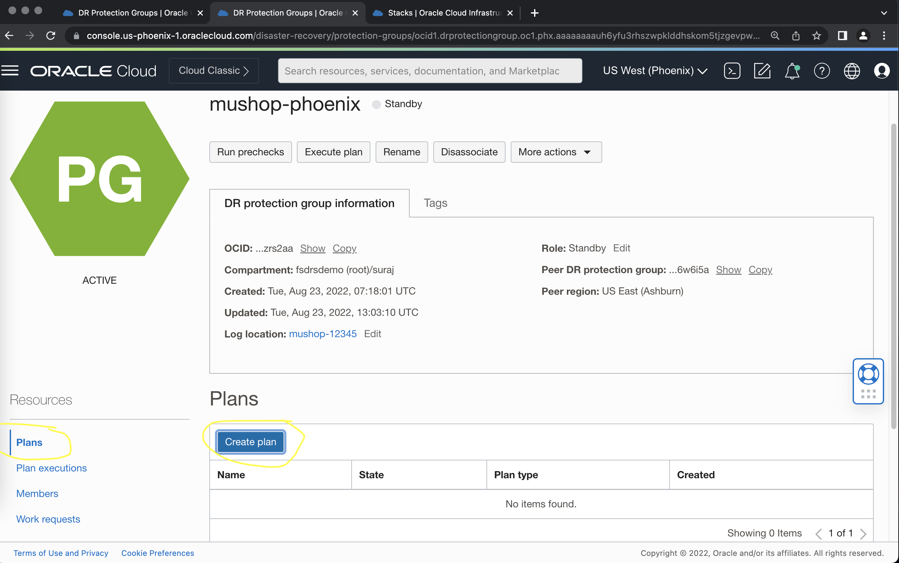

- Create plan
- Name as **mushop-app-switchover**
- Plantype as **Switchover**
- Hit Create

  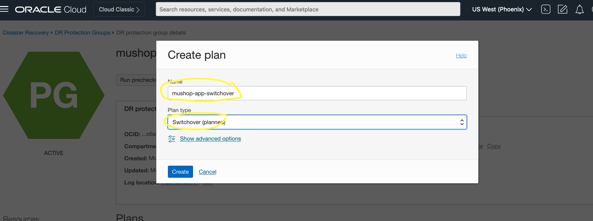

  Plan will start creating,select the plan **mushop-app-switchover**.

  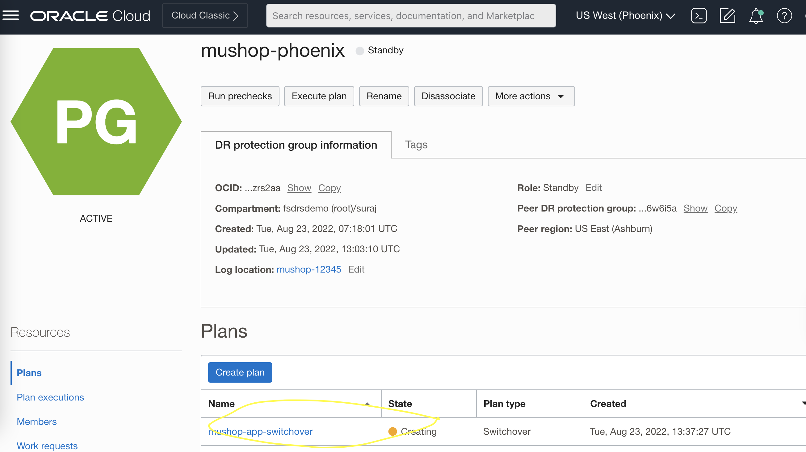

  Refresh the DR Plan page if required. You can monitor the status of the request in **Work requests* section under Resources. Within a minute, the plan will get created and it should be in *active* state

  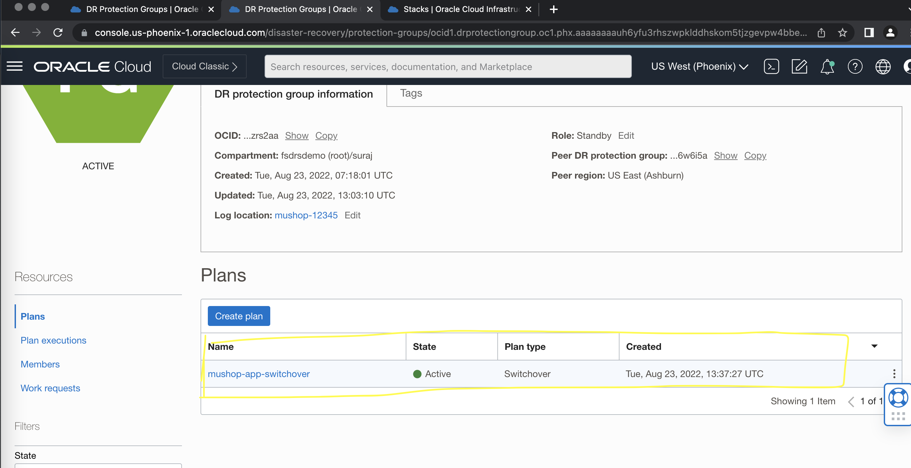

  Select the **mushop-app-switchover** plan and you should be able to various inbuilt plan groups.

  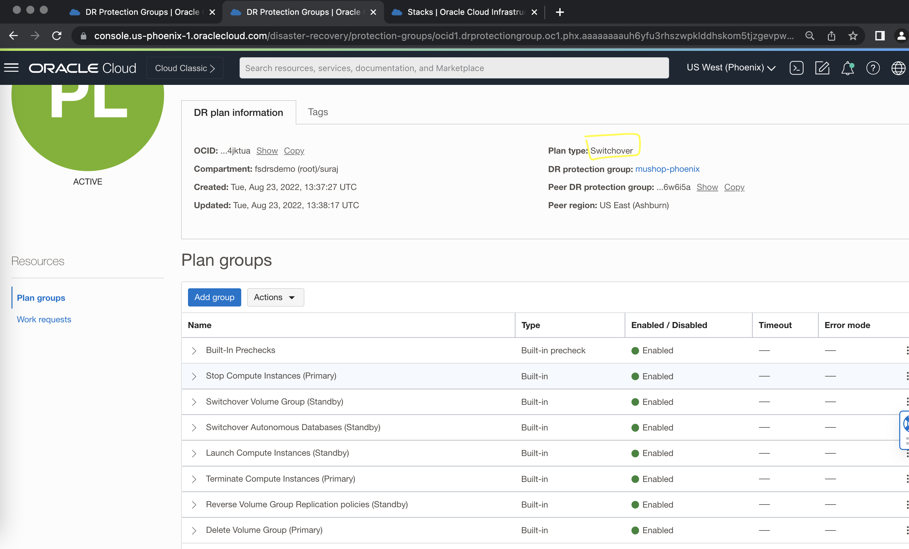

  Based on the members we have added in both primary and standby DRPG, FSDRS created these built-in plans automatically. You can navigate around the plan groups to see the various steps which got created.
  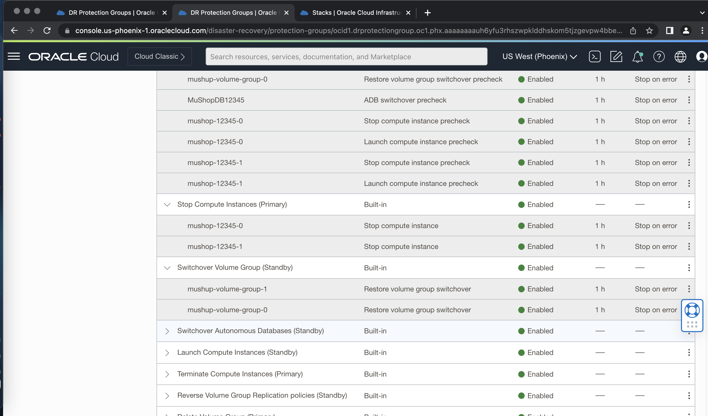

- Built-in Precheks - These are prechecks for app,db and volume group switchover
- Stop Compute Instances (Primary) - Stop app VM's in ashburn region (primary)
- Switchover Volume Group (Standby) - Switchover volume group in phoenix region (standby)
- Switchover Autonomous Databases (Standby) - Switchover ATP DB from ashburn to Phoenix region
- Launch Compute Instances (Standby) - Create app VM's in phoenix region (stanby)
- Terminate Compute Instances (Primary) - Though the group says as terminate compute instances, we will not terminate the app VM's in primary region.
- Reverse Volume Group Replication policies (Standby)- Setup reverse volume group replication from phoenix to ashburn region.
- Delete Volume Group (Primary)- Though the group says as delete volume group, we will not delete those in ashburn region.

## Task 2: Gather Load Balancer OCID's

1. As a prequisite need to gather OCID's (Oracle Cloud Identifier) of loadbalancers running in Ashburn (Primary) and Phoenix (Standby) region.

2. Leave the existing DRPG console tabs as running. Now open two new OCI console tabs and make sure you are logged into asburn region and phoenix region respectively.

3. From the Hamburger menu, select **Networking**, then **Load Balancers**.Make sure you are logged into **Ashburn** region.
  
  

4. You should have load balancer with name **mushop-xxxx**, choose the right compartment assigned to you.Select the three dots in the right end of balancer details. Select **Copy OCID** and paste the OCID details safely in any preferred notes. You shoud have value something similar to below

 **ocid1.loadbalancer.oc1.iad.aaaaaaaa2t4kwwavlgwghuebrce6mgqm5ewrsj5kscw2t5ncdpxdpo6ztvaq**

  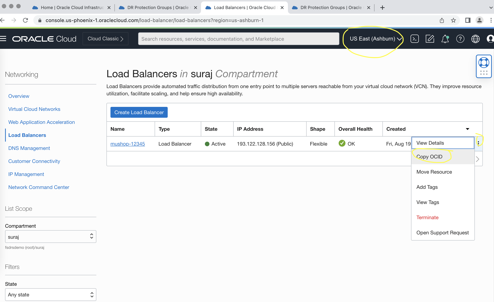

5. From the Hamburger menu, select **Networking**, then **Load Balancers**.Make sure you are logged into **Phoenix** region.
  
  

6. You should have load balancer with name **mushop-xxxx**,choose the right compartment assigned to you.Select the three dots in the right end of balancer details. Select **Copy OCID** and paste the OCID details safely in any preferred notes. You shoud have value something similar to below

 **ocid1.loadbalancer.oc1.phx.aaaaaaaaqo6sn6xku3vcuiqjb7emuastpzdrd4yrdgozh5g2c3bahwdkhiyq**

  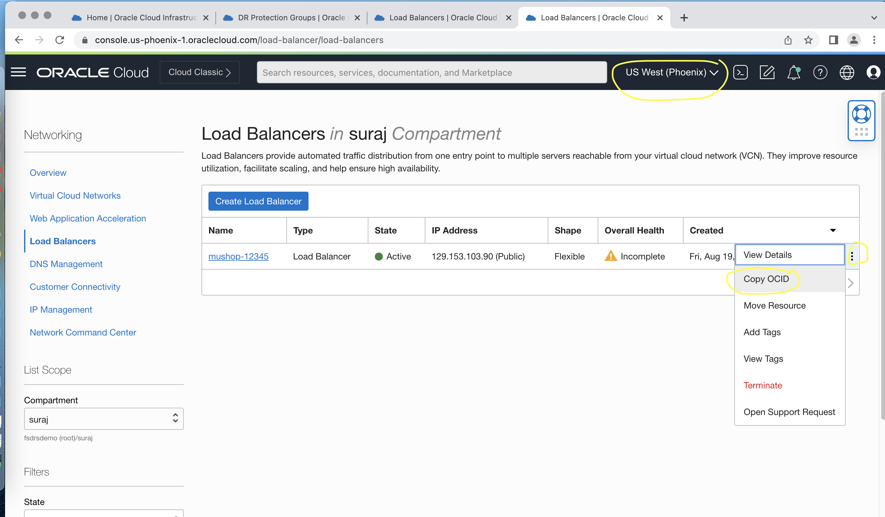

## Task 3: Customize the Switchover plan- Remove Primary Load Balancer Backends group

1. Create user defined groups for mushop application switchover. We need to create 4 user defined groups. Let's create those one by one. This can be done by selecting **Add group** in the *mushop-app-switchover* plan

  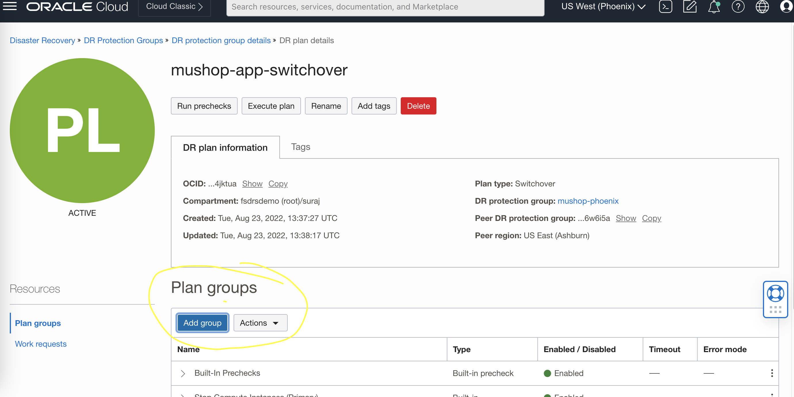

2. Add "Remove Primary Load Balancer Backends" user defined group

- Add *Remove Primary Load Balancer Backends* in Group name
- Add *Remove Primary Backend on Node-0* in Step name
- Select Error mode as "Stop on error"
- Leave the default "3600" seconds in Timeout in seconds
- Leave the enabled tick mark
- In the region select "US East (Ashburn)"
- Select "Run local script" option
- Select "mushop-xxxxx-0" instance in "Target instance in compartment"
- In script parameters provide the details **/usr/bin/sudo /home/opc/fsdrsscripts/removeFromBackendset.py ocid1.loadbalancer.oc1.iad.aaaaaaaa2t4kwwavlgwghuebrce6mgqm5ewrsj5kscw2t5ncdpxdpo6ztvaq**

 **You need to replace the OCID of the primary (Ashburn) load balancer as per step 2.4, make sure you replace the OCID of your load balancer with out fail in the above command**

- Leave the field blank in "Run as user"
- Verify all the details and hit add

  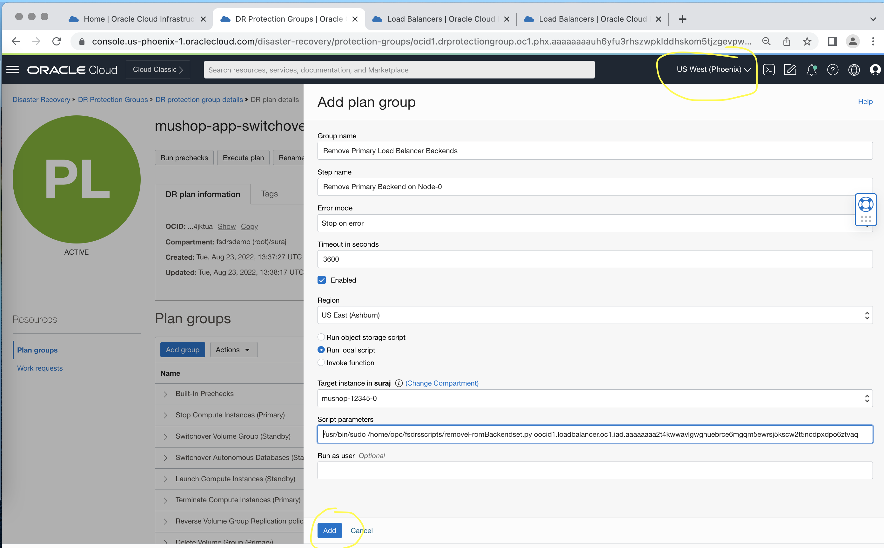

- **mushop-phoenix** drpg will go into updating state and after few seconds it will come back to active state. Refersh the DRPG page if required. You should be able to see the *Remove Primary Load Balancer Backends* Plan group has been added successfully with *Remove Primary Backend on Node-0* step. Note the type in group name it will show as **User defined** as this is user defined group.

  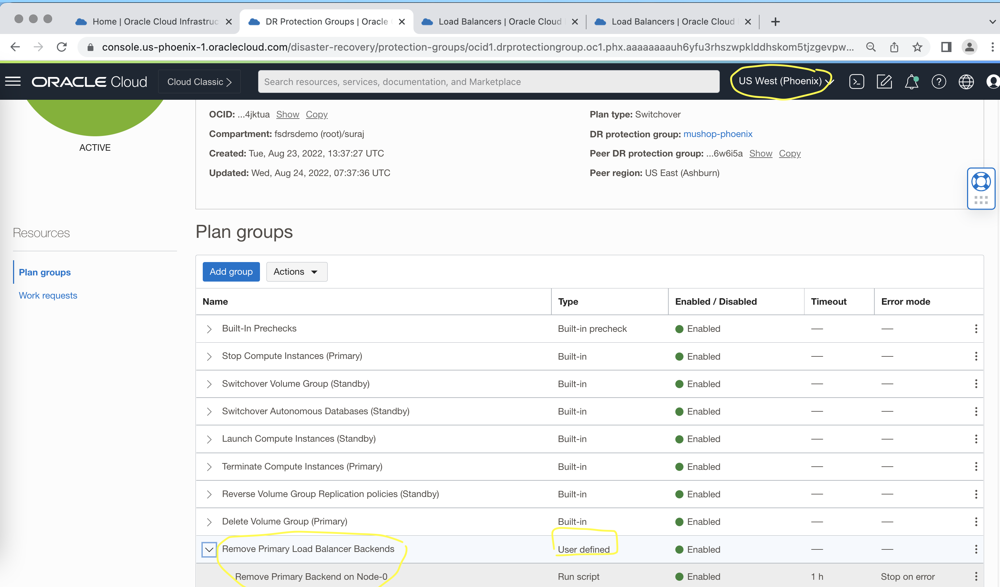

3.Need to add another step for *Remove Primary Backend on Node-1* in *Remove Primary Load Balancer Backends* Plan group

- From the *Remove Primary Load Balancer Backends* Plan group, select the three dots section in the right end. Select **Add Step"

  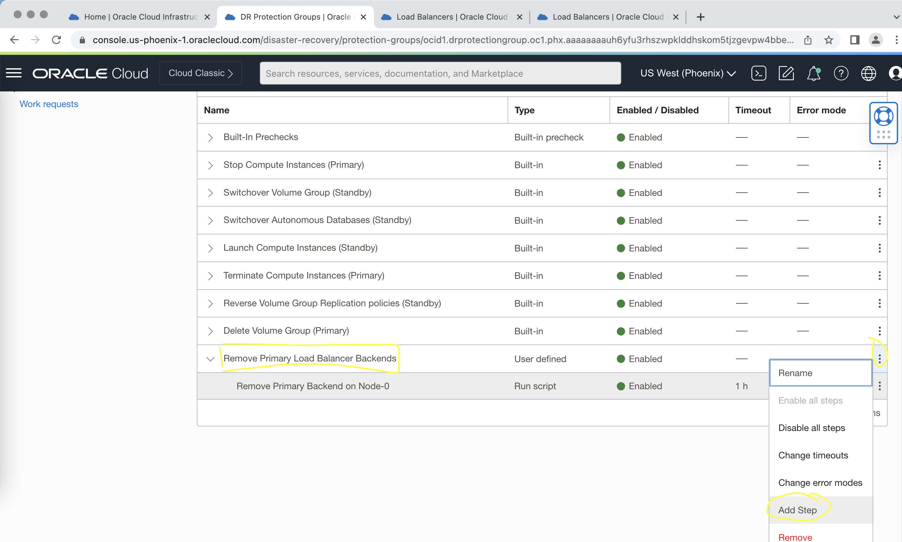

- Leave the default Group name
- Add *Remove Primary Backend on Node-1* in Step name
- Select Error mode as "Stop on error"
- Leave the default "3600" seconds in Timeout in seconds
- Leave the enabled tick mark
- In the region select "US East (Ashburn)"
- Select "Run local script" option
- Select "mushop-xxxxx-1" instance in "Target instance in compartment"
- In script parameters provide the details **/usr/bin/sudo /home/opc/fsdrsscripts/removeFromBackendset.py ocid1.loadbalancer.oc1.iad.aaaaaaaa2t4kwwavlgwghuebrce6mgqm5ewrsj5kscw2t5ncdpxdpo6ztvaq**

 **You need to replace the OCID of the primary (Ashburn) load balancer as per step 2.4, make sure you replace the OCID of your load balancer with out fail in the above command**

- Leave the field blank in "Run as user"
- Verify all the details and hit add

  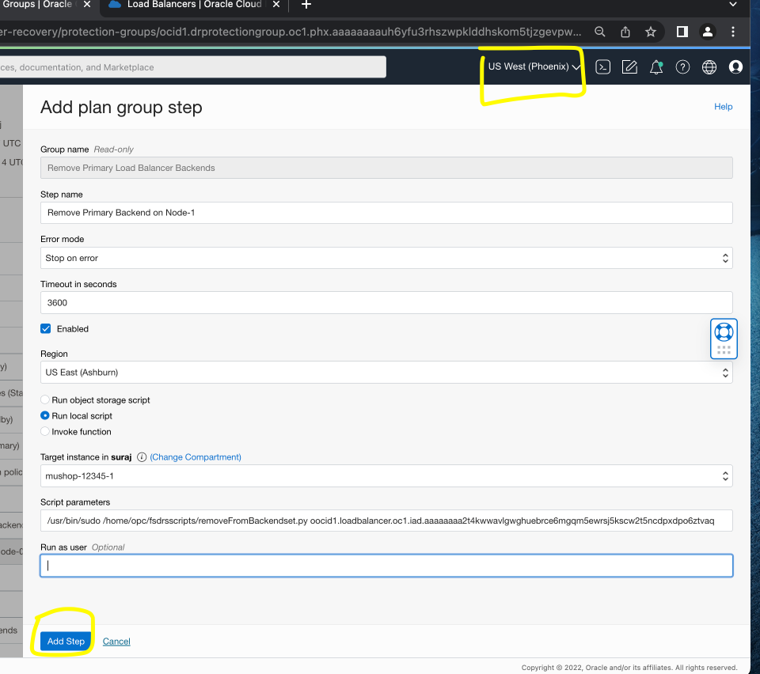

- **mushop-phoenix** drpg will go into updating state and after few secondw it will come back to active state. Refersh the DRPG page if required. You should be able to see the *Remove Primary Load Balancer Backends* Plan group has been modified successfully with *Remove Primary Backend on Node-1* step. Now you can see both steps has been added in the group.

  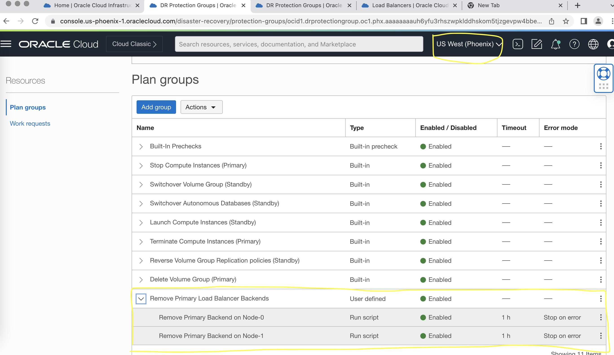

## Task 4: Customize the Switchover plan- Restore Database Wallet group

1. Create user defined group for "Restore Database Wallet". This can be done by selecting **Add group** in the *Restore Database Wallet* plan

  

2. Add "Restore Database Wallet" user defined group

- Add *Restore Database Wallet* in Group name
- Add *Restore Database Wallet on Node-0* in Step name
- Select Error mode as "Stop on error"
- Leave the default "3600" seconds in Timeout in seconds
- Leave the enabled tick mark
- In the region select "US East (Ashburn)"
- Select "Run local script" option
- Select "mushop-xxxxx-0" instance in "Target instance in compartment"
- In script parameters provide the details */usr/bin/sudo /home/opc/fsdrsscripts/mushop\_db\_wallet\_restore.sh*
- Leave the field blank in "Run as user"
- Verify all the details and hit add

  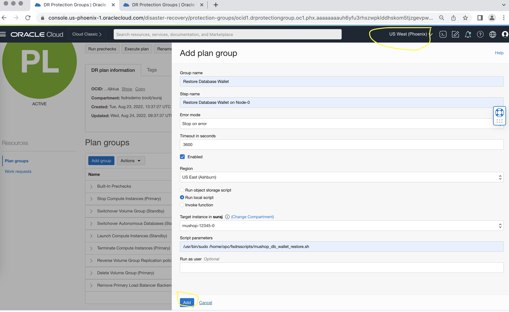

- **mushop-phoenix** drpg will go into updating state and after few seconds it will come back to active state. Refersh the DRPG page if required. You should be able to see the *Restore Database Wallet* plan group has been added successfully with *Restore Database Wallet on Node-0* step. Note the type in group name it will show as **User defined** as this is user defined group.

  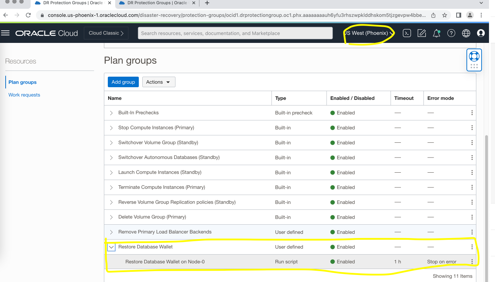

3.Need to add another step for *Restore Database Wallet on Node-1* in *Restore Database Wallet* plan group

- From the *Restore Database Wallet* Plan group, select the three dots section in the right end. Select **Add Step**

  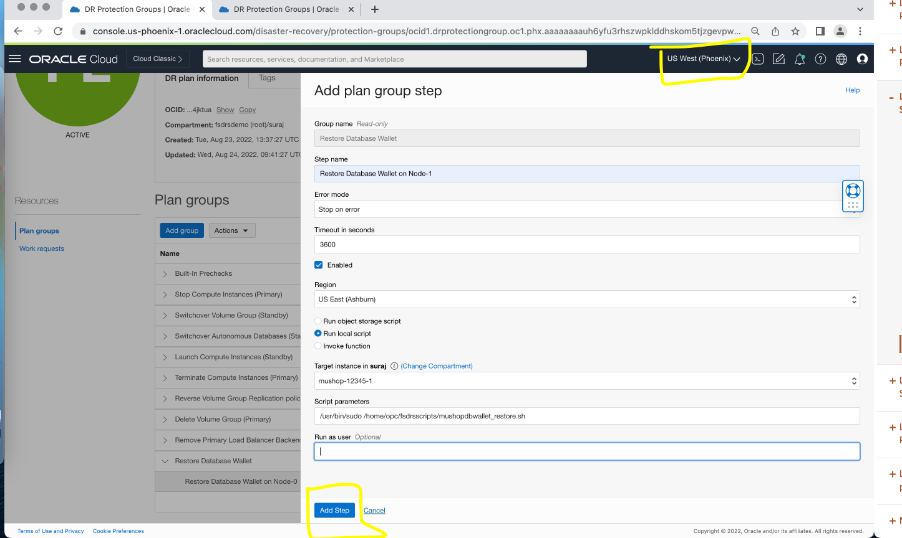

- Leave the default Group name
- Add *Restore Database Wallet on Node-1* in Step name
- Select Error mode as "Stop on error"
- Leave the default "3600" seconds in Timeout in seconds
- Leave the enabled tick mark
- In the region select "US East (Ashburn)"
- Select "Run local script" option
- Select "mushop-xxxxx-1" instance in "Target instance in compartment"
- In script parameters provide the details */usr/bin/sudo /home/opc/fsdrsscripts/mushop\_db\_wallet\_restore.sh*
- Leave the field blank in "Run as user"
- Verify all the details and hit add

  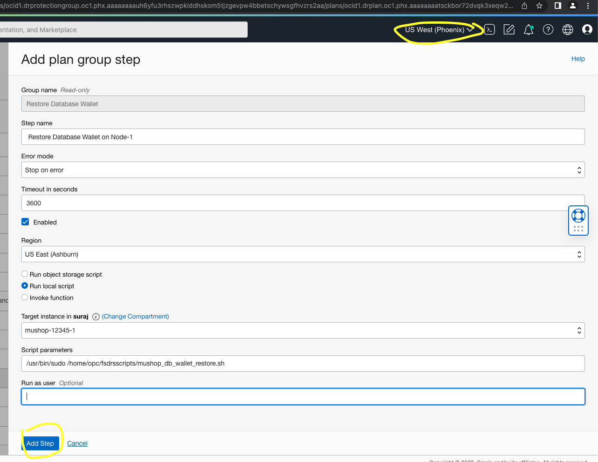

- **mushop-phoenix** drpg will go into updating state and after few secondw it will come back to active state. Refersh the DRPG page if required. You should be able to see the *Restore Database Wallet* Plan group has been modified successfully with *RRestore Database Wallet on Node-1* step. Now you can see both steps has been added in the group.

  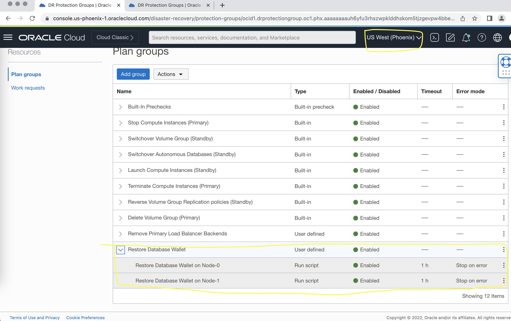

## Task 5: Customize the Switchover plan- Restore Application group

1. Create user defined group for "Restore Application". This can be done by selecting **Add group** in the *mushop-app-switchover* plan

  

2. Add "Restore Application" user defined group

- Add *Restore Application* in Group name
- Add *Restore Application on Node-0* in Step name
- Select Error mode as "Stop on error"
- Leave the default "3600" seconds in Timeout in seconds
- Leave the enabled tick mark
- In the region select "US East (Ashburn)"
- Select "Run local script" option
- Select "mushop-xxxxx-0" instance in "Target instance in compartment"
- In script parameters provide the details */usr/bin/sudo /home/opc/fsdrsscripts/mushop_reconfigure.sh*
- Leave the field blank in "Run as user"
- Verify all the details and hit add

  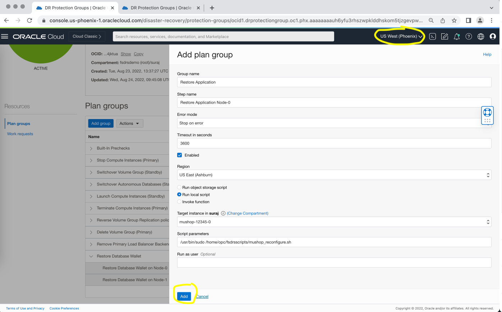

- **mushop-phoenix** drpg will go into updating state and after few seconds it will come back to active state. Refersh the DRPG page if required. You should be able to see the *Restore Application* plan group has been added successfully with *Restore Application on Node-0* step. Note the type in group name it will show as **User defined** as this is user defined group.

  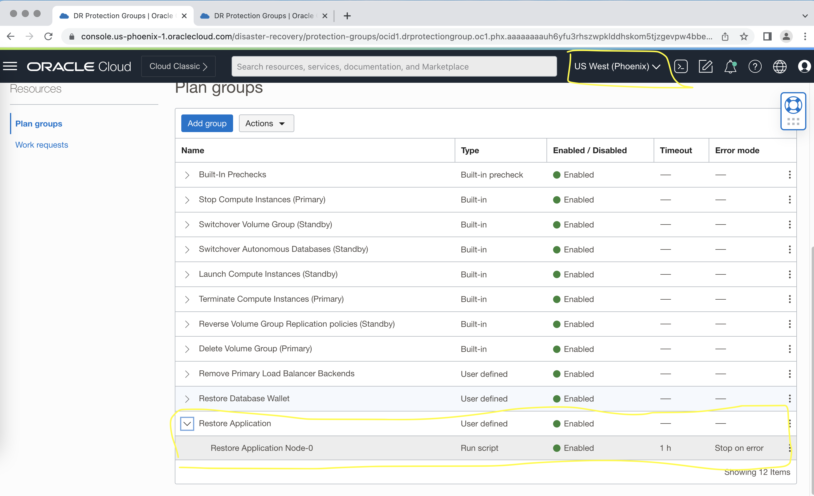

3.Need to add another step for *Restore Application on Node-1* in *Restore Application* plan group

- From the *Restore Database Wallet* Plan group, select the three dots section in the right end. Select **Add Step**

  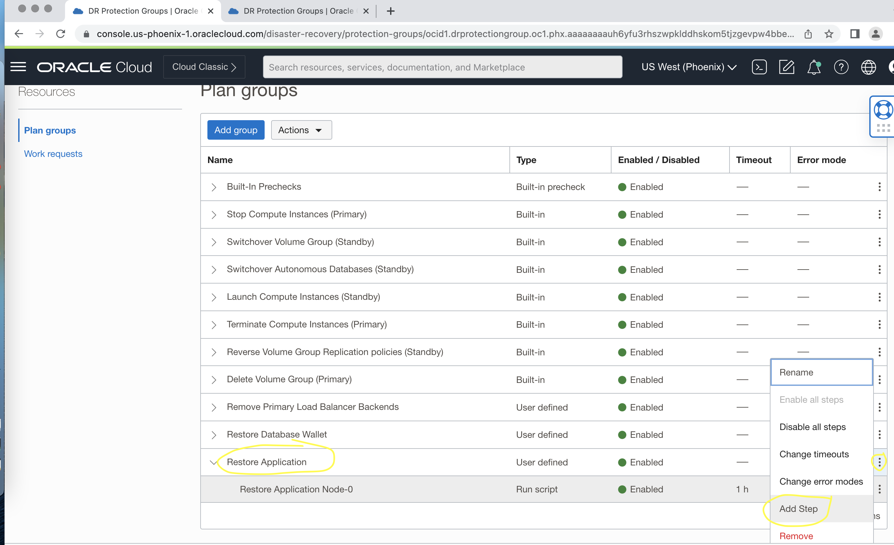

- Leave the default Group name
- Add *Restore Application on Node-1* in Step name
- Select Error mode as "Stop on error"
- Leave the default "3600" seconds in Timeout in seconds
- Leave the enabled tick mark
- In the region select "US East (Ashburn)"
- Select "Run local script" option
- Select "mushop-xxxxx-1" instance in "Target instance in compartment"
- In script parameters provide the details */usr/bin/sudo /home/opc/fsdrsscripts/mushop_reconfigure.sh*
- Leave the field blank in "Run as user"
- Verify all the details and hit add

  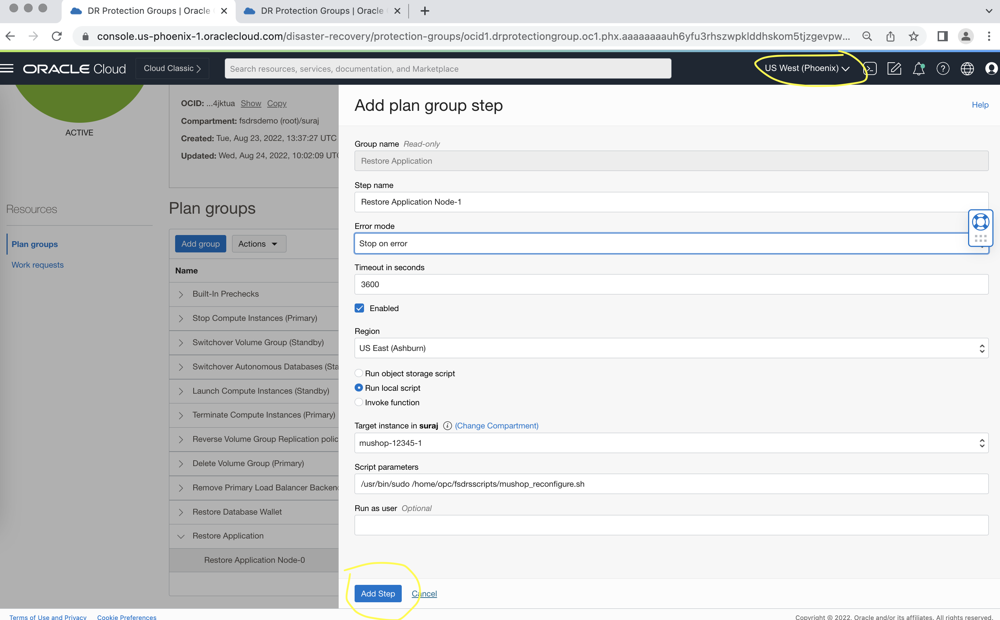

- **mushop-phoenix** drpg will go into updating state and after few seconds it will come back to active state. Refersh the DRPG page if required. You should be able to see the *Restore Application* Plan group has been modified successfully with *RRestore Application on Node-1* step. Now you can see both steps has been added in the group.

  

## Task 6: Customize the Switchover plan- Add Standby Load Balancer Backends group

1. Create user defined group for "Add Standby Load Balancer Backends". This can be done by selecting **Add group** in the *mushop-app-switchover* plan

  

2. Add "Add Standby Load Balancer Backends" user defined group

- Add *Add Standby Load Balancer Backends* in Group name
- Add *Add Standby Backend on Node-0* in Step name
- Select Error mode as "Stop on error"
- Leave the default "3600" seconds in Timeout in seconds
- Leave the enabled tick mark
- In the region select "US East (Ashburn)"
- Select "Run local script" option
- Select "mushop-xxxxx-0" instance in "Target instance in compartment"
- In script parameters provide the details **/usr/bin/sudo /home/opc/fsdrsscripts/addToBackendset.py ocid1.loadbalancer.oc1.phx.aaaaaaaae4uajkrtx544r2txz4hzo2ongtc5v5jaddl2szok3lzh3r5w4awa**

 **You need to replace the OCID of the standby (Phoenix) load balancer as per step 2.6, make sure you replace the OCID of your load balancer with out fail in the above command**

- Leave the field blank in "Run as user"
- Verify all the details and hit add

  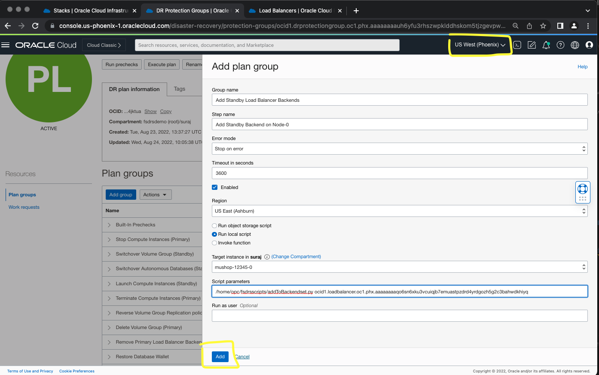

- **mushop-phoenix** drpg will go into updating state and after few seconds it will come back to active state. Refersh the DRPG page if required. You should be able to see the *Add Standby Load Balancer Backends* Plan group has been added successfully with *Add Standby Backend on Node-0* step. Note the type in group name it will show as **User defined** as this is user defined group.

  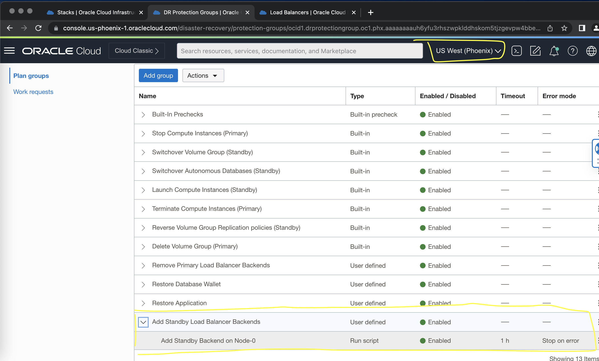

3.Need to add another step for *Add Standby Backend on Node-1* in *Add Standby Load Balancer Backends* Plan group

- From the *Add Standby Load Balancer Backends* Plan group, select the three dots section in the right end. Select **Add Step"

  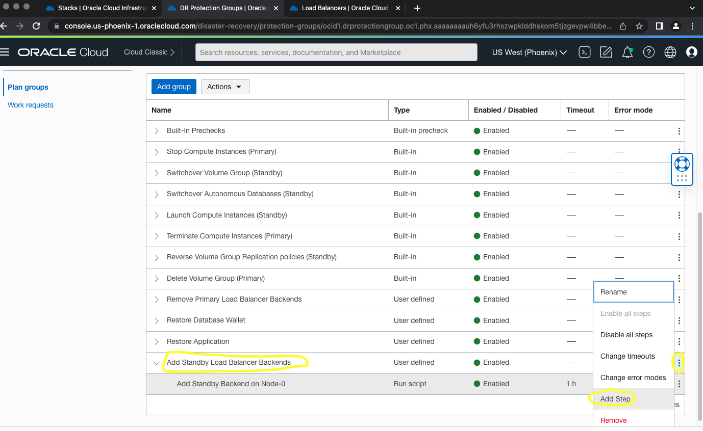

- Leave the default Group name
- Add *Add Standby Backend on Node-1* in Step name
- Select Error mode as "Stop on error"
- Leave the default "3600" seconds in Timeout in seconds
- Leave the enabled tick mark
- In the region select "US East (Ashburn)"
- Select "Run local script" option
- Select "mushop-xxxxx-1" instance in "Target instance in compartment"
- In script parameters provide the details **/usr/bin/sudo /home/opc/fsdrsscripts/addToBackendset.py ocid1.loadbalancer.oc1.phx.aaaaaaaae4uajkrtx544r2txz4hzo2ongtc5v5jaddl2szok3lzh3r5w4awa**

 **You need to replace the OCID of the standby (Phoenix) load balancer as per step 2.6, make sure you replace the OCID of your load balancer with out fail in the above command**

- Leave the field blank in "Run as user"
- Verify all the details and hit add

  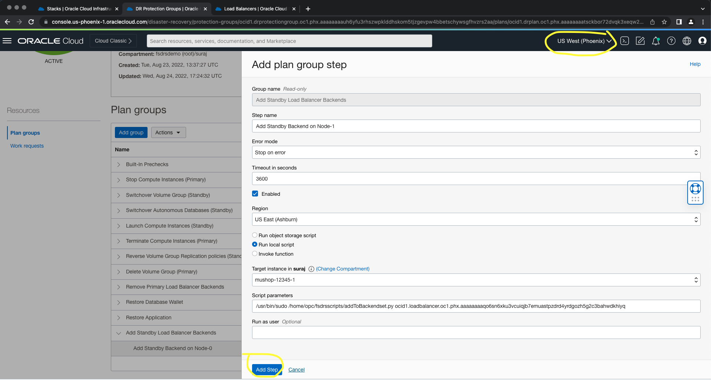

- **mushop-phoenix** drpg will go into updating state and after few seconds it will come back to active state. Refersh the DRPG page if required. You should be able to see the *Add Standby Load Balancer Backends* Plan group has been modified successfully with *Add Standby Backend on Node-1* step. Now you can see both steps has been added in the group.

  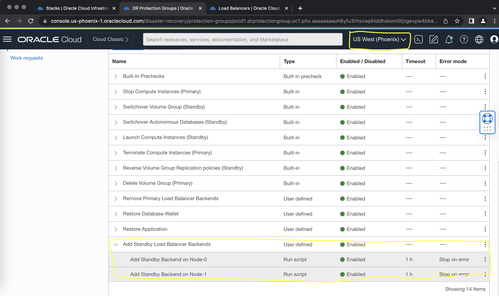

## Task 7: Verify and reorder the user defined groups

1. We have created all the required user defined group in **mushop-app-switchover** switchover plan as part of the Mushop application switchover.

  

2. Let review the **mushop-app-switchover** switchover plan 

  - "Built in Prechecks" - These are the built in prechecks groups for all the Plan groups (Built-in and User defined)
  -  Based on the members we have added in both Primary DRPG and Standby DRPG, FSDRS created 7 Built-in switchover plan
  -  We have manually created 4 user defined group as per the Mushop application switchover requirement.
  -  In summary, **mushop-app-switchover** switchover plan has created *1*- Built in precheck plan group, *7*- Built in Plan group,*4*- User defined Plan group

  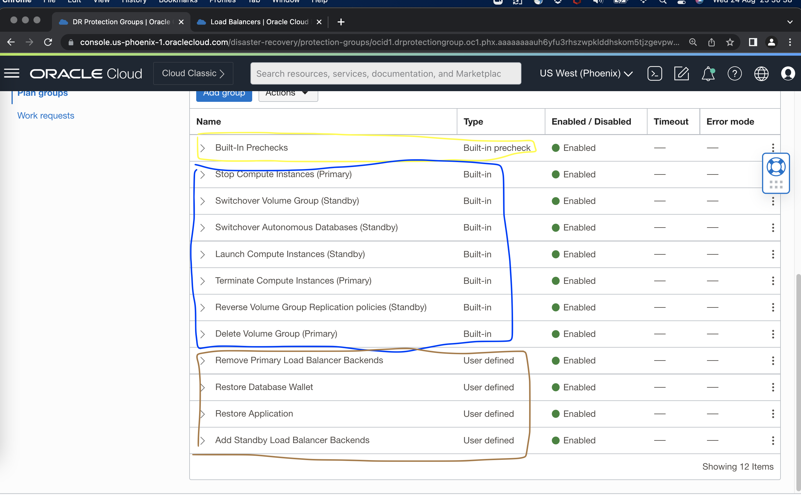

3. Plan groups can be reordered as per the switchover workflow requirement. As part of Mushop Switchover plan, we would like to execute **Remove Primary Load Balancer Backends** plan group after the **Built-In Prechecks** plan group. Use the **Actions** after the Add group and select **Reorder groups**

  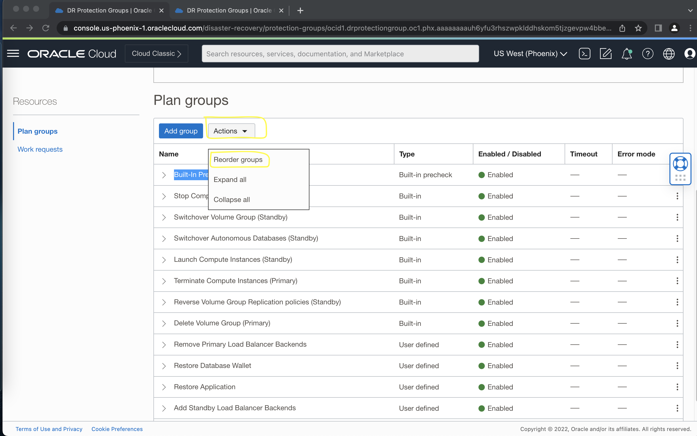

4. Go to **Remove Primary Load Balancer Backends** plan group, use the move up **^** symbol and keep moving up the **Remove Primary Load Balancer Backends** plan group and place it after **Built-In Prechecks** plan group. This is very important so that we execute the plan groups in right order. Verify and hit **Save changes** 

  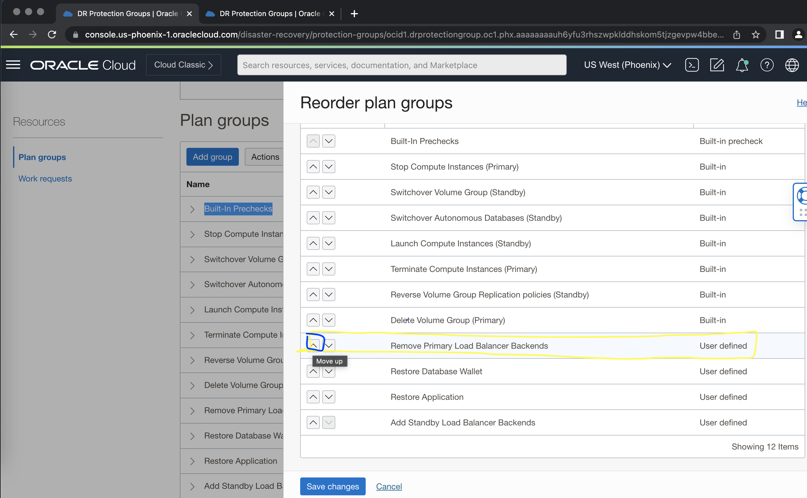
  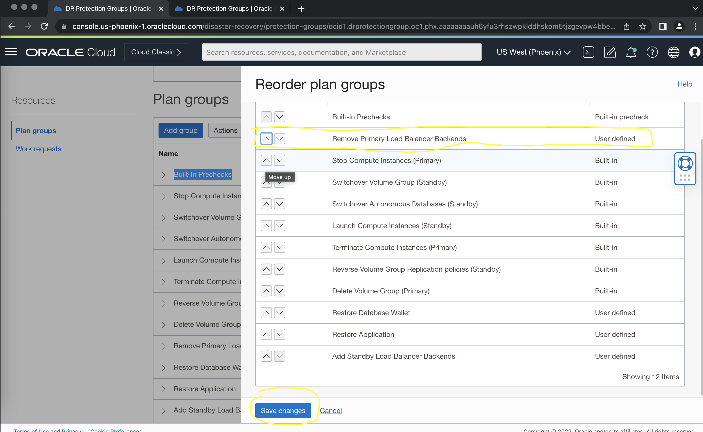 

5. You should be able to see **Remove Primary Load Balancer Backends** plan group moved after **Built-In Prechecks** plan group.

    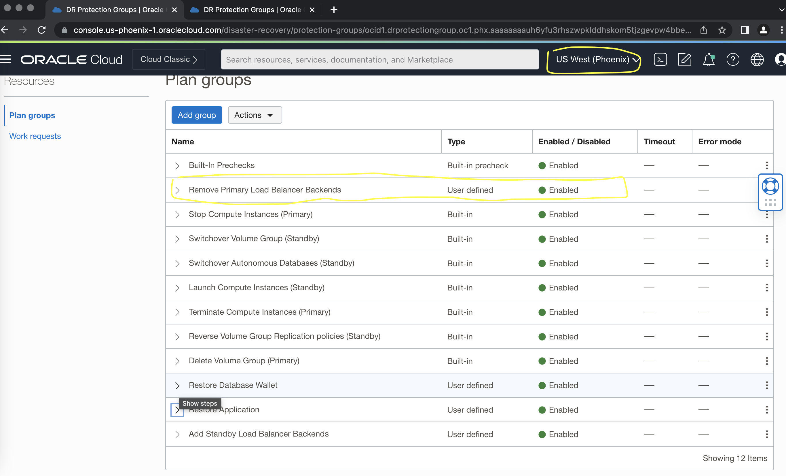

This concludes this Lab 4. Now you can move to Lab 5.

## Acknowledgements

- **Author** -  Suraj Ramesh, Principal Product Manager
- **Last Updated By/Date** -  Suraj Ramesh,August 2022
