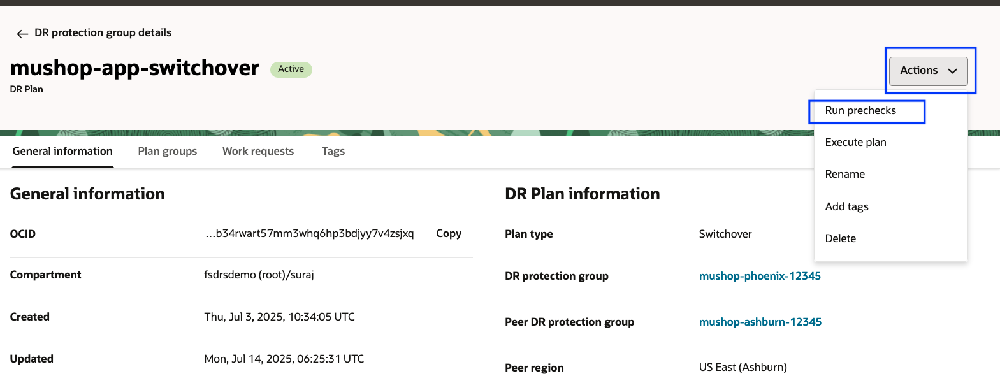
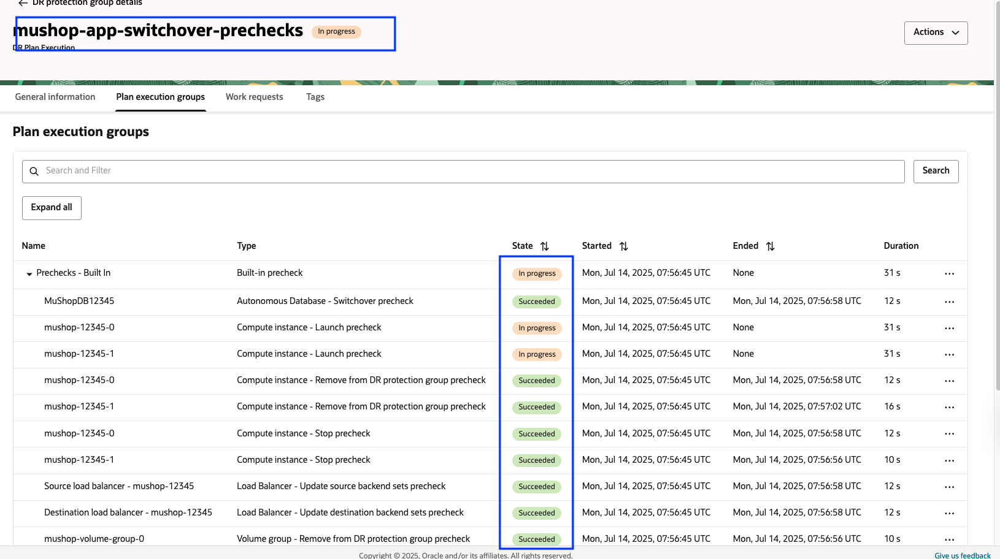
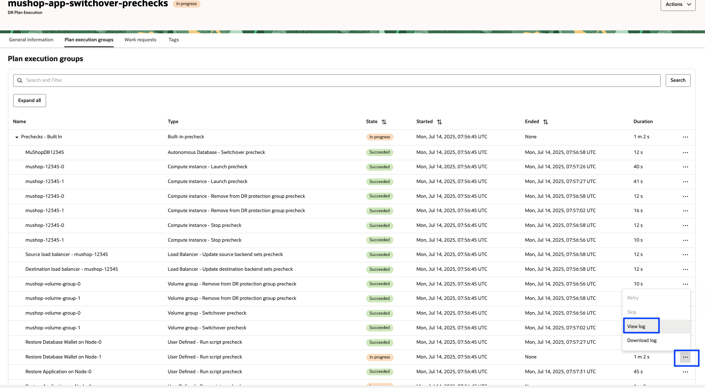
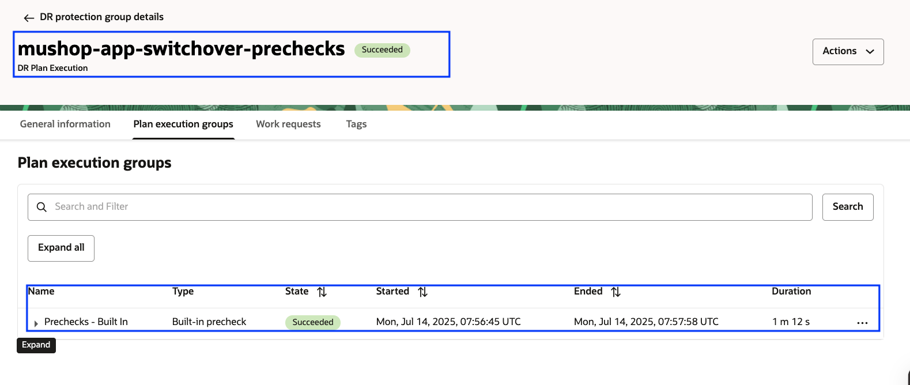
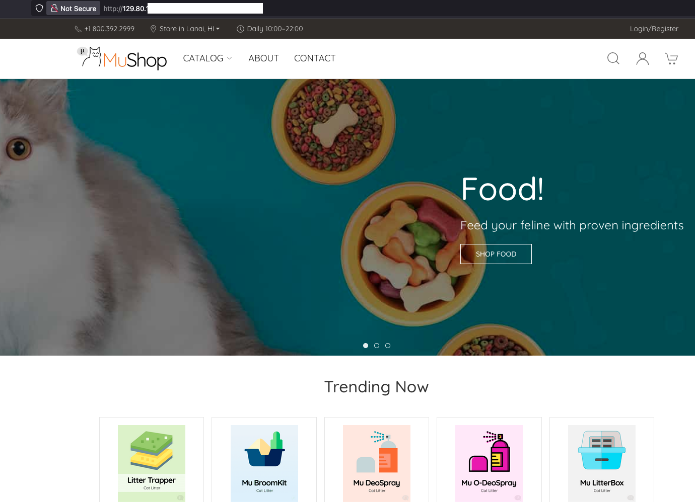
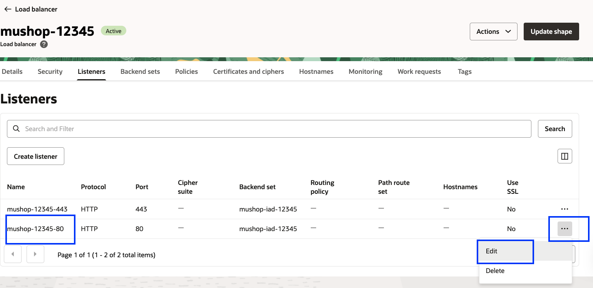
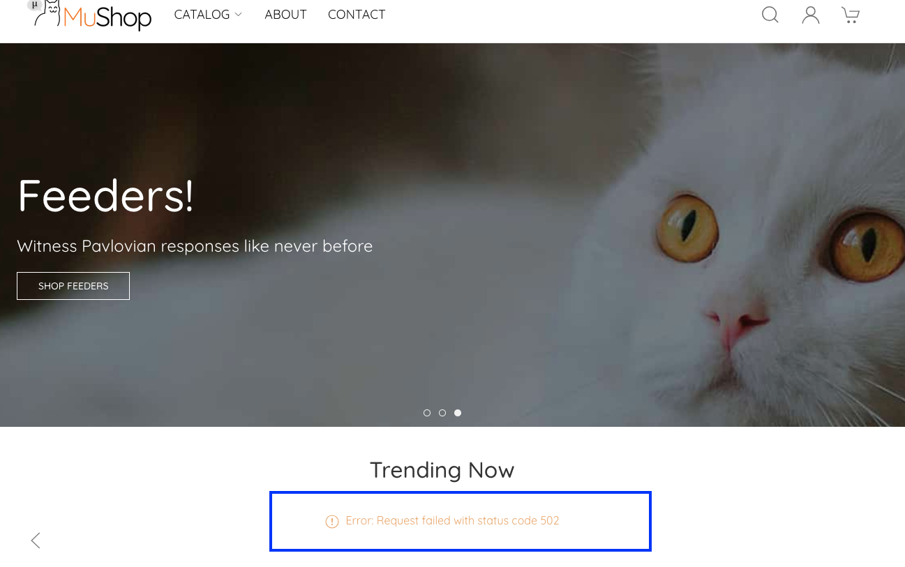

# Perform pre-checks for the DR Switchover Plan and break the MuShop Application

## Introduction

In this lab, you will run **Prechecks** for the **mushop-app-switchover** plan that was created in the previous lab.The **Run Prechecks** action executes all the **built-in prechecks** in parallel. These checks help validate the environment and configuration before any changes are made. We will also create an **outage** to the Mushop application before executing the DR plan in the next lab.

> ⚠️ **Note:** Running prechecks does **not** initiate the actual switchover. It only performs *validation steps*.
> Successfully completing the prechecks is a **critical prerequisite** for executing the switchover plan.

**Estimated Time**: 10 Minutes

### Objectives

- Perform Run prechecks for the switchover plan
- Monitor the executed prechecks plan
- Verify the executed prechecks plan
- Verify the MuShop application and break the application

## Task 1: Perform Run prechecks for the Switchover plan

1.  Login into OCI Console with your provided Credentials. Select region as **Phoenix**.

    

2.  Open the **Hamburger menu (☰)** and select **Migration and Disaster Recovery**. Then go to **Disaster Recovery → DR Protection Groups** and Confirm that the **region is set to Phoenix**.

    

3.  You will land on the Disaster Recovery Protection group home page; make sure you have selected the Phoenix region. **DR Plans always be created and executed in the Standby DRPG (Phoenix region)**

    

4.  Select the **mushop-phoenix-xxxxx** DRPG, navigate to the **Plans** tab, and select the **mushop-app-switchover** plan.

    

5.  Use the **Actions** button and click **Run prechecks**

    

6.  In the **Run prechecks** window, provide the Plan execution name as **mushop-app-switchover-prechecks** and hit **Run prechecks**

    

> **Note:** We have seen how to run prechecks for the **Switchover** plan. Similarly, you can run prechecks for the **Failover** and **StartDrill** plans created in the previous lab.

## Task 2: Monitor the executed prechecks plan

1.  Navigate to the **Plan Executions** section and select the **mushop-app-switchover-prechecks** plan execution. Then, go to the **Plan Execution Group** tab.Initially, you will see all the **Built-in Prechecks** listed with the status *Queued*.

    

2.  Refresh the page; within a few seconds, the **State** will change from *Queued* to *In Progress*.

    

3.  All the **Built-in Prechecks** steps will execute in parallel. You can monitor the progress and view logs for each step individually.

    To do this, navigate to the **three dots (...)** next to the respective built-in step and click on it. You will see options to **View Log** and **Download Log**. These logs are stored in the **Object Storage bucket** that was provided during the DRPG creation. Downloading the logs can be helpful for **troubleshooting**, if needed.

    

## Task 3: Verify the executed prechecks plan

1. After 2–3 minutes, the **Built-in Prechecks** should complete successfully; verify each step's **status**, **duration**, and ensure all checks pass before proceeding.

    

    Refer to the **Troubleshooting tips** section for known failures and correction actions.

## Task 4: Verify the MuShop application and break the application

1.  Login into OCI Console with your provided Credentials. Select region as **Ashburn**.

    
  
2.  From the Hamburger menu, select **Networking**, then **Load Balancers**
  
    

3.  Gather the Public IP address of the Load Balancer

     

4.  Verify the mushop application using `**http://ashburn loadbalancer ip**`
    replace with the actual value from Step 3. Navigate around the site and verify the cat products.

    

5.  Let us break the MuShop application to create an outage;click the **mushop-xxxxx** load balancer, then navigate to the **Listeners** section.

    

    

6.  Select the **Edit** option by clicking the three dots (...) at the right end of the **mushop-xxxxx-80** listener on port 80.

    

    Modify the listener port from 80 to 81 to break the application, and save changes. You will get work requests submitted and select close requests.

    
    
    

    Wait for a few seconds and refresh the browser tab of the MuShop application. You should see that the MuShop site can't be reached or Error: Request failed with status code 502. 

    

    We have created an outage in the working MuShop application. In the next lab, we will use the **Full Stack DR** service to initiate a **Switchover** of the full stack (App VMs, Database, and Application Customizations) from the **Ashburn** region to the **Phoenix** region.

    You may now [Proceed to the next lab](#next)

## Troubleshooting tips

1.  During the pre-check execution logs, if you messages like "Requests are being throttled for instance ocid1", retry the **Run prechecks** again

    [ocid1.instance.oc1.iad.anuwcljt5h22avqcjswxs6tublhrz2qonyjmucpxlyjxplybldbpxz2jqkaq] -- Error returned by PutObject operation in ObjectStorage service.(409, Conflict, false) Server is busy. Requests are being throttled for instance ocid1.instance.oc1.iad.anuwcljt5h22avqcjswxs6tublhrz2qonyjmucpxlyjxplybldbpxz2jqkaq (opc-request-id: B7721980580148749787FE758C9440FC/3D8758622598943932D50842DCD7EAA1/143166BA790ECD35695B548600382010)

2. If there are errors related to the `ocarun` command, ensure that the required **dynamic groups** have been created and the appropriate **IAM policy** has been updated. For more details, refer [IAM Policy](https://blogs.oracle.com/maa/post/iam-policies-fullstackdr), section 5,6,7.

## Acknowledgements

- **Author** - Suraj Ramesh,Principal Product Manager,Oracle Database High Availability (HA), Scalability and Maximum Availability Architecture (MAA)
- **Last Updated By/Date** - Suraj Ramesh, July 2025
