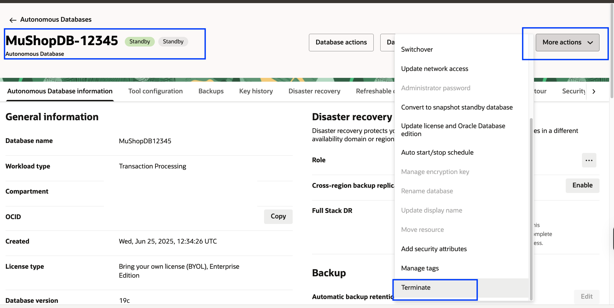
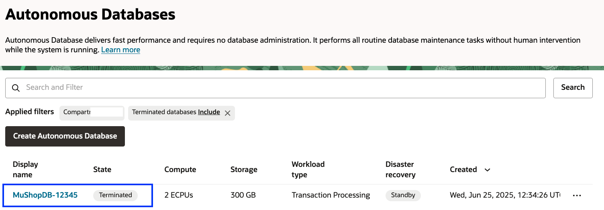
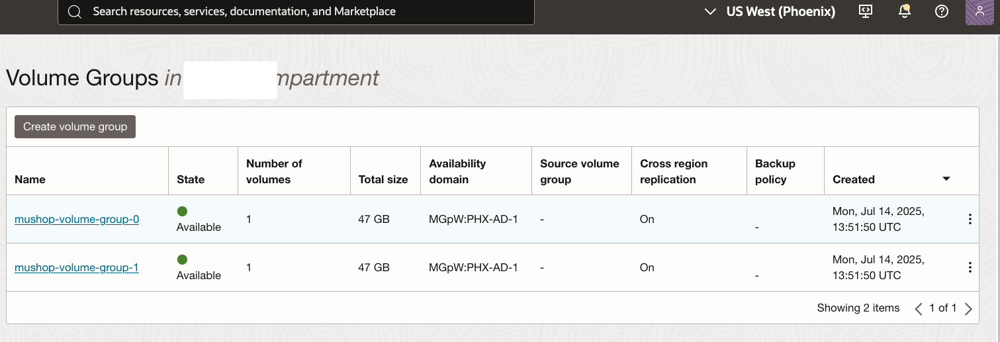
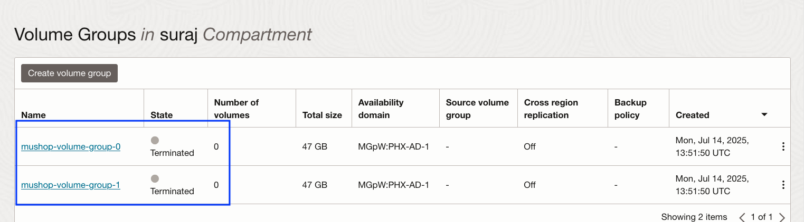
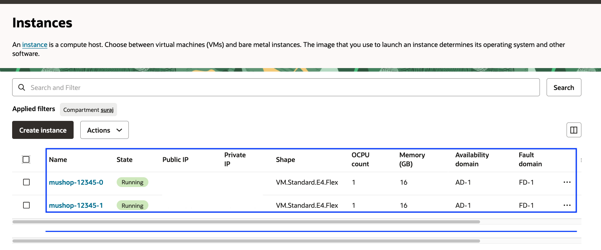
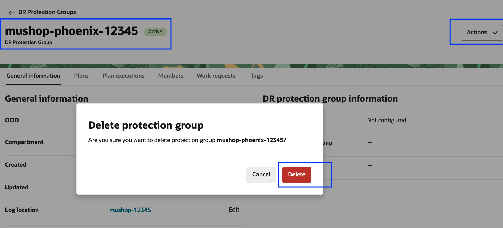

# Terminate OCI resources

##  Introduction  

In this lab, we will terminate all the resources created through **OCI Resource Manager** as well as other resources manually created during DR plan executions. This is an **optional** lab. If you wish to keep the resources up and running, you can **skip this lab**.

**Estimated Time:** 60 minutes

### Objectives

- Terminate the **ATP Standby DB**  
- Disable **cross-region replication** for the volume groups in *both* regions  
- Terminate the compute instances in **Phoenix region**
- Delete **Pre-Authenticated Requests (PARs)** from the `mushop-xxxxx` bucket in *both* regions  
- Run the **destroy job** for the `mushop` stack in **Resource Manager**  
- Delete **Full Stack DR Protection Groups**

## Task 1: Terminate ATP Standby DB

1. Login into OCI Console with your credentials. Select the region, where the standby ATP DB is running. In our example, it will be **Ashburn** region.

2.  From the Hamburger menu, select **Oracle Database**, then **Autonomous Database**.

3. Select **MuShopDB-XXXXX** DB, go to **More Actions tab** and select **Terminate**

    

4. Enter the database name and click **Terminate Autonomous Database**

    

5. In 2-3 minutes, the ATP database will be terminated.

    

## Task 2: Terminate the volume groups

> **Note:**  
> If you enabled the built-in plan group (**Volume Groups – Terminate**) in the switchover plan,then the volume groups in **Ashburn** would have already been terminated during the execution of the **switchover DR plan**.  

If you disabled the plan group, you must perform Task-2 in both Ashburn and Phoenix regions. In our lab, since the **Volume Groups – Terminate** plan group is enabled, we will terminate the volume groups only in **Phoenix** region.

1. Select **Phoenix** region. From the Hamburger menu,select Storage-> Volume groups.

2. You will find two volume groups **mushop-volume-group-0** and **mushop-volume-group-1**. 

    

3. Disable the cross-region replication. Select **mushop-volume-group-0** and click **Edit**

    

4. In the Wizard, navigate to **Cross region replication** section by clicking **Next**

5. Modify the radio button from **on** to **off** and click the two check boxes to turn off the replication.

    

6. Click **Next**, you should be in **Summary** section, verify and click **Save changes**

    

7. Repeat the same steps (3 to 6) to disable the cross-region replication for **mushop-volume-group-1** volume group.

8. In few minutes, you should be able to see the cross region replication is set of **off** for both the volume groups and now you can terminate the volume groups.

    

    

    

## Task 3: Terminate the compute instances in the Phoenix region

1. Select **Phoenix** region. From the Hamburger menu,select Compute-> Instances

2. You will find two VM's **mushop-xxxxx-0** and **mushop-xxxxx-1**. 

    

3. Follow the steps as per the below to terminate the VMs

    

    

    

## Task 4: Delete the Pre-Authenticated requests (PAR) and logs files in object storage bucket

1. During Full Stack DR plan execution, PAR (Pre-Authenticated Request) entries and logs are created in the **mushop-xxxxx** folder, where `xxxxx` is your reservation ID.  

2. From the **Navigation Menu**, go to **Storage > Object Storage & Archive Storage > Bucket**.  

3. Select the **mushop-xxxxx** bucket and navigate to **Pre-Authenticated Requests** under the **Resources** section.  

4. Full Stack DR creates Pre-Authenticated Requests and log files in this bucket.  

5. Delete these entries from the **mushop-xxxxx** bucket in both **Primary** and **Standby** regions.  

**Note:** These steps must be completed in both regions.

## Task 4: Run destroy job for the mushop stack in the resource manager

1. Click the **Navigation Menu** in the upper left, go to **Developer Services > Resource Manager > Stacks**. Ensure you are in the **Ashburn** region. If you used different regions, select your **Primary** region.

    

2. Select **fullstackdr-mushop-stack** stack and click **Destroy**

3. Provide the job name or leave the default value, click **Destroy**

    

4. You should be able a see destroy job which is in-progress state.Click the job details and monitor.

5. The job will take approximately 5 minutes to complete. Verify the status of job, it should show as **Succeeded**. In case if the job fails, verify the logs and take necessary action.

    

## Task 5: Delete DR protection groups

1. Select **Migration and Disaster Recovery** from the Hamburger menu, then **Disaster Recovery** -> **DR Protection Groups**. Verify the region in **Ashburn**

2. Select **mushop-ashburn-xxxxx** DR protection group, click **Actions** and click **Diassociate** 

    

3. In the Disassociate protection group page, click **Diassociate** 

    

4. In few minutes, **mushop-ashburn-xxxxx** DR protection group will be disassociated.

5. Delete **mushop-ashburn-xxxxx** DR protection group. Click **Actions** -> **Delete**

    

    

6. Change to **PHOENIX** region.Select **mushop-phoenix-xxxxx** protection group and delete **mushop-phoenix** DR protection group. Click **actions** -> **Delete**

    

## Lab Complete!

You did it! This concludes the lab **Protect Your Business Using Oracle Full Stack Disaster Recovery Service**.

In this lab, you witnessed the **seamless, fully automated switchover** of a **MuShop application (Full Stack)** from the **Ashburn** region to the **Phoenix** region — all with just **one click**!  

An impressive demonstration of the power and simplicity of **Oracle Full Stack DR**!

## Acknowledgements

- **Author** - Suraj Ramesh,Principal Product Manager,Oracle Database High Availability (HA), Scalability and Maximum Availability Architecture (MAA)
- **Last Updated By/Date** - Suraj Ramesh, July 2025

