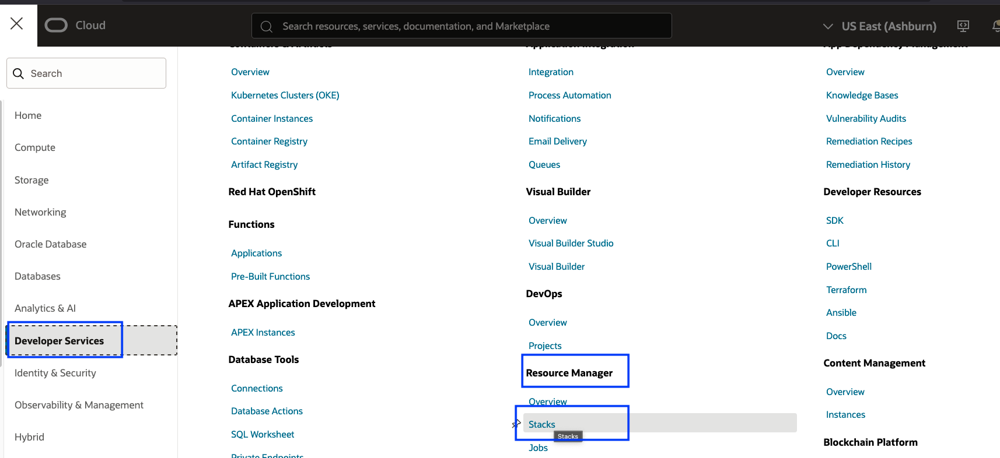

# Terminate OCI resources

## Introduction

In this lab, we will terminate all the resources which are created. This is an optional lab.

Estimated Time: 60 minutes

### Objectives

- Terminate the ATP Standby DB
- Disable the cross-region replication for the volume groups in both regions
- Delete the Pre-Authenticated requests (PAR) generated in the mushop-xxxxx bucket in both regions
- Run destroy job for the mushop stack in the resource manager
- Delete Full Stack DR protection groups

## Task 1: Terminate ATP Standby DB

1. Login into OCI Console with your credentials. Select the region, where the standby ATP DB is running. In our example, it will be **PHOENIX** region.

2. From the Hamburger menu,select Oracle Database-> Autonomous Transaction Processing.

3. Select **MuShopDB-XXXXX** DB, go to **More Actions tab** and select **Terminate**

4. Enter the database name and click **Terminate Autonomous Database**

    

5. In 2-3 minutes, the ATP database will be terminated.

    

## Task 2: Disable the cross-region replication for the Volume groups

1. Select **ASHBURN** region. From the Hamburger menu,select Storage-> Volume groups.

2. You will find two volume groups **mushop-volume-group-0** and **mushop-volume-group-1**. 

    

3. Disable the cross-region replication. Select **mushop-volume-group-0** and click **Edit**

    

4. In the Wizard, navigate to **Cross region replication** section by clicking **Next**

5. Modify the radio button from **on** to **off** and click the two check boxes to turn off the replication.

    

6. Click **Next**, you should be in **Summary** section, verify and click **Save changes**

    

7. Repeat the same steps (3 to 5) to disable the cross-region replication for **mushop-volume-group-1** volume group.

8. In few minutes, you should be able to see the cross region replication is set of **off** for both the volume groups.

    

## Task 3: Delete the Pre-Authenticated requests (PAR)

1. During Full Stack DR plan execution will create PAR requests in the mushop-xxxxx folder, where xxxxx is your reservation id.

2. From the Hamburger menu,select Storage-> Object Storage & Archive Storage

3. Select **mushop-xxxxx** bucket, navigate to **PreAuthenticated Requests** under Resources section.

4. If you have any active Preauthenticated Requests created during the DR plan execution, please delete those.

5. You should delete active Preauthenticated Requests in both primary and standby region **mushop-xxxxx**  bucket.

## Task 4: Run destroy job for the mushop stack in the resource manager

1. Click the Navigation Menu in the upper left, navigate to Developer Services, and select Stacks. Make sure you are in the **Ashburn** region. If you have used different regions, select your Primary region.

    

2. Select **fullstackdr-mushop-stack** stack and click **Destroy**

3. Provide the job name or leave the default value, click **Destroy**

    

4. You should be able a see destroy job which is in-progress state.Click the job details and monitor.

5. The job will take approximately 5 minutes to complete. Verify the status of job, it should show as **Succeeded**. In case if the job fails, verify the logs and take necessary action.

    

## Task 5: Delete DR protection groups

1. Select **Migration and Disaster Recovery** from the Hamburger menu, then **Disaster Recovery** -> **DR Protection Groups**. Verify the region in **Ashburn**

2. Select **mushop-ashburn** DR protection group, click **Diassociate** 

    

3. In the Disassociate protection group page, click **Diassociate** 

    

4. In few minutes, **mushop-ashburn** DR protection group will be disassociated.

5. Delete **mushop-ashburn** DR protection group. Click **More actions** -> **Delete**

    

    

6. Change to **PHOENIX** region.Select **mushop-phoenix** protection group and delete **mushop-phoenix** DR protection group. Click **More actions** -> **Delete**

    

This concludes the lab Protect your business using Oracle Full Stack Disaster Recovery Service. We have seen the complete automation of switching over a MuShop application (Full Stack) from the Ashburn region to the Phoenix region with a single click of a button! 

## Acknowledgements

- **Author** - Suraj Ramesh,Principal Product Manager,Oracle Database High Availability (HA), Scalability and Maximum Availability Architecture (MAA)
- **Last Updated By/Date** - Suraj Ramesh,November 2024

