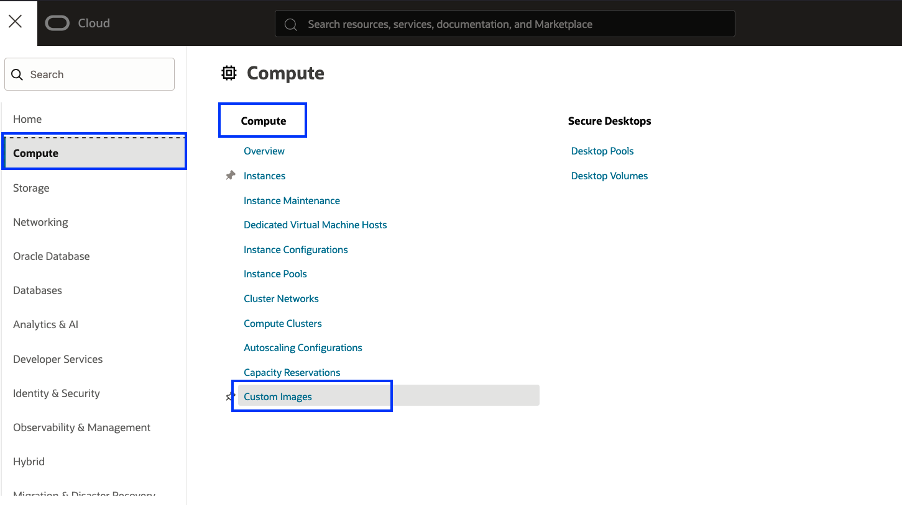
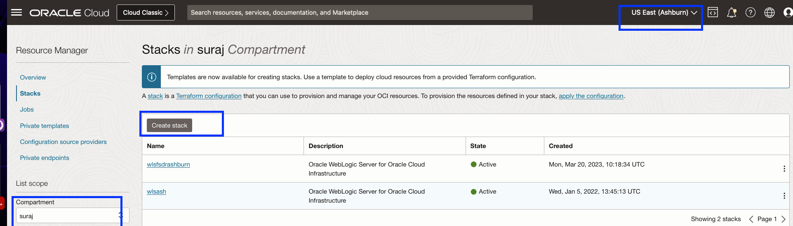
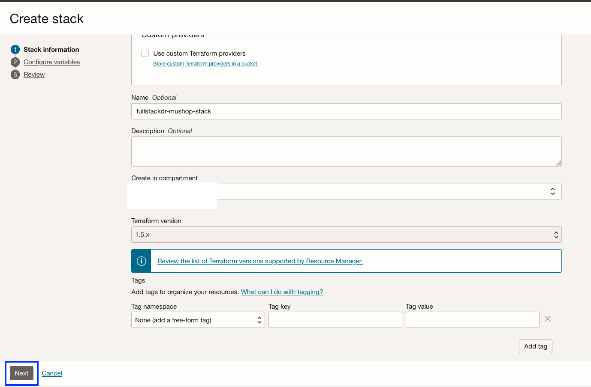
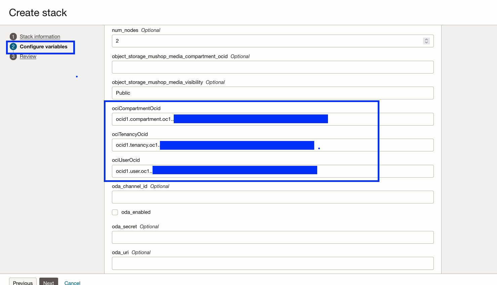
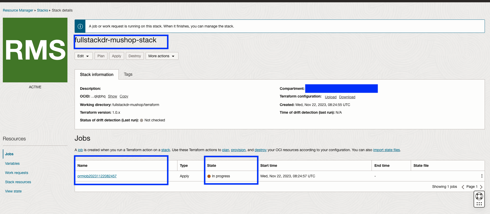

# Provision the resources using OCI Resource manager

## Introduction

In this lab, we will provision all the required OCI resources for the Mushop application using OCI Resource Manager.

Estimated Time: 60 minutes

### Objectives

- Create custom image and prepare terraform files
- Provision OCI resources using OCI resource manager
- Verify the OCI resource manager job status

### Pre-requisites 

- You should use an **OCI tenancy with credits or a paid account**. A **Free Tier** account will **not** work for this lab, as **Free Tier** doesnt allow to subscribe to two regions, which is mandatory for this lab.

- It is recommended to use an OCI user with the **Administrator** role to provision resources. If you plan to *non-adminstrator* use, please refer to the OCI documentation and create the necessary IAM policies that allow the user to create and manage:
    - **VCN**
    - **Load Balancer**
    - **Autonomous Database (Serverless - ATP)**
    - **Block Storage**
    - **Compute Instances**
    - **Object Storage**
    - **Cloud Shell**
    - **Full Stack Disaster Recovery** 

- Create a **Dynamic Group** and provide the required **IAM policies** to allow the OCI user to use **OCI Full Stack DR**.Refer to this blog for detailed guidance: [Full Stack DR IAM Policies](https://blogs.oracle.com/maa/post/iam-policies-fullstackdr)


## Task 1: Create custom image and prepare terraform files

1. We will use **Ashburn** as the primary region and **Phoenix** as the standby region. Both region details are specified in the Terraform files. If you want to use different regions, please update the `region` (primary) and `remote_region` (standby) values in the `variables.tf` file.More information about the Terraform files can be found in **Steps 9–12**.

> ⚠️ If you are using a different primary and standby region, make sure to complete the remaining steps of **Lab 1** from your selected **Primary** region.

2.  Go to the [OCI Console](https://cloud.oracle.com) and login with your credentails.From the top-right corner,select the **ASHBURN** region from the region dropdown.

    

3. In the OCI Console (while in the **Ashburn** region), open the navigation menu (☰ **Hamburger menu**). Navigate to: **Compute** → **Custom Images**. Click **Create Custom Image** and follow the prompts to configure the image.

    

4. Click **Import image** and provide the below details.

    - Select the compartment of your choice and use the same compartment for deploying all resources as part of this lab. 
    - Provide Name as **mushopimage**
    - Select Operating system as **Oracle Linux**
    - Select **Import from an Object Storage URL**
    - Paste the below URL in the **Object Storage URL** section
        ````
        <copy>https://objectstorage.us-ashburn-1.oraclecloud.com/p/N1Q_gWVqQ2ETQ6kf6S-WTqd3s3uv6vPs4SniklnUf7wrukkhAWPEFC1EuxE3wRqI/n/idfwhcj05ugj/b/fsdrs/o/mushop-new-image</copy>
        ````
    - Select Image type as **OCI**
    - Verify the details and click **Import image**

    

5. It will take approximately **10–15 minutes** for the custom image to appear as **Available**.

    

6. Copy the **OCID** of the created **MuShop custom image** and keep it handy for later steps.

    

7. Click on the link below to download the **Mushop Terraform Stack** ZIP file:  

    [fullstackdr-mushop.zip](https://idfwhcj05ugj.objectstorage.us-ashburn-1.oci.customer-oci.com/p/h8n0TsiellDDWa-fODHkWs3mg4nPCirw7sSlU_5sMsqLIJUutEHFrdISSro5NE5I/n/idfwhcj05ugj/b/fsdrs/o/fullstackdr-mushop.zip) - Packaged terraform script for creating various OCI resources for Mushop application.

8. Save it in your downloads or any other preferred folder.

9. Unzip the file **fullstackdr-mushop.zip** 

10. Navigate to **fullstackdr-mushop->terraform->scripts** folder

11. Open the **`compute.tf`** file in your preferred code editor. Locate the **`source_details`** section.Replace the value of **`source_id`** with the **OCID of your custom MuShop image** (copied in Step 8).

    

12. Save the updated `compute.tf` file and compress the folder as **fullstackdr-mushop-updated.zip**, ensuring it includes the modified file.


## Task 2: Provision OCI resources using OCI resource manager

1. Click the **Navigation Menu** (☰) in the upper-left corner, go to **Developer Services**, **Resource Manager** and select **Stacks**.Ensure you are in the **Ashburn** region.

    

2. Click **Create Stack** and select the compartment.

    

3. In the **Stack information** section,provide the below details.

    - Choose **My configuration**
    - In the **Stack congiguration**, use **.Zip file** and upload **fullstackdr-mushop-updated.zip**. Use the zip file from Step 12 of [Task1](#task-1-create-custom-image-and-prepare-terraform-files).
    - In the **Name**,provide the name as **fullstackdr-mushop-stack**
        
    - Select the **compartment** of your choice
    - Leave the other values as default.
    - Click Next
    

4. In the **Configure variables** section, provide the below details  in the variables section.  
 
    - ociCompartmentOcid: Provide your compartment OCID
    - ociTenancyOcid: Provide your tenancy OCID
    - ociUserOcid: Provide your OCI user OCID
    - resId:Provide a random 5 digit number
    
    
    - Leave the rest of the variables section with default values.
    - Click Next

5. In the **Review** section
 
    - Review the **Stack Information** and **Variables**
    - Select the checkbox **Run apply** in the Run apply on selected stack
    - Click **Create**
    

## Task 3: Verify the OCI resource manager job

1. Navigate to **Stacks**, select **fullstackdr-mushop-stack**

    

2. You should be able a see oracle resource manager (orm) job which is in-progress state.Click the job details and monitor.

    

3. The job will take approximately 30 minutes to complete; verify that the status shows as **Succeeded**. If it fails, review the logs and take appropriate action. The common failure reasons include missing IAM policies or unavailable resource quotas. 

    

You may now [Proceed to the next lab](#next)

## Acknowledgements

- **Author** - Suraj Ramesh,Principal Product Manager,Oracle Database High Availability (HA), Scalability and Maximum Availability Architecture (MAA)
- **Last Updated By/Date** - Suraj Ramesh, July 2025

