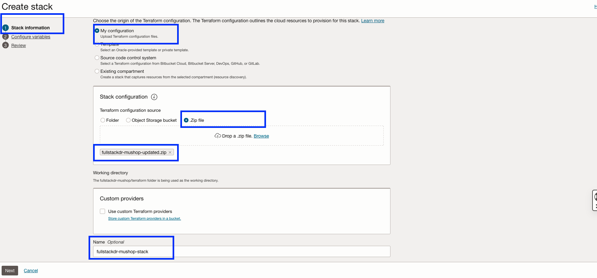
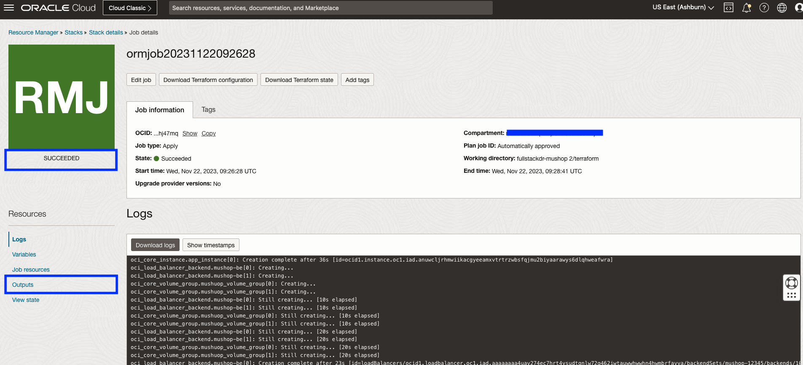

# Provision the OCI resources

## Introduction

In this lab, we will provision all the required OCI resources for the Mushop application.

Estimated Time: 30 minutes

### Objectives

- Create custom image and prepare terraform files
- Use OCI Resource Manager to provision all the required OCI resources to demonstrate the Mushop application switchover using Full Stack DR.
- Verify the resource manager stack creation is successful

## Task 1: Create custom image and prepare terraform files

1. Preferably use OCI user with **administrator** role to provision the OCI resources as part of this lab. If not please check the OCI  documentation and create necesary IAM policies for the OCI user to create and manage OCI VCN,Load Balancer,Autonomous Database Serverless-ATP,Block Storage, Object Storage,Cloud Shell.

2. Provide necessary IAM policies to the OCI user for using Full Stack DR. Refer to this blog [Full Stack DR IAM policies](https://blogs.oracle.com/maa/post/iam-policies-fullstackdr).

3. We will use **Ashburn** as primary region and **Phoenix** as standby region. Both region details are used in the terraform files. If you want to use different regions, please modify the region (primary) and remote_region (standby) details in the variables.tf file.If you are using different Primary and Standby region, make sure to complete the rest of lab 1 steps from your **Primary** region.

4. Login into OCI Console with your provided Credentials. Select **ASHBURN** region.

    

5. Create custom image in the Ashburn region.From the Hamburger menu,select Compute->Custom images

    

6. Click Import image and provide the below details.

    - Select the compartment of your choice and use the same compartment for deploying all resources as part of this lab. 
    - Provide Name as **mushopimage**
    - Select Operating system as **Oracle Linux**
    - Select **Import from an Object Storage URL**
    - Paste the below URL inthe **Object Storage URL**
        ````
        <copy>https://objectstorage.us-ashburn-1.oraclecloud.com/p/N1Q_gWVqQ2ETQ6kf6S-WTqd3s3uv6vPs4SniklnUf7wrukkhAWPEFC1EuxE3wRqI/n/idfwhcj05ugj/b/fsdrs/o/mushop-new-image</copy>
        ````
    - Select Image type as **OCI**
    - Verify the details and click **Import image**

    

7. It will take approximately 10-15 minutes to show the custom image as **Available**.

    

8. Copy the OCID of the custom image and keep it handy. 

    

9. Click on the link below to download the Resource Manager zip file.

    [fullstackdr-mushop.zip](https://idfwhcj05ugj.objectstorage.us-ashburn-1.oci.customer-oci.com/p/h8n0TsiellDDWa-fODHkWs3mg4nPCirw7sSlU_5sMsqLIJUutEHFrdISSro5NE5I/n/idfwhcj05ugj/b/fsdrs/o/fullstackdr-mushop.zip) - Packaged terraform script for creating various OCI resources for Mushop application.

10. Save it in your downloads or any other preferred folder.

11. Unzip  **fullstackdr-mushop.zip** 

12. Navigate to **fullstackdr-mushop->terraform->scripts** folder

13. Open **compute.tf** file in your preferred editor, you should add the OCID of your compute image (taken in step 8) in the **`source_id`** which is under **`source_details`** section

    

14. Save the compute.tf file and zip or compress the folder as **fullstackdr-mushop-updated.zip**. This zip file should have the **updated compute.tf** file.

## Task 2: Provision OCI resources using OCI resource manager

1. Click the Navigation Menu in the upper left, navigate to Developer Services, and select Stacks. Make sure you are in the **Ashburn** region.

    

2. Click **Create Stack** and select the compartment.

    

3. In the **Stack information** section,provide the below details.

    - Choose **My configuration**
    - In the **Stack congiguration**, use **.Zip file** and upload **fullstackdr-mushop-updated.zip**. You should use the zip file from Task 1 -> Step 14.
    - In the **Name**,provide the name as **fullstackdr-mushop-stack**
        
    - Select the **compartment** of your choice
    - Leave the other values as default.
    - Click Next
    

4. In the **Configure variables** section, provide the below details  in the variables section.  
 
    - ociCompartmentOcid: Provide your compartment OCID
    - ociTenancyOcid: Provide your tenancy OCID
    - ociUserOcid: Provide your OCI user OCID
    - resId:Provide a random 5 digit number
    
    
    - Leave the rest of the variables section with default values.
    - Click Next

5. In the **Review** section
 
    - Review the **Stack Information** and **Variables**
    - Select the checkbox **Run apply** in the Run apply on selected stack
    - Click **Create**
    

## Task 3: Verify the OCI resource manager job

1. Navigate to **Stacks**, select **fullstackdr-mushop-stack**

    

2. You should be able a see oracle resource manager (orm) job which is in-progress state.Click the job details and monitor.

    

3. The job will take approximately 30 minutes to complete. Verify the status of job, it should show as **Succeeded**. In case if the job fails, verify the logs and take necessary action. Common causes for failures are missing IAM policies, resource quota not available.

    

You may now [Proceed to the next lab](#next)

## Acknowledgements

- **Author** - Suraj Ramesh,Principal Product Manager,Oracle Database High Availability (HA), Scalability and Maximum Availability Architecture (MAA)
- **Last Updated By/Date** - Suraj Ramesh,November 2023

